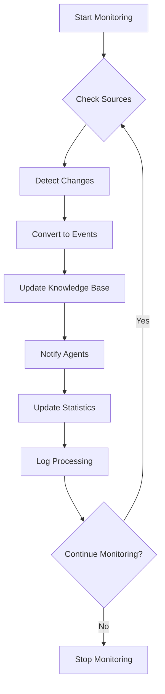
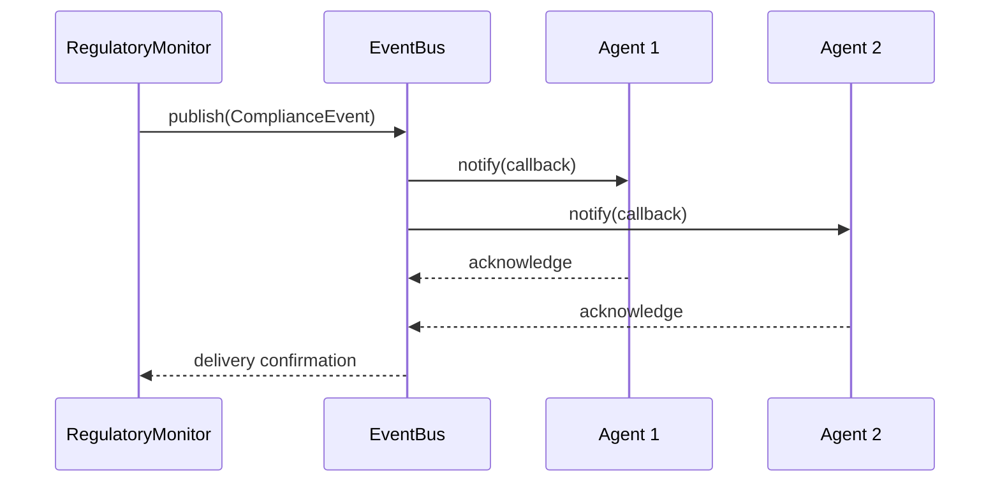
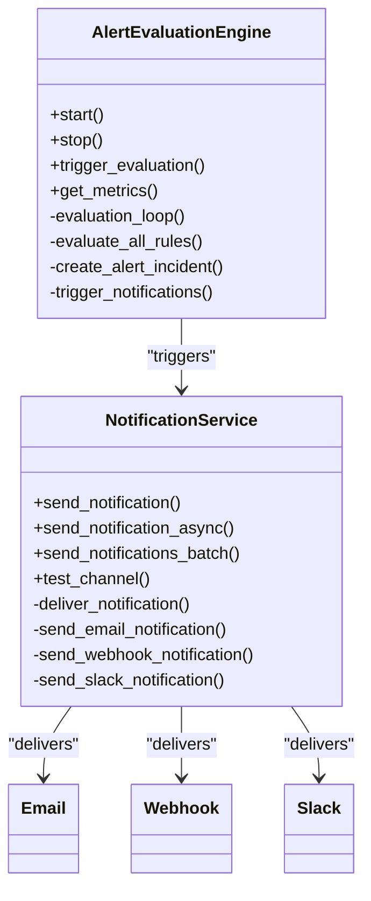
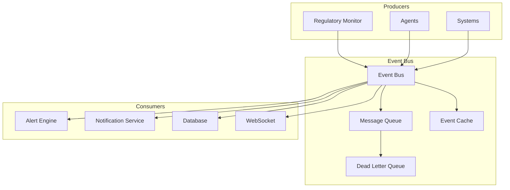
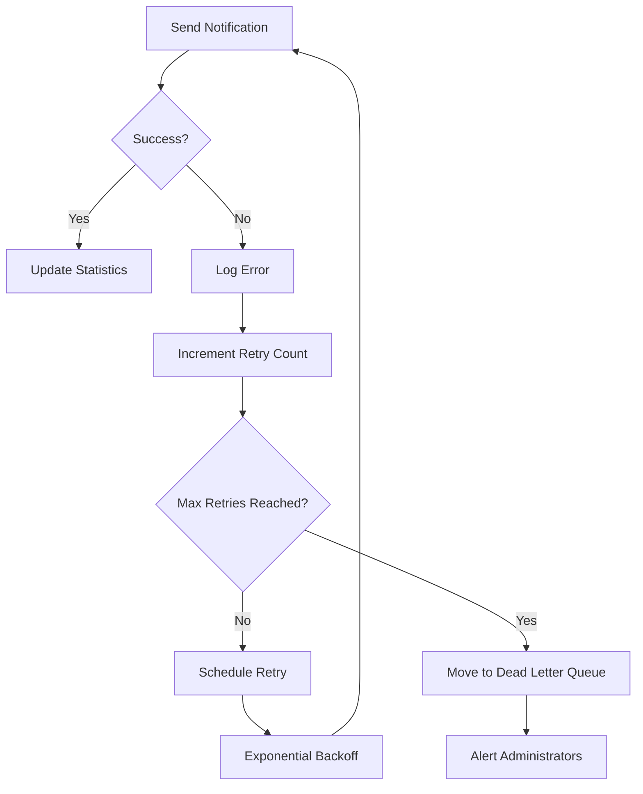
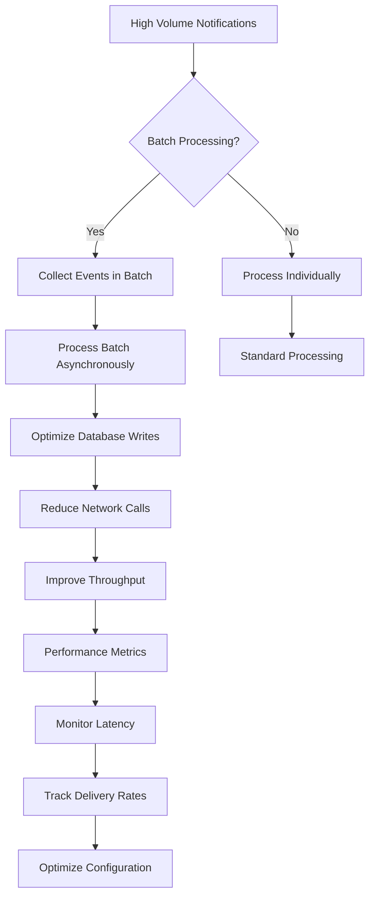

# Notification System

<cite>
**Referenced Files in This Document**   
- [regulatory_monitor.hpp](file://regulatory_monitor/regulatory_monitor.hpp)
- [regulatory_monitor.cpp](file://regulatory_monitor/regulatory_monitor.cpp)
- [regulatory_event_subscriber.hpp](file://shared/event_system/regulatory_event_subscriber.hpp)
- [compliance_event.hpp](file://shared/models/compliance_event.hpp)
- [event.hpp](file://shared/event_system/event.hpp)
- [event_bus.hpp](file://shared/event_system/event_bus.hpp)
- [notification_service.hpp](file://shared/alerts/notification_service.hpp)
- [alert_evaluation_engine.hpp](file://shared/alerts/alert_evaluation_engine.hpp)
- [agent_output_router.hpp](file://shared/event_system/agent_output_router.hpp)
</cite>

## Table of Contents
1. [Introduction](#introduction)
2. [Regulatory Change Detection and Processing](#regulatory-change-detection-and-processing)
3. [Event Notification Mechanism](#event-notification-mechanism)
4. [Alert Evaluation and Priority-Based Routing](#alert-evaluation-and-priority-based-routing)
5. [Event Bus Architecture](#event-bus-architecture)
6. [Error Handling and Reliable Delivery](#error-handling-and-reliable-delivery)
7. [Scalability and Performance Optimization](#scalability-and-performance-optimization)
8. [Conclusion](#conclusion)

## Introduction
The Notification System in Regulens is a comprehensive event-driven architecture designed to detect regulatory changes, process them efficiently, and notify relevant agents through a robust notification mechanism. This system ensures that compliance-related events are properly routed, prioritized, and delivered to dependent components. The architecture integrates multiple subsystems including the Regulatory Monitor, Event Bus, Alert Evaluation Engine, and Notification Service to provide a reliable and scalable notification infrastructure.

## Regulatory Change Detection and Processing
The Regulatory Monitor is responsible for detecting changes in regulatory sources and processing them through a coordinated workflow. The system monitors various regulatory sources including SEC EDGAR, FCA Regulatory, ECB Announcements, and custom feeds. When changes are detected, they are processed through the `process_regulatory_changes()` workflow which coordinates knowledge base updates and agent notifications.

**Diagram sources**
- [regulatory_monitor.hpp](file://regulatory_monitor/regulatory_monitor.hpp#L149-L191)
- [regulatory_monitor.cpp](file://regulatory_monitor/regulatory_monitor.cpp#L198-L235)

**Section sources**
- [regulatory_monitor.hpp](file://regulatory_monitor/regulatory_monitor.hpp#L149-L191)
- [regulatory_monitor.cpp](file://regulatory_monitor/regulatory_monitor.cpp#L198-L235)

## Event Notification Mechanism
The notification system uses a publish-subscribe pattern where the Regulatory Monitor's `notify_agents()` method publishes ComplianceEvents to the event bus upon detecting regulatory changes. The event callback mechanism allows agents to subscribe to specific types of regulatory events based on their interests and responsibilities.

The `notify_agents()` method creates a ComplianceEvent with appropriate metadata including source ID, document title, and impact level. This event is then published to the event bus for distribution to subscribed agents.

**Diagram sources**
- [regulatory_monitor.cpp](file://regulatory_monitor/regulatory_monitor.cpp#L215-L225)
- [compliance_event.hpp](file://shared/models/compliance_event.hpp#L0-L238)

**Section sources**
- [regulatory_monitor.cpp](file://regulatory_monitor/regulatory_monitor.cpp#L215-L225)
- [compliance_event.hpp](file://shared/models/compliance_event.hpp#L0-L238)

## Alert Evaluation and Priority-Based Routing
The alert evaluation engine integrates with the notification system to provide priority-based notification routing. When regulatory changes are detected, the system evaluates their impact level and routes notifications accordingly. High and critical impact changes receive immediate attention, while lower impact changes are processed according to their priority.

The integration between the alert evaluation engine and notification service ensures that notifications are routed through appropriate channels based on their priority and urgency.

**Diagram sources**
- [alert_evaluation_engine.hpp](file://shared/alerts/alert_evaluation_engine.hpp#L0-L152)
- [notification_service.hpp](file://shared/alerts/notification_service.hpp#L0-L200)

**Section sources**
- [alert_evaluation_engine.hpp](file://shared/alerts/alert_evaluation_engine.hpp#L0-L152)
- [notification_service.hpp](file://shared/alerts/notification_service.hpp#L0-L200)

## Event Bus Architecture
The event bus serves as the central nervous system of the notification architecture, providing reliable message delivery between components. It implements a publisher-subscriber pattern with support for event filtering, asynchronous processing, and guaranteed delivery.

The event bus architecture ensures that messages are delivered reliably even under high load conditions, with support for message persistence, retry mechanisms, and dead letter queues for failed deliveries.

**Diagram sources**
- [event_bus.hpp](file://shared/event_system/event_bus.hpp#L0-L286)
- [event.hpp](file://shared/event_system/event.hpp#L0-L244)

**Section sources**
- [event_bus.hpp](file://shared/event_system/event_bus.hpp#L0-L286)
- [event.hpp](file://shared/event_system/event.hpp#L0-L244)

## Error Handling and Reliable Delivery
The notification system implements comprehensive error handling strategies to ensure reliable message delivery to dependent agents. The `notify_agents()` method includes error handling to manage exceptions during event publication, and the event bus provides mechanisms for retrying failed deliveries.

The system uses exponential backoff for retry attempts and maintains statistics on delivery success rates, failures, and retry attempts. Failed notifications are moved to a dead letter queue for further analysis and potential manual intervention.

**Diagram sources**
- [regulatory_monitor.cpp](file://regulatory_monitor/regulatory_monitor.cpp#L215-L225)
- [event_bus.cpp](file://shared/event_system/event_bus.cpp#L541-L579)

**Section sources**
- [regulatory_monitor.cpp](file://regulatory_monitor/regulatory_monitor.cpp#L215-L225)
- [event_bus.cpp](file://shared/event_system/event_bus.cpp#L541-L579)

## Scalability and Performance Optimization
The notification system is designed with scalability and performance optimization in mind. It supports event batching and asynchronous processing to handle high-volume change notifications efficiently. The system implements several performance optimization strategies:

Key scalability features include:
- **Event batching**: Multiple events are processed in batches to reduce overhead
- **Asynchronous processing**: Non-blocking operations ensure system responsiveness
- **Connection pooling**: Database connections are reused to minimize overhead
- **Caching**: Frequently accessed data is cached to reduce database load
- **Load shedding**: Under extreme load, non-critical notifications may be temporarily delayed

The system also includes comprehensive monitoring and metrics collection to track performance and identify bottlenecks.

**Diagram sources**
- [agent_output_router.hpp](file://shared/event_system/agent_output_router.hpp#L151-L187)
- [event_bus.hpp](file://shared/event_system/event_bus.hpp#L0-L286)

**Section sources**
- [agent_output_router.hpp](file://shared/event_system/agent_output_router.hpp#L151-L187)
- [event_bus.hpp](file://shared/event_system/event_bus.hpp#L0-L286)

## Conclusion
The Notification System in Regulens provides a robust, scalable, and reliable infrastructure for handling regulatory change notifications. By integrating the Regulatory Monitor, Event Bus, Alert Evaluation Engine, and Notification Service, the system ensures that compliance-related events are detected, processed, and delivered efficiently to all dependent agents. The architecture supports high-volume notifications through batching and asynchronous processing, while comprehensive error handling and retry mechanisms ensure reliable message delivery. The system's modular design allows for easy extension and integration with additional notification channels and evaluation rules as regulatory requirements evolve.