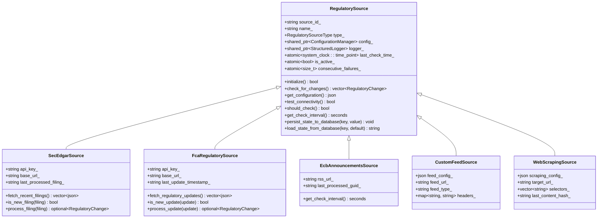
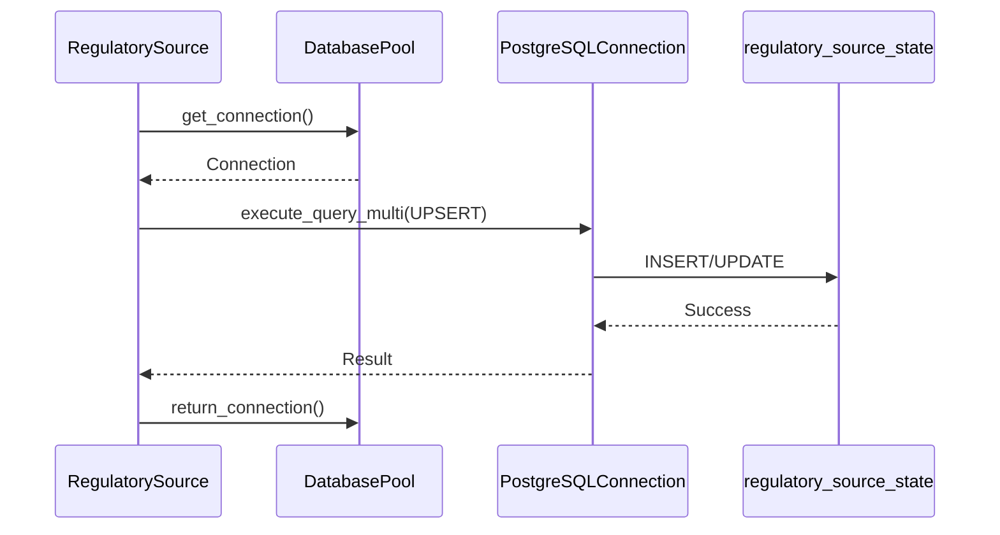
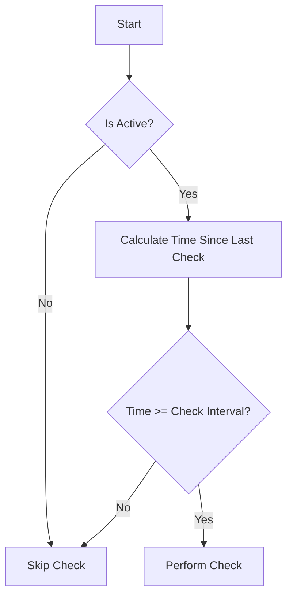

# Source Integration

<cite>
**Referenced Files in This Document**   
- [regulatory_source.hpp](file://regulatory_monitor/regulatory_source.hpp)
- [regulatory_source.cpp](file://regulatory_monitor/regulatory_source.cpp)
- [database_source.hpp](file://shared/data_ingestion/sources/database_source.hpp)
- [rest_api_source.hpp](file://shared/data_ingestion/sources/rest_api_source.hpp)
- [web_scraping_source.hpp](file://shared/data_ingestion/sources/web_scraping_source.hpp)
</cite>

## Table of Contents
1. [Introduction](#introduction)
2. [RegulatorySource Abstract Base Class](#regulatorysource-abstract-base-class)
3. [Concrete Source Implementations](#concrete-source-implementations)
4. [Initialization and Connectivity Testing](#initialization-and-connectivity-testing)
5. [State Persistence Mechanisms](#state-persistence-mechanisms)
6. [Polling Configuration and Failure Handling](#polling-configuration-and-failure-handling)
7. [Integration Challenges and Strategies](#integration-challenges-and-strategies)

## Introduction
The Source Integration subsystem provides a unified framework for monitoring regulatory changes from diverse sources including RSS feeds, REST APIs, web scraping, and databases. This document details the architecture and implementation of the RegulatorySource class hierarchy, state management, and integration strategies for handling various regulatory body APIs.

## RegulatorySource Abstract Base Class

The RegulatorySource class serves as an abstract base class for all regulatory data sources, providing a consistent interface and shared functionality across different source types. The class is designed with production reliability in mind, incorporating state persistence, error handling, and configuration management.

The base class defines several pure virtual methods that must be implemented by concrete subclasses:
- `initialize()`: Sets up the source with configuration parameters
- `check_for_changes()`: Detects new regulatory changes from the source
- `get_configuration()`: Returns the current configuration as JSON
- `test_connectivity()`: Verifies connectivity to the source

The class also provides common utility methods and state management features, including atomic tracking of the last check time, active status, and consecutive failures. The should_check() method determines whether a source should be polled based on its check interval and last check time.

**Section sources**
- [regulatory_source.hpp](file://regulatory_monitor/regulatory_source.hpp#L15-L100)

## Concrete Source Implementations

The system implements several concrete source types, each tailored to a specific data source format:

### SEC EDGAR API Source
The SecEdgarSource class implements integration with the SEC EDGAR API, handling authentication with API keys and parsing regulatory filings. It extracts key information from filings including form type, company name, and filing date, and determines the regulatory impact based on the form type (e.g., 8-K forms are considered high impact).

### FCA Regulatory API Source
The FcaRegulatorySource class integrates with the UK Financial Conduct Authority API, processing regulatory updates and policy changes. It handles timestamp-based change detection and categorizes updates by type (emergency, rule_change, policy, guidance) to determine their severity.

### ECB Announcements RSS Source
The EcbAnnouncementsSource class processes RSS feeds from the European Central Bank, parsing XML content to extract announcements, regulations, and guidance documents. It uses a longer check interval (15 minutes) appropriate for RSS feeds.

### Custom Feed and Web Scraping Sources
The CustomFeedSource and WebScrapingSource classes provide flexible integration for non-standard sources. CustomFeedSource supports RSS, Atom, and JSON feeds with configurable parsing rules, while WebScrapingSource uses libxml2 for robust HTML parsing with XPath support.

**Diagram sources**
- [regulatory_source.hpp](file://regulatory_monitor/regulatory_source.hpp#L15-L301)
- [regulatory_source.cpp](file://regulatory_monitor/regulatory_source.cpp#L1-L1244)

**Section sources**
- [regulatory_source.hpp](file://regulatory_monitor/regulatory_source.hpp#L102-L301)
- [regulatory_source.cpp](file://regulatory_monitor/regulatory_source.cpp#L1-L1244)

## Initialization and Connectivity Testing

Each source type implements the initialize() method to configure itself based on environment variables and load persistent state from the database. The initialization process includes:

1. Loading configuration parameters (API keys, base URLs, etc.) from the ConfigurationManager
2. Establishing connectivity to the source
3. Loading the last processed state from the database (e.g., last filing number, last update timestamp)
4. Performing a connectivity test

The test_connectivity() method verifies that the source is accessible by making a test request to a health endpoint or a known resource. This method is used during initialization and can be called externally to verify source health.

All source implementations use the HttpClient class for HTTP requests, ensuring consistent behavior across different source types. The HTTP request methods include error handling and return structured HttpResponse objects containing status codes and response bodies.

**Section sources**
- [regulatory_source.cpp](file://regulatory_monitor/regulatory_source.cpp#L50-L100)
- [regulatory_source.cpp](file://regulatory_monitor/regulatory_source.cpp#L250-L300)
- [regulatory_source.cpp](file://regulatory_monitor/regulatory_source.cpp#L450-L500)

## State Persistence Mechanisms

The system implements robust state persistence to ensure reliability across application restarts and failures. The RegulatorySource base class provides two key methods for state management:

- `persist_state_to_database(key, value)`: Stores a key-value pair in the database
- `load_state_from_database(key, default_value)`: Retrieves a value from the database with a fallback to a default

These methods use the ConnectionPool to obtain a database connection and execute UPSERT operations on the regulatory_source_state table. The state storage is used to track:
- Last processed filing number (SEC EDGAR)
- Last update timestamp (FCA)
- Last processed GUID (ECB RSS)
- Other source-specific state

The database-backed state storage ensures that the system can resume monitoring from where it left off after restarts, preventing duplicate processing of regulatory changes.

**Diagram sources**
- [regulatory_source.cpp](file://regulatory_monitor/regulatory_source.cpp#L1000-L1244)
- [postgresql_connection.hpp](file://shared/database/postgresql_connection.hpp#L67-L113)

**Section sources**
- [regulatory_source.cpp](file://regulatory_monitor/regulatory_source.cpp#L1000-L1244)
- [postgresql_connection.hpp](file://shared/database/postgresql_connection.hpp#L67-L113)

## Polling Configuration and Failure Handling

The system implements sophisticated polling and failure handling mechanisms to ensure reliable monitoring of regulatory sources.

### Check Interval Configuration
The should_check() method determines whether a source should be polled based on its check interval and last check time:

The check interval can be overridden by concrete implementations. For example, the ECB RSS source uses a 15-minute interval (900 seconds) while most API sources use the default 5-minute interval.

### Failure Handling with Exponential Backoff
The system tracks consecutive failures using the consecutive_failures_ atomic counter. When a source fails to check for changes, the record_failure() method increments this counter. When a check succeeds, record_success() resets the counter to zero.

This mechanism enables exponential backoff strategies in higher-level monitoring components, though the specific backoff logic is not implemented in the source classes themselves. The consecutive failure count can be used to trigger alerts or temporarily disable problematic sources.

**Section sources**
- [regulatory_source.hpp](file://regulatory_monitor/regulatory_source.hpp#L80-L95)
- [regulatory_source.cpp](file://regulatory_monitor/regulatory_source.cpp#L50-L100)
- [regulatory_source.cpp](file://regulatory_monitor/regulatory_source.cpp#L250-L300)

## Integration Challenges and Strategies

Integrating with various regulatory body APIs presents several challenges that the system addresses through specific strategies:

### Rate Limiting
The system respects API rate limits through appropriate check intervals and can be extended to parse rate limit headers from API responses. The HttpClient implementation provides a foundation for automatic rate limit handling.

### Authentication
Different sources require different authentication methods:
- SEC EDGAR: API key in request parameters
- FCA: API key in request parameters
- Other sources may use header-based authentication, OAuth, or JWT

The configuration system allows storing credentials securely in environment variables, with the option to integrate with secret management systems like HashiCorp Vault.

### Schema Changes
The system handles schema changes in external sources through:
- Flexible JSON parsing that gracefully handles missing fields
- Default values for optional fields
- Comprehensive error handling around parsing operations
- Logging of parsing errors for monitoring and alerting

### Content Parsing
Different source types require different parsing approaches:
- API sources parse JSON responses with schema validation
- RSS sources parse XML content using libxml2
- Web scraping sources use XPath expressions for reliable content extraction

The system's modular design allows adding new source types and parsing strategies without modifying the core monitoring logic.

**Section sources**
- [regulatory_source.cpp](file://regulatory_monitor/regulatory_source.cpp#L1-L1244)
- [rest_api_source.hpp](file://shared/data_ingestion/sources/rest_api_source.hpp#L1-L148)
- [web_scraping_source.hpp](file://shared/data_ingestion/sources/web_scraping_source.hpp#L1-L201)