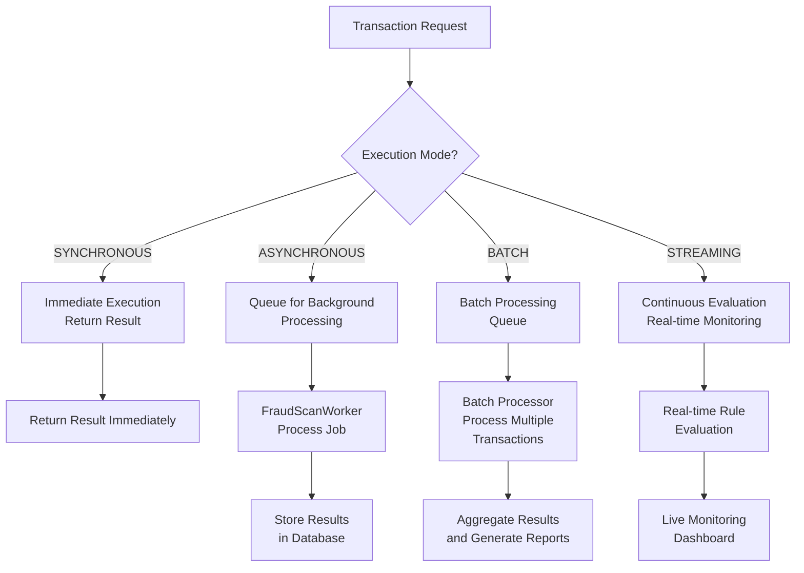
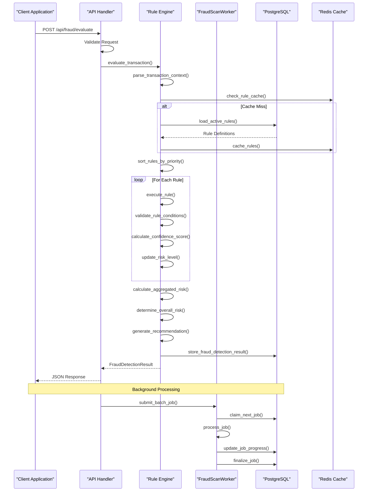
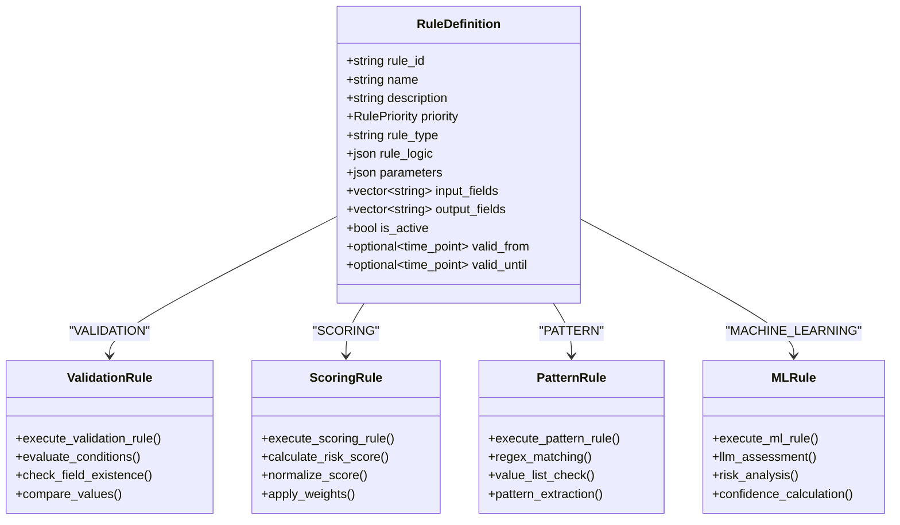
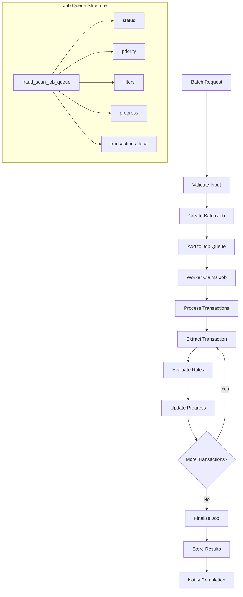
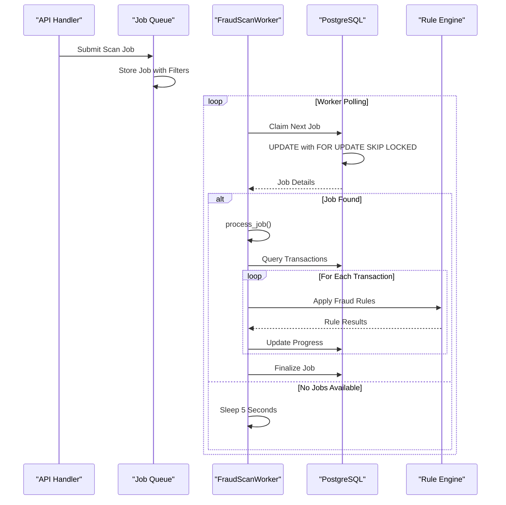
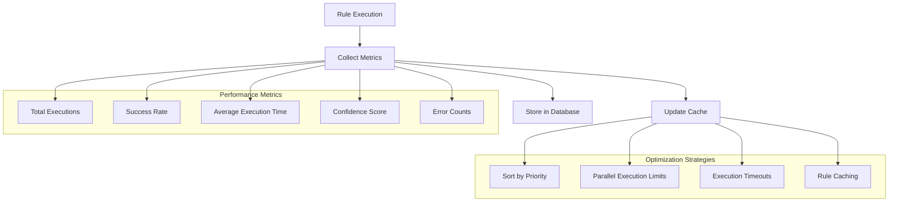
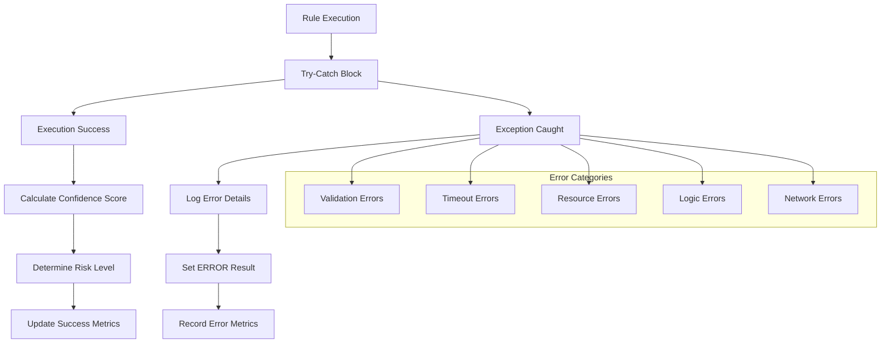
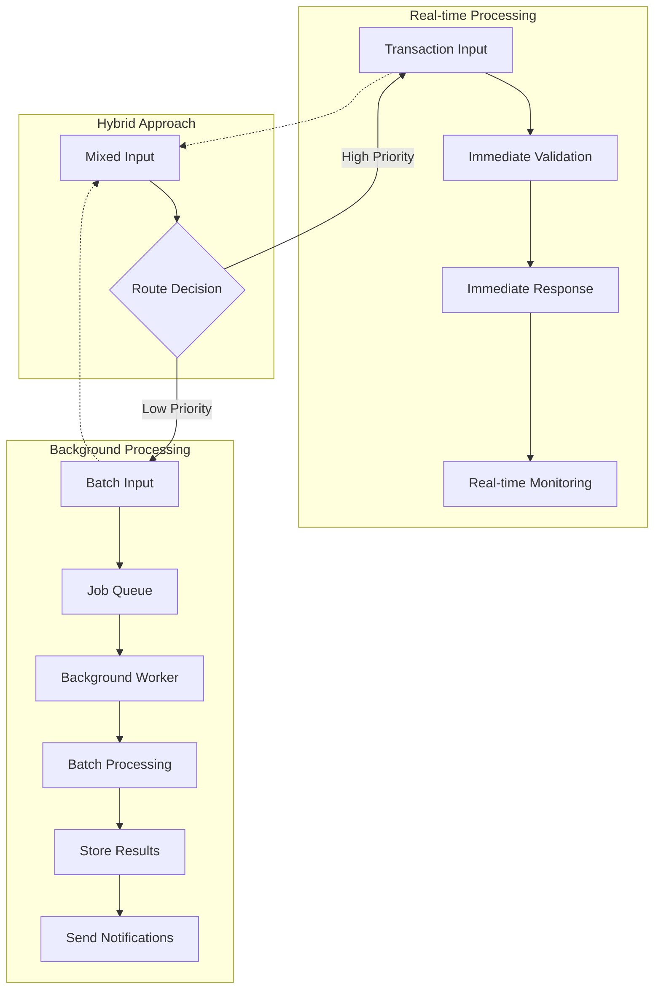

# Execution Model

<cite>
**Referenced Files in This Document**
- [advanced_rule_engine.hpp](file://shared/rules/advanced_rule_engine.hpp)
- [advanced_rule_engine.cpp](file://shared/rules/advanced_rule_engine.cpp)
- [advanced_rule_engine_api_handlers.cpp](file://shared/rules/advanced_rule_engine_api_handlers.cpp)
- [fraud_scan_worker.hpp](file://shared/fraud_detection/fraud_scan_worker.hpp)
- [fraud_scan_worker.cpp](file://shared/fraud_detection/fraud_scan_worker.cpp)
- [fraud_ml_api_handlers.cpp](file://shared/fraud_detection/fraud_ml_api_handlers.cpp)
- [fraud_api_handlers.cpp](file://shared/fraud_detection/fraud_api_handlers.cpp)
- [schema.sql](file://schema.sql)
</cite>

## Table of Contents
1. [Introduction](#introduction)
2. [Execution Modes](#execution-modes)
3. [Core Execution Pipeline](#core-execution-pipeline)
4. [Rule Types and Execution Methods](#rule-types-and-execution-methods)
5. [Batch Processing Workflows](#batch-processing-workflows)
6. [FraudScanWorker Integration](#fraudscanworker-integration)
7. [Performance Monitoring and Optimization](#performance-monitoring-and-optimization)
8. [Error Handling and Tracing](#error-handling-and-tracing)
9. [Real-time vs Background Processing](#real-time-vs-background-processing)
10. [Optimization Strategies](#optimization-strategies)
11. [Troubleshooting Guide](#troubleshooting-guide)
12. [Conclusion](#conclusion)

## Introduction

The Execution Model is the core subsystem of the Rule Engine responsible for processing fraud detection rules and policy checks in both synchronous and asynchronous modes. This component orchestrates the complete lifecycle of rule execution, from context ingestion to result aggregation, with sophisticated support for batch processing, parallel execution limits, and real-time transaction monitoring.

The system implements a multi-layered execution architecture that supports four primary execution modes: synchronous, asynchronous, batch processing, and streaming. Each mode serves different use cases ranging from immediate transaction validation to large-scale background analysis.

## Execution Modes

The Rule Engine supports four distinct execution modes, each optimized for specific scenarios:



**Diagram sources**
- [advanced_rule_engine.hpp](file://shared/rules/advanced_rule_engine.hpp#L18-L22)
- [fraud_scan_worker.cpp](file://shared/fraud_detection/fraud_scan_worker.cpp#L18-L35)

### Synchronous Execution

Synchronous execution provides immediate results for real-time transaction validation. This mode is essential for online transaction processing where decisions must be made within milliseconds.

**Key Characteristics:**
- **Response Time:** < 5 seconds
- **Use Case:** Online transaction approval/rejection
- **Resource Allocation:** Dedicated threads/processes
- **Error Handling:** Immediate failure reporting

### Asynchronous Execution

Asynchronous execution queues rules for background processing, ideal for scenarios where immediate results aren't required but thorough analysis is necessary.

**Key Characteristics:**
- **Response Time:** Variable (typically 1-10 minutes)
- **Use Case:** Post-transaction analysis and enrichment
- **Resource Allocation:** Background workers
- **Error Handling:** Retry mechanisms and notifications

### Batch Processing

Batch processing handles large volumes of historical data, enabling comprehensive analysis across extensive datasets.

**Key Characteristics:**
- **Throughput:** High volume processing
- **Use Case:** Periodic audits and compliance reporting
- **Resource Allocation:** Dedicated batch processors
- **Error Handling:** Partial success reporting

### Streaming Execution

Streaming execution continuously evaluates incoming transactions against active rules, providing real-time insights and alerts.

**Key Characteristics:**
- **Latency:** Sub-second processing
- **Use Case:** Real-time monitoring and alerting
- **Resource Allocation:** Event-driven architecture
- **Error Handling:** Graceful degradation

**Section sources**
- [advanced_rule_engine.hpp](file://shared/rules/advanced_rule_engine.hpp#L18-L22)
- [advanced_rule_engine.cpp](file://shared/rules/advanced_rule_engine.cpp#L85-L120)

## Core Execution Pipeline

The execution pipeline follows a structured approach from context ingestion to result aggregation:



**Diagram sources**
- [advanced_rule_engine.cpp](file://shared/rules/advanced_rule_engine.cpp#L121-L256)
- [advanced_rule_engine_api_handlers.cpp](file://shared/rules/advanced_rule_engine_api_handlers.cpp#L50-L120)
- [fraud_scan_worker.cpp](file://shared/fraud_detection/fraud_scan_worker.cpp#L18-L35)

### Context Ingestion Phase

The context ingestion phase transforms raw transaction data into structured execution contexts:

```cpp
struct RuleExecutionContext {
    std::string transaction_id;
    std::string user_id;
    std::string session_id;
    nlohmann::json transaction_data;
    nlohmann::json user_profile;
    nlohmann::json historical_data;
    std::chrono::system_clock::time_point execution_time;
    std::string source_system;
    std::unordered_map<std::string, std::string> metadata;
};
```

**Key Features:**
- **Transaction ID Generation:** Unique identifiers for correlation
- **Metadata Enrichment:** Additional context from user profiles and history
- **Timestamp Precision:** Millisecond-level timing for performance tracking
- **Source Attribution:** System identification for audit trails

### Rule Selection and Sorting

The system prioritizes rules based on their importance and execution characteristics:

```cpp
// Sort rules by priority (highest first)
std::sort(rules_to_execute.begin(), rules_to_execute.end(),
         [](const RuleDefinition& a, const RuleDefinition& b) {
             return static_cast<int>(a.priority) > static_cast<int>(b.priority);
         });
```

**Section sources**
- [advanced_rule_engine.cpp](file://shared/rules/advanced_rule_engine.cpp#L121-L256)
- [advanced_rule_engine.hpp](file://shared/rules/advanced_rule_engine.hpp#L40-L50)

## Rule Types and Execution Methods

The system supports four distinct rule types, each with specialized execution logic:



**Diagram sources**
- [advanced_rule_engine.hpp](file://shared/rules/advanced_rule_engine.hpp#L60-L85)
- [advanced_rule_engine.cpp](file://shared/rules/advanced_rule_engine.cpp#L275-L512)

### Validation Rules

Validation rules check specific conditions against transaction data:

```cpp
RuleExecutionResultDetail AdvancedRuleEngine::execute_validation_rule(
    const RuleDefinition& rule,
    const RuleExecutionContext& context
) {
    // Extract conditions from rule logic
    const auto& conditions = rule.rule_logic["conditions"];
    
    bool all_conditions_met = true;
    std::vector<std::string> failed_conditions;
    
    for (const auto& condition : conditions) {
        bool condition_met = evaluate_condition(condition, context.transaction_data);
        if (!condition_met) {
            all_conditions_met = false;
            failed_conditions.push_back(condition["description"]);
        }
    }
    
    result.result = all_conditions_met ? RuleExecutionResult::PASS : RuleExecutionResult::FAIL;
    return result;
}
```

### Scoring Rules

Scoring rules calculate risk scores based on weighted factors:

```cpp
RuleExecutionResultDetail AdvancedRuleEngine::execute_scoring_rule(
    const RuleDefinition& rule,
    const RuleExecutionContext& context
) {
    double score = 0.0;
    std::unordered_map<std::string, double> risk_factors;
    
    for (const auto& factor : rule.rule_logic["scoring_factors"]) {
        double factor_score = 0.0;
        
        if (operation == "exists" && !field_value.is_null()) {
            factor_score = weight;
        } else if (operation == "value" && field_value.is_number()) {
            factor_score = field_value.get<double>() * weight;
        }
        
        score += factor_score;
        if (factor_score > 0) {
            risk_factors[field] = factor_score;
        }
    }
    
    // Normalize score and determine threshold crossing
    score = normalize_risk_score(score);
    double threshold = rule.rule_logic.value("threshold", 0.5);
    result.result = (score >= threshold) ? RuleExecutionResult::FAIL : RuleExecutionResult::PASS;
    
    return result;
}
```

### Pattern Rules

Pattern rules detect suspicious patterns using regex and value matching:

```cpp
RuleExecutionResultDetail AdvancedRuleEngine::execute_pattern_rule(
    const RuleDefinition& rule,
    const RuleExecutionContext& context
) {
    bool pattern_matched = false;
    
    for (const auto& pattern : rule.rule_logic["patterns"]) {
        if (pattern_type == "regex") {
            std::regex compiled_pattern(pattern["pattern"]);
            if (std::regex_match(value_str, compiled_pattern)) {
                pattern_matched = true;
                matched_patterns.push_back("Regex pattern on field '" + field + "'");
            }
        } else if (pattern_type == "value_list") {
            for (const auto& allowed_value : values) {
                if (field_value == allowed_value) {
                    pattern_matched = true;
                    matched_patterns.push_back("Value list match on field '" + field + "'");
                    break;
                }
            }
        }
    }
    
    return result;
}
```

### Machine Learning Rules

ML rules leverage LLM interfaces for sophisticated fraud detection:

```cpp
RuleExecutionResultDetail AdvancedRuleEngine::execute_ml_rule(
    const RuleDefinition& rule,
    const RuleExecutionContext& context
) {
    // Prepare comprehensive analysis data
    nlohmann::json ml_analysis_data = {
        {"transaction_id", context.transaction_id},
        {"user_id", context.user_id},
        {"session_id", context.session_id},
        {"transaction_data", context.transaction_data},
        {"user_profile", context.user_profile},
        {"historical_data", context.historical_data},
        {"execution_time", std::chrono::duration_cast<std::chrono::seconds>(
            context.execution_time.time_since_epoch()).count()},
        {"source_system", context.source_system},
        {"metadata", context.metadata},
        {"rule_parameters", rule.parameters}
    };
    
    // Use LLM for risk assessment
    auto llm_response = llm_interface_->assess_risk(ml_analysis_data, model_type);
    
    if (!llm_response.success) {
        result.result = RuleExecutionResult::ERROR;
        result.error_message = "LLM risk assessment failed: " + llm_response.error_message;
        return result;
    }
    
    // Determine fraud based on confidence threshold
    result.confidence_score = llm_response.confidence_score;
    double risk_threshold = rule.rule_logic.value("risk_threshold", 0.5);
    
    if (result.confidence_score >= risk_threshold) {
        result.result = RuleExecutionResult::FAIL;
    } else {
        result.result = RuleExecutionResult::PASS;
    }
    
    return result;
}
```

**Section sources**
- [advanced_rule_engine.cpp](file://shared/rules/advanced_rule_engine.cpp#L275-L512)

## Batch Processing Workflows

Batch processing enables efficient analysis of large transaction datasets through sophisticated queuing and parallel processing mechanisms:



**Diagram sources**
- [fraud_scan_worker.cpp](file://shared/fraud_detection/fraud_scan_worker.cpp#L49-L94)
- [fraud_ml_api_handlers.cpp](file://shared/fraud_detection/fraud_ml_api_handlers.cpp#L346-L416)

### Job Submission Process

The batch processing system creates jobs through a structured submission process:

```cpp
std::string AdvancedRuleEngineAPIHandlers::handle_batch_evaluate_transactions(
    const std::string& request_body, 
    const std::string& user_id
) {
    // Parse transactions
    std::vector<RuleExecutionContext> contexts;
    for (const auto& txn_request : request["transactions"]) {
        if (txn_request.contains("transaction_data")) {
            RuleExecutionContext context = parse_transaction_context(txn_request);
            contexts.push_back(context);
        }
    }
    
    // Submit batch evaluation
    std::string batch_id = rule_engine_->submit_batch_evaluation(contexts, rule_ids);
    
    // Start background processing
    std::thread([this, batch_id, contexts, rule_ids]() {
        update_batch_progress(batch_id, 0.0);
        
        std::unordered_map<std::string, FraudDetectionResult> results;
        int processed = 0;
        
        for (const auto& context : contexts) {
            FraudDetectionResult result = rule_engine_->evaluate_transaction(context, rule_ids);
            results[context.transaction_id] = result;
            
            processed++;
            double progress = static_cast<double>(processed) / contexts.size();
            update_batch_progress(batch_id, progress);
        }
        
        // Store results
        std::lock_guard<std::mutex> lock(batch_mutex_);
        batch_results_[batch_id] = std::move(results);
        batch_progress_[batch_id] = 1.0;
    }).detach();
    
    return create_success_response({"batch_id", batch_id}).dump();
}
```

### Parallel Execution Limits

The system implements configurable parallel execution limits to prevent resource exhaustion:

```cpp
void AdvancedRuleEngine::set_max_parallel_executions(int max_parallel) {
    max_parallel_executions_ = std::max(1, max_parallel);
}

// Example usage in batch processing
std::string AdvancedRuleEngine::submit_batch_evaluation(
    const std::vector<RuleExecutionContext>& contexts,
    const std::vector<std::string>& rule_ids
) {
    std::string batch_id = generate_batch_id();
    
    // Process in batches to respect parallel limits
    int batch_size = std::min(max_parallel_executions_, 100);
    int total_batches = (contexts.size() + batch_size - 1) / batch_size;
    
    // Submit individual batch jobs...
    
    return batch_id;
}
```

**Section sources**
- [advanced_rule_engine_api_handlers.cpp](file://shared/rules/advanced_rule_engine_api_handlers.cpp#L120-L180)
- [advanced_rule_engine.cpp](file://shared/rules/advanced_rule_engine.cpp#L1050-L1106)

## FraudScanWorker Integration

The FraudScanWorker provides robust background job processing capabilities with atomic job claiming and progress tracking:



**Diagram sources**
- [fraud_scan_worker.cpp](file://shared/fraud_detection/fraud_scan_worker.cpp#L18-L35)
- [fraud_scan_worker.cpp](file://shared/fraud_detection/fraud_scan_worker.cpp#L49-L94)

### Atomic Job Claiming

The worker implements atomic job claiming to prevent race conditions:

```cpp
std::optional<ScanJob> FraudScanWorker::claim_next_job() {
    // Atomic job claiming using UPDATE ... RETURNING with FOR UPDATE SKIP LOCKED
    std::string worker_id_str = worker_id_;
    const char* params[1] = {worker_id_str.c_str()};
    
    PGresult* result = PQexecParams(db_conn_,
        "UPDATE fraud_scan_job_queue "
        "SET status = 'processing', "
        "    worker_id = $1, "
        "    claimed_at = NOW(), "
        "    started_at = NOW() "
        "WHERE job_id = ("
        "  SELECT job_id FROM fraud_scan_job_queue "
        "  WHERE status = 'queued' "
        "  ORDER BY priority DESC, created_at ASC "
        "  LIMIT 1 "
        "  FOR UPDATE SKIP LOCKED"
        ") "
        "RETURNING job_id, filters, created_by",
        1, NULL, params, NULL, NULL, 0);
    
    if (PQresultStatus(result) != PGRES_TUPLES_OK || PQntuples(result) == 0) {
        PQclear(result);
        return std::nullopt;
    }
    
    ScanJob job;
    job.job_id = PQgetvalue(result, 0, 0);
    
    std::string filters_json = PQgetvalue(result, 0, 1);
    try {
        job.filters = json::parse(filters_json);
    } catch (...) {
        job.filters = json::object();
    }
    
    job.created_by = PQgetvalue(result, 0, 2);
    
    PQclear(result);
    return job;
}
```

### Progress Tracking and Reporting

The worker maintains detailed progress tracking for long-running jobs:

```cpp
void FraudScanWorker::update_job_progress(const std::string& job_id, int processed, int flagged) {
    int progress = (processed * 100) / (processed + 1);  // Avoid division by zero
    
    std::string progress_str = std::to_string(progress);
    std::string processed_str = std::to_string(processed);
    std::string flagged_str = std::to_string(flagged);
    
    const char* params[4] = {progress_str.c_str(), processed_str.c_str(),
                            flagged_str.c_str(), job_id.c_str()};
    
    PGresult* result = PQexecParams(db_conn_,
        "UPDATE fraud_scan_job_queue "
        "SET progress = $1, transactions_processed = $2, transactions_flagged = $3 "
        "WHERE job_id = $4",
        4, NULL, params, NULL, NULL, 0);
    
    PQclear(result);
}
```

### Real-time Transaction Monitoring

The system supports real-time transaction monitoring through continuous rule evaluation:

```cpp
void FraudScanWorker::process_job(const ScanJob& job) {
    try {
        // Build transaction query based on filters
        std::string query = "SELECT transaction_id, amount, currency, from_account, to_account, "
                           "       transaction_type, metadata "
                           "FROM transactions "
                           "WHERE 1=1";
        
        // Apply filters dynamically
        if (job.filters.contains("date_from")) {
            query += " AND created_at >= $" + std::to_string(param_values.size() + 1);
            param_values.push_back(job.filters["date_from"].get<std::string>());
        }
        
        // Execute query and process transactions
        PGresult* txn_result = PQexecParams(db_conn_, query.c_str(),
            params.size(), NULL, params.data(), NULL, NULL, 0);
        
        // Process each transaction with real-time monitoring
        for (int i = 0; i < total_transactions; i++) {
            std::string txn_id = PQgetvalue(txn_result, i, 0);
            double amount = std::stod(PQgetvalue(txn_result, i, 1));
            std::string currency = PQgetvalue(txn_result, i, 2);
            
            // Apply fraud detection rules in real-time
            bool is_flagged = apply_fraud_rules(txn_id, amount, currency, 
                                               from_account, to_account, txn_type);
            
            if (is_flagged) {
                flagged++;
            }
            
            processed++;
            
            // Update progress every 100 transactions
            if (processed % 100 == 0) {
                update_job_progress(job.job_id, processed, flagged);
            }
        }
        
    } catch (const std::exception& e) {
        finalize_job(job.job_id, false, std::string("Exception: ") + e.what());
    }
}
```

**Section sources**
- [fraud_scan_worker.cpp](file://shared/fraud_detection/fraud_scan_worker.cpp#L49-L94)
- [fraud_scan_worker.cpp](file://shared/fraud_detection/fraud_scan_worker.cpp#L128-L196)

## Performance Monitoring and Optimization

The system implements comprehensive performance monitoring and optimization strategies:



**Diagram sources**
- [advanced_rule_engine.cpp](file://shared/rules/advanced_rule_engine.cpp#L1024-L1050)

### Execution Timeouts

The system enforces configurable execution timeouts to prevent rule execution from consuming excessive resources:

```cpp
void AdvancedRuleEngine::set_execution_timeout(std::chrono::milliseconds timeout) {
    execution_timeout_ = std::max(std::chrono::milliseconds(100), timeout);
}

RuleExecutionResultDetail AdvancedRuleEngine::execute_rule(
    const RuleDefinition& rule,
    const RuleExecutionContext& context,
    RuleExecutionMode mode
) {
    auto start_time = std::chrono::high_resolution_clock::now();
    
    try {
        // Execute rule logic...
        
    } catch (const std::exception& e) {
        result.result = RuleExecutionResult::ERROR;
        result.error_message = std::string("Rule execution failed: ") + e.what();
    }
    
    auto end_time = std::chrono::high_resolution_clock::now();
    result.execution_time = std::chrono::duration_cast<std::chrono::milliseconds>(end_time - start_time);
    
    // Check timeout
    if (result.execution_time > execution_timeout_) {
        result.result = RuleExecutionResult::TIMEOUT;
        result.error_message = "Rule execution exceeded timeout";
    }
    
    return result;
}
```

### Caching Strategies

The system implements multi-level caching for optimal performance:

```cpp
void AdvancedRuleEngine::cache_rule(const RuleDefinition& rule) {
    std::lock_guard<std::mutex> lock(cache_mutex_);
    rule_cache_[rule.rule_id] = rule;
}

void AdvancedRuleEngine::invalidate_rule_cache(const std::string& rule_id) {
    std::lock_guard<std::mutex> lock(cache_mutex_);
    if (rule_id.empty()) {
        rule_cache_.clear();
    } else {
        rule_cache_.erase(rule_id);
    }
}

void AdvancedRuleEngine::cleanup_expired_cache_entries() {
    auto now = std::chrono::system_clock::now();
    
    std::lock_guard<std::mutex> lock(cache_mutex_);
    auto it = rule_cache_.begin();
    while (it != rule_cache_.end()) {
        // Remove rules that haven't been accessed recently
        if (/* expired condition */) {
            it = rule_cache_.erase(it);
        } else {
            ++it;
        }
    }
}
```

### Performance Metrics Collection

The system tracks comprehensive performance metrics for each rule:

```cpp
void AdvancedRuleEngine::update_rule_metrics(const std::string& rule_id, 
                                           const RuleExecutionResultDetail& result) {
    std::lock_guard<std::mutex> lock(cache_mutex_);
    
    auto& metrics = metrics_cache_[rule_id];
    metrics.rule_id = rule_id;
    metrics.total_executions++;
    
    if (result.result == RuleExecutionResult::PASS) {
        metrics.successful_executions++;
    } else if (result.result == RuleExecutionResult::FAIL) {
        metrics.failed_executions++;
        metrics.fraud_detections++;
    }
    
    // Calculate moving averages
    metrics.average_confidence_score = (metrics.average_confidence_score + result.confidence_score) / 2.0;
    metrics.last_execution = std::chrono::system_clock::now();
}

void AdvancedRuleEngine::record_execution_time(const std::string& rule_id, 
                                             std::chrono::milliseconds duration) {
    std::lock_guard<std::mutex> lock(cache_mutex_);
    
    auto& metrics = metrics_cache_[rule_id];
    metrics.average_execution_time_ms = (metrics.average_execution_time_ms + duration.count()) / 2.0;
}
```

**Section sources**
- [advanced_rule_engine.cpp](file://shared/rules/advanced_rule_engine.cpp#L1024-L1106)

## Error Handling and Tracing

The system implements comprehensive error handling and execution tracing mechanisms:



**Diagram sources**
- [advanced_rule_engine.cpp](file://shared/rules/advanced_rule_engine.cpp#L85-L120)

### Comprehensive Error Handling

Each rule execution includes robust error handling:

```cpp
RuleExecutionResultDetail AdvancedRuleEngine::execute_rule(
    const RuleDefinition& rule,
    const RuleExecutionContext& context,
    RuleExecutionMode mode
) {
    RuleExecutionResultDetail result;
    result.rule_id = rule.rule_id;
    result.rule_name = rule.name;
    
    auto start_time = std::chrono::high_resolution_clock::now();
    
    try {
        // Check rule validity
        if (!rule.is_active) {
            result.result = RuleExecutionResult::SKIPPED;
            result.error_message = "Rule is inactive";
            return result;
        }
        
        if (rule.valid_from && context.execution_time < *rule.valid_from) {
            result.result = RuleExecutionResult::SKIPPED;
            result.error_message = "Rule not yet valid";
            return result;
        }
        
        // Execute based on rule type
        if (rule.rule_type == "VALIDATION") {
            result = execute_validation_rule(rule, context);
        } else if (rule.rule_type == "SCORING") {
            result = execute_scoring_rule(rule, context);
        } else if (rule.rule_type == "PATTERN") {
            result = execute_pattern_rule(rule, context);
        } else if (rule.rule_type == "MACHINE_LEARNING") {
            result = execute_ml_rule(rule, context);
        } else {
            result.result = RuleExecutionResult::ERROR;
            result.error_message = "Unknown rule type: " + rule.rule_type;
        }
        
        // Calculate confidence score
        result.confidence_score = calculate_rule_confidence(rule, result);
        
        // Determine risk level
        if (result.result == RuleExecutionResult::FAIL) {
            result.risk_level = score_to_risk_level(result.confidence_score);
        }
        
    } catch (const std::exception& e) {
        result.result = RuleExecutionResult::ERROR;
        result.error_message = std::string("Rule execution failed: ") + e.what();
        
        if (logger_) {
            logger_->error(fmt::format("Rule execution failed for rule '{}': {}", 
                                     rule.rule_id, e.what()));
        }
    }
    
    auto end_time = std::chrono::high_resolution_clock::now();
    result.execution_time = std::chrono::duration_cast<std::chrono::milliseconds>(end_time - start_time);
    
    // Update performance metrics
    if (enable_performance_monitoring_) {
        update_rule_metrics(rule.rule_id, result);
        record_execution_time(rule.rule_id, result.execution_time);
    }
    
    return result;
}
```

### Execution Tracing

The system provides detailed execution tracing for debugging and auditing:

```cpp
nlohmann::json serialize_rule_result(const RuleExecutionResultDetail& detail) {
    nlohmann::json payload = {
        {"rule_id", detail.rule_id},
        {"rule_name", detail.rule_name},
        {"result", to_string(detail.result)},
        {"confidence_score", detail.confidence_score},
        {"risk_level", to_string(detail.risk_level)},
        {"rule_output", detail.rule_output},
        {"error_message", detail.error_message},
        {"execution_time_ms", detail.execution_time.count()},
        {"triggered_conditions", detail.triggered_conditions}
    };
    
    nlohmann::json risk_factors_json = nlohmann::json::object();
    for (const auto& [factor, value] : detail.risk_factors) {
        risk_factors_json[factor] = value;
    }
    payload["risk_factors"] = std::move(risk_factors_json);
    
    return payload;
}
```

### Error Recovery Mechanisms

The system implements several error recovery mechanisms:

```cpp
bool AdvancedRuleEngine::store_fraud_detection_result(const FraudDetectionResult& result) {
    try {
        if (!db_conn_) return false;
        
        std::string query = R"(
            INSERT INTO fraud_detection_results (
                transaction_id, is_fraudulent, overall_risk, fraud_score,
                rule_results, aggregated_findings, detection_time, processing_duration,
                recommendation
            ) VALUES ($1, $2, $3, $4, $5, $6, $7, $8, $9)
        )";
        
        nlohmann::json rule_results_json = nlohmann::json::array();
        for (const auto& detail : result.rule_results) {
            rule_results_json.push_back(serialize_rule_result(detail));
        }
        
        std::vector<std::string> params = {
            result.transaction_id,
            result.is_fraudulent ? "true" : "false",
            std::to_string(static_cast<int>(result.overall_risk)),
            std::to_string(result.fraud_score),
            rule_results_json.dump(),
            result.aggregated_findings.dump(),
            std::to_string(std::chrono::duration_cast<std::chrono::seconds>(
                result.detection_time.time_since_epoch()).count()),
            result.processing_duration,
            result.recommendation
        };
        
        return db_conn_->execute_command(query, params);
        
    } catch (const std::exception& e) {
        if (logger_) {
            logger_->error(fmt::format("Exception in store_fraud_detection_result: {}", e.what()));
        }
        return false;
    }
}
```

**Section sources**
- [advanced_rule_engine.cpp](file://shared/rules/advanced_rule_engine.cpp#L85-L120)
- [advanced_rule_engine.cpp](file://shared/rules/advanced_rule_engine.cpp#L1024-L1050)

## Real-time vs Background Processing

The system supports both real-time and background processing modes, each optimized for different scenarios:



**Diagram sources**
- [advanced_rule_engine_api_handlers.cpp](file://shared/rules/advanced_rule_engine_api_handlers.cpp#L50-L120)
- [fraud_scan_worker.cpp](file://shared/fraud_detection/fraud_scan_worker.cpp#L18-L35)

### Real-time Processing

Real-time processing provides immediate results for critical transaction decisions:

```cpp
std::string AdvancedRuleEngineAPIHandlers::handle_evaluate_transaction(
    const std::string& request_body, 
    const std::string& user_id
) {
    try {
        nlohmann::json request = nlohmann::json::parse(request_body);
        
        // Parse transaction context
        RuleExecutionContext context = parse_transaction_context(request);
        
        // Extract rule IDs if specified
        std::vector<std::string> rule_ids;
        if (request.contains("rule_ids") && request["rule_ids"].is_array()) {
            for (const auto& rule_id : request["rule_ids"]) {
                if (rule_id.is_string()) {
                    rule_ids.push_back(rule_id.get<std::string>());
                }
            }
        }
        
        // Evaluate transaction synchronously
        auto start_time = std::chrono::high_resolution_clock::now();
        FraudDetectionResult result = rule_engine_->evaluate_transaction(context, rule_ids);
        auto end_time = std::chrono::high_resolution_clock::now();
        
        // Add processing time
        auto processing_time = std::chrono::duration_cast<std::chrono::milliseconds>(end_time - start_time);
        result.processing_duration = std::to_string(processing_time.count()) + "ms";
        
        nlohmann::json response_data = format_fraud_detection_result(result);
        response_data["processing_time_ms"] = processing_time.count();
        
        return create_success_response(response_data, "Transaction evaluated successfully").dump();
        
    } catch (const std::exception& e) {
        spdlog::error("Exception in handle_evaluate_transaction: {}", e.what());
        return create_error_response("Internal server error", 500).dump();
    }
}
```

### Background Processing

Background processing handles non-critical tasks asynchronously:

```cpp
void FraudScanWorker::process_job(const ScanJob& job) {
    try {
        // Build transaction query based on filters
        std::string query = "SELECT transaction_id, amount, currency, from_account, to_account, "
                           "       transaction_type, metadata "
                           "FROM transactions "
                           "WHERE 1=1";
        
        // Apply filters and execute query
        PGresult* txn_result = PQexecParams(db_conn_, query.c_str(),
            params.size(), NULL, params.data(), NULL, NULL, 0);
        
        int total_transactions = PQntuples(txn_result);
        int processed = 0;
        int flagged = 0;
        
        // Update job with total count
        std::string total_str = std::to_string(total_transactions);
        const char* total_params[2] = {total_str.c_str(), job.job_id.c_str()};
        PGresult* update_total = PQexecParams(db_conn_,
            "UPDATE fraud_scan_job_queue SET transactions_total = $1 WHERE job_id = $2",
            2, NULL, total_params, NULL, NULL, 0);
        PQclear(update_total);
        
        // Process each transaction
        for (int i = 0; i < total_transactions; i++) {
            std::string txn_id = PQgetvalue(txn_result, i, 0);
            double amount = std::stod(PQgetvalue(txn_result, i, 1));
            std::string currency = PQgetvalue(txn_result, i, 2);
            
            // Apply fraud detection rules
            bool is_flagged = apply_fraud_rules(txn_id, amount, currency, 
                                               from_account, to_account, txn_type);
            
            if (is_flagged) {
                flagged++;
            }
            
            processed++;
            
            // Update progress every 100 transactions
            if (processed % 100 == 0) {
                update_job_progress(job.job_id, processed, flagged);
            }
        }
        
        PQclear(txn_result);
        
        // Final progress update
        update_job_progress(job.job_id, processed, flagged);
        
        // Finalize job
        finalize_job(job.job_id, true);
        
    } catch (const std::exception& e) {
        finalize_job(job.job_id, false, std::string("Exception: ") + e.what());
    }
}
```

**Section sources**
- [advanced_rule_engine_api_handlers.cpp](file://shared/rules/advanced_rule_engine_api_handlers.cpp#L50-L120)
- [fraud_scan_worker.cpp](file://shared/fraud_detection/fraud_scan_worker.cpp#L95-L196)

## Optimization Strategies

The system implements several optimization strategies for high-volume transaction environments:

### Rule Execution Optimization

```cpp
void AdvancedRuleEngine::optimize_rule_execution() {
    // Reorder rules by performance metrics
    std::vector<RuleDefinition> active_rules = get_active_rules();
    
    // Sort by expected execution time (fastest first)
    std::sort(active_rules.begin(), active_rules.end(),
             [](const RuleDefinition& a, const RuleDefinition& b) {
                 // Use cached performance metrics
                 auto get_avg_time = [](const std::string& rule_id) -> double {
                     // Return cached average execution time
                     return /* cached value */;
                 };
                 
                 return get_avg_time(a.rule_id) < get_avg_time(b.rule_id);
             });
    
    // Update rule cache with optimized order
    for (const auto& rule : active_rules) {
        cache_rule(rule);
    }
}
```

### Database Interaction Patterns

The system optimizes database interactions through several strategies:

```cpp
// Efficient rule loading with pagination
std::vector<RuleDefinition> AdvancedRuleEngine::load_active_rules() {
    std::vector<RuleDefinition> rules;
    
    try {
        if (!db_conn_) return rules;
        
        std::string query = R"(
            SELECT rule_id, name, description, priority, rule_type, rule_logic,
                   parameters, input_fields, output_fields, is_active, valid_from,
                   valid_until, created_by, created_at, updated_at
            FROM fraud_detection_rules
            WHERE is_active = true
            ORDER BY priority DESC, created_at DESC
            LIMIT 100 OFFSET $1
        )";
        
        // Load rules in batches to prevent memory issues
        int offset = 0;
        const int batch_size = 100;
        
        while (true) {
            std::vector<std::string> params = {std::to_string(offset)};
            auto results = db_conn_->execute_query_multi(query, params);
            
            if (results.empty()) break;
            
            for (const auto& row : results) {
                RuleDefinition rule = parse_rule_from_row(row);
                rules.push_back(rule);
            }
            
            offset += batch_size;
        }
        
    } catch (const std::exception& e) {
        if (logger_) {
            logger_->error(fmt::format("Exception in load_active_rules: {}", e.what()));
        }
    }
    
    return rules;
}
```

### Memory Management

```cpp
void AdvancedRuleEngine::cleanup_expired_cache_entries() {
    auto now = std::chrono::system_clock::now();
    
    std::lock_guard<std::mutex> lock(cache_mutex_);
    
    // Remove rules older than 1 hour
    auto cutoff_time = now - std::chrono::hours(1);
    
    auto it = rule_cache_.begin();
    while (it != rule_cache_.end()) {
        // Check last access time or creation time
        if (/* expired condition */) {
            it = rule_cache_.erase(it);
        } else {
            ++it;
        }
    }
    
    // Compact metrics cache
    auto metrics_it = metrics_cache_.begin();
    while (metrics_it != metrics_cache_.end()) {
        if (metrics_it->second.last_execution < cutoff_time) {
            metrics_it = metrics_cache_.erase(metrics_it);
        } else {
            ++metrics_it;
        }
    }
}
```

### Parallel Processing Optimization

```cpp
void AdvancedRuleEngine::set_max_parallel_executions(int max_parallel) {
    max_parallel_executions_ = std::max(1, max_parallel);
}

// Example usage in batch processing
std::string AdvancedRuleEngine::submit_batch_evaluation(
    const std::vector<RuleExecutionContext>& contexts,
    const std::vector<std::string>& rule_ids
) {
    std::string batch_id = generate_batch_id();
    
    // Process in batches to respect parallel limits
    int batch_size = std::min(max_parallel_executions_, 100);
    int total_batches = (contexts.size() + batch_size - 1) / batch_size;
    
    // Submit individual batch jobs...
    
    return batch_id;
}
```

**Section sources**
- [advanced_rule_engine.cpp](file://shared/rules/advanced_rule_engine.cpp#L1050-L1106)

## Troubleshooting Guide

### Common Issues and Solutions

#### Rule Execution Timeouts

**Symptoms:**
- Rules consistently timing out
- High CPU usage during rule execution
- Slow response times

**Diagnosis:**
```cpp
// Check execution timeout configuration
void AdvancedRuleEngine::set_execution_timeout(std::chrono::milliseconds timeout) {
    execution_timeout_ = std::max(std::chrono::milliseconds(100), timeout);
}

// Monitor rule execution times
void AdvancedRuleEngine::record_execution_time(const std::string& rule_id, 
                                             std::chrono::milliseconds duration) {
    std::lock_guard<std::mutex> lock(cache_mutex_);
    
    auto& metrics = metrics_cache_[rule_id];
    metrics.average_execution_time_ms = (metrics.average_execution_time_ms + duration.count()) / 2.0;
    
    // Alert on slow rules
    if (duration.count() > 1000) { // 1 second threshold
        if (logger_) {
            logger_->warn(fmt::format("Slow rule detected: {} took {}ms", 
                                    rule_id, duration.count()));
        }
    }
}
```

**Solutions:**
1. Increase timeout for complex rules
2. Optimize rule logic to reduce computation
3. Break down complex rules into simpler components
4. Use caching for expensive calculations

#### Memory Leaks in Batch Processing

**Symptoms:**
- Increasing memory usage over time
- Out of memory errors during batch processing
- Slow performance degradation

**Diagnosis:**
```cpp
// Monitor memory usage in batch processing
void AdvancedRuleEngineAPIHandlers::update_batch_progress(const std::string& batch_id, double progress) {
    std::lock_guard<std::mutex> lock(batch_mutex_);
    batch_progress_[batch_id] = progress;
    
    // Log memory usage periodically
    if (progress > 0 && static_cast<int>(progress * 100) % 10 == 0) {
        // Log memory usage
        if (logger_) {
            logger_->info(fmt::format("Batch {} progress: {:.1f}%", batch_id, progress * 100));
        }
    }
}
```

**Solutions:**
1. Implement proper resource cleanup
2. Use RAII principles for resource management
3. Limit batch sizes to prevent memory accumulation
4. Regular garbage collection of completed batches

#### Database Connection Issues

**Symptoms:**
- Connection timeouts
- Deadlocks during rule execution
- Slow database queries

**Diagnosis:**
```cpp
// Monitor database connection health
bool AdvancedRuleEngine::store_fraud_detection_result(const FraudDetectionResult& result) {
    try {
        if (!db_conn_) {
            if (logger_) {
                logger_->error("Database connection not available");
            }
            return false;
        }
        
        // Test connection before query
        if (PQstatus(db_conn_) != CONNECTION_OK) {
            if (logger_) {
                logger_->error("Database connection lost");
            }
            return false;
        }
        
        // Execute query...
        
    } catch (const std::exception& e) {
        if (logger_) {
            logger_->error(fmt::format("Database operation failed: {}", e.what()));
        }
        return false;
    }
}
```

**Solutions:**
1. Implement connection pooling
2. Use prepared statements for repeated queries
3. Add retry logic for transient failures
4. Monitor database performance metrics

### Performance Tuning Guidelines

#### Rule Engine Configuration

```cpp
void AdvancedRuleEngine::load_configuration() {
    try {
        if (config_manager_) {
            // Load execution timeout
            auto timeout_opt = config_manager_->get_config("rule_engine.execution_timeout_ms");
            if (timeout_opt && timeout_opt->value.is_number()) {
                execution_timeout_ = std::chrono::milliseconds(
                    static_cast<long long>(timeout_opt->value.get<double>()));
            }
            
            // Load max parallel executions
            auto max_parallel_opt = config_manager_->get_config("rule_engine.max_parallel_executions");
            if (max_parallel_opt && max_parallel_opt->value.is_number()) {
                max_parallel_executions_ = static_cast<int>(max_parallel_opt->value.get<double>());
            }
            
            // Load performance monitoring setting
            auto monitoring_opt = config_manager_->get_config("rule_engine.enable_performance_monitoring");
            if (monitoring_opt && monitoring_opt->value.is_boolean()) {
                enable_performance_monitoring_ = monitoring_opt->value.get<bool>();
            }
        }
    } catch (const std::exception& e) {
        if (logger_) {
            logger_->warn(fmt::format("Failed to load rule engine configuration: {}", e.what()));
        }
    }
}
```

#### Monitoring and Alerting

```cpp
// Comprehensive monitoring setup
void AdvancedRuleEngine::setup_monitoring() {
    // Performance metrics collection
    if (enable_performance_monitoring_) {
        // Start metrics collection thread
        std::thread([this]() {
            while (running_) {
                collect_performance_metrics();
                std::this_thread::sleep_for(std::chrono::minutes(5));
            }
        }).detach();
    }
    
    // Health check endpoint
    auto health_check = [this]() -> std::string {
        nlohmann::json health = {
            {"status", "healthy"},
            {"rule_cache_size", rule_cache_.size()},
            {"metrics_cache_size", metrics_cache_.size()},
            {"execution_timeout_ms", execution_timeout_.count()},
            {"max_parallel_executions", max_parallel_executions_}
        };
        
        return health.dump();
    };
}
```

**Section sources**
- [advanced_rule_engine.cpp](file://shared/rules/advanced_rule_engine.cpp#L1050-L1106)

## Conclusion

The Execution Model of the Rule Engine provides a robust, scalable foundation for fraud detection and policy enforcement. Through its support for multiple execution modes, comprehensive performance monitoring, and sophisticated error handling, the system delivers reliable real-time and batch processing capabilities.

Key strengths of the system include:

- **Flexible Execution Modes:** Support for synchronous, asynchronous, batch, and streaming execution
- **Rule Type Diversity:** Four distinct rule types with specialized execution logic
- **Performance Optimization:** Multi-level caching, parallel execution limits, and timeout management
- **Robust Error Handling:** Comprehensive error recovery and execution tracing
- **Scalable Architecture:** Background job processing with atomic operations
- **Real-time Monitoring:** Continuous performance tracking and alerting

The system's modular design allows for easy extension and customization while maintaining high performance and reliability standards. Future enhancements could include machine learning model integration, distributed processing capabilities, and enhanced monitoring dashboards.

For organizations requiring sophisticated fraud detection capabilities, this execution model provides the foundation for building resilient, high-performance systems capable of handling demanding real-world scenarios.