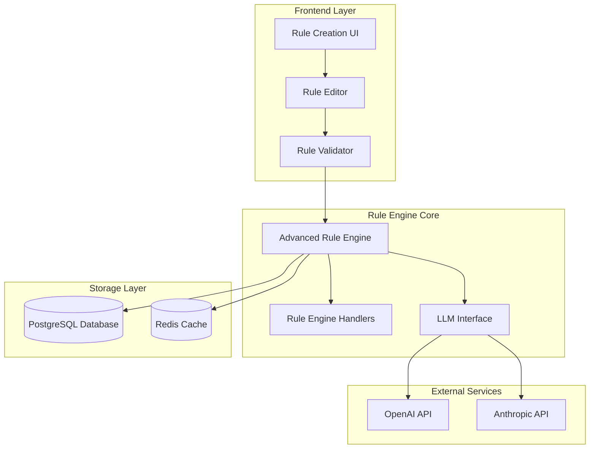
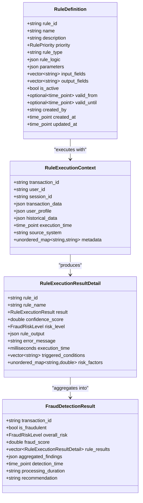
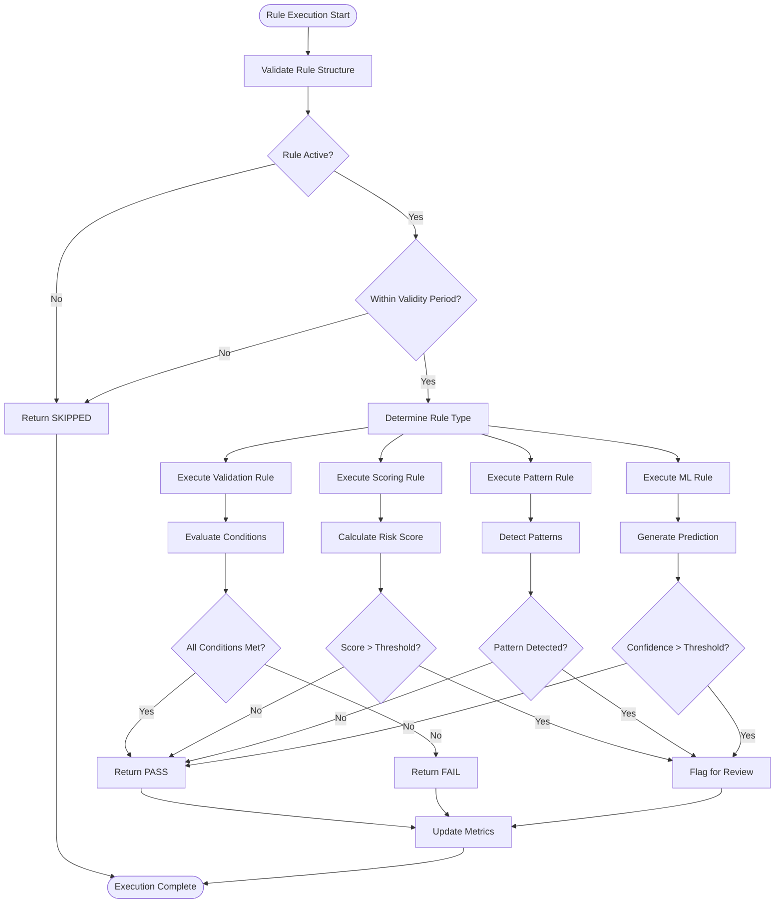
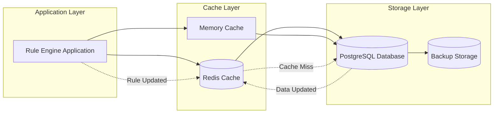
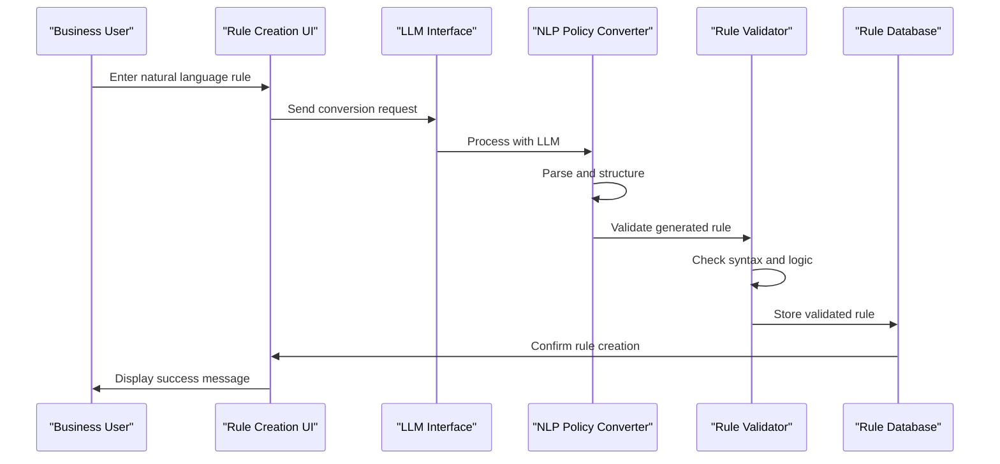
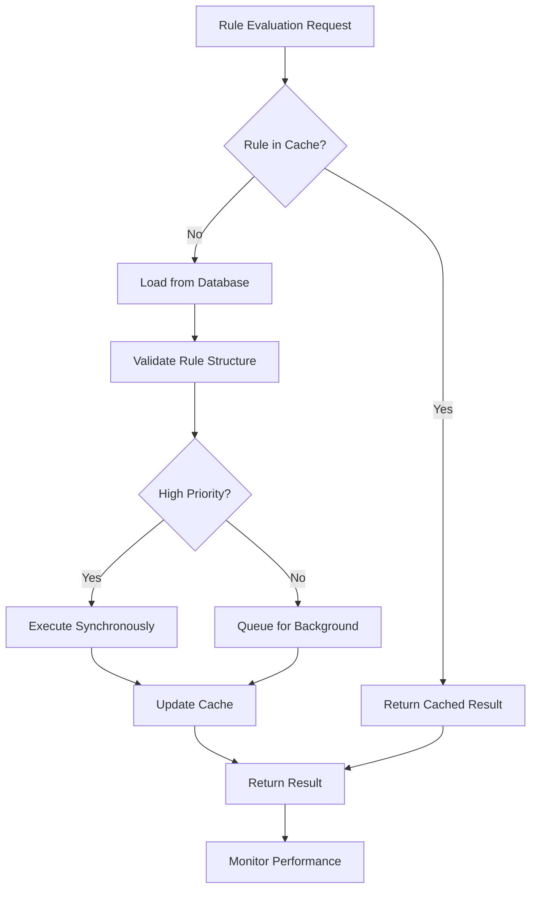

# Rule Definition

<cite>
**Referenced Files in This Document**
- [advanced_rule_engine.hpp](file://shared/rules/advanced_rule_engine.hpp)
- [advanced_rule_engine.cpp](file://shared/rules/advanced_rule_engine.cpp)
- [RuleCreationForm.tsx](file://frontend/src/components/RuleEngine/RuleCreationForm.tsx)
- [RuleEditor.tsx](file://frontend/src/components/RuleEngine/RuleEditor.tsx)
- [FraudRules.tsx](file://frontend/src/pages/FraudRules.tsx)
- [schema.sql](file://schema.sql)
- [llm_interface.hpp](file://shared/agentic_brain/llm_interface.hpp)
- [nl_policy_converter.hpp](file://shared/policy/nl_policy_converter.hpp)
- [nl_policy_converter.cpp](file://shared/policy/nl_policy_converter.cpp)
- [policy_generation_service.cpp](file://shared/llm/policy_generation_service.cpp)
</cite>

## Table of Contents
1. [Introduction](#introduction)
2. [Rule Definition Architecture](#rule-definition-architecture)
3. [Rule Types and Categories](#rule-types-and-categories)
4. [Rule Schema and Structure](#rule-schema-and-structure)
5. [Rule Management Operations](#rule-management-operations)
6. [Condition Logic and Evaluation](#condition-logic-and-evaluation)
7. [Action Specifications](#action-specifications)
8. [Storage and Caching](#storage-and-caching)
9. [LLM Integration for Natural Language Rules](#llm-integration-for-natural-language-rules)
10. [Validation and Testing](#validation-and-testing)
11. [Performance Optimization](#performance-optimization)
12. [Best Practices](#best-practices)
13. [Common Issues and Troubleshooting](#common-issues-and-troubleshooting)
14. [Conclusion](#conclusion)

## Introduction

The Rule Definition sub-component of the Rule Engine is a sophisticated system designed for creating, managing, and executing complex business rules for fraud detection, policy enforcement, and compliance monitoring. This component serves as the foundation for the entire rule-based decision-making system, providing a flexible and scalable framework for defining rules in multiple formats including JSON, DSL (Domain Specific Language), and natural language.

The system supports four primary rule types: Validation rules for data verification, Scoring rules for risk assessment, Pattern rules for detecting suspicious behavior, and Machine Learning rules for advanced anomaly detection. Each rule type is optimized for specific use cases while maintaining a unified interface for execution and management.

## Rule Definition Architecture

The Rule Definition system follows a layered architecture that separates concerns between rule creation, validation, execution, and persistence. The core components work together to provide a robust and extensible rule management platform.



**Diagram sources**
- [advanced_rule_engine.hpp](file://shared/rules/advanced_rule_engine.hpp#L1-L256)
- [llm_interface.hpp](file://shared/agentic_brain/llm_interface.hpp#L1-L221)

The architecture ensures separation of concerns while maintaining high performance through intelligent caching and asynchronous processing capabilities.

**Section sources**
- [advanced_rule_engine.hpp](file://shared/rules/advanced_rule_engine.hpp#L1-L100)
- [schema.sql](file://schema.sql#L150-L200)

## Rule Types and Categories

The system supports four distinct rule types, each optimized for specific use cases and operational requirements:

### Validation Rules
Validation rules ensure data integrity and compliance by checking specific conditions against transaction or entity data. These rules are typically synchronous and provide immediate feedback on data quality.

**Key Characteristics:**
- Immediate execution
- Boolean outcomes (pass/fail)
- High priority for data quality
- Commonly used for input validation

### Scoring Rules
Scoring rules calculate risk scores based on multiple factors and weighted criteria. They provide quantitative assessments that can be used for decision-making and prioritization.

**Key Characteristics:**
- Weighted scoring systems
- Range-based outputs (0.0-1.0)
- Cumulative risk assessment
- Used for tiered decision making

### Pattern Rules
Pattern rules detect suspicious behavior patterns across time series data, geographic locations, or transaction volumes. These rules excel at identifying complex relationships and temporal anomalies.

**Key Characteristics:**
- Time-based analysis
- Pattern recognition algorithms
- Velocity and volume monitoring
- Geographic correlation analysis

### Machine Learning Rules
Machine Learning rules leverage trained models for advanced anomaly detection and predictive analytics. These rules provide the highest accuracy for complex fraud detection scenarios.

**Key Characteristics:**
- Model-based predictions
- Feature engineering requirements
- Continuous learning capabilities
- High computational demands



**Diagram sources**
- [advanced_rule_engine.hpp](file://shared/rules/advanced_rule_engine.hpp#L70-L150)

**Section sources**
- [advanced_rule_engine.hpp](file://shared/rules/advanced_rule_engine.hpp#L20-L60)
- [RuleCreationForm.tsx](file://frontend/src/components/RuleEngine/RuleCreationForm.tsx#L20-L50)

## Rule Schema and Structure

The rule schema defines the structure and constraints for all rule definitions within the system. Each rule must conform to a standardized format that ensures consistency, validation, and interoperability across different rule types and execution environments.

### Core Schema Fields

The fundamental rule schema includes several mandatory and optional fields that define rule behavior, execution context, and lifecycle management:

**Mandatory Fields:**
- `rule_id`: Unique identifier for the rule (auto-generated or user-defined)
- `name`: Human-readable rule name for identification and display
- `description`: Detailed explanation of rule purpose and behavior
- `rule_type`: Classification determining execution logic and processing requirements
- `priority`: Execution priority affecting rule ordering and resource allocation
- `rule_logic`: JSON structure containing conditions, actions, and parameters

**Lifecycle Fields:**
- `is_active`: Boolean flag controlling rule activation status
- `valid_from`: Optional start date/time for rule validity period
- `valid_until`: Optional end date/time for rule expiration
- `created_by`: User or system identifier responsible for rule creation
- `created_at`: Timestamp marking rule creation
- `updated_at`: Timestamp tracking last modification

### Rule Logic Structure

The `rule_logic` field contains the executable portion of the rule, structured differently based on rule type:

**Validation Rules:**
```json
{
  "conditions": [
    {
      "field": "amount",
      "operator": ">",
      "value": 10000,
      "description": "Amount exceeds $10,000"
    }
  ]
}
```

**Scoring Rules:**
```json
{
  "factors": [
    {
      "field": "transaction_count",
      "weight": 0.3,
      "transformation": "linear"
    }
  ],
  "threshold": 0.7,
  "action": "review"
}
```

**Pattern Rules:**
```json
{
  "pattern_type": "velocity",
  "time_window": 3600,
  "threshold": 5,
  "conditions": [
    {
      "field": "transaction_type",
      "operator": "=",
      "value": "cash_deposit"
    }
  ]
}
```

**Machine Learning Rules:**
```json
{
  "model_type": "supervised",
  "algorithm": "random_forest",
  "features": ["amount", "location", "time"],
  "training_data_size": 10000,
  "accuracy_threshold": 0.85
}
```

### Input and Output Field Specifications

Rules declare their input and output requirements to ensure proper data flow and validation:

**Input Fields:** Specify which data elements the rule requires for execution
**Output Fields:** Define the structure and types of data produced by rule execution

**Section sources**
- [advanced_rule_engine.hpp](file://shared/rules/advanced_rule_engine.hpp#L70-L120)
- [schema.sql](file://schema.sql#L150-L200)

## Rule Management Operations

The Rule Engine provides comprehensive CRUD (Create, Read, Update, Delete) operations along with advanced management capabilities for rule lifecycle management and bulk operations.

### Core Management Methods

**Rule Registration:**
```cpp
bool register_rule(const RuleDefinition& rule);
```
Registers a new rule in the system, validating structure and storing in both database and cache.

**Rule Retrieval:**
```cpp
std::optional<RuleDefinition> get_rule(const std::string& rule_id);
std::vector<RuleDefinition> get_active_rules();
std::vector<RuleDefinition> get_rules_by_type(const std::string& rule_type);
```
Provides various retrieval mechanisms for accessing rule definitions based on criteria.

**Rule Updates:**
```cpp
bool update_rule(const std::string& rule_id, const nlohmann::json& updates);
```
Supports partial updates to existing rules while maintaining data integrity.

**Rule Lifecycle Management:**
```cpp
bool deactivate_rule(const std::string& rule_id);
bool delete_rule(const std::string& rule_id);
```
Handles rule deactivation and permanent deletion with appropriate cleanup.

### Batch Processing Operations

The system supports batch rule evaluation for improved performance when processing multiple transactions simultaneously:

```cpp
std::string submit_batch_evaluation(
    const std::vector<RuleExecutionContext>& contexts,
    const std::vector<std::string>& rule_ids = {}
);

std::unordered_map<std::string, FraudDetectionResult> get_batch_results(const std::string& batch_id);
double get_batch_progress(const std::string& batch_id);
```

### Performance Monitoring

Built-in performance monitoring tracks execution metrics and provides insights for optimization:

```cpp
RulePerformanceMetrics get_rule_metrics(const std::string& rule_id);
std::vector<RulePerformanceMetrics> get_all_rule_metrics();
void reset_rule_metrics(const std::string& rule_id = "");
```

**Section sources**
- [advanced_rule_engine.hpp](file://shared/rules/advanced_rule_engine.hpp#L120-L180)
- [advanced_rule_engine.cpp](file://shared/rules/advanced_rule_engine.cpp#L100-L200)

## Condition Logic and Evaluation

Condition evaluation forms the core of rule execution, determining whether rule conditions are met based on input data and logical operators. The system supports complex conditional logic with multiple evaluation modes and optimization strategies.

### Condition Types and Operators

The system provides a comprehensive set of operators for different data types and comparison scenarios:

**Numeric Comparisons:**
- `=` (equals)
- `!=` (not equals)
- `>` (greater than)
- `<` (less than)
- `>=` (greater than or equal)
- `<=` (less than or equal)

**String Operations:**
- `=` (equals)
- `!=` (not equals)
- `contains` (substring matching)
- `starts_with` (prefix matching)
- `ends_with` (suffix matching)
- `regex` (regular expression matching)

**Set Operations:**
- `IN` (member of set)
- `NOT_IN` (not member of set)

**Temporal Operations:**
- `BETWEEN` (range comparison)
- `MATCHES` (pattern matching)

### Logical Grouping and Nesting

Complex conditions support logical grouping using AND/OR operators and nested conditions:

```json
{
  "conditions": [
    {
      "all": [
        {
          "field": "amount",
          "operator": ">",
          "value": 10000
        },
        {
          "field": "country",
          "operator": "IN",
          "value": ["USA", "CAN", "GBR"]
        }
      ]
    },
    {
      "any": [
        {
          "field": "transaction_type",
          "operator": "=",
          "value": "cash_deposit"
        },
        {
          "field": "merchant_category",
          "operator": "=",
          "value": "gambling"
        }
      ]
    }
  ]
}
```

### Evaluation Performance Optimization

The system employs several optimization strategies for condition evaluation:

**Early Termination:** Conditions are evaluated in priority order, allowing early termination when results are determined.

**Index Utilization:** Database indexes are leveraged for efficient data retrieval and filtering.

**Caching Strategies:** Frequently accessed conditions and results are cached to reduce computation overhead.

**Parallel Processing:** Independent conditions can be evaluated concurrently when appropriate.



**Diagram sources**
- [advanced_rule_engine.cpp](file://shared/rules/advanced_rule_engine.cpp#L200-L350)

**Section sources**
- [advanced_rule_engine.cpp](file://shared/rules/advanced_rule_engine.cpp#L270-L350)
- [policy_generation_service.cpp](file://shared/llm/policy_generation_service.cpp#L700-L800)

## Action Specifications

Actions define the consequences and responses when rule conditions are met. The system supports a wide variety of action types, each designed for specific operational requirements and integration scenarios.

### Action Types and Categories

**Transaction Actions:**
- `flag_transaction`: Mark transaction for manual review
- `block_transaction`: Prevent transaction execution
- `approve_transaction`: Automatically approve transaction
- `escalate_to_team`: Route to specialized team for review

**Notification Actions:**
- `notify_compliance`: Send alert to compliance officers
- `notify_finance`: Notify finance department
- `send_email`: Dispatch automated email notification
- `webhook_notification`: Trigger external webhook

**Logging and Auditing:**
- `log_event`: Record event in audit trail
- `create_incident`: Generate incident ticket
- `update_knowledge_base`: Add to learning system
- `generate_report`: Create compliance report

**System Actions:**
- `update_customer_risk`: Modify customer risk profile
- `adjust_limits`: Change transaction limits
- `blacklist_entity`: Add to blacklist
- `clear_cache`: Clear related cache entries

### Action Configuration and Parameters

Actions support configurable parameters for customization and integration:

```json
{
  "actions": [
    {
      "type": "notify_compliance",
      "parameters": {
        "recipients": ["compliance@company.com"],
        "subject": "Suspicious Transaction Detected",
        "severity": "HIGH",
        "timeout": 300
      }
    },
    {
      "type": "flag_transaction",
      "parameters": {
        "reason": "High risk detected",
        "escalation_level": "MANUAL_REVIEW",
        "max_hold_time": 3600
      }
    }
  ]
}
```

### Action Chaining and Dependencies

The system supports complex action workflows with dependencies and conditional execution:

**Sequential Actions:** Actions executed in specified order with dependency checks
**Conditional Actions:** Actions triggered based on previous action outcomes
**Parallel Actions:** Independent actions executed simultaneously
**Fallback Actions:** Alternative actions when primary actions fail

### Action Execution Guarantees

The system provides various execution guarantees depending on action type:

**Immediate Execution:** Synchronous actions executed during rule evaluation
**Deferred Execution:** Asynchronous actions queued for background processing
**Idempotent Execution:** Actions safely re-executable without side effects
**Transactional Execution:** Actions committed atomically with rule evaluation

**Section sources**
- [RuleEditor.tsx](file://frontend/src/components/RuleEngine/RuleEditor.tsx#L40-L80)
- [FraudRules.tsx](file://frontend/src/pages/FraudRules.tsx#L100-L150)

## Storage and Caching

The Rule Engine implements a dual-layer storage architecture combining persistent database storage with high-performance in-memory caching to ensure optimal performance and data durability.

### Database Storage Architecture

The system uses PostgreSQL as the primary persistent storage layer, leveraging its advanced JSON capabilities and indexing features:

**Rule Storage Table:**
```sql
CREATE TABLE advanced_rules (
    rule_id VARCHAR(255) PRIMARY KEY,
    rule_name VARCHAR(255) NOT NULL,
    description TEXT,
    category VARCHAR(50) NOT NULL,
    severity VARCHAR(20) NOT NULL,
    conditions JSONB NOT NULL,
    action VARCHAR(20) NOT NULL,
    threshold_score DECIMAL(3,2) DEFAULT 0.5,
    tags TEXT[],
    enabled BOOLEAN DEFAULT true,
    created_at TIMESTAMP WITH TIME ZONE NOT NULL DEFAULT NOW(),
    updated_at TIMESTAMP WITH TIME ZONE NOT NULL DEFAULT NOW()
);
```

**Evaluation Results Storage:**
```sql
CREATE TABLE rule_evaluation_results (
    evaluation_id VARCHAR(255) PRIMARY KEY,
    rule_id VARCHAR(255) NOT NULL REFERENCES advanced_rules(rule_id),
    entity_id VARCHAR(255) NOT NULL,
    entity_type VARCHAR(50),
    score DECIMAL(5,4),
    triggered BOOLEAN DEFAULT false,
    action VARCHAR(20),
    matched_conditions TEXT[],
    condition_scores JSONB,
    processing_time_ms INTEGER,
    evaluated_at TIMESTAMP WITH TIME ZONE NOT NULL,
    source_system VARCHAR(100),
    metadata JSONB,
    created_at TIMESTAMP WITH TIME ZONE NOT NULL DEFAULT NOW()
);
```

### In-Memory Caching Strategy

Redis serves as the primary caching layer, providing fast access to frequently used rules and reducing database load:

**Cache Structure:**
- Rule definitions cached by rule_id with TTL (Time To Live)
- Evaluation results cached for recently processed entities
- Metadata and statistics cached for performance monitoring
- Template and configuration data cached for quick access

**Cache Invalidation:**
- Automatic invalidation on rule updates
- Manual invalidation for maintenance operations
- Lazy loading for cache warming
- Background refresh for stale data

### Data Consistency and Synchronization

The system maintains data consistency through several mechanisms:

**Write Through Caching:** Changes written to both cache and database simultaneously
**Cache Aside Pattern:** Cache reads from database when data is stale
**Event Sourcing:** Rule changes tracked through event streams
**Replication:** Database replication for high availability



**Diagram sources**
- [schema.sql](file://schema.sql#L150-L200)
- [advanced_rule_engine.hpp](file://shared/rules/advanced_rule_engine.hpp#L180-L220)

**Section sources**
- [schema.sql](file://schema.sql#L150-L250)
- [advanced_rule_engine.hpp](file://shared/rules/advanced_rule_engine.hpp#L180-L220)

## LLM Integration for Natural Language Rules

The system integrates advanced Large Language Model (LLM) capabilities to enable natural language rule creation and conversion, bridging the gap between business requirements and technical implementation.

### Natural Language Processing Pipeline

The LLM integration follows a sophisticated pipeline that converts natural language descriptions into structured rule definitions:



**Diagram sources**
- [nl_policy_converter.cpp](file://shared/policy/nl_policy_converter.cpp#L50-L150)
- [llm_interface.hpp](file://shared/agentic_brain/llm_interface.hpp#L100-L200)

### Template-Based Conversion

The system uses predefined templates to guide LLM conversion and ensure consistent output structure:

**Template Structure:**
- Input schema specification
- Output schema definition
- Example input-output pairs
- Conversion prompts and guidelines

**Available Templates:**
- Fraud Detection Rules
- Compliance Monitoring Rules
- Risk Assessment Rules
- Policy Validation Rules

### Conversion Quality Assurance

Multiple layers of validation ensure conversion quality and reliability:

**Syntax Validation:** Ensures generated rules conform to expected JSON structure
**Logic Validation:** Verifies rule logic is sound and free of contradictions
**Security Validation:** Checks for potential security vulnerabilities
**Performance Validation:** Assesses rule efficiency and execution impact

### Confidence Scoring and Feedback

The system provides confidence scores for generated rules and collects user feedback for continuous improvement:

**Confidence Calculation:**
- Based on LLM response consistency
- Historical conversion success rates
- Rule complexity and validation results
- User feedback and corrections

**Feedback Mechanism:**
- User rating system for conversion quality
- Suggestion submission for improvements
- Error reporting and correction
- Learning integration for model improvement

**Section sources**
- [nl_policy_converter.hpp](file://shared/policy/nl_policy_converter.hpp#L50-L150)
- [nl_policy_converter.cpp](file://shared/policy/nl_policy_converter.cpp#L50-L200)

## Validation and Testing

The Rule Engine provides comprehensive validation and testing capabilities to ensure rule correctness, performance, and compliance with organizational standards.

### Rule Validation Framework

The validation system operates at multiple levels to catch errors early in the rule development lifecycle:

**Syntax Validation:**
```cpp
bool validate_rule_logic(const nlohmann::json& rule_obj);
```
Validates JSON structure, required fields, and data type consistency.

**Semantic Validation:**
```cpp
PolicyValidationResult validate_policy(const nlohmann::json& policy, const std::string& policy_type);
```
Checks rule logic for consistency, completeness, and business appropriateness.

**Cross-Validation:**
```cpp
bool validate_dsl_logic(const std::string& rule_dsl);
```
Validates Domain Specific Language rules for syntax and logical consistency.

### Testing Infrastructure

The system provides built-in testing capabilities for rule validation and performance assessment:

**Unit Testing:**
```cpp
nlohmann::json test_rule_execution(
    const std::string& rule_id,
    const RuleExecutionContext& test_context
);
```
Executes rules with predefined test data to verify expected behavior.

**Integration Testing:**
```cpp
std::string submit_batch_evaluation(
    const std::vector<RuleExecutionContext>& contexts,
    const std::vector<std::string>& rule_ids = {}
);
```
Tests rule behavior in realistic scenarios with multiple data points.

**Performance Testing:**
```cpp
double get_batch_progress(const std::string& batch_id);
```
Monitors rule execution performance under load conditions.

### Validation Error Reporting

Comprehensive error reporting helps developers and business users understand and fix rule issues:

**Error Classification:**
- Syntax errors (missing fields, incorrect types)
- Logic errors (contradictory conditions, unreachable code)
- Performance warnings (inefficient patterns, resource usage)
- Security concerns (potential vulnerabilities)

**Error Resolution Guidance:**
- Specific error messages with context
- Recommended fixes and alternatives
- Links to documentation and examples
- Interactive debugging tools

**Section sources**
- [policy_generation_service.cpp](file://shared/llm/policy_generation_service.cpp#L700-L850)
- [advanced_rule_engine.cpp](file://shared/rules/advanced_rule_engine.cpp#L350-L450)

## Performance Optimization

The Rule Engine implements numerous optimization strategies to ensure high performance and scalability across diverse rule execution scenarios.

### Execution Optimization Strategies

**Rule Ordering and Prioritization:**
- Priority-based execution scheduling
- Critical path identification for high-priority rules
- Parallel execution for independent rules
- Resource-aware scheduling

**Caching and Memoization:**
```cpp
void cache_rule(const RuleDefinition& rule);
void invalidate_rule_cache(const std::string& rule_id = "");
```
Intelligent caching reduces repeated computation and database access.

**Batch Processing:**
```cpp
std::string submit_batch_evaluation(
    const std::vector<RuleExecutionContext>& contexts,
    const std::vector<std::string>& rule_ids = {}
);
```
Efficient processing of multiple transactions simultaneously.

### Memory Management

**Efficient Data Structures:**
- Optimized JSON processing for rule logic
- Compact storage formats for rule definitions
- Garbage-collected temporary objects
- Memory pool allocation for frequent operations

**Resource Limits:**
```cpp
void set_execution_timeout(std::chrono::milliseconds timeout);
void set_max_parallel_executions(int max_parallel);
```
Configurable limits prevent resource exhaustion and ensure system stability.

### Database Optimization

**Indexing Strategies:**
- Composite indexes for common query patterns
- JSONB indexing for rule logic searches
- Partitioning for large datasets
- Materialized views for complex queries

**Query Optimization:**
- Prepared statements for repeated queries
- Connection pooling for database access
- Query result caching for frequently accessed data
- Batch operations for bulk data processing



**Diagram sources**
- [advanced_rule_engine.cpp](file://shared/rules/advanced_rule_engine.cpp#L100-L200)

**Section sources**
- [advanced_rule_engine.hpp](file://shared/rules/advanced_rule_engine.hpp#L200-L256)
- [advanced_rule_engine.cpp](file://shared/rules/advanced_rule_engine.cpp#L400-L500)

## Best Practices

Effective rule definition requires adherence to established best practices that ensure maintainability, performance, and reliability across diverse organizational needs.

### Rule Design Principles

**Clarity and Simplicity:**
- Use descriptive rule names and clear condition descriptions
- Break complex rules into smaller, focused units
- Avoid overly complex nested conditions
- Document assumptions and edge cases

**Performance Considerations:**
- Place high-priority rules first in execution order
- Use indexed fields for condition evaluation
- Avoid expensive computations in rule conditions
- Consider rule complexity when setting execution timeouts

**Maintainability Guidelines:**
- Version control all rule changes
- Document rule rationale and business context
- Use consistent naming conventions
- Regular rule reviews and updates

### Rule Composition Strategies

**Modular Design:**
```json
{
  "rule_type": "VALIDATION",
  "name": "High Value Transaction Validator",
  "conditions": [
    {
      "field": "amount",
      "operator": ">",
      "value": 100000
    },
    {
      "field": "country",
      "operator": "IN",
      "value": ["USA", "CAN", "GBR"]
    }
  ]
}
```

**Reusable Components:**
- Common condition sets for similar use cases
- Parameterized rules for flexible configuration
- Template-based rule creation for consistency
- Shared libraries for complex calculations

### Testing and Validation

**Comprehensive Testing:**
- Unit tests for individual rule conditions
- Integration tests for rule combinations
- Performance tests under load conditions
- Regression tests for rule modifications

**Continuous Monitoring:**
- Rule execution metrics and alerts
- Performance degradation detection
- Accuracy validation through historical data
- Business impact assessment

### Security and Compliance

**Access Control:**
- Role-based access to rule management
- Audit trails for all rule changes
- Approval workflows for critical rule modifications
- Secure storage of sensitive rule data

**Compliance Requirements:**
- Rule documentation for regulatory audits
- Traceability of rule decision-making
- Regular compliance assessments
- Automated compliance validation

## Common Issues and Troubleshooting

Understanding common issues and their solutions helps ensure smooth operation and rapid problem resolution.

### Rule Conflicts and Resolution

**Conflict Detection:**
- Overlapping rule conditions causing ambiguity
- Competing actions from different rules
- Priority conflicts between rules
- Circular dependencies in rule logic

**Resolution Strategies:**
```cpp
// Example conflict resolution logic
if (rule_a.priority > rule_b.priority) {
    // Execute rule_a first
} else if (rule_a.priority == rule_b.priority) {
    // Resolve based on rule creation time
}
```

**Conflict Prevention:**
- Clear rule categorization and separation
- Well-defined rule boundaries and scopes
- Regular conflict analysis and resolution
- Governance processes for rule approval

### Performance Issues

**Symptoms:**
- Slow rule execution times
- High memory usage during rule evaluation
- Database query timeouts
- Cache miss rates exceeding thresholds

**Diagnostic Approaches:**
```cpp
// Performance monitoring
RulePerformanceMetrics get_rule_metrics(const std::string& rule_id);
void reset_rule_metrics(const std::string& rule_id = "");
```

**Optimization Solutions:**
- Rule profiling and bottleneck identification
- Cache tuning and optimization
- Database index optimization
- Parallel execution configuration

### Data Integrity Issues

**Common Problems:**
- Missing or malformed rule data
- Inconsistent rule logic across environments
- Stale cache entries causing incorrect results
- Validation bypasses leading to rule corruption

**Prevention and Recovery:**
- Automated data validation and repair
- Cross-environment synchronization
- Regular data integrity checks
- Rollback procedures for problematic changes

### Integration Challenges

**External Service Issues:**
- LLM service unavailability
- Database connectivity problems
- Cache service failures
- Network latency affecting performance

**Mitigation Strategies:**
- Circuit breaker patterns for external services
- Graceful degradation for service failures
- Retry mechanisms with exponential backoff
- Health monitoring and alerting

**Section sources**
- [advanced_rule_engine.cpp](file://shared/rules/advanced_rule_engine.cpp#L200-L300)
- [policy_generation_service.cpp](file://shared/llm/policy_generation_service.cpp#L800-L900)

## Conclusion

The Rule Definition sub-component of the Rule Engine represents a sophisticated and comprehensive system for managing complex business rules in a production environment. Through its multi-layered architecture, support for multiple rule types, and advanced features like LLM integration, the system provides organizations with the tools necessary to implement robust, scalable, and maintainable rule-based decision-making systems.

Key strengths of the system include:

**Flexibility and Extensibility:** Support for multiple rule types and execution modes allows adaptation to diverse business requirements while maintaining a unified interface.

**Performance Optimization:** Intelligent caching, parallel execution, and database optimization ensure high throughput and low latency for rule evaluation.

**Quality Assurance:** Comprehensive validation, testing, and monitoring capabilities help maintain rule quality and system reliability.

**Developer Experience:** Rich UI components, natural language processing, and extensive documentation facilitate rule creation and management.

**Production Readiness:** Robust error handling, monitoring, and governance features ensure reliable operation in production environments.

The system's modular design and extensive configuration options make it suitable for organizations ranging from small businesses requiring basic fraud detection to large enterprises needing complex compliance monitoring and risk assessment capabilities. By following the documented best practices and utilizing the provided troubleshooting guidance, organizations can successfully implement and maintain effective rule-based systems that drive business value while ensuring compliance and operational excellence.

Future enhancements may include expanded rule types, advanced machine learning integration, and enhanced visualization capabilities for rule management and analysis. The solid architectural foundation ensures that such enhancements can be integrated seamlessly without disrupting existing functionality.