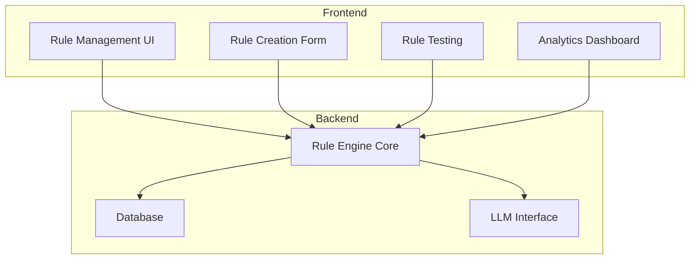
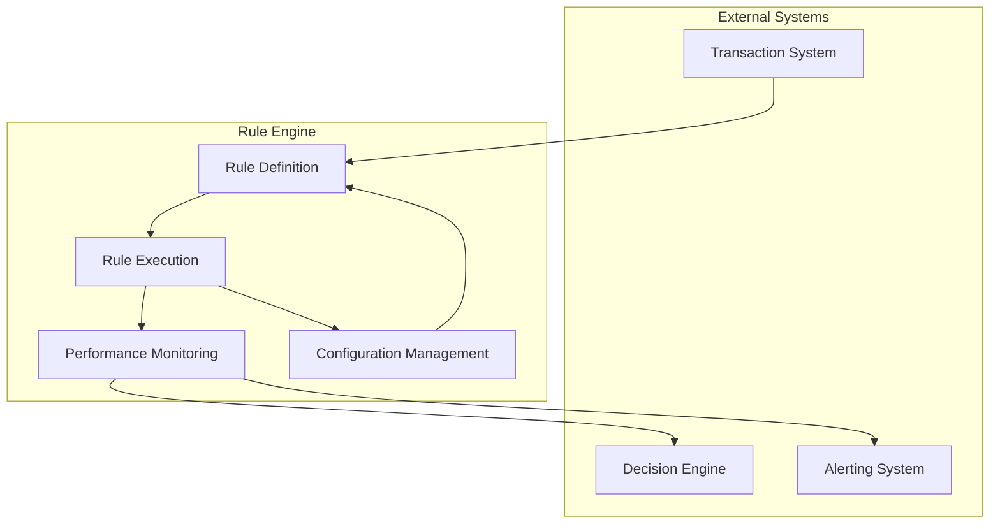
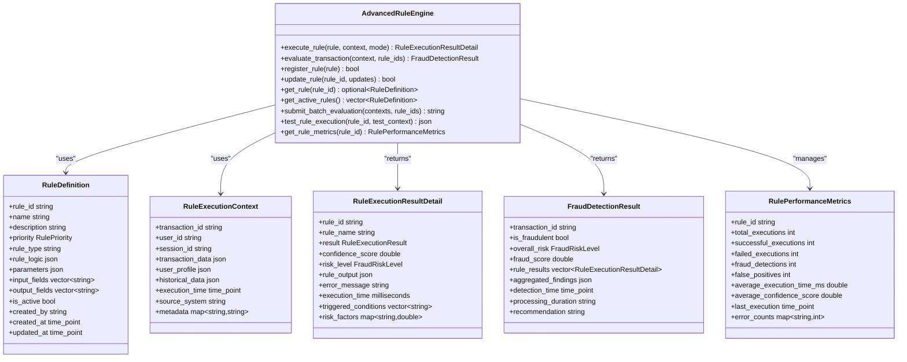
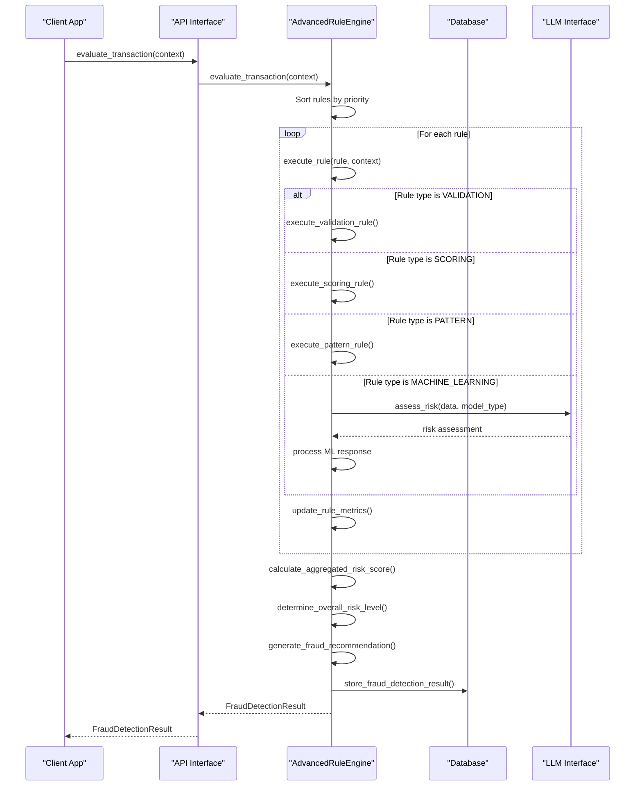
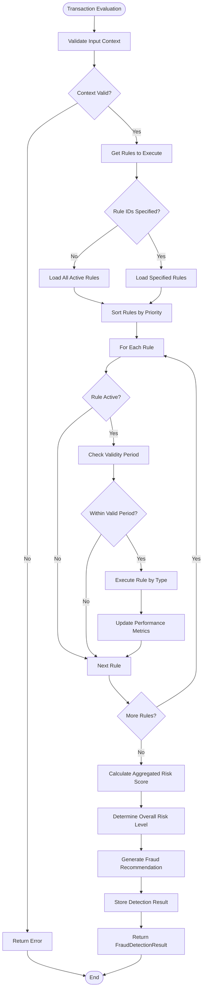
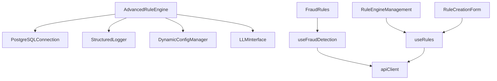

# Rule Engine

<cite>
**Referenced Files in This Document**   
- [advanced_rule_engine.hpp](file://shared/rules/advanced_rule_engine.hpp)
- [advanced_rule_engine.cpp](file://shared/rules/advanced_rule_engine.cpp)
- [FraudRules.tsx](file://frontend/src/pages/FraudRules.tsx)
- [useFraudDetection.ts](file://frontend/src/hooks/useFraudDetection.ts)
- [useRules.ts](file://frontend/src/hooks/useRules.ts)
- [RuleEngineManagement.tsx](file://frontend/src/components/RuleEngine/RuleEngineManagement.tsx)
- [RuleCreationForm.tsx](file://frontend/src/components/RuleEngine/RuleCreationForm.tsx)
- [AdvancedRuleEngine.tsx](file://frontend/src/pages/AdvancedRuleEngine.tsx)
- [api.ts](file://frontend/src/types/api.ts)
</cite>

## Table of Contents
1. [Introduction](#introduction)
2. [Project Structure](#project-structure)
3. [Core Components](#core-components)
4. [Architecture Overview](#architecture-overview)
5. [Detailed Component Analysis](#detailed-component-analysis)
6. [Dependency Analysis](#dependency-analysis)
7. [Performance Considerations](#performance-considerations)
8. [Troubleshooting Guide](#troubleshooting-guide)
9. [Conclusion](#conclusion)

## Introduction
The Rule Engine is a production-grade fraud detection and policy enforcement system designed to evaluate transactions against configurable rules for fraud detection and compliance. The system supports multiple rule types including validation, scoring, pattern detection, and machine learning-based rules. It integrates with transaction systems, decision engines, and alerting systems to provide real-time fraud detection capabilities. The engine supports various execution modes including synchronous, asynchronous, batch, and streaming evaluation. The system is designed for high-volume transaction processing with performance monitoring and optimization capabilities.

## Project Structure
The Rule Engine implementation is organized across multiple directories in the repository. The core engine logic is located in the shared/rules directory with C++ implementation files. The frontend components for rule management are located in the frontend/src/components/RuleEngine directory, while API integration hooks are in frontend/src/hooks. The system uses a layered architecture with clear separation between the rule engine core, API interfaces, and user interface components.

**Diagram sources**
- [advanced_rule_engine.hpp](file://shared/rules/advanced_rule_engine.hpp#L1-L256)
- [FraudRules.tsx](file://frontend/src/pages/FraudRules.tsx#L1-L448)

**Section sources**
- [advanced_rule_engine.hpp](file://shared/rules/advanced_rule_engine.hpp#L1-L256)
- [FraudRules.tsx](file://frontend/src/pages/FraudRules.tsx#L1-L448)

## Core Components
The Rule Engine consists of several core components that work together to provide fraud detection and policy enforcement capabilities. The system is built around the AdvancedRuleEngine class which handles rule execution, transaction evaluation, and rule management. The engine supports multiple rule types and execution modes, with comprehensive performance monitoring and configuration options. The system integrates with external components including database storage, logging, configuration management, and LLM interfaces for machine learning-based fraud detection.

**Section sources**
- [advanced_rule_engine.hpp](file://shared/rules/advanced_rule_engine.hpp#L1-L256)
- [advanced_rule_engine.cpp](file://shared/rules/advanced_rule_engine.cpp#L1-L1106)

## Architecture Overview
The Rule Engine follows a modular architecture with clear separation of concerns. The core engine component handles rule execution and transaction evaluation, while supporting components manage configuration, logging, and data storage. The system is designed to integrate with external systems including transaction processing, decision engines, and alerting systems. The architecture supports both real-time synchronous evaluation and asynchronous batch processing of transactions.

**Diagram sources**
- [advanced_rule_engine.hpp](file://shared/rules/advanced_rule_engine.hpp#L1-L256)
- [advanced_rule_engine.cpp](file://shared/rules/advanced_rule_engine.cpp#L1-L1106)

## Detailed Component Analysis

### Rule Engine Core Analysis
The AdvancedRuleEngine class is the central component of the system, responsible for executing rules against transaction data to detect fraud and enforce policies. The engine supports multiple rule types and execution modes, with comprehensive error handling and performance monitoring.

#### For Object-Oriented Components:

**Diagram sources**
- [advanced_rule_engine.hpp](file://shared/rules/advanced_rule_engine.hpp#L1-L256)

#### For API/Service Components:

**Diagram sources**
- [advanced_rule_engine.cpp](file://shared/rules/advanced_rule_engine.cpp#L1-L1106)

#### For Complex Logic Components:

**Diagram sources**
- [advanced_rule_engine.cpp](file://shared/rules/advanced_rule_engine.cpp#L1-L1106)

**Section sources**
- [advanced_rule_engine.hpp](file://shared/rules/advanced_rule_engine.hpp#L1-L256)
- [advanced_rule_engine.cpp](file://shared/rules/advanced_rule_engine.cpp#L1-L1106)

### Rule Definition Language
The Rule Engine supports a flexible rule definition language that allows for the creation of complex fraud detection and policy enforcement rules. Rules are defined with a JSON-based structure that specifies the rule logic, parameters, input and output fields, and execution characteristics. The system supports multiple rule types including validation, scoring, pattern detection, and machine learning-based rules. Each rule has a priority level that determines its execution order relative to other rules.

**Section sources**
- [advanced_rule_engine.hpp](file://shared/rules/advanced_rule_engine.hpp#L1-L256)
- [useRules.ts](file://frontend/src/hooks/useRules.ts#L1-L416)

### Rule Execution Model
The Rule Engine supports multiple execution modes to accommodate different use cases and performance requirements. The synchronous mode executes rules immediately and returns the result, suitable for real-time transaction evaluation. The asynchronous mode queues rules for background execution, allowing for non-blocking operation. The batch mode processes multiple transactions as a group, optimizing performance for large volumes of data. The streaming mode enables continuous rule evaluation on data streams, ideal for real-time monitoring applications.

**Section sources**
- [advanced_rule_engine.hpp](file://shared/rules/advanced_rule_engine.hpp#L1-L256)
- [advanced_rule_engine.cpp](file://shared/rules/advanced_rule_engine.cpp#L1-L1106)

### Testing Framework
The Rule Engine includes a comprehensive testing framework that allows for validation of rule logic and execution behavior. The system provides methods to test individual rules against specific test contexts, validate rule definitions, and simulate rule execution. The testing framework supports both unit testing of individual rules and integration testing of the complete rule evaluation workflow. Performance metrics are collected during testing to identify potential bottlenecks and optimization opportunities.

**Section sources**
- [advanced_rule_engine.hpp](file://shared/rules/advanced_rule_engine.hpp#L1-L256)
- [useFraudDetection.ts](file://frontend/src/hooks/useFraudDetection.ts#L1-L289)

### Integration with Fraud Detection Systems
The Rule Engine integrates with fraud detection systems through multiple mechanisms. For machine learning-based fraud detection, the engine uses an LLM interface to perform risk assessments based on transaction patterns and historical data. The system stores fraud detection results in the database for audit and analysis purposes. The engine generates recommendations (APPROVE, REVIEW, BLOCK) based on the overall risk assessment, which can be used by downstream systems to make transaction decisions.

**Section sources**
- [advanced_rule_engine.cpp](file://shared/rules/advanced_rule_engine.cpp#L1-L1106)
- [FraudRules.tsx](file://frontend/src/pages/FraudRules.tsx#L1-L448)

### Transaction Monitoring Integration
The Rule Engine is integrated with transaction monitoring systems to provide real-time fraud detection capabilities. The system receives transaction data from the transaction system and evaluates it against configured rules. When fraud indicators are detected, the engine triggers alerts and generates detailed findings that are sent to the alerting system. The integration supports both synchronous evaluation for immediate transaction decisions and asynchronous evaluation for post-transaction analysis.

**Section sources**
- [advanced_rule_engine.cpp](file://shared/rules/advanced_rule_engine.cpp#L1-L1106)
- [useFraudDetection.ts](file://frontend/src/hooks/useFraudDetection.ts#L1-L289)

### Rule Evaluation Workflows
The Rule Engine follows a structured workflow for evaluating transactions against configured rules. The process begins with input validation and context preparation, followed by rule selection and prioritization. Each rule is executed in order of priority, with results aggregated to determine the overall fraud risk. The workflow includes comprehensive error handling and performance monitoring to ensure reliable operation under high load.

**Section sources**
- [advanced_rule_engine.cpp](file://shared/rules/advanced_rule_engine.cpp#L1-L1106)
- [RuleEngineManagement.tsx](file://frontend/src/components/RuleEngine/RuleEngineManagement.tsx#L1-L430)

### Performance Considerations
The Rule Engine is designed for high-performance operation in real-time transaction processing environments. The system includes several performance optimization features including rule caching, parallel execution, and configurable execution timeouts. Performance metrics are collected for each rule to identify bottlenecks and optimize rule execution order. The engine supports configuration of maximum parallel executions and execution timeouts to balance performance and resource utilization.

**Section sources**
- [advanced_rule_engine.hpp](file://shared/rules/advanced_rule_engine.hpp#L1-L256)
- [advanced_rule_engine.cpp](file://shared/rules/advanced_rule_engine.cpp#L1-L1106)

### Configuration Options
The Rule Engine provides extensive configuration options for rule prioritization, execution scheduling, and exception handling. Rules can be assigned priority levels (LOW, MEDIUM, HIGH, CRITICAL) that determine their execution order. The system supports configuration of execution timeouts, maximum parallel executions, and performance monitoring settings. Rules can be activated or deactivated dynamically, and their validity period can be specified to enable time-based rule application.

**Section sources**
- [advanced_rule_engine.hpp](file://shared/rules/advanced_rule_engine.hpp#L1-L256)
- [advanced_rule_engine.cpp](file://shared/rules/advanced_rule_engine.cpp#L1-L1106)

## Dependency Analysis
The Rule Engine has several key dependencies that enable its functionality. The system depends on a PostgreSQL database for persistent storage of rules and detection results. It uses a structured logging system for operational monitoring and debugging. The engine integrates with a dynamic configuration manager to support runtime configuration changes. For machine learning-based fraud detection, the system depends on an LLM interface. The frontend components depend on React and associated libraries for UI rendering and state management.

**Diagram sources**
- [advanced_rule_engine.hpp](file://shared/rules/advanced_rule_engine.hpp#L1-L256)
- [useFraudDetection.ts](file://frontend/src/hooks/useFraudDetection.ts#L1-L289)
- [useRules.ts](file://frontend/src/hooks/useRules.ts#L1-L416)

**Section sources**
- [advanced_rule_engine.hpp](file://shared/rules/advanced_rule_engine.hpp#L1-L256)
- [useFraudDetection.ts](file://frontend/src/hooks/useFraudDetection.ts#L1-L289)
- [useRules.ts](file://frontend/src/hooks/useRules.ts#L1-L416)

## Performance Considerations
The Rule Engine is optimized for real-time rule evaluation on high-volume transactions. The system uses an in-memory rule cache to minimize database access during rule execution. Rules are executed in priority order, with higher priority rules evaluated first. The engine supports parallel execution of rules to maximize throughput, with configurable limits on the number of concurrent executions. Performance metrics are collected for each rule to identify bottlenecks and optimize the rule evaluation process. The system includes configurable execution timeouts to prevent individual rules from impacting overall performance.

**Section sources**
- [advanced_rule_engine.hpp](file://shared/rules/advanced_rule_engine.hpp#L1-L256)
- [advanced_rule_engine.cpp](file://shared/rules/advanced_rule_engine.cpp#L1-L1106)

## Troubleshooting Guide
The Rule Engine includes comprehensive logging and monitoring capabilities to assist with troubleshooting. The system logs detailed information about rule execution, including success/failure status, execution time, and error messages. Performance metrics are collected for each rule to identify performance issues. The engine provides methods to validate rule logic and test rule execution with specific test contexts. When issues occur, the logs should be checked for error messages, and the performance metrics should be reviewed to identify any rules with abnormal execution times or failure rates.

**Section sources**
- [advanced_rule_engine.cpp](file://shared/rules/advanced_rule_engine.cpp#L1-L1106)
- [useFraudDetection.ts](file://frontend/src/hooks/useFraudDetection.ts#L1-L289)

## Conclusion
The Rule Engine is a comprehensive fraud detection and policy enforcement system that provides flexible rule definition, efficient execution, and robust integration capabilities. The system supports multiple rule types and execution modes, making it suitable for a wide range of fraud detection and compliance use cases. The engine is designed for high-performance operation in real-time transaction processing environments, with comprehensive performance monitoring and optimization features. The system's modular architecture and clear separation of concerns make it maintainable and extensible, while its integration with machine learning capabilities enables advanced fraud detection beyond simple rule-based approaches.