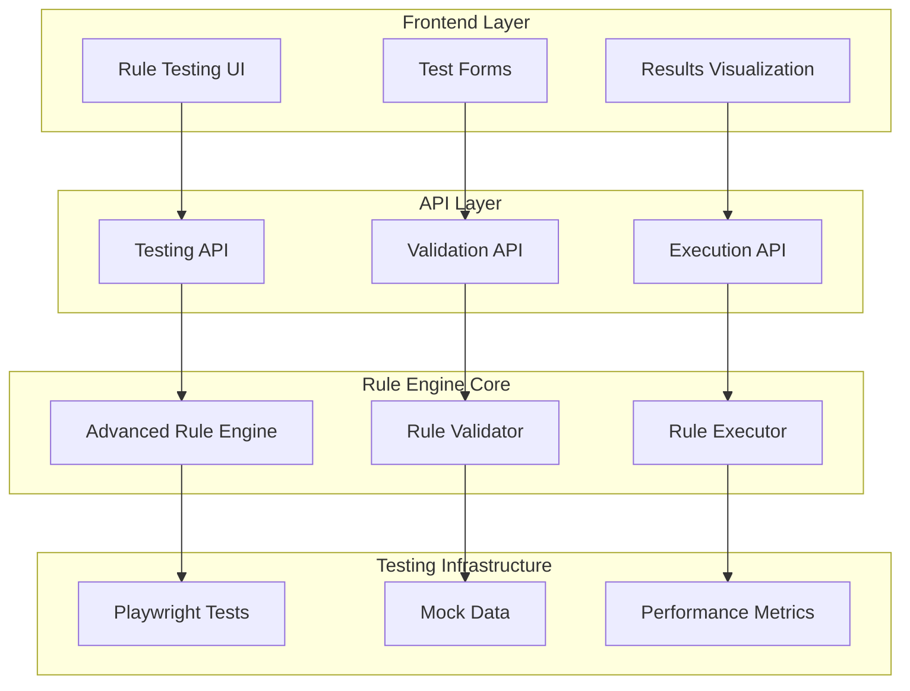
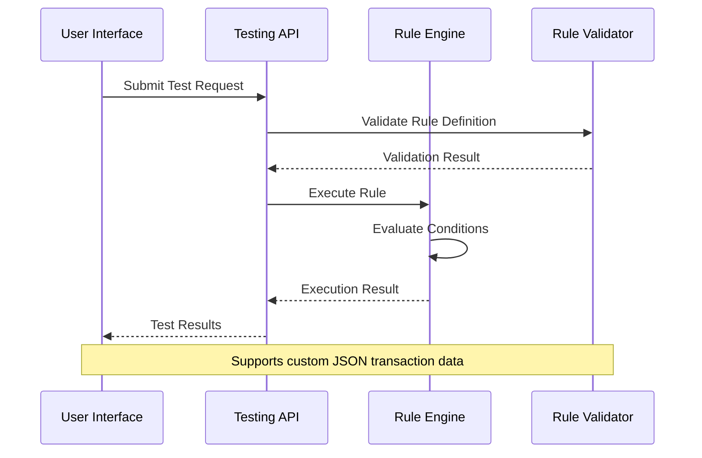
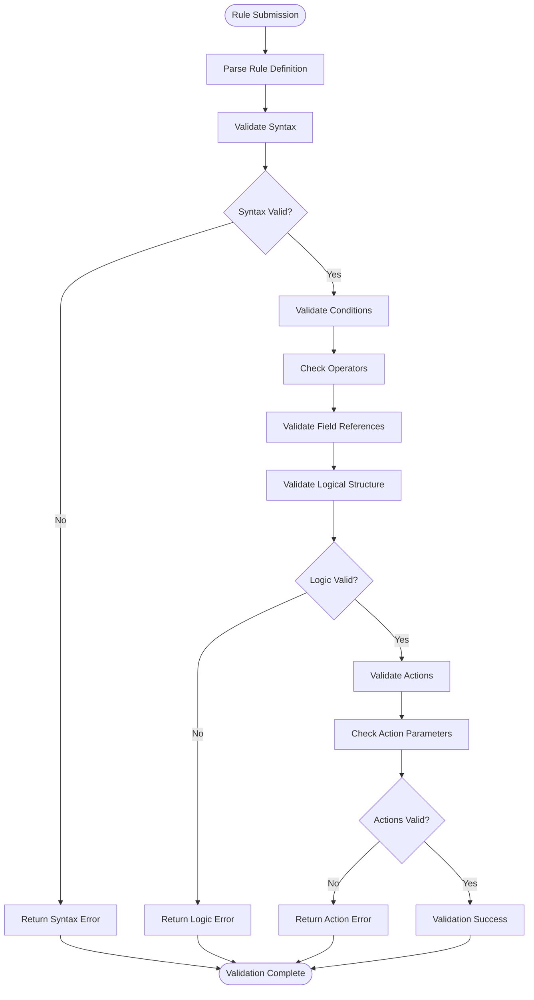
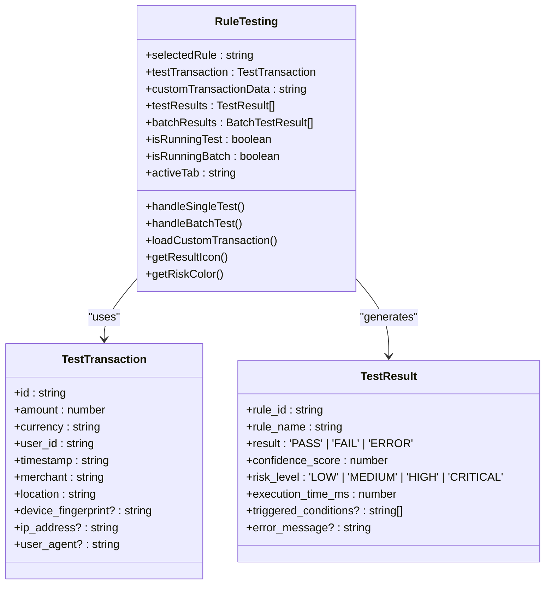

# Testing Framework

<cite>
**Referenced Files in This Document**
- [RuleTesting.tsx](file://frontend/src/components/RuleEngine/RuleTesting.tsx)
- [useRules.ts](file://frontend/src/hooks/useRules.ts)
- [advanced_rule_engine.cpp](file://shared/rules/advanced_rule_engine.cpp)
- [FraudRules.tsx](file://frontend/src/pages/FraudRules.tsx)
- [api.ts](file://frontend/src/services/api.ts)
- [playwright.config.ts](file://playwright.config.ts)
- [testing_checklist.txt](file://frontend/testing_checklist.txt)
- [api.ts](file://frontend/src/types/api.ts)
</cite>

## Table of Contents
1. [Introduction](#introduction)
2. [Architecture Overview](#architecture-overview)
3. [Core Testing Components](#core-testing-components)
4. [Rule Execution Testing](#rule-execution-testing)
5. [Validation Framework](#validation-framework)
6. [Frontend Testing Interface](#frontend-testing-interface)
7. [End-to-End Testing](#end-to-end-testing)
8. [Test Case Management](#test-case-management)
9. [Performance Monitoring](#performance-monitoring)
10. [Best Practices](#best-practices)
11. [Troubleshooting](#troubleshooting)

## Introduction

The Testing Framework is a comprehensive sub-component of the Rule Engine designed to validate rule logic before deployment and ensure mission-critical fraud detection rules operate correctly. This framework provides developers and compliance officers with powerful tools to simulate rule execution, analyze outcomes, and measure performance metrics across various scenarios.

The framework encompasses multiple layers: frontend testing interfaces, backend rule execution engines, automated validation systems, and end-to-end testing capabilities using Playwright. It supports both single-rule testing and batch execution scenarios, enabling thorough validation of complex rule interactions and boundary conditions.

## Architecture Overview

The Testing Framework follows a layered architecture that separates concerns between frontend interfaces, backend rule execution, and automated testing infrastructure.



**Diagram sources**
- [RuleTesting.tsx](file://frontend/src/components/RuleEngine/RuleTesting.tsx#L1-L50)
- [advanced_rule_engine.cpp](file://shared/rules/advanced_rule_engine.cpp#L1-L100)

**Section sources**
- [RuleTesting.tsx](file://frontend/src/components/RuleEngine/RuleTesting.tsx#L1-L100)
- [advanced_rule_engine.cpp](file://shared/rules/advanced_rule_engine.cpp#L1-L200)

## Core Testing Components

### Rule Testing Interface

The frontend testing interface provides an intuitive way to test rule logic with sample transaction data. The `RuleTesting` component offers both single and batch testing capabilities.

```typescript
interface TestTransaction {
  id: string;
  amount: number;
  currency: string;
  user_id: string;
  timestamp: string;
  merchant: string;
  location: string;
  device_fingerprint?: string;
  ip_address?: string;
  user_agent?: string;
}

interface TestResult {
  rule_id: string;
  rule_name: string;
  result: 'PASS' | 'FAIL' | 'ERROR';
  confidence_score: number;
  risk_level: 'LOW' | 'MEDIUM' | 'HIGH' | 'CRITICAL';
  execution_time_ms: number;
  triggered_conditions?: string[];
  error_message?: string;
}
```

### Backend Rule Engine Integration

The backend Advanced Rule Engine provides robust rule execution capabilities with built-in validation and performance monitoring.

```cpp
RuleExecutionResultDetail AdvancedRuleEngine::execute_validation_rule(
    const RuleDefinition& rule,
    const RuleExecutionContext& context
) {
    RuleExecutionResultDetail result;
    result.rule_id = rule.rule_id;
    result.rule_name = rule.name;

    try {
        const auto& logic = rule.rule_logic;
        if (!logic.contains("conditions")) {
            result.result = RuleExecutionResult::ERROR;
            result.error_message = "Validation rule missing conditions";
            return result;
        }

        const auto& conditions = logic["conditions"];
        bool all_conditions_met = true;
        std::vector<std::string> failed_conditions;

        for (const auto& condition : conditions) {
            bool condition_met = evaluate_condition(condition, context.transaction_data);
            if (!condition_met) {
                all_conditions_met = false;
                if (condition.contains("description")) {
                    failed_conditions.push_back(condition["description"]);
                }
            } else {
                result.triggered_conditions.push_back(
                    condition.value("description", "Condition met")
                );
            }
        }

        result.result = all_conditions_met ? RuleExecutionResult::PASS : RuleExecutionResult::FAIL;

        if (!all_conditions_met) {
            result.rule_output = {
                {"failed_conditions", failed_conditions},
                {"validation_result", "FAILED"}
            };
        } else {
            result.rule_output = {
                {"validation_result", "PASSED"},
                {"conditions_checked", conditions.size()}
            };
        }

    } catch (const std::exception& e) {
        result.result = RuleExecutionResult::ERROR;
        result.error_message = std::string("Validation rule execution error: ") + e.what();
    }

    return result;
}
```

**Section sources**
- [RuleTesting.tsx](file://frontend/src/components/RuleEngine/RuleTesting.tsx#L25-L100)
- [advanced_rule_engine.cpp](file://shared/rules/advanced_rule_engine.cpp#L271-L337)

## Rule Execution Testing

### Single Rule Testing

The single rule testing functionality allows developers to test individual rules with configurable transaction data. The system supports both predefined sample data and custom JSON input.



**Diagram sources**
- [RuleTesting.tsx](file://frontend/src/components/RuleEngine/RuleTesting.tsx#L150-L200)
- [advanced_rule_engine.cpp](file://shared/rules/advanced_rule_engine.cpp#L135-L170)

### Batch Testing

Batch testing enables simultaneous evaluation of multiple transactions against a single rule, providing comprehensive coverage for rule validation.

```typescript
interface BatchTestResult {
  transaction_id: string;
  is_fraudulent: boolean;
  overall_risk: 'LOW' | 'MEDIUM' | 'HIGH' | 'CRITICAL';
  fraud_score: number;
  rule_results: TestResult[];
  processing_time_ms: number;
}
```

The batch testing interface supports transaction selection from predefined samples and provides aggregated statistics including fraud detection rates, processing times, and risk assessments.

**Section sources**
- [RuleTesting.tsx](file://frontend/src/components/RuleEngine/RuleTesting.tsx#L200-L350)

## Validation Framework

### Rule Logic Validation

The validation framework ensures rule definitions meet required standards before execution. It validates rule syntax, condition logic, and operational parameters.



**Diagram sources**
- [advanced_rule_engine.cpp](file://shared/rules/advanced_rule_engine.cpp#L271-L337)

### Edge Case Testing

The framework includes comprehensive edge case testing capabilities for complex rule interactions and boundary conditions. This includes:

- **Null Value Handling**: Testing rules with missing or null transaction fields
- **Extreme Value Testing**: Evaluating rules with very high or low numeric values
- **Boundary Condition Testing**: Validating rules at threshold limits
- **Concurrent Rule Execution**: Testing interactions between multiple rules
- **Performance Degradation**: Identifying bottlenecks in complex rule chains

**Section sources**
- [advanced_rule_engine.cpp](file://shared/rules/advanced_rule_engine.cpp#L135-L170)

## Frontend Testing Interface

### User Interface Components

The frontend testing interface consists of several key components that work together to provide a seamless testing experience.



**Diagram sources**
- [RuleTesting.tsx](file://frontend/src/components/RuleEngine/RuleTesting.tsx#L25-L100)

### Test Data Management

The system provides flexible test data management capabilities:

- **Predefined Samples**: Built-in transaction samples for common scenarios
- **Custom JSON Input**: Support for importing custom transaction data
- **Data Validation**: Automatic validation of imported JSON data
- **Data Export**: Capability to export test results and configurations

**Section sources**
- [RuleTesting.tsx](file://frontend/src/components/RuleEngine/RuleTesting.tsx#L100-L250)

## End-to-End Testing

### Playwright Integration

The framework integrates with Playwright for comprehensive end-to-end testing of the entire rule engine workflow.

```typescript
// Playwright configuration for testing
export default defineConfig({
  testDir: './tests/e2e/tests',
  timeout: 30 * 1000,
  fullyParallel: true,
  forbidOnly: !!process.env.CI,
  retries: process.env.CI ? 2 : 0,
  workers: process.env.CI ? 1 : undefined,
  reporter: [
    ['html', { outputFolder: 'tests/e2e/reports/html' }],
    ['json', { outputFile: 'tests/e2e/reports/results.json' }],
    ['junit', { outputFile: 'tests/e2e/reports/junit.xml' }],
    ['list']
  ],
  use: {
    baseURL: process.env.BASE_URL || 'http://localhost:8080',
    trace: 'on-first-retry',
    screenshot: 'only-on-failure',
    video: 'retain-on-failure',
    actionTimeout: 10 * 1000,
    viewport: { width: 1920, height: 1080 },
    ignoreHTTPSErrors: true,
  },
});
```

### Automated Test Scenarios

The end-to-end testing suite covers comprehensive scenarios:

- **Rule Creation Workflow**: Testing complete rule creation from form submission to database persistence
- **Execution Pipeline**: Validating rule execution through the entire processing pipeline
- **Error Handling**: Testing graceful degradation under various error conditions
- **Performance Benchmarks**: Measuring execution times and resource utilization
- **Integration Testing**: Validating interactions between rule engine and other system components

**Section sources**
- [playwright.config.ts](file://playwright.config.ts#L1-L100)

## Test Case Management

### Test Case Structure

Test cases are structured with clear input-output specifications and expected outcomes:

```typescript
interface TestRuleRequest {
  ruleId: string;
  testData: Record<string, any>;
  expectedResult?: 'pass' | 'fail';
}

interface TestResult {
  result: RuleExecutionResult;
  passed: boolean;
  expectedResult?: string;
  actualResult: string;
}
```

### Sample Transaction Data

The framework includes predefined sample transaction data for common testing scenarios:

```typescript
const sampleTransactions: TestTransaction[] = [
  {
    id: 'TXN-001',
    amount: 15000.00,
    currency: 'USD',
    user_id: 'USER-123',
    timestamp: '2024-01-15T14:30:00Z',
    merchant: 'Electronics Store',
    location: 'New York, NY',
    device_fingerprint: 'abc123def456',
    ip_address: '192.168.1.100'
  },
  {
    id: 'TXN-002',
    amount: 2500.00,
    currency: 'USD',
    user_id: 'USER-456',
    timestamp: '2024-01-15T14:35:00Z',
    merchant: 'Online Retailer',
    location: 'Los Angeles, CA',
    device_fingerprint: 'xyz789uvw123',
    ip_address: '10.0.0.50'
  }
];
```

**Section sources**
- [useRules.ts](file://frontend/src/hooks/useRules.ts#L1-L100)
- [RuleTesting.tsx](file://frontend/src/components/RuleEngine/RuleTesting.tsx#L50-L100)

## Performance Monitoring

### Execution Metrics

The framework tracks comprehensive performance metrics for rule execution:

```typescript
interface RuleExecutionResult {
  executionId: string;
  ruleId: string;
  result: 'pass' | 'fail' | 'error' | 'timeout' | 'skipped';
  riskLevel?: 'low' | 'medium' | 'high' | 'critical';
  executionTime: number;
  timestamp: string;
  details?: string;
  alertsTriggered: number;
  errorMessage?: string;
}
```

### Performance Analysis

Key performance indicators tracked include:

- **Execution Time**: Milliseconds per rule execution
- **Throughput**: Rules processed per second
- **Resource Utilization**: CPU and memory usage during execution
- **Error Rates**: Percentage of failed rule executions
- **Success Rates**: Percentage of successful rule evaluations

### Batch Processing Statistics

Batch testing provides aggregated performance statistics:

```typescript
// Batch test summary statistics
const summary = {
  cleanTransactions: batchResults.filter(r => !r.is_fraudulent).length,
  flaggedTransactions: batchResults.filter(r => r.is_fraudulent).length,
  averageProcessingTime: 
    (batchResults.reduce((sum, r) => sum + r.processing_time_ms, 0) / batchResults.length).toFixed(0),
  averageFraudScore: 
    (batchResults.reduce((sum, r) => sum + r.fraud_score, 0) / batchResults.length).toFixed(1)
};
```

**Section sources**
- [useRules.ts](file://frontend/src/hooks/useRules.ts#L50-L150)
- [RuleTesting.tsx](file://frontend/src/components/RuleEngine/RuleTesting.tsx#L350-L450)

## Best Practices

### Comprehensive Test Coverage

To ensure mission-critical fraud rules are thoroughly tested:

1. **Positive Test Cases**: Validate that legitimate transactions pass through the rule system
2. **Negative Test Cases**: Ensure fraudulent transactions trigger appropriate alerts
3. **Edge Cases**: Test boundary conditions and extreme values
4. **Performance Testing**: Validate rule execution under load
5. **Integration Testing**: Test rule interactions with other system components

### Rule Validation Guidelines

- **Syntax Validation**: Ensure rule definitions follow required syntax
- **Logical Consistency**: Verify that rule conditions don't contradict each other
- **Performance Impact**: Assess the computational cost of complex rule logic
- **Data Dependencies**: Validate that required transaction fields are available

### Testing Workflow Recommendations

1. **Development Phase**: Use single rule testing for rapid iteration
2. **Integration Phase**: Employ batch testing for comprehensive validation
3. **Production Phase**: Implement automated regression testing
4. **Maintenance Phase**: Regular performance monitoring and rule updates

## Troubleshooting

### Common Issues and Solutions

**Rule Execution Failures**:
- Verify rule syntax and condition logic
- Check transaction data format and completeness
- Validate rule dependencies and external integrations

**Performance Issues**:
- Profile rule execution to identify bottlenecks
- Optimize complex condition logic
- Consider rule caching for frequently executed rules

**Data Validation Errors**:
- Ensure transaction data matches expected schema
- Validate field names and data types
- Check for null or missing required fields

### Debugging Tools

The framework provides several debugging capabilities:

- **Execution Traces**: Detailed logs of rule execution steps
- **Condition Evaluation**: Step-by-step condition checking
- **Performance Profiling**: Timing analysis for rule execution
- **Error Reporting**: Comprehensive error messages with context

### Test Environment Setup

For optimal testing results:

1. **Isolated Environment**: Use separate databases for testing
2. **Controlled Data**: Limit test data to known scenarios
3. **Performance Monitoring**: Track system resources during testing
4. **Automated Cleanup**: Remove test artifacts after completion

**Section sources**
- [testing_checklist.txt](file://frontend/testing_checklist.txt#L1-L152)
- [advanced_rule_engine.cpp](file://shared/rules/advanced_rule_engine.cpp#L271-L337)