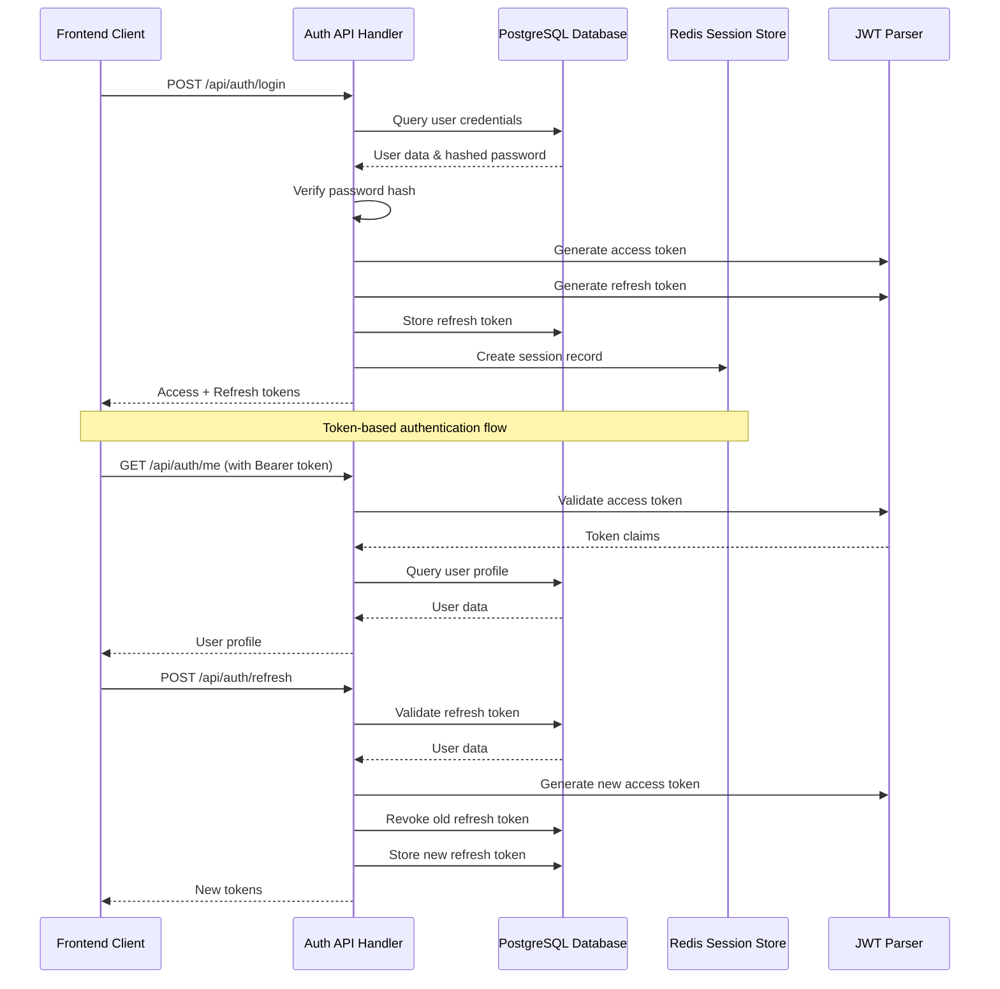
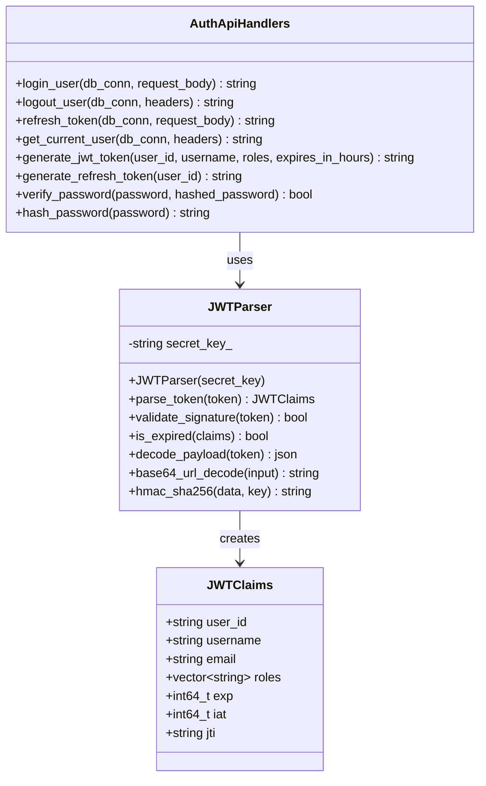
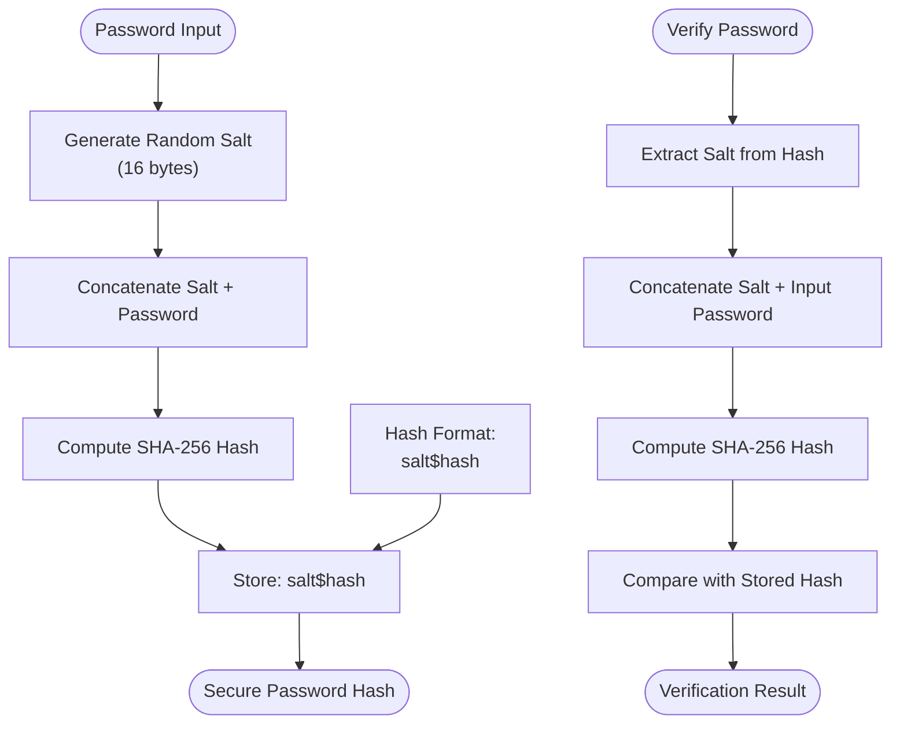
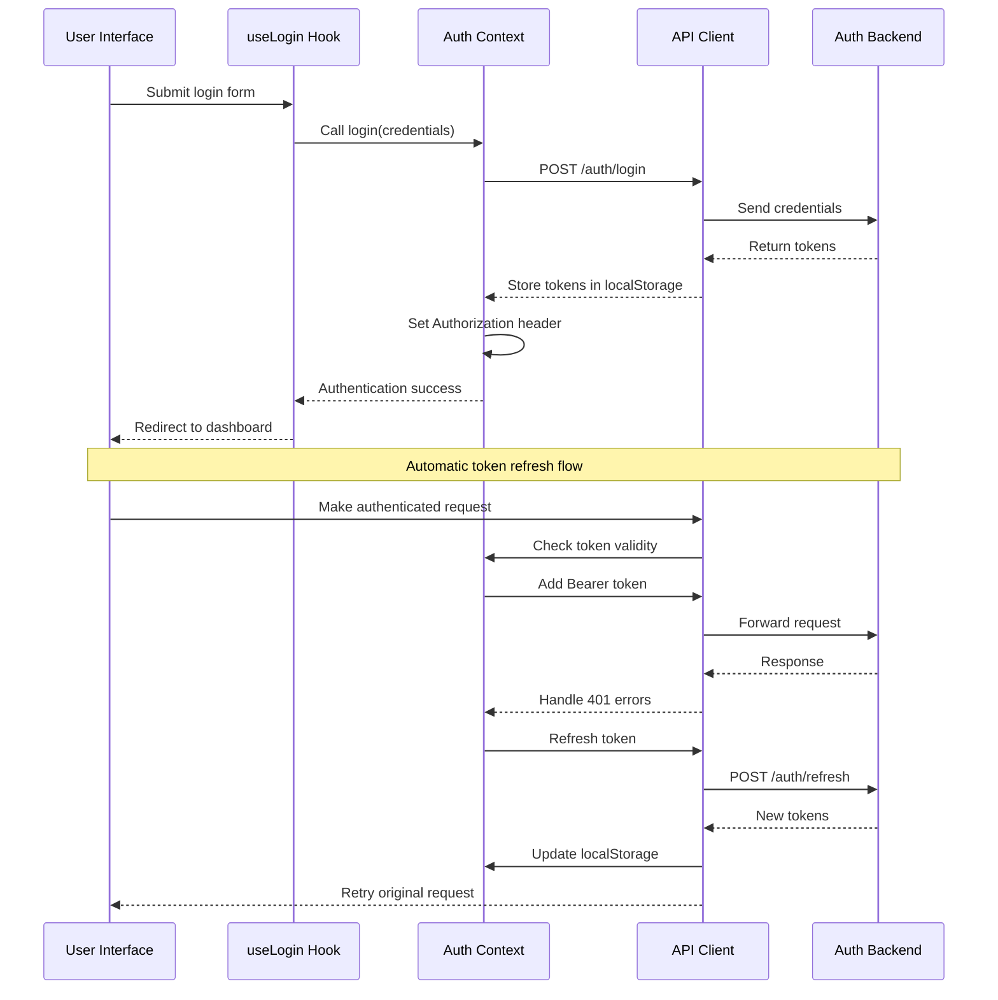
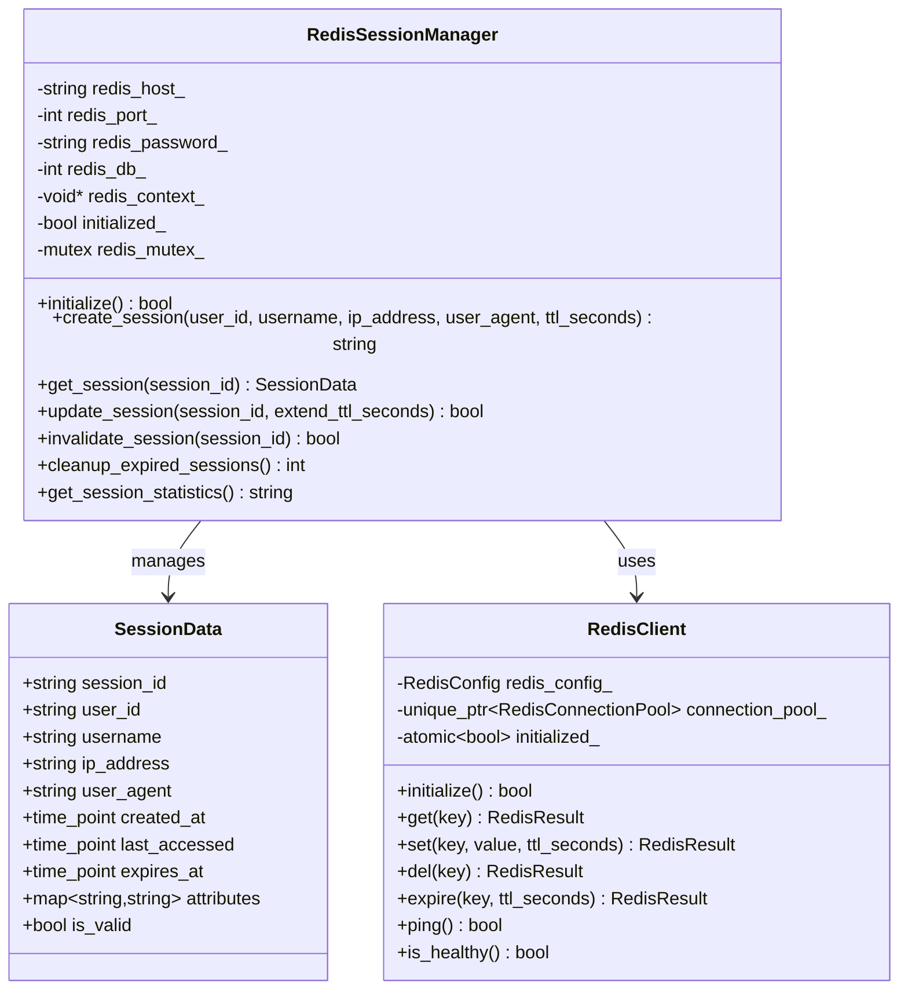
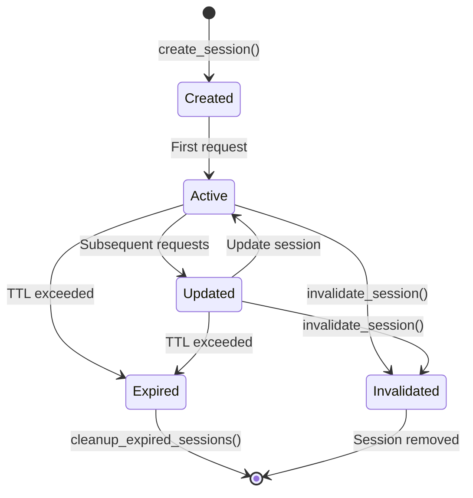
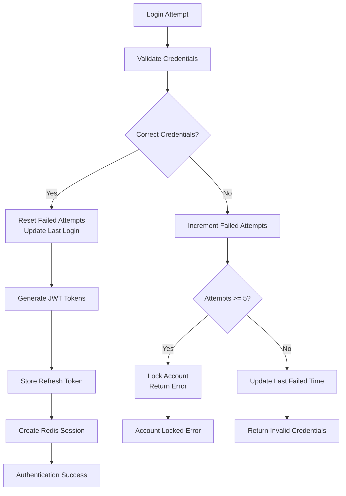

# Authentication

<cite>
**Referenced Files in This Document**
- [auth_api_handlers.cpp](file://shared/auth/auth_api_handlers.cpp)
- [auth_api_handlers.hpp](file://shared/auth/auth_api_handlers.hpp)
- [jwt_parser.cpp](file://shared/auth/jwt_parser.cpp)
- [jwt_parser.hpp](file://shared/auth/jwt_parser.hpp)
- [auth_helpers.cpp](file://shared/auth/auth_helpers.cpp)
- [auth_helpers.hpp](file://shared/auth/auth_helpers.hpp)
- [api.ts](file://frontend/src/services/api.ts)
- [AuthContext.tsx](file://frontend/src/contexts/AuthContext.tsx)
- [useLogin.ts](file://frontend/src/hooks/useLogin.ts)
- [Login.tsx](file://frontend/src/pages/Login.tsx)
- [api.ts](file://frontend/src/types/api.ts)
- [redis_session_manager.hpp](file://shared/session/redis_session_manager.hpp)
- [redis_client.cpp](file://shared/cache/redis_client.cpp)
- [redis_client.hpp](file://shared/cache/redis_client.hpp)
</cite>

## Table of Contents
1. [Introduction](#introduction)
2. [JWT-Based Authentication Architecture](#jwt-based-authentication-architecture)
3. [Core Authentication Components](#core-authentication-components)
4. [Authentication API Endpoints](#authentication-api-endpoints)
5. [Frontend Authentication Integration](#frontend-authentication-integration)
6. [Session Management with Redis](#session-management-with-redis)
7. [Security Features](#security-features)
8. [Configuration Options](#configuration-options)
9. [Error Handling and Validation](#error-handling-and-validation)
10. [Performance Considerations](#performance-considerations)
11. [Troubleshooting Guide](#troubleshooting-guide)
12. [Conclusion](#conclusion)

## Introduction

The Regulens platform implements a comprehensive JWT-based authentication system designed for enterprise-grade security and scalability. This authentication sub-feature provides secure user authentication, token-based session management, automatic token refresh capabilities, and robust security measures including failed login attempt tracking and account lockout mechanisms.

The authentication system is built with production-ready security standards, utilizing industry-standard cryptographic algorithms for password hashing (SHA-256 with salt) and token generation (HMAC-SHA256). The implementation integrates seamlessly with Redis for distributed session management and caching, ensuring high availability and scalability across multiple server instances.

## JWT-Based Authentication Architecture

The authentication system follows a modern JWT (JSON Web Token) architecture that provides stateless authentication while maintaining security and scalability. The system generates two types of tokens: access tokens with short expiration (24 hours) and refresh tokens with longer lifespan (30 days).



**Diagram sources**
- [auth_api_handlers.cpp](file://shared/auth/auth_api_handlers.cpp#L30-L150)
- [jwt_parser.cpp](file://shared/auth/jwt_parser.cpp#L1-L180)

**Section sources**
- [auth_api_handlers.cpp](file://shared/auth/auth_api_handlers.cpp#L30-L150)
- [jwt_parser.cpp](file://shared/auth/jwt_parser.cpp#L1-L180)

## Core Authentication Components

### JWT Parser Implementation

The JWT parser is a critical component responsible for validating and parsing JWT tokens. It implements HMAC-SHA256 signature verification and provides secure token validation capabilities.



**Diagram sources**
- [jwt_parser.cpp](file://shared/auth/jwt_parser.cpp#L10-L180)
- [auth_api_handlers.cpp](file://shared/auth/auth_api_handlers.cpp#L30-L644)

### Password Security Implementation

The authentication system implements secure password hashing using SHA-256 with salt, providing protection against rainbow table attacks and ensuring password security.



**Diagram sources**
- [auth_api_handlers.cpp](file://shared/auth/auth_api_handlers.cpp#L450-L500)

**Section sources**
- [auth_api_handlers.cpp](file://shared/auth/auth_api_handlers.cpp#L450-L500)

## Authentication API Endpoints

### Login Endpoint (/api/auth/login)

The login endpoint handles user authentication and token generation. It validates credentials against the database, manages failed login attempts, and creates secure JWT tokens.

**Request Schema:**
```json
{
  "username": "string",
  "password": "string"
}
```

**Response Schema:**
```json
{
  "accessToken": "string",
  "refreshToken": "string",
  "tokenType": "Bearer",
  "expiresIn": 86400,
  "user": {
    "id": "string",
    "username": "string",
    "roles": ["string"],
    "permissions": ["string"]
  }
}
```

### Refresh Token Endpoint (/api/auth/refresh)

The refresh endpoint allows clients to obtain new access tokens using valid refresh tokens, extending session lifetime without requiring re-authentication.

**Request Schema:**
```json
{
  "refreshToken": "string"
}
```

**Response Schema:**
```json
{
  "accessToken": "string",
  "refreshToken": "string",
  "tokenType": "Bearer",
  "expiresIn": 86400
}
```

### Logout Endpoint (/api/auth/logout)

The logout endpoint securely revokes refresh tokens and terminates user sessions, ensuring proper token lifecycle management.

**Request Schema:**
```json
{
  "refreshToken": "string"
}
```

**Response Schema:**
```json
{
  "message": "Logged out successfully"
}
```

### Current User Endpoint (/api/auth/me)

The current user endpoint retrieves authenticated user profile information using validated JWT tokens.

**Response Schema:**
```json
{
  "id": "string",
  "username": "string",
  "email": "string",
  "isActive": true,
  "createdAt": "string",
  "lastLoginAt": "string",
  "failedLoginAttempts": 0,
  "roles": ["string"]
}
```

**Section sources**
- [auth_api_handlers.cpp](file://shared/auth/auth_api_handlers.cpp#L30-L644)

## Frontend Authentication Integration

The frontend authentication system integrates seamlessly with the backend API, providing automatic token management, request/response interceptors, and seamless user experience.



**Diagram sources**
- [AuthContext.tsx](file://frontend/src/contexts/AuthContext.tsx#L1-L128)
- [api.ts](file://frontend/src/services/api.ts#L1-L799)

**Section sources**
- [AuthContext.tsx](file://frontend/src/contexts/AuthContext.tsx#L1-L128)
- [api.ts](file://frontend/src/services/api.ts#L1-L799)
- [useLogin.ts](file://frontend/src/hooks/useLogin.ts#L1-L73)

## Session Management with Redis

The authentication system integrates with Redis for distributed session management, providing scalable and reliable session storage across multiple server instances.



**Diagram sources**
- [redis_session_manager.hpp](file://shared/session/redis_session_manager.hpp#L33-L106)
- [redis_client.hpp](file://shared/cache/redis_client.hpp#L1-L637)

### Session Lifecycle Management

The Redis session manager handles the complete session lifecycle, including creation, validation, updates, and cleanup of user sessions.



**Section sources**
- [redis_session_manager.hpp](file://shared/session/redis_session_manager.hpp#L33-L276)
- [redis_client.cpp](file://shared/cache/redis_client.cpp#L1-L799)

## Security Features

### Failed Login Attempt Tracking

The authentication system implements comprehensive failed login attempt tracking with automatic account lockout after 5 consecutive failed attempts.



**Diagram sources**
- [auth_api_handlers.cpp](file://shared/auth/auth_api_handlers.cpp#L50-L100)

### Token Security Measures

The system implements multiple layers of token security including:

- **Access Token Expiration**: 24-hour lifespan with automatic renewal
- **Refresh Token Rotation**: Old refresh tokens are revoked upon new token generation
- **Secure Token Storage**: Tokens stored in HTTP-only cookies or secure local storage
- **Signature Verification**: HMAC-SHA256 signature validation for all tokens
- **Token Revocation**: Immediate invalidation of compromised refresh tokens

### Cryptographic Implementation

The authentication system uses industry-standard cryptographic algorithms:

- **Password Hashing**: SHA-256 with salt (production: use bcrypt/Argon2)
- **Token Generation**: HMAC-SHA256 for JWT signatures
- **Random Token Generation**: OpenSSL RAND_bytes for secure randomness
- **Base64 URL Encoding**: RFC 4648 compliant URL-safe encoding

**Section sources**
- [auth_api_handlers.cpp](file://shared/auth/auth_api_handlers.cpp#L50-L100)
- [auth_api_handlers.cpp](file://shared/auth/auth_api_handlers.cpp#L450-L550)

## Configuration Options

### JWT Configuration

The authentication system supports extensive configuration options for production deployment:

```cpp
// JWT Secret (required)
const char* jwt_secret_env = std::getenv("JWT_SECRET");
if (!jwt_secret_env) {
    throw std::runtime_error("JWT_SECRET environment variable not set");
}

// Token Expiration Times
int access_token_expires_in_hours = 24;           // 24 hours
int refresh_token_expires_in_days = 30;           // 30 days
int session_timeout_minutes = 30;                 // Redis session timeout

// Password Security Configuration
int password_salt_length = 16;                    // 128-bit salt
int password_hash_iterations = 10000;             // Iterations for PBKDF2 (future)
```

### Redis Session Configuration

```cpp
// Redis Connection Settings
std::string redis_host = "localhost";             // Production: external Redis
int redis_port = 6379;                            // Standard Redis port
std::string redis_password = "";                  // Production: secure password
int redis_database = 0;                           // Dedicated database

// Session Management Settings
int session_ttl_seconds = 1800;                   // 30 minutes default
int max_concurrent_sessions = 5;                  // Per-user session limit
bool enable_session_limiting = true;              // Concurrent session enforcement
```

### Environment Variables

Required environment variables for production deployment:

- `JWT_SECRET`: Cryptographic key for JWT signature generation
- `REDIS_HOST`: Redis server hostname or IP address
- `REDIS_PORT`: Redis server port (default: 6379)
- `REDIS_PASSWORD`: Redis authentication password (if enabled)
- `REDIS_DATABASE`: Redis database number for isolation

**Section sources**
- [auth_api_handlers.cpp](file://shared/auth/auth_api_handlers.cpp#L250-L300)
- [redis_session_manager.hpp](file://shared/session/redis_session_manager.hpp#L33-L70)

## Error Handling and Validation

### Authentication Error Responses

The authentication system provides comprehensive error handling with meaningful error messages:

```json
{
  "error": "Invalid username or password",
  "message": "Authentication failed",
  "code": "INVALID_CREDENTIALS",
  "timestamp": "2024-01-15T10:30:00Z"
}
```

Common error scenarios and responses:

- **Missing Credentials**: "Missing required fields: username, password"
- **Invalid Credentials**: "Invalid username or password"
- **Account Disabled**: "Account is disabled"
- **Account Locked**: "Account locked due to too many failed attempts"
- **Expired Token**: "Token expired"
- **Invalid Token**: "Invalid authentication token"

### Input Validation

The system implements strict input validation:

- **Username Validation**: Alphanumeric characters, minimum length 3
- **Password Validation**: Minimum 8 characters, mixed case, special characters
- **Token Validation**: JWT format validation, signature verification
- **Header Validation**: Proper Authorization header format checking

**Section sources**
- [auth_api_handlers.cpp](file://shared/auth/auth_api_handlers.cpp#L30-L150)
- [auth_api_handlers.cpp](file://shared/auth/auth_api_handlers.cpp#L550-L644)

## Performance Considerations

### Token Generation Performance

The JWT token generation process is optimized for high-throughput scenarios:

- **Parallel Token Creation**: Multiple tokens can be generated concurrently
- **Efficient Hashing**: SHA-256 implementation optimized for performance
- **Minimal Database Queries**: Token validation occurs entirely in-memory
- **Connection Pooling**: Redis connections reused for session operations

### Caching Strategies

The system implements intelligent caching for improved performance:

- **Session Caching**: Active sessions cached in Redis with automatic TTL
- **User Data Caching**: Frequently accessed user data cached temporarily
- **Token Validation Caching**: JWT signature validation results cached
- **Rate Limiting**: Failed login attempts tracked without excessive database writes

### Scalability Features

- **Horizontal Scaling**: Stateless JWT tokens support unlimited server instances
- **Load Balancing**: Session affinity handled by Redis cluster
- **Database Optimization**: Indexes on user authentication and refresh token tables
- **Connection Management**: Redis connection pooling prevents resource exhaustion

## Troubleshooting Guide

### Common Authentication Issues

**Issue**: "JWT secret not configured"
**Solution**: Set the `JWT_SECRET` environment variable with a cryptographically secure key.

**Issue**: "Invalid authentication token"
**Solution**: 
1. Verify token format (Bearer prefix)
2. Check token expiration
3. Validate JWT signature
4. Ensure proper token transmission

**Issue**: "Account locked due to too many failed attempts"
**Solution**:
1. Wait for automatic unlock (typically 15-30 minutes)
2. Contact administrator for manual unlock
3. Reset password if compromised

**Issue**: "Refresh token invalid or expired"
**Solution**:
1. Obtain new refresh token from login
2. Check token rotation policies
3. Verify database storage of refresh tokens

### Debugging Authentication Flow

Enable detailed logging for authentication debugging:

```cpp
// Enable debug logging
logger_->debug("Authentication attempt", "AuthHandler", "login",
              {{"username", username}, {"ip_address", ip_address}});

// Log token generation
logger_->info("JWT token generated", "AuthHandler", "generate_jwt_token",
              {{"user_id", user_id}, {"expires_in", std::to_string(expires_in_hours)}});

// Log session creation
logger_->info("Session created", "RedisSessionManager", "create_session",
              {{"session_id", session_id}, {"user_id", user_id}});
```

### Performance Monitoring

Monitor authentication system performance using these metrics:

- **Authentication Success Rate**: Percentage of successful logins
- **Token Generation Time**: Average time to generate JWT tokens
- **Session Creation Time**: Time to create Redis sessions
- **Database Query Time**: Time spent on user authentication queries
- **Redis Operation Time**: Time spent on Redis session operations

**Section sources**
- [auth_api_handlers.cpp](file://shared/auth/auth_api_handlers.cpp#L550-L644)
- [redis_client.cpp](file://shared/cache/redis_client.cpp#L1-L799)

## Conclusion

The Regulens authentication system provides a comprehensive, secure, and scalable solution for enterprise-grade authentication. Built on proven JWT standards with Redis-based session management, the system offers:

- **Enterprise Security**: Industry-standard cryptographic algorithms and security practices
- **High Availability**: Redis clustering support for distributed deployments
- **Seamless Integration**: Complete frontend-backend integration with automatic token management
- **Production Ready**: Extensive configuration options and monitoring capabilities
- **Developer Friendly**: Clear APIs and comprehensive error handling

The authentication system serves as a foundation for the entire Regulens platform, ensuring secure access control while maintaining high performance and scalability. Future enhancements may include OAuth2 integration, multi-factor authentication, and advanced threat detection capabilities.