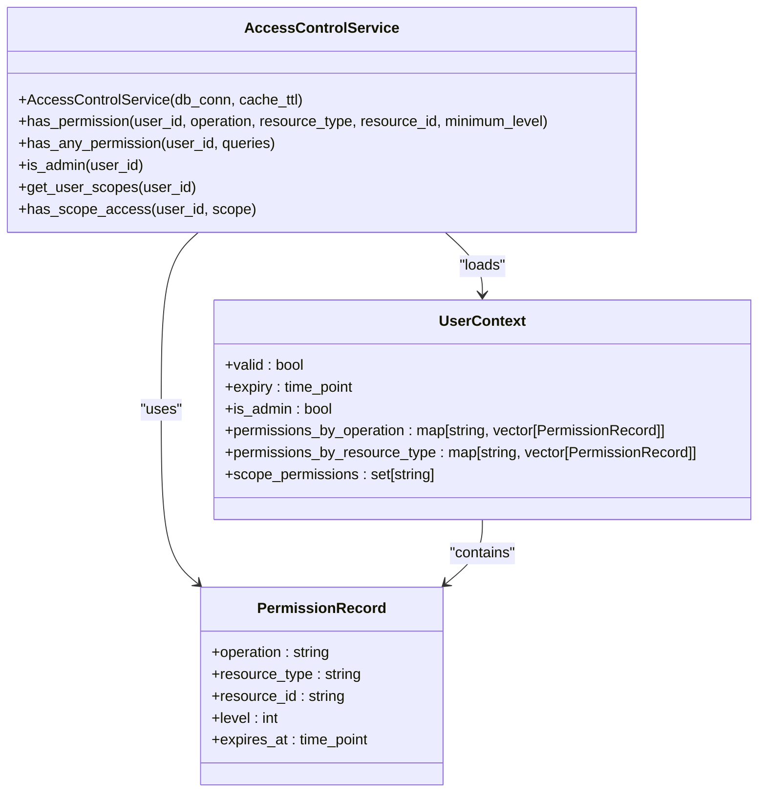
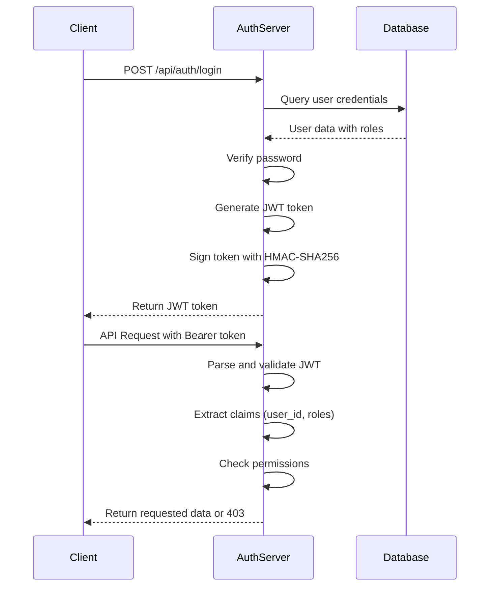
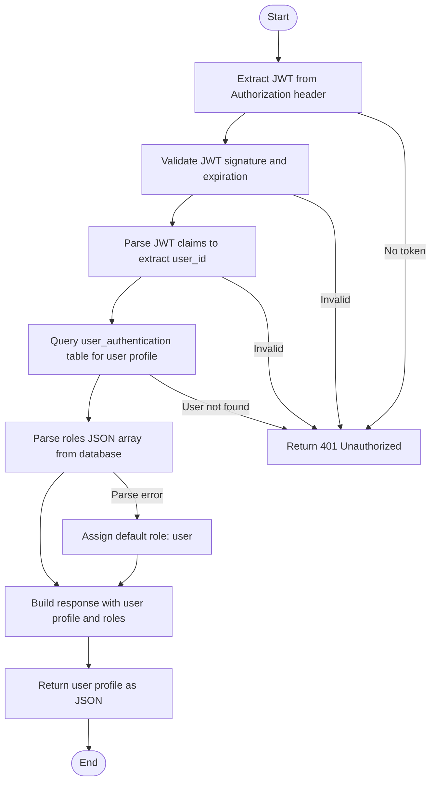
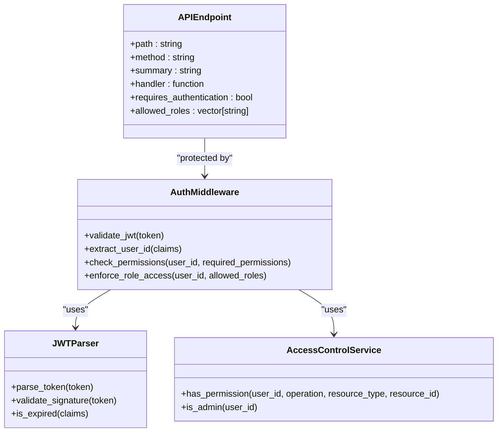

# Authorization

<cite>
**Referenced Files in This Document**   
- [auth_api_handlers.cpp](file://shared/auth/auth_api_handlers.cpp)
- [auth_api_handlers.hpp](file://shared/auth/auth_api_handlers.hpp)
- [jwt_parser.cpp](file://shared/auth/jwt_parser.cpp)
- [jwt_parser.hpp](file://shared/auth/jwt_parser.hpp)
- [access_control_service.cpp](file://shared/security/access_control_service.cpp)
- [access_control_service.hpp](file://shared/security/access_control_service.hpp)
- [auth_helpers.cpp](file://shared/auth/auth_helpers.cpp)
- [auth_helpers.hpp](file://shared/auth/auth_helpers.hpp)
- [schema.sql](file://schema.sql)
- [seed_data.sql](file://seed_data.sql)
- [api_endpoint_registrations.cpp](file://shared/api_registry/api_endpoint_registrations.cpp)
- [security_monitor.hpp](file://shared/security/security_monitor.hpp)
</cite>

## Table of Contents
1. [Introduction](#introduction)
2. [Role-Based Access Control System](#role-based-access-control-system)
3. [JWT Token Generation and Claims](#jwt-token-generation-and-claims)
4. [User Authentication and Role Extraction](#user-authentication-and-role-extraction)
5. [get_current_user Function](#get_current_user-function)
6. [API-Level Authorization Enforcement](#api-level-authorization-enforcement)
7. [Database Schema and Configuration](#database-schema-and-configuration)
8. [Security Monitoring and Privilege Escalation](#security-monitoring-and-privilege-escalation)
9. [Conclusion](#conclusion)

## Introduction
The Authorization sub-feature in the Regulens system implements a robust role-based access control (RBAC) system using JWT tokens and database-stored permissions. This document details how user roles and permissions are managed throughout the authentication and authorization flows, from login to API access enforcement. The system integrates JWT-based authentication with fine-grained permission checks to ensure secure access to resources based on user roles and permissions stored in the database.

**Section sources**
- [auth_api_handlers.cpp](file://shared/auth/auth_api_handlers.cpp#L0-L46)
- [access_control_service.hpp](file://shared/security/access_control_service.hpp#L0-L42)

## Role-Based Access Control System
The Regulens system implements a comprehensive role-based access control (RBAC) system that combines JWT claims with database-stored permissions to enforce authorization. The AccessControlService class serves as the central authorization engine, loading user roles, permissions, and scope metadata from PostgreSQL and applying in-memory caching for performance optimization.

The RBAC system determines administrative privileges by querying the user_roles, roles, and users tables. Users are considered administrators if they have a role level of 90 or higher, or if their role name is "administrator", "super_admin", or "admin". The system also grants admin privileges if a user has a wildcard operation permission ("*") in their permissions.

Permissions are organized by operation and resource type, allowing for fine-grained access control. The system supports hierarchical resource matching, where specific resource types can inherit permissions from more general types. Each permission includes a level attribute that represents the privilege level, with higher values indicating greater privileges.

The access control system implements caching with a configurable time-to-live (TTL) to improve performance. User contexts are cached in memory and refreshed when they expire, reducing the number of database queries required for authorization checks. This caching mechanism ensures that the system can handle high volumes of authorization requests efficiently.

**Diagram sources **
- [access_control_service.hpp](file://shared/security/access_control_service.hpp#L0-L42)
- [access_control_service.cpp](file://shared/security/access_control_service.cpp#L189-L215)

**Section sources**
- [access_control_service.cpp](file://shared/security/access_control_service.cpp#L189-L265)
- [access_control_service.hpp](file://shared/security/access_control_service.hpp#L0-L42)

## JWT Token Generation and Claims
The JWT token generation process in Regulens follows industry best practices for security and standard compliance. The system uses HMAC-SHA256 cryptographic signing to ensure token integrity and prevent tampering. JWT tokens are generated with standard claims including issuer (iss), audience (aud), subject (sub), issued at (iat), and expiration (exp) timestamps.

The JWT payload includes user-specific claims such as user_id, username, email, and roles. The roles claim is a JSON array containing all roles assigned to the user, enabling role-based access decisions. The token also includes a JWT ID (jti) claim, which serves as a unique identifier for the token and can be used for revocation tracking.

Token expiration is strictly enforced, with a configurable expiration time (default 24 hours). The system validates token expiration during the parsing process, rejecting any tokens that have passed their expiration time. This ensures that even if a token is compromised, its usefulness is limited to the token's lifetime.

The JWT parser implementation includes comprehensive validation of the token signature using the HMAC-SHA256 algorithm with a secret key stored in the JWT_SECRET environment variable. The parser also handles base64 URL encoding/decoding according to JWT standards, ensuring compatibility with standard JWT libraries.

**Diagram sources **
- [jwt_parser.cpp](file://shared/auth/jwt_parser.cpp#L0-L180)
- [auth_api_handlers.cpp](file://shared/auth/auth_api_handlers.cpp#L370-L410)

**Section sources**
- [jwt_parser.cpp](file://shared/auth/jwt_parser.cpp#L0-L180)
- [auth_api_handlers.cpp](file://shared/auth/auth_api_handlers.cpp#L370-L410)

## User Authentication and Role Extraction
During the login process, the system extracts user roles from the user_authentication table and includes them in the JWT payload. The login_user function queries the database for the user's credentials, verifies the password using PBKDF2 with SHA256 hashing, and retrieves the user's roles from the roles JSON array stored in the database.

The roles are stored as a JSON array in the user_authentication table, allowing for flexible role assignment. When a user logs in, the system parses this JSON array and converts it into a vector of strings that is included in the JWT token. If the roles JSON cannot be parsed, the system assigns a default "user" role to ensure that all authenticated users have at least basic access privileges.

In addition to roles, the system also loads explicit permissions from the user_permissions table. These permissions provide fine-grained access control beyond the role-based permissions. Each permission includes an operation, resource type, resource ID, permission level, and expiration timestamp. The system filters out expired permissions during the authentication process, ensuring that users only have active permissions.

After successful authentication, the system generates both an access token and a refresh token. The access token is used for API requests, while the refresh token is stored in the user_refresh_tokens table with an expiration time of 30 days. This allows users to obtain new access tokens without re-entering their credentials, while maintaining security through token expiration and revocation.

**Section sources**
- [auth_api_handlers.cpp](file://shared/auth/auth_api_handlers.cpp#L81-L115)
- [auth_api_handlers.cpp](file://shared/auth/auth_api_handlers.cpp#L100-L150)
- [schema.sql](file://schema.sql#L2000-L2100)

## get_current_user Function
The get_current_user function is responsible for retrieving the current user's profile information from a validated JWT token. This function first extracts the user ID from the Authorization header by parsing the JWT token using the JWTParser. If the token is invalid or missing, the function returns an authentication error.

Once the user ID is extracted, the function queries the user_authentication table to retrieve the user's profile information, including username, email, creation date, last login time, and failed login attempts. The function also retrieves the user's roles from the roles JSON array in the database and includes them in the response.

The get_current_user function implements proper error handling throughout the process. If the database query fails or the user is not found, appropriate error messages are returned. The function also handles JSON parsing errors gracefully, assigning default values when necessary to prevent service disruption.

This function is protected by authentication, requiring a valid JWT token to access. It is used by client applications to retrieve the current user's information for display in the user interface and to determine the user's permissions for UI element visibility and functionality.

**Diagram sources **
- [auth_api_handlers.cpp](file://shared/auth/auth_api_handlers.cpp#L200-L299)
- [auth_helpers.cpp](file://shared/auth/auth_helpers.cpp#L0-L38)

**Section sources**
- [auth_api_handlers.cpp](file://shared/auth/auth_api_handlers.cpp#L200-L299)
- [auth_helpers.cpp](file://shared/auth/auth_helpers.cpp#L0-L38)

## API-Level Authorization Enforcement
The system enforces authorization at the API level by validating JWT tokens and checking required permissions for each endpoint. The API endpoint registration system includes role-based access control for each endpoint, specifying which roles are allowed to access the endpoint.

When an API request is received, the system first validates the JWT token in the Authorization header. The JWTParser validates the token signature and checks for expiration. If the token is valid, the system extracts the user ID and roles from the token claims.

For endpoints that require specific permissions, the AccessControlService is used to check if the user has the required permissions. The service checks both role-based permissions and explicit user permissions stored in the database. The system supports wildcard permissions and hierarchical resource matching, allowing for flexible permission configurations.

The authorization enforcement is implemented through middleware that is applied to protected endpoints. This middleware extracts the user information from the JWT token and checks if the user has the necessary roles or permissions to access the endpoint. If the user is not authorized, the request is rejected with a 403 Forbidden response.

**Diagram sources **
- [api_endpoint_registrations.cpp](file://shared/api_registry/api_endpoint_registrations.cpp#L0-L2980)
- [access_control_service.hpp](file://shared/security/access_control_service.hpp#L0-L42)

**Section sources**
- [api_endpoint_registrations.cpp](file://shared/api_registry/api_endpoint_registrations.cpp#L0-L2980)
- [access_control_service.cpp](file://shared/security/access_control_service.cpp#L307-L344)

## Database Schema and Configuration
The authorization system relies on several database tables to store user authentication and authorization data. The user_authentication table stores user credentials, including username, password hash, email, and roles in JSON format. The password is stored using PBKDF2 with SHA256 hashing for security.

The user_permissions table stores explicit permissions for users, including the operation, resource type, resource ID, permission level, and expiration timestamp. This table allows for fine-grained access control beyond the role-based permissions. The user_roles table establishes the many-to-many relationship between users and roles, with an is_active flag to enable or disable role assignments.

The roles table defines the available roles in the system, including their names and levels. The role level is used to determine administrative privileges, with higher levels indicating greater privileges. The system also includes a user_refresh_tokens table to store refresh tokens with their expiration times, enabling secure token refresh without requiring user credentials.

The database schema includes appropriate indexes on frequently queried columns to ensure optimal performance of authentication and authorization operations. Foreign key constraints maintain data integrity between related tables, and check constraints enforce business rules such as valid permission levels and status values.

**Section sources**
- [schema.sql](file://schema.sql#L2000-L2500)
- [seed_data.sql](file://seed_data.sql#L2000-L2500)

## Security Monitoring and Privilege Escalation
The system includes comprehensive security monitoring to detect and prevent privilege escalation attempts and unauthorized access. The SecurityMonitor class detects various security threats, including failed login attempts, brute force attacks, SQL injection attempts, XSS attacks, unauthorized access, and privilege escalation.

When a privilege escalation attempt is detected, the system logs a security event with high or critical severity and triggers appropriate alerts. The security monitor can automatically block IP addresses that exhibit suspicious behavior, such as multiple failed login attempts or rapid succession of privilege escalation attempts.

The system also monitors for anomalous behavior that may indicate compromised accounts or insider threats. This includes detecting unusual access patterns, data exfiltration attempts, and access to sensitive resources outside normal business hours. The security monitor uses machine learning to establish user behavior baselines and detect deviations that may indicate security threats.

All security events are logged in the audit_log table for compliance and forensic analysis. The system generates security alerts for critical events and can integrate with external SIEM systems for centralized security monitoring. Regular security scans and compliance checks ensure that the system maintains a high security posture and adheres to regulatory requirements.

**Section sources**
- [security_monitor.hpp](file://shared/security/security_monitor.hpp#L0-L478)
- [schema.sql](file://schema.sql#L1000-L1500)

## Conclusion
The authorization system in Regulens provides a robust, secure, and flexible role-based access control mechanism that integrates JWT-based authentication with database-stored permissions. The system effectively manages user roles and permissions through a combination of JWT claims and fine-grained database permissions, ensuring that users have appropriate access to resources based on their roles and explicit permissions.

The integration between authentication and authorization flows is seamless, with user roles and permissions extracted from the database during login and included in the JWT payload. The get_current_user function provides a reliable way to retrieve user profile information, while the API-level authorization enforcement ensures that only authorized users can access protected endpoints.

The system's security monitoring capabilities provide an additional layer of protection against privilege escalation attempts and unauthorized access, with comprehensive logging and alerting for security events. Overall, the authorization system in Regulens meets the requirements for a production-grade, secure access control system in a regulated environment.