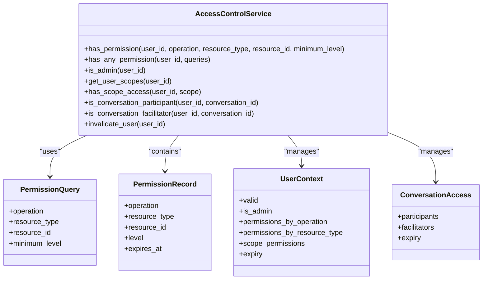
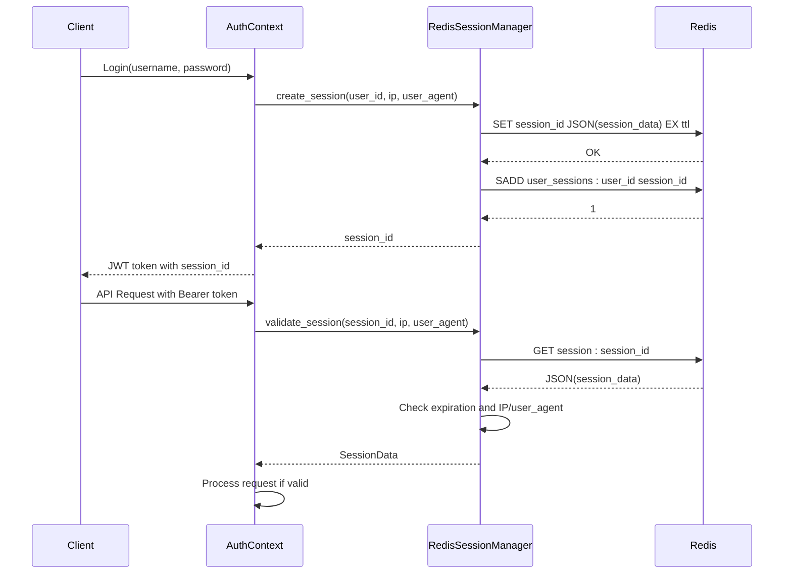
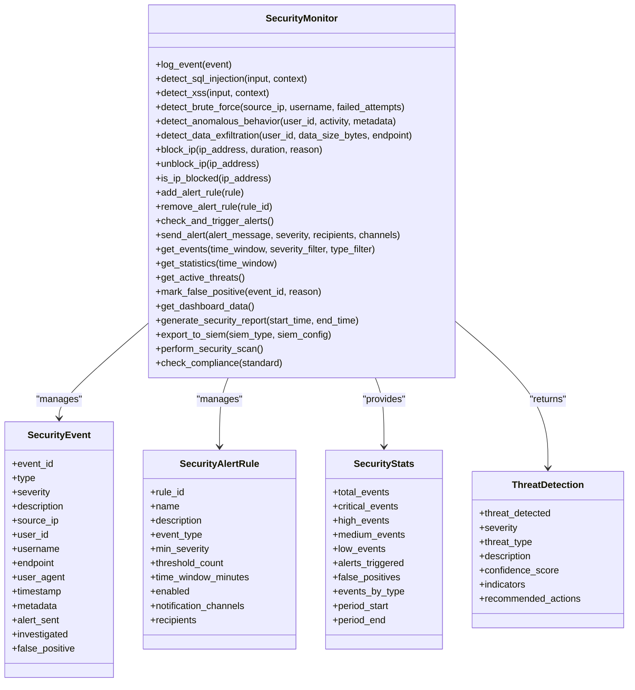
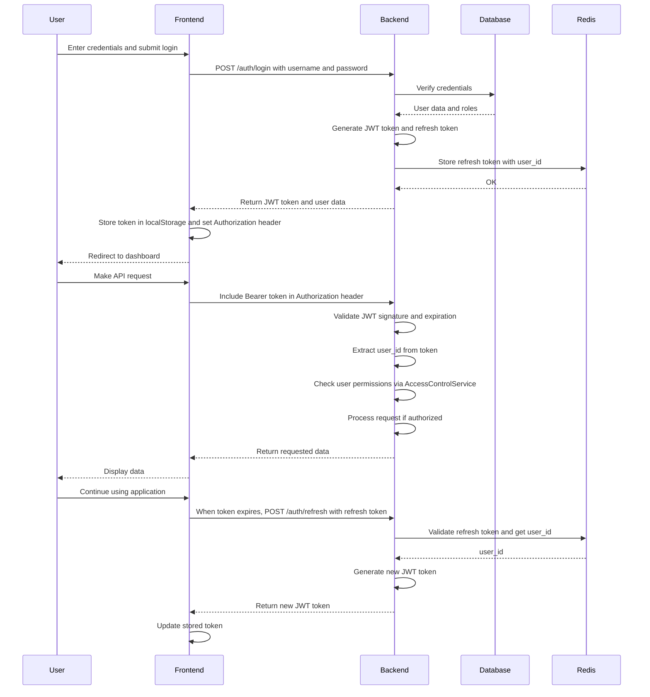

# Security Model

<cite>
**Referenced Files in This Document**   
- [access_control_service.hpp](file://shared/security/access_control_service.hpp)
- [access_control_service.cpp](file://shared/security/access_control_service.cpp)
- [security_monitor.hpp](file://shared/security/security_monitor.hpp)
- [redis_client.hpp](file://shared/cache/redis_client.hpp)
- [redis_session_manager.hpp](file://shared/session/redis_session_manager.hpp)
- [jwt_parser.hpp](file://shared/auth/jwt_parser.hpp)
- [auth_helpers.hpp](file://shared/auth/auth_helpers.hpp)
- [auth_api_handlers.hpp](file://shared/auth/auth_api_handlers.hpp)
- [AuthContext.tsx](file://frontend/src/contexts/AuthContext.tsx)
- [api.ts](file://frontend/src/services/api.ts)
- [Login.tsx](file://frontend/src/pages/Login.tsx)
- [LoginForm.tsx](file://frontend/src/components/LoginForm.tsx)
- [useLogin.ts](file://frontend/src/hooks/useLogin.ts)
</cite>

## Table of Contents
1. [Introduction](#introduction)
2. [Authentication System](#authentication-system)
3. [Authorization and Access Control](#authorization-and-access-control)
4. [Session Management with Redis](#session-management-with-redis)
5. [Security Monitoring and Threat Detection](#security-monitoring-and-threat-detection)
6. [Security Configuration and Compliance](#security-configuration-and-compliance)
7. [Authentication Workflow](#authentication-workflow)
8. [API Security](#api-security)
9. [Conclusion](#conclusion)

## Introduction

The Regulens platform implements a comprehensive security model designed to protect sensitive financial data and ensure compliance with regulatory requirements. The security architecture is built around three core pillars: authentication, authorization, and security monitoring. The system uses JWT-based authentication for stateless token management, role-based access control for fine-grained permissions, and Redis for distributed session management. Additionally, the platform includes advanced security monitoring capabilities to detect anomalous behavior and potential threats in real-time. This documentation provides a detailed overview of the security model, including the high-level design, implementation details, and configuration options.

## Authentication System

The authentication system in Regulens is built on JWT (JSON Web Tokens) for secure user authentication and authorization. The system follows industry-standard practices for token generation, validation, and refresh mechanisms. The `JWTParser` class handles token parsing and validation, ensuring that all tokens are properly signed and not expired. The authentication process begins with user credentials being submitted through the login interface, which then communicates with the backend authentication service to verify the credentials and issue a JWT token.

The JWT token contains essential claims including user ID, username, email, roles, expiration timestamp, and JWT ID. These claims are used throughout the system to identify the user and determine their permissions. The token is signed using HMAC-SHA256 to ensure its integrity and prevent tampering. The authentication system also supports refresh tokens, which allow users to obtain new access tokens without re-entering their credentials when the current token expires.

**Section sources**
- [jwt_parser.hpp](file://shared/auth/jwt_parser.hpp)
- [auth_api_handlers.hpp](file://shared/auth/auth_api_handlers.hpp)
- [AuthContext.tsx](file://frontend/src/contexts/AuthContext.tsx)

## Authorization and Access Control

The authorization system in Regulens is implemented through the `AccessControlService` class, which provides fine-grained access control based on user roles and permissions. The service loads role, permission, and scope metadata from PostgreSQL, applying in-memory caching for performance optimization. The access control system supports various permission checks, including operation-based permissions, resource-type permissions, and scope-based access control.

The `AccessControlService` provides several methods for permission validation:
- `has_permission`: Checks if a user has a specific permission for a given operation, resource type, and resource ID
- `has_any_permission`: Determines if a user has any permission from a list of queries
- `is_admin`: Checks if a user is a platform administrator
- `get_user_scopes`: Retrieves the configuration scopes a user can access
- `has_scope_access`: Validates if a user has access to a specific configuration scope

The system also includes specialized permission checks for conversation participants and facilitators, enabling collaborative features while maintaining security boundaries. Permission data is cached in memory with a configurable TTL (Time-To-Live) to balance performance and security. The service automatically refreshes schema metadata and invalidates cached data when necessary to ensure consistency.

**Diagram sources**
- [access_control_service.hpp](file://shared/security/access_control_service.hpp)
- [access_control_service.cpp](file://shared/security/access_control_service.cpp)

**Section sources**
- [access_control_service.hpp](file://shared/security/access_control_service.hpp)
- [access_control_service.cpp](file://shared/security/access_control_service.cpp)

## Session Management with Redis

Regulens implements distributed session management using Redis for scalability and high availability. The `RedisSessionManager` class handles all aspects of session creation, validation, and cleanup. Sessions are stored in Redis with automatic expiration based on configurable TTL (Time-To-Live) values. The system supports concurrent session limits per user, preventing unauthorized access from multiple locations simultaneously.

The session management system includes several key features:
- Secure session ID generation using cryptographic methods
- IP address and user agent validation to prevent session hijacking
- Automatic session expiration and cleanup
- Support for multiple concurrent sessions with configurable limits
- High availability through Redis replication
- Session activity tracking for security monitoring

Each session contains metadata including user ID, username, IP address, user agent, creation time, last access time, expiration time, and custom attributes. The system validates sessions on each request, checking not only expiration but also consistency with the client's IP address and user agent to detect potential session hijacking attempts.

**Diagram sources**
- [redis_session_manager.hpp](file://shared/session/redis_session_manager.hpp)
- [AuthContext.tsx](file://frontend/src/contexts/AuthContext.tsx)

**Section sources**
- [redis_session_manager.hpp](file://shared/session/redis_session_manager.hpp)
- [redis_client.hpp](file://shared/cache/redis_client.hpp)

## Security Monitoring and Threat Detection

The security monitoring system in Regulens is implemented through the `SecurityMonitor` class, which provides comprehensive threat detection and alerting capabilities. The system monitors for various security events including failed login attempts, brute force attacks, SQL injection attempts, XSS attacks, unauthorized access, privilege escalation, data exfiltration, and anomalous behavior.

The security monitor includes several detection mechanisms:
- **Brute force protection**: Tracks failed login attempts by IP address and username, triggering alerts or blocking when thresholds are exceeded
- **SQL injection detection**: Analyzes user input for SQL injection patterns and suspicious query structures
- **XSS attack detection**: Identifies cross-site scripting attempts in user input and form data
- **Anomaly detection**: Uses behavioral analysis to detect unusual user activity patterns
- **Data exfiltration monitoring**: Detects attempts to access or transfer large amounts of sensitive data
- **Concurrent session monitoring**: Alerts on multiple concurrent sessions from different locations

The system supports configurable alert rules with severity levels, time windows, and notification channels. When a security event is detected, the system can automatically trigger alerts via email, SMS, or Slack, and take automated response actions such as blocking IP addresses or invalidating sessions. The security monitor also provides comprehensive reporting and dashboard capabilities for security analytics.

**Diagram sources**
- [security_monitor.hpp](file://shared/security/security_monitor.hpp)

**Section sources**
- [security_monitor.hpp](file://shared/security/security_monitor.hpp)

## Security Configuration and Compliance

Regulens provides comprehensive configuration options for security policies and compliance requirements. The system is designed to meet financial regulatory standards including SOX, GDPR, and PCI-DSS. Configuration options are available for password policies, session timeouts, security logging, and compliance monitoring.

Key configuration aspects include:
- **Password policies**: Configurable requirements for password complexity, length, expiration, and history
- **Session timeouts**: Adjustable session TTL values for different user roles and security levels
- **Security logging**: Detailed audit trails for all security-relevant events with configurable retention periods
- **Compliance monitoring**: Automated checks for regulatory requirements with reporting capabilities
- **Certificate management**: Support for TLS/SSL certificates and secure communication
- **Key rotation**: Regular rotation of cryptographic keys and secrets

The system includes a compliance checking function that validates adherence to specified standards and generates compliance reports. These reports can be exported to SIEM (Security Information and Event Management) systems for centralized monitoring and analysis. The security configuration is managed through a centralized configuration manager that ensures consistency across all components of the system.

**Section sources**
- [security_monitor.hpp](file://shared/security/security_monitor.hpp)
- [config/configuration_manager.hpp](file://shared/config/configuration_manager.hpp)

## Authentication Workflow

The authentication workflow in Regulens follows a standard JWT-based pattern with additional security measures. The process begins when a user submits their credentials through the login interface. The frontend `AuthContext` component handles the login request and communicates with the backend authentication service.

The workflow includes several security measures:
1. Passwords are hashed using secure algorithms before storage
2. JWT tokens have a limited lifespan (typically 24 hours)
3. Refresh tokens are stored securely in Redis with the user ID
4. Each API request is validated for token authenticity and expiration
5. User permissions are checked for each protected resource access
6. Session activity is tracked and monitored for suspicious behavior

When a user logs out, the frontend sends a logout request to invalidate the refresh token on the server side, while removing the JWT token from local storage. This ensures that the session cannot be resumed even if the JWT token is compromised.

**Diagram sources**
- [auth_api_handlers.hpp](file://shared/auth/auth_api_handlers.hpp)
- [AuthContext.tsx](file://frontend/src/contexts/AuthContext.tsx)
- [api.ts](file://frontend/src/services/api.ts)

**Section sources**
- [auth_api_handlers.hpp](file://shared/auth/auth_api_handlers.hpp)
- [AuthContext.tsx](file://frontend/src/contexts/AuthContext.tsx)
- [api.ts](file://frontend/src/services/api.ts)
- [Login.tsx](file://frontend/src/pages/Login.tsx)
- [LoginForm.tsx](file://frontend/src/components/LoginForm.tsx)
- [useLogin.ts](file://frontend/src/hooks/useLogin.ts)

## API Security

The API security model in Regulens implements multiple layers of protection to ensure the integrity and confidentiality of data. All API endpoints are protected by JWT-based authentication, requiring a valid token in the Authorization header for access. The system uses role-based access control to enforce fine-grained permissions on API resources.

Key API security features include:
- **Authentication**: All endpoints require valid JWT tokens for access
- **Authorization**: Role-based access control determines which operations a user can perform
- **Input validation**: All input data is validated to prevent injection attacks
- **Rate limiting**: Protection against brute force and denial-of-service attacks
- **CORS policies**: Strict cross-origin resource sharing policies to prevent unauthorized access
- **Security headers**: Implementation of security headers like Content-Security-Policy and X-Content-Type-Options
- **Error handling**: Generic error messages to prevent information leakage

The API uses a consistent pattern for authentication and authorization. The `auth_helpers.hpp` file contains helper functions for extracting user IDs from request headers and validating JWT tokens. The `AccessControlService` is used to check permissions for specific operations and resources. This ensures that users can only access data and perform actions for which they have appropriate permissions.

API endpoints are versioned to support backward compatibility and secure deprecation of older versions. The system also supports API key management for programmatic access, with key rotation and revocation capabilities. All API communications are encrypted using TLS to protect data in transit.

**Section sources**
- [auth_api_handlers.hpp](file://shared/auth/auth_api_handlers.hpp)
- [auth_helpers.hpp](file://shared/auth/auth_helpers.hpp)
- [access_control_service.hpp](file://shared/security/access_control_service.hpp)
- [api.ts](file://frontend/src/services/api.ts)

## Conclusion

The security model in Regulens provides a comprehensive framework for protecting sensitive financial data and ensuring regulatory compliance. The system combines JWT-based authentication, role-based access control, and Redis-backed session management to create a secure and scalable architecture. The security monitoring capabilities provide real-time threat detection and response, while the configuration options allow organizations to tailor security policies to their specific requirements.

The implementation follows industry best practices for security, including secure token management, input validation, rate limiting, and comprehensive logging. The system is designed to meet financial regulatory standards and can be extended to support additional compliance requirements as needed. By integrating security into the core architecture, Regulens ensures that data protection and access control are maintained throughout the application lifecycle.