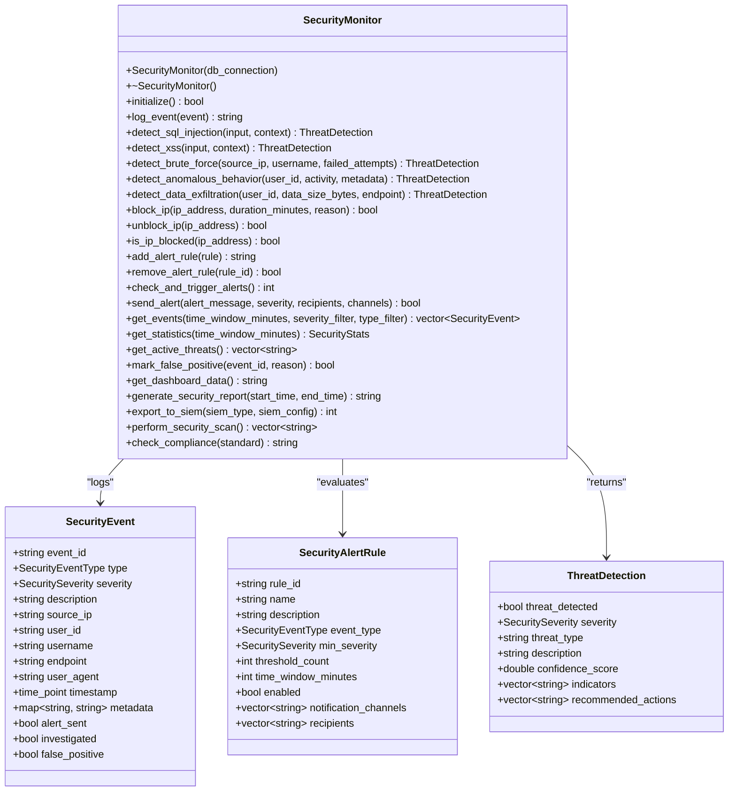
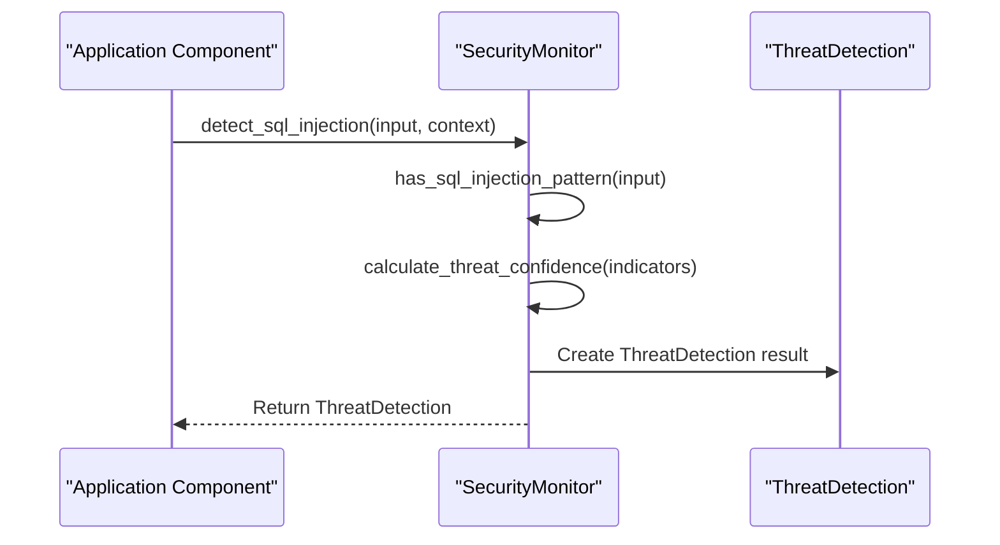
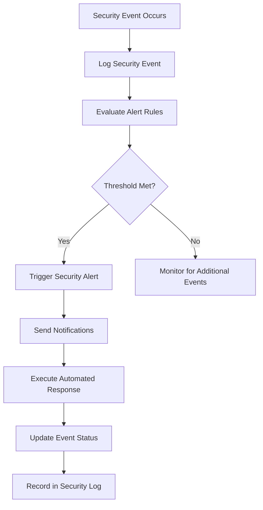

# Security Monitoring

<cite>
**Referenced Files in This Document**   
- [security_monitor.hpp](file://shared/security/security_monitor.hpp)
</cite>

## Table of Contents
1. [Introduction](#introduction)
2. [Core Data Structures](#core-data-structures)
3. [Security Monitor Implementation](#security-monitor-implementation)
4. [Threat Detection Capabilities](#threat-detection-capabilities)
5. [Real-time Monitoring Workflow](#real-time-monitoring-workflow)
6. [Integration with Authentication](#integration-with-authentication)
7. [Session Management Integration](#session-management-integration)
8. [Alerting System](#alerting-system)
9. [Configuration Options](#configuration-options)

## Introduction
The Security Monitoring sub-feature provides comprehensive protection for the Regulens system through real-time threat detection, anomaly monitoring, and automated incident response. The SecurityMonitor class serves as the central component for identifying and responding to security threats across the application. This documentation details the implementation of the security monitoring system, including threat detection capabilities, data structures, workflow, and integration points.

**Section sources**
- [security_monitor.hpp](file://shared/security/security_monitor.hpp#L1-L50)

## Core Data Structures

### SecurityEvent Structure
The SecurityEvent structure represents individual security incidents detected within the system. Each event contains comprehensive metadata for forensic analysis and response coordination.

**Key attributes:**
- **event_id**: Unique identifier for the security event
- **type**: SecurityEventType enum value indicating the nature of the event
- **severity**: SecuritySeverity enum value (LOW, MEDIUM, HIGH, CRITICAL)
- **description**: Human-readable description of the event
- **source_ip**: IP address from which the suspicious activity originated
- **user_id**: Identifier of the user associated with the event
- **username**: Username associated with the event
- **endpoint**: API endpoint or system component targeted
- **user_agent**: User agent string from the request
- **timestamp**: Time when the event occurred
- **metadata**: Key-value pairs containing additional context-specific information
- **alert_sent**: Flag indicating whether an alert has been triggered
- **investigated**: Flag indicating whether the event has been reviewed
- **false_positive**: Flag indicating whether the event was marked as a false positive

### SecurityAlertRule Structure
The SecurityAlertRule structure defines the conditions under which security alerts should be triggered. These rules enable configurable threshold-based detection of suspicious patterns.

**Key attributes:**
- **rule_id**: Unique identifier for the alert rule
- **name**: Descriptive name for the rule
- **description**: Detailed explanation of the rule's purpose
- **event_type**: Specific SecurityEventType the rule monitors
- **min_severity**: Minimum SecuritySeverity level to trigger the alert
- **threshold_count**: Number of events required within the time window
- **time_window_minutes**: Duration in minutes for threshold evaluation
- **enabled**: Boolean flag indicating if the rule is active
- **notification_channels**: List of channels (email, sms, slack) for alert delivery
- **recipients**: List of users or systems to receive the alert

### SecuritySeverity and SecurityEventType Enums
The system uses standardized enums to categorize security events:

**SecuritySeverity levels:**
- LOW
- MEDIUM
- HIGH
- CRITICAL

**SecurityEventType categories:**
- FAILED_LOGIN
- BRUTE_FORCE_ATTEMPT
- SQL_INJECTION_ATTEMPT
- XSS_ATTEMPT
- UNAUTHORIZED_ACCESS
- PRIVILEGE_ESCALATION
- DATA_EXFILTRATION
- SUSPICIOUS_API_CALL
- ANOMALOUS_BEHAVIOR
- MALFORMED_REQUEST
- RATE_LIMIT_EXCEEDED
- INVALID_TOKEN
- EXPIRED_CERTIFICATE
- WEAK_CREDENTIALS
- CONCURRENT_SESSION_VIOLATION

**Section sources**
- [security_monitor.hpp](file://shared/security/security_monitor.hpp#L26-L102)

## Security Monitor Implementation

### SecurityMonitor Class Overview
The SecurityMonitor class provides a comprehensive security monitoring and alerting system with the following key features:
- Real-time threat detection
- Anomaly detection using machine learning
- Brute force protection
- SQL injection detection
- XSS attack detection
- DDoS detection
- Data exfiltration monitoring
- Compliance violation detection
- Automated incident response
- Security analytics and reporting

### Constructor and Initialization
The SecurityMonitor constructor accepts an optional database connection string parameter for persistent event storage. The initialize() method prepares the monitoring system for operation, setting up internal data structures and connections.

### Event Management
The log_event() method records security events to the monitoring system, returning a unique event ID. Events are stored in memory and can be persisted to the database for long-term analysis and compliance reporting.

**Diagram sources**
- [security_monitor.hpp](file://shared/security/security_monitor.hpp#L104-L476)

**Section sources**
- [security_monitor.hpp](file://shared/security/security_monitor.hpp#L104-L156)

## Threat Detection Capabilities

### SQL Injection Detection
The detect_sql_injection() method analyzes user input for patterns indicative of SQL injection attempts. It examines both the input content and context (such as query parameters or form fields) to identify malicious payloads. The method returns a ThreatDetection structure containing:
- threat_detected: Boolean indicating if SQL injection was detected
- severity: Appropriate SecuritySeverity level
- threat_type: "SQL_INJECTION" classification
- description: Detailed explanation of the detected threat
- confidence_score: Probability score between 0.0 and 1.0
- indicators: Specific patterns that triggered the detection
- recommended_actions: Steps to mitigate the threat

### Brute Force Attack Detection
The detect_brute_force() method identifies potential brute force attacks by analyzing failed login attempts from specific IP addresses and usernames. It considers three parameters:
- source_ip: The originating IP address
- username: The targeted user account
- failed_attempts: Count of recent failed login attempts

The method evaluates these factors to determine if the activity constitutes a coordinated attack pattern, returning appropriate threat detection results.

### Cross-Site Scripting (XSS) Detection
The detect_xss() method scans user input for patterns associated with XSS attacks, including script tags, event handlers, and JavaScript URIs. Like SQL injection detection, it considers both the input content and context to minimize false positives while maintaining high detection accuracy.

### Data Exfiltration Monitoring
The detect_data_exfiltration() method monitors for unauthorized data access patterns that may indicate data theft. It analyzes:
- user_id: The user accessing data
- data_size_bytes: Volume of data accessed
- endpoint: The API endpoint or system component accessed

Unusual data access patterns, particularly large data transfers by users without legitimate need, trigger alerts at appropriate severity levels.

### Anomalous Behavior Detection
The detect_anomalous_behavior() method employs machine learning techniques to identify deviations from established user behavior baselines. By comparing current activity against historical patterns, it can detect compromised accounts and insider threats that might otherwise go unnoticed.

**Diagram sources**
- [security_monitor.hpp](file://shared/security/security_monitor.hpp#L148-L156)

**Section sources**
- [security_monitor.hpp](file://shared/security/security_monitor.hpp#L148-L156)

## Real-time Monitoring Workflow

### Event Logging to Alert Triggering
The security monitoring workflow follows a systematic process from event detection to alert notification:

1. **Event Detection**: Security events are identified through various mechanisms including input validation, behavioral analysis, and pattern matching.

2. **Event Logging**: Detected events are recorded using the log_event() method, which stores comprehensive details in the SecurityEvent structure.

3. **Rule Evaluation**: The check_and_trigger_alerts() method periodically evaluates all active SecurityAlertRule instances against recent events.

4. **Alert Generation**: When rule thresholds are met (e.g., multiple failed login attempts within a time window), alerts are generated.

5. **Notification Delivery**: Alerts are sent through configured channels (email, SMS, Slack) to designated recipients.

6. **Incident Response**: Automated response actions may be initiated, such as IP blocking or account lockout.

**Diagram sources**
- [security_monitor.hpp](file://shared/security/security_monitor.hpp#L258-L265)

**Section sources**
- [security_monitor.hpp](file://shared/security/security_monitor.hpp#L258-L265)

## Integration with Authentication

### Failed Login Attempt Detection
The security monitoring system integrates closely with the authentication subsystem to detect and respond to failed login attempts. When a login fails, the authentication system logs a FAILED_LOGIN event through the SecurityMonitor, which then:

1. Updates the failed login counter for the source IP address using update_failed_login_counter()
2. Checks if the failure threshold has been reached
3. Triggers brute force protection measures if necessary

### Account Lockout Mechanism
Based on configurable rules, the system can automatically lock accounts or block IP addresses after a specified number of failed attempts. The block_ip() method implements temporary or permanent IP blocking with configurable duration and reason recording.

### Authentication Event Types
The system monitors several authentication-related event types:
- FAILED_LOGIN: Individual failed authentication attempts
- BRUTE_FORCE_ATTEMPT: Pattern of multiple failed attempts indicating a brute force attack
- INVALID_TOKEN: Use of expired or invalid authentication tokens
- WEAK_CREDENTIALS: Detection of easily guessable passwords

## Session Management Integration

### Concurrent Session Violation Detection
The security monitor integrates with the session management system to detect concurrent session violations. When multiple active sessions are detected for the same user account from different locations or devices, the system can:

1. Log a CONCURRENT_SESSION_VIOLATION event
2. Evaluate the risk based on user behavior patterns
3. Trigger appropriate alerts based on configured rules
4. Optionally terminate suspicious sessions

### Session Anomaly Detection
By monitoring session characteristics such as IP address, user agent, geographic location, and activity patterns, the system can identify potentially compromised sessions. Sudden changes in session attributes trigger anomalous behavior detection for further investigation.

## Alerting System

### Multi-Channel Notifications
The security monitoring system supports multiple notification channels for alert delivery:

- **Email**: Traditional email alerts sent to designated recipients
- **SMS**: Text message alerts for critical security incidents
- **Slack**: Integration with Slack workspaces for team notifications

The send_alert() method coordinates delivery across the configured channels, while specialized methods (send_email_alert(), send_sms_alert(), send_slack_alert()) handle channel-specific formatting and transmission.

### False Positive Management
The mark_false_positive() method allows security analysts to flag events that were incorrectly identified as threats. This functionality helps refine detection algorithms over time and reduces alert fatigue. When an event is marked as a false positive, it is recorded in the system for future reference and analysis.

### Alert Lifecycle
Security alerts follow a defined lifecycle:
1. Detection: Threat is identified through pattern matching or behavioral analysis
2. Evaluation: Alert rules determine if notification is required
3. Notification: Alerts are sent through configured channels
4. Acknowledgment: Security team acknowledges receipt of the alert
5. Investigation: The event is reviewed and analyzed
6. Resolution: Appropriate response actions are taken
7. Documentation: The incident and response are recorded

## Configuration Options

### Alert Thresholds and Time Windows
The system provides configurable parameters for fine-tuning alert sensitivity:

- **threshold_count**: Number of events required to trigger an alert
- **time_window_minutes**: Duration in minutes over which events are counted
- **min_severity**: Minimum severity level for rule evaluation

These parameters allow administrators to balance security sensitivity with operational efficiency, reducing false positives while maintaining protection against genuine threats.

### Retention Policies
The system implements configurable retention policies for security events through the cleanup_old_events() method. Administrators can specify the number of days to retain event data based on compliance requirements and storage considerations.

### Notification Configuration
Alert notification settings are highly configurable:
- **notification_channels**: Selection of active delivery channels
- **recipients**: List of users or systems to receive alerts
- **severity_filtering**: Configuration of which severity levels trigger notifications

These options enable organizations to tailor the alerting system to their specific operational requirements and response capabilities.

**Section sources**
- [security_monitor.hpp](file://shared/security/security_monitor.hpp#L213-L258)