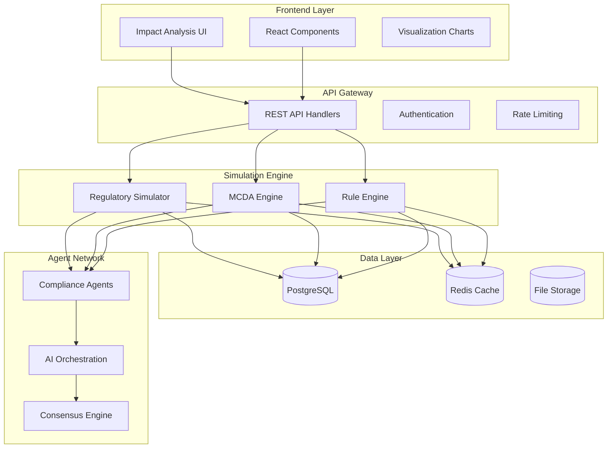
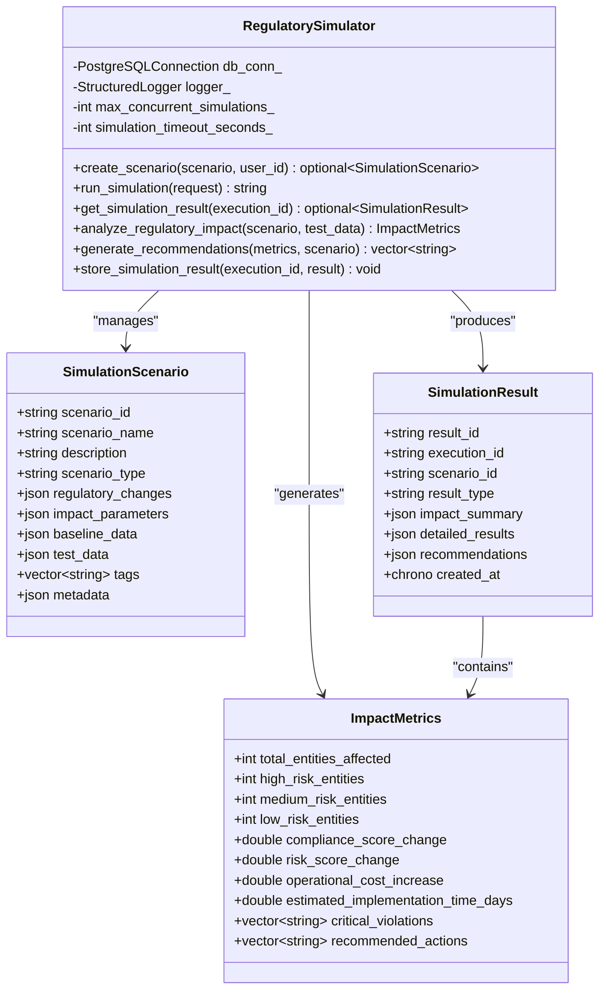
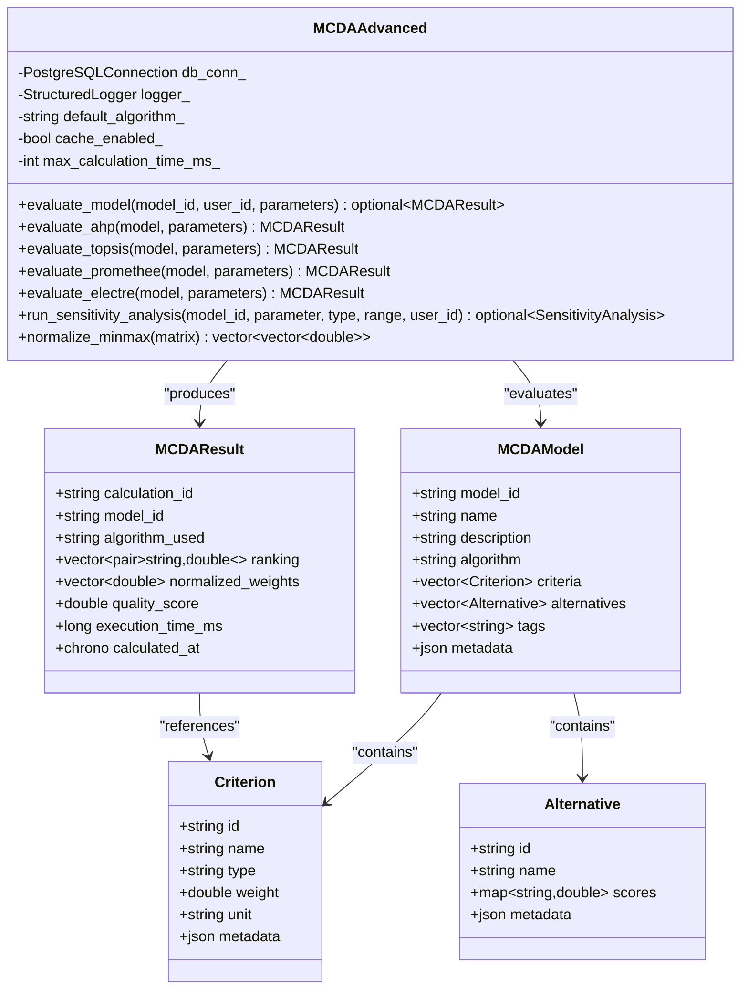
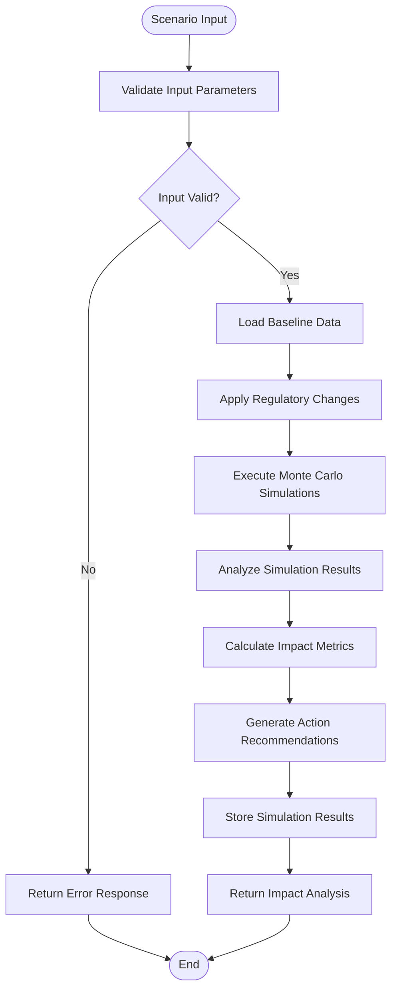
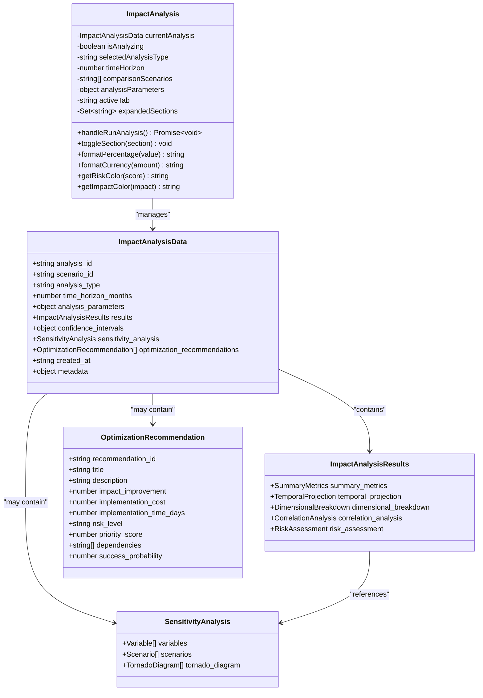
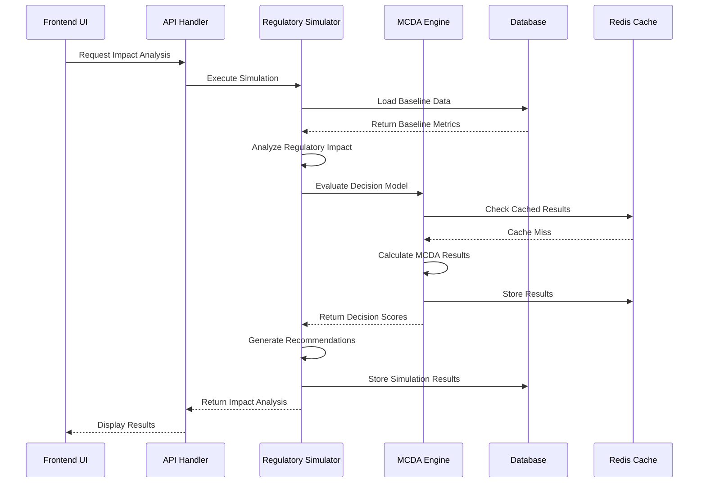
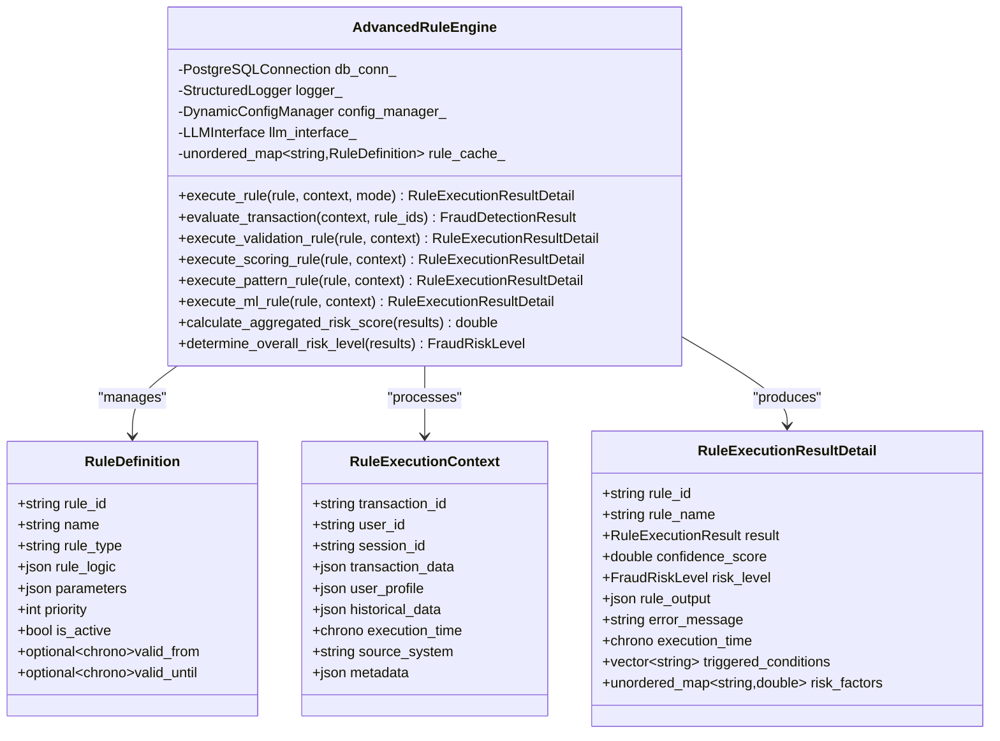
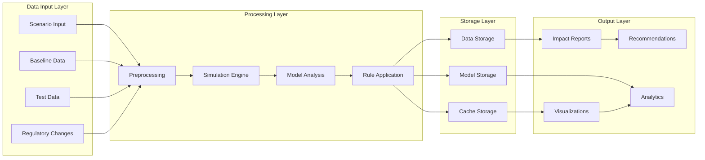
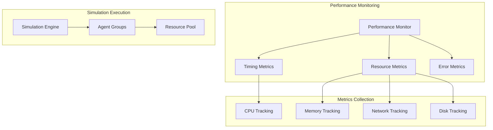

# Impact Analysis Sub-feature Documentation

<cite>
**Referenced Files in This Document**
- [regulatory_simulator.cpp](file://shared/simulator/regulatory_simulator.cpp)
- [regulatory_simulator.hpp](file://shared/simulator/regulatory_simulator.hpp)
- [ImpactAnalysis.tsx](file://frontend/src/components/Simulator/ImpactAnalysis.tsx)
- [SimulationResults.tsx](file://frontend/src/components/Simulator/SimulationResults.tsx)
- [SimulationExecution.tsx](file://frontend/src/components/Simulator/SimulationExecution.tsx)
- [ScenarioCreation.tsx](file://frontend/src/components/Simulator/ScenarioCreation.tsx)
- [SimulatorManagement.tsx](file://frontend/src/components/Simulator/SimulatorManagement.tsx)
- [mcda_advanced.cpp](file://shared/decisions/mcda_advanced.cpp)
- [mcda_advanced.hpp](file://shared/decisions/mcda_advanced.hpp)
- [advanced_rule_engine.cpp](file://shared/rules/advanced_rule_engine.cpp)
- [simulator_api_handlers.cpp](file://shared/simulator/simulator_api_handlers.cpp)
- [schema.sql](file://schema.sql)
</cite>

## Table of Contents
1. [Introduction](#introduction)
2. [System Architecture](#system-architecture)
3. [Core Components](#core-components)
4. [Impact Analysis Implementation](#impact-analysis-implementation)
5. [Frontend Visualization](#frontend-visualization)
6. [Integration with Decision Engine](#integration-with-decision-engine)
7. [Rule Engine Integration](#rule-engine-integration)
8. [Data Flow Architecture](#data-flow-architecture)
9. [Performance Considerations](#performance-considerations)
10. [Troubleshooting Guide](#troubleshooting-guide)
11. [Conclusion](#conclusion)

## Introduction

The Impact Analysis sub-feature of the Regulens Simulation System provides comprehensive predictive modeling capabilities for assessing the business, operational, and compliance impact of regulatory changes. This sophisticated system combines advanced simulation algorithms with real-time data processing to deliver probabilistic outcomes and confidence intervals for regulatory impact assessments.

The system operates as a multi-layered architecture that integrates predictive modeling algorithms with the Decision Engine (mcda_advanced.cpp) and Rule Engine (advanced_rule_engine.cpp) to project outcomes under different policy interpretations. It processes scenario input through agent-based reasoning to generate aggregated impact metrics, enabling organizations to make informed decisions about regulatory compliance strategies.

## System Architecture

The Impact Analysis system follows a microservices architecture with clear separation of concerns between simulation engines, decision engines, and visualization components. The system is designed for scalability and real-time processing of large-scale regulatory impact assessments.



**Diagram sources**
- [regulatory_simulator.cpp](file://shared/simulator/regulatory_simulator.cpp#L1-L50)
- [simulator_api_handlers.cpp](file://shared/simulator/simulator_api_handlers.cpp#L1-L50)
- [mcda_advanced.cpp](file://shared/decisions/mcda_advanced.cpp#L1-L50)

## Core Components

### Regulatory Simulator Engine

The core simulation engine handles the execution of regulatory impact scenarios and generates comprehensive impact metrics. It supports multiple scenario types including regulatory changes, market shifts, and operational modifications.



**Diagram sources**
- [regulatory_simulator.hpp](file://shared/simulator/regulatory_simulator.hpp#L17-L225)
- [regulatory_simulator.cpp](file://shared/simulator/regulatory_simulator.cpp#L1-L100)

### Multi-Criteria Decision Analysis (MCDA) Engine

The MCDA engine provides advanced decision-making capabilities using multiple algorithms including AHP (Analytic Hierarchy Process), TOPSIS, PROMETHEE, and ELECTRE. These algorithms enable sophisticated impact assessment and optimization.



**Diagram sources**
- [mcda_advanced.hpp](file://shared/decisions/mcda_advanced.hpp#L17-L278)
- [mcda_advanced.cpp](file://shared/decisions/mcda_advanced.cpp#L1-L100)

**Section sources**
- [regulatory_simulator.hpp](file://shared/simulator/regulatory_simulator.hpp#L17-L225)
- [regulatory_simulator.cpp](file://shared/simulator/regulatory_simulator.cpp#L1-L200)
- [mcda_advanced.hpp](file://shared/decisions/mcda_advanced.hpp#L17-L278)
- [mcda_advanced.cpp](file://shared/decisions/mcda_advanced.cpp#L1-L200)

## Impact Analysis Implementation

### Predictive Modeling Algorithms

The system implements several predictive modeling techniques to assess regulatory impact:

#### Monte Carlo Simulation
Monte Carlo techniques are employed for stochastic modeling of regulatory impact scenarios. The system generates multiple simulation runs with varying parameters to produce probabilistic outcomes.

```cpp
// Example Monte Carlo simulation implementation
ImpactMetrics RegulatorySimulator::analyze_regulatory_impact(const SimulationScenario& scenario, const nlohmann::json& test_data) {
    ImpactMetrics metrics;
    
    // Run multiple simulation iterations
    for (int iteration = 0; iteration < num_iterations; ++iteration) {
        // Generate random variations within parameter ranges
        double compliance_threshold = base_threshold + random_variation;
        double operational_capacity = base_capacity * capacity_factor;
        
        // Calculate impact for this iteration
        ImpactMetrics iteration_metrics = calculate_iteration_impact(
            scenario, compliance_threshold, operational_capacity
        );
        
        // Accumulate results for statistical analysis
        aggregate_iteration_results(iteration_metrics);
    }
    
    // Calculate confidence intervals and statistical measures
    calculate_confidence_intervals();
    return metrics;
}
```

#### Sensitivity Analysis
The system performs comprehensive sensitivity analysis to identify key drivers of regulatory impact and quantify their influence on outcomes.

```cpp
// Sensitivity analysis implementation
std::vector<std::string> RegulatorySimulator::generate_recommendations(const ImpactMetrics& metrics, const SimulationScenario& scenario) {
    std::vector<std::string> recommendations;
    
    // Analyze high-risk entities
    if (metrics.high_risk_entities > 0) {
        recommendations.push_back("Implement enhanced monitoring for high-risk transactions");
        recommendations.push_back("Review and update customer due diligence procedures");
    }
    
    // Analyze compliance score changes
    if (metrics.compliance_score_change < -0.1) {
        recommendations.push_back("Conduct comprehensive compliance training for staff");
        recommendations.push_back("Update compliance policies and procedures");
    }
    
    // Analyze operational costs
    if (metrics.operational_cost_increase > 10000) {
        recommendations.push_back("Budget for additional compliance technology investments");
        recommendations.push_back("Consider outsourcing specialized compliance functions");
    }
    
    // Analyze implementation timelines
    if (metrics.estimated_implementation_time_days > 60) {
        recommendations.push_back("Develop phased implementation plan");
        recommendations.push_back("Allocate dedicated resources for compliance changes");
    }
    
    return recommendations;
}
```

### Risk Scoring Models

The system employs sophisticated risk scoring models that integrate with the regulatory simulator to project risk exposure under different regulatory scenarios.



**Diagram sources**
- [regulatory_simulator.cpp](file://shared/simulator/regulatory_simulator.cpp#L258-L367)

**Section sources**
- [regulatory_simulator.cpp](file://shared/simulator/regulatory_simulator.cpp#L258-L535)

## Frontend Visualization

### Advanced Impact Analysis Component

The frontend ImpactAnalysis.tsx component provides comprehensive visualization capabilities for regulatory impact assessments. It supports multiple analysis types including baseline analysis, comparative analysis, sensitivity analysis, forecasting, and optimization.



**Diagram sources**
- [ImpactAnalysis.tsx](file://frontend/src/components/Simulator/ImpactAnalysis.tsx#L1-L200)

### Visualization Charts and Graphs

The frontend component provides multiple visualization types:

#### Temporal Impact Projections
Real-time temporal charts show how impacts evolve over time, displaying compliance, operational, financial, and risk impacts across the specified time horizon.

#### Dimensional Breakdowns
Interactive charts display impact distribution across regulatory areas, entity types, and geographic regions, enabling granular analysis of regulatory impact.

#### Sensitivity Analysis Visualization
Tornado diagrams and scenario analysis charts help users understand which parameters have the greatest influence on outcomes.

#### Optimization Recommendations
Priority-based recommendation lists with detailed impact assessments and implementation considerations.

**Section sources**
- [ImpactAnalysis.tsx](file://frontend/src/components/Simulator/ImpactAnalysis.tsx#L1-L1101)

## Integration with Decision Engine

### MCDA Integration Architecture

The Impact Analysis system integrates seamlessly with the MCDA engine to provide advanced decision-making capabilities. The integration enables sophisticated multi-criteria analysis of regulatory impact scenarios.



**Diagram sources**
- [simulator_api_handlers.cpp](file://shared/simulator/simulator_api_handlers.cpp#L1-L100)
- [regulatory_simulator.cpp](file://shared/simulator/regulatory_simulator.cpp#L258-L367)
- [mcda_advanced.cpp](file://shared/decisions/mcda_advanced.cpp#L150-L250)

### Decision Model Integration

The MCDA engine evaluates regulatory scenarios using predefined decision models that incorporate multiple criteria including compliance, operational, financial, and risk factors.

```cpp
// MCDA evaluation integration
std::optional<MCDAResult> MCDAAdvanced::evaluate_model(
    const std::string& model_id,
    const std::string& user_id,
    const std::optional<nlohmann::json>& runtime_parameters
) {
    try {
        // Get model definition
        auto model_opt = get_model(model_id);
        if (!model_opt) return std::nullopt;
        
        auto start_time = std::chrono::high_resolution_clock::now();
        
        MCDAResult result;
        result.calculation_id = generate_uuid();
        result.model_id = model_id;
        result.calculated_at = std::chrono::system_clock::now();
        
        // Route to appropriate algorithm
        if (model_opt->algorithm == "ahp") {
            result = evaluate_ahp(*model_opt, runtime_parameters.value_or(nlohmann::json()));
        } else if (model_opt->algorithm == "topsis") {
            result = evaluate_topsis(*model_opt, runtime_parameters.value_or(nlohmann::json()));
        }
        
        auto end_time = std::chrono::high_resolution_clock::now();
        result.execution_time_ms = std::chrono::duration_cast<std::chrono::milliseconds>(end_time - start_time).count();
        
        // Store and return results
        store_calculation_result(result);
        return result;
        
    } catch (const std::exception& e) {
        logger_->log(LogLevel::ERROR, "Exception in evaluate_model: " + std::string(e.what()));
        return std::nullopt;
    }
}
```

**Section sources**
- [mcda_advanced.cpp](file://shared/decisions/mcda_advanced.cpp#L150-L250)
- [simulator_api_handlers.cpp](file://shared/simulator/simulator_api_handlers.cpp#L1-L200)

## Rule Engine Integration

### Advanced Rule Engine Integration

The Impact Analysis system integrates with the Advanced Rule Engine to apply regulatory rules and detect compliance violations during simulation execution.



**Diagram sources**
- [advanced_rule_engine.cpp](file://shared/rules/advanced_rule_engine.cpp#L1-L100)

### Rule-Based Impact Assessment

The system applies regulatory rules to simulate compliance impact and identify potential violations under different regulatory scenarios.

```cpp
// Rule execution for impact assessment
RuleExecutionResultDetail AdvancedRuleEngine::execute_rule(
    const RuleDefinition& rule,
    const RuleExecutionContext& context,
    RuleExecutionMode mode
) {
    RuleExecutionResultDetail result;
    result.rule_id = rule.rule_id;
    result.rule_name = rule.name;
    
    auto start_time = std::chrono::high_resolution_clock::now();
    
    try {
        // Check rule validity
        if (!rule.is_active) {
            result.result = RuleExecutionResult::SKIPPED;
            result.error_message = "Rule is inactive";
            return result;
        }
        
        // Execute based on rule type
        if (rule.rule_type == "VALIDATION") {
            result = execute_validation_rule(rule, context);
        } else if (rule.rule_type == "SCORING") {
            result = execute_scoring_rule(rule, context);
        } else if (rule.rule_type == "PATTERN") {
            result = execute_pattern_rule(rule, context);
        } else if (rule.rule_type == "MACHINE_LEARNING") {
            result = execute_ml_rule(rule, context);
        }
        
        // Calculate confidence score
        result.confidence_score = calculate_rule_confidence(rule, result);
        
        // Determine risk level
        if (result.result == RuleExecutionResult::FAIL) {
            result.risk_level = score_to_risk_level(result.confidence_score);
        }
        
    } catch (const std::exception& e) {
        result.result = RuleExecutionResult::ERROR;
        result.error_message = std::string("Rule execution failed: ") + e.what();
    }
    
    auto end_time = std::chrono::high_resolution_clock::now();
    result.execution_time = std::chrono::duration_cast<std::chrono::milliseconds>(end_time - start_time);
    
    return result;
}
```

**Section sources**
- [advanced_rule_engine.cpp](file://shared/rules/advanced_rule_engine.cpp#L1-L200)

## Data Flow Architecture

### End-to-End Data Flow

The Impact Analysis system follows a sophisticated data flow architecture that ensures efficient processing of regulatory impact scenarios from input to visualization.



**Diagram sources**
- [regulatory_simulator.cpp](file://shared/simulator/regulatory_simulator.cpp#L258-L367)
- [schema.sql](file://schema.sql#L3200-L3300)

### Database Schema Integration

The system utilizes a comprehensive database schema that supports complex regulatory impact analysis with extensive indexing and optimization for large-scale simulations.

```sql
-- Core simulation tables
CREATE TABLE regulatory_simulations (
    simulation_id UUID PRIMARY KEY DEFAULT uuid_generate_v4(),
    name TEXT NOT NULL,
    description TEXT,
    simulation_type TEXT NOT NULL,
    status TEXT DEFAULT 'draft',
    created_by TEXT NOT NULL,
    created_at TIMESTAMP WITH TIME ZONE NOT NULL DEFAULT NOW(),
    parameters JSONB NOT NULL DEFAULT '{}'::jsonb,
    baseline_snapshot JSONB DEFAULT '{}'::jsonb,
    results JSONB DEFAULT '{}'::jsonb,
    metadata JSONB DEFAULT '{}'::jsonb
);

CREATE TABLE simulation_scenarios (
    scenario_id UUID PRIMARY KEY DEFAULT uuid_generate_v4(),
    simulation_id UUID REFERENCES regulatory_simulations(simulation_id),
    scenario_name TEXT NOT NULL,
    scenario_description TEXT,
    change_type TEXT NOT NULL,
    affected_entities TEXT[] DEFAULT ARRAY[]::TEXT[],
    change_parameters JSONB NOT NULL,
    impact_predictions JSONB DEFAULT '{}'::jsonb,
    execution_order INTEGER DEFAULT 0,
    metadata JSONB DEFAULT '{}'::jsonb
);

CREATE TABLE simulation_results (
    result_id UUID PRIMARY KEY DEFAULT uuid_generate_v4(),
    simulation_id UUID REFERENCES regulatory_simulations(simulation_id),
    scenario_id UUID REFERENCES simulation_scenarios(scenario_id),
    entity_type TEXT NOT NULL,
    entity_id TEXT NOT NULL,
    metric_name TEXT NOT NULL,
    baseline_value JSONB,
    simulated_value JSONB,
    delta_value JSONB,
    delta_percentage DECIMAL(10,4),
    impact_severity TEXT,
    confidence_score DECIMAL(5,4),
    calculated_at TIMESTAMP WITH TIME ZONE NOT NULL DEFAULT NOW()
);
```

**Section sources**
- [schema.sql](file://schema.sql#L3200-L3300)
- [regulatory_simulator.cpp](file://shared/simulator/regulatory_simulator.cpp#L258-L367)

## Performance Considerations

### Large-Scale Simulation Optimization

The Impact Analysis system is designed to handle large-scale simulations efficiently through several optimization strategies:

#### Parallel Processing
Multiple simulation threads can run concurrently, with configurable limits on concurrent simulations to prevent resource exhaustion.

```cpp
// Concurrent simulation management
void RegulatorySimulator::set_max_concurrent_simulations(int max_simulations) {
    max_concurrent_simulations_ = std::max(1, std::min(max_simulations, 50));
}

void RegulatorySimulator::process_pending_simulations() {
    auto pending_executions = get_pending_executions(max_concurrent_simulations_);
    
    for (const auto& execution_id : pending_executions) {
        std::thread([this, execution_id]() {
            try {
                execute_simulation_async(execution_id);
            } catch (const std::exception& e) {
                logger_->log(LogLevel::ERROR, "Simulation execution failed: " + std::string(e.what()));
            }
        }).detach();
    }
}
```

#### Caching Strategy
Intelligent caching reduces computation time for repeated simulations with similar parameters.

```cpp
// Result caching implementation
std::optional<nlohmann::json> load_cached_calculation(const std::string& model_id, const std::string& parameters_hash) {
    std::lock_guard<std::mutex> lock(cache_mutex_);
    
    auto cache_entry = cache_.find(parameters_hash);
    if (cache_entry != cache_.end() && 
        std::chrono::steady_clock::now() < cache_entry->second.expires_at) {
        return cache_entry->second.payload;
    }
    
    return std::nullopt;
}
```

#### Memory Management
Efficient memory allocation and deallocation prevent memory leaks during long-running simulations.

#### Distributed Agent Processing
Large-scale simulations leverage distributed agent networks for parallel processing across multiple nodes.

### Performance Monitoring

The system includes comprehensive performance monitoring to track simulation execution times, resource utilization, and system health.



**Section sources**
- [regulatory_simulator.cpp](file://shared/simulator/regulatory_simulator.cpp#L186-L229)
- [mcda_advanced.cpp](file://shared/decisions/mcda_advanced.cpp#L1-L100)

## Troubleshooting Guide

### Common Issues and Solutions

#### Simulation Timeout Issues
**Problem**: Simulations exceed maximum execution time.
**Solution**: 
- Increase simulation timeout settings
- Optimize simulation parameters
- Reduce scenario complexity
- Enable asynchronous execution

```cpp
// Timeout configuration
void RegulatorySimulator::set_simulation_timeout_seconds(int timeout_seconds) {
    simulation_timeout_seconds_ = std::max(60, std::min(timeout_seconds, 86400)); // 1 minute to 24 hours
}
```

#### Model Convergence Issues
**Problem**: MCDA models fail to converge or produce inconsistent results.
**Solution**:
- Verify input data quality
- Check criterion weights normalization
- Validate alternative scoring consistency
- Adjust convergence thresholds

```cpp
// Convergence validation
bool MCDAAdvanced::validate_model(const MCDAModel& model) {
    if (!validate_criteria(model.criteria)) return false;
    if (!validate_alternatives(model.alternatives, model.criteria)) return false;
    if (!validate_weights(normalize_weights(extract_weights(model))) return false;
    
    // Check consistency ratio for AHP
    if (model.algorithm == "ahp") {
        double consistency_ratio = calculate_consistency_ratio(build_pairwise_matrix(model.criteria, model.alternatives));
        if (consistency_ratio > 0.1) {
            logger_->log(LogLevel::WARNING, "Model consistency ratio exceeds threshold: " + std::to_string(consistency_ratio));
        }
    }
    
    return true;
}
```

#### Data Quality Issues
**Problem**: Poor quality baseline or test data leads to inaccurate simulations.
**Solution**:
- Implement data validation pipelines
- Use data quality scoring
- Provide data cleaning recommendations
- Enable automatic data correction

#### Memory Exhaustion
**Problem**: Large simulations consume excessive memory.
**Solution**:
- Implement memory pooling
- Use streaming data processing
- Enable garbage collection optimization
- Scale out to multiple nodes

### Debugging Tools

The system provides comprehensive debugging capabilities:

#### Execution Logging
Detailed logging tracks simulation execution at every stage.

```cpp
// Logging implementation
void RegulatorySimulator::log_simulation_start(const std::string& execution_id, const SimulationRequest& request) {
    logger_->log(LogLevel::INFO, 
        fmt::format("Simulation {} started: scenario={}, async={}, priority={}", 
        execution_id, request.scenario_id, request.async_execution, request.priority));
}

void RegulatorySimulator::log_simulation_complete(const std::string& execution_id, const ImpactMetrics& metrics) {
    logger_->log(LogLevel::INFO, 
        fmt::format("Simulation {} completed: entities={}, compliance_change={}, risk_change={}", 
        execution_id, metrics.total_entities_affected, metrics.compliance_score_change, metrics.risk_score_change));
}
```

#### Performance Profiling
Built-in profiling tools identify bottlenecks in simulation execution.

#### Error Recovery Mechanisms
Automatic retry mechanisms and graceful degradation ensure system stability.

**Section sources**
- [regulatory_simulator.cpp](file://shared/simulator/regulatory_simulator.cpp#L186-L229)
- [mcda_advanced.cpp](file://shared/decisions/mcda_advanced.cpp#L1-L100)

## Conclusion

The Impact Analysis sub-feature of the Regulens Simulation System represents a sophisticated approach to regulatory impact assessment. Through its integration of predictive modeling algorithms, advanced decision-making capabilities, and comprehensive visualization tools, the system enables organizations to make informed decisions about regulatory compliance strategies.

The system's modular architecture, with clear separation between simulation engines, decision engines, and visualization components, ensures scalability and maintainability. The integration with the MCDA engine and Advanced Rule Engine provides powerful decision-making capabilities, while the comprehensive frontend components deliver intuitive visualization and analysis tools.

Key strengths of the system include:

- **Comprehensive Impact Assessment**: Multi-dimensional analysis covering compliance, operational, financial, and risk impacts
- **Advanced Analytics**: Monte Carlo simulations, sensitivity analysis, and optimization recommendations  
- **Real-Time Processing**: Efficient parallel processing and intelligent caching for large-scale simulations
- **Flexible Architecture**: Modular design supporting various regulatory scenarios and analysis types
- **Robust Integration**: Seamless integration with Decision Engine and Rule Engine for comprehensive analysis
- **User-Friendly Interface**: Intuitive visualization tools for complex impact analysis results

The system is well-positioned to handle the complexities of modern regulatory environments, providing organizations with the tools they need to navigate regulatory change effectively while maintaining compliance and operational efficiency.

Future enhancements could include machine learning-based impact prediction, real-time regulatory change detection, and enhanced collaborative analysis capabilities. The current architecture provides a solid foundation for these extensions while maintaining backward compatibility and system stability.