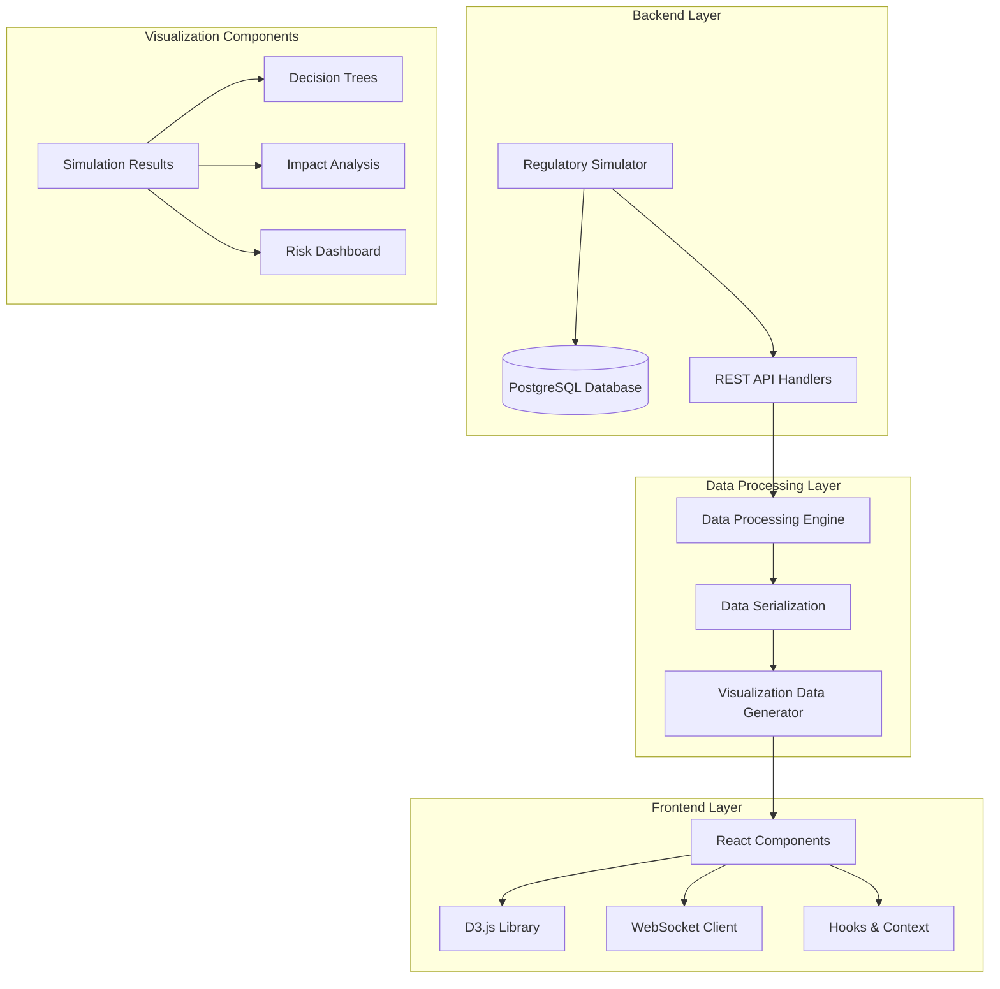

# Result Visualization

<cite>
**Referenced Files in This Document**
- [SimulationResults.tsx](file://frontend/src/components/Simulator/SimulationResults.tsx)
- [SimulationResults.tsx](file://frontend/src/pages/SimulationResults.tsx)
- [DecisionTreeVisualization.tsx](file://frontend/src/components/DecisionTree/DecisionTreeVisualization.tsx)
- [ImpactAnalysis.tsx](file://frontend/src/components/Simulator/ImpactAnalysis.tsx)
- [ScenarioCreation.tsx](file://frontend/src/components/Simulator/ScenarioCreation.tsx)
- [SimulationExecution.tsx](file://frontend/src/components/Simulator/SimulationExecution.tsx)
- [regulatory_simulator.cpp](file://shared/simulator/regulatory_simulator.cpp)
- [decision_tree.hpp](file://shared/models/decision_tree.hpp)
- [decision_tree_types.hpp](file://shared/models/decision_tree_types.hpp)
- [api.ts](file://frontend/src/services/api.ts)
- [useSimulations.ts](file://frontend/src/hooks/useSimulations.ts)
- [useDecisionTree.ts](file://frontend/src/hooks/useDecisionTree.ts)
- [PatternAnalysis.tsx](file://frontend/src/pages/PatternAnalysis.tsx)
- [RiskDashboard.tsx](file://frontend/src/pages/RiskDashboard.tsx)
</cite>

## Table of Contents
1. [Introduction](#introduction)
2. [Architecture Overview](#architecture-overview)
3. [Core Visualization Components](#core-visualization-components)
4. [Data Flow and Serialization](#data-flow-and-serialization)
5. [Interactive Visualizations](#interactive-visualizations)
6. [Chart Types and Implementations](#chart-types-and-implementations)
7. [Real-time Update Mechanisms](#real-time-update-mechanisms)
8. [User Role Customization](#user-role-customization)
9. [Accessibility and Responsiveness](#accessibility-and-responsiveness)
10. [Performance Optimization](#performance-optimization)
11. [Error Handling and Fallbacks](#error-handling-and-fallbacks)
12. [Troubleshooting Guide](#troubleshooting-guide)
13. [Conclusion](#conclusion)

## Introduction

The Result Visualization component of the Regulens Simulation System provides comprehensive, interactive visual representations of regulatory impact simulations. This system transforms complex simulation outcomes into intuitive, actionable insights through advanced visualization techniques, enabling compliance officers, executives, and analysts to interpret regulatory impacts effectively.

The visualization system bridges the gap between backend simulation results from `regulatory_simulator.cpp` and frontend rendering in React components, utilizing modern visualization libraries like D3.js to create dynamic, responsive charts and decision tree visualizations. The system supports multiple chart types, real-time updates, and role-based customization to serve different user needs.

## Architecture Overview

The Result Visualization system follows a layered architecture that separates concerns between data processing, visualization rendering, and user interaction:



**Diagram sources**
- [regulatory_simulator.cpp](file://shared/simulator/regulatory_simulator.cpp#L1-L50)
- [SimulationResults.tsx](file://frontend/src/components/Simulator/SimulationResults.tsx#L1-L50)
- [DecisionTreeVisualization.tsx](file://frontend/src/components/DecisionTree/DecisionTreeVisualization.tsx#L1-L50)

## Core Visualization Components

### Simulation Results Visualization

The primary visualization component is the `SimulationResults` component, which serves as the central hub for displaying comprehensive simulation outcomes:

```typescript
interface SimulationResult {
  result_id: string;
  execution_id: string;
  scenario_id: string;
  user_id: string;
  result_type: 'impact_analysis' | 'compliance_check' | 'risk_assessment';
  impact_summary: any;
  detailed_results: any;
  affected_entities: any;
  recommendations: any;
  risk_assessment: any;
  cost_impact: any;
  compliance_impact: any;
  operational_impact: any;
  created_at: string;
  metadata: any;
}
```

The component provides multiple visualization tabs including:
- **Overview**: Executive summary with key metrics
- **Impact Analysis**: Detailed impact breakdown
- **Compliance**: Compliance score changes and gaps
- **Risk Assessment**: Risk distribution and mitigation
- **Cost Impact**: Financial implications
- **Recommendations**: Actionable suggestions

### Decision Tree Visualization

The `DecisionTreeVisualization` component renders interactive decision trees using D3.js:

```typescript
interface DecisionTreeVisualizationProps {
  tree: DecisionTree;
  width?: number;
  height?: number;
  onNodeClick?: (nodeId: string) => void;
}
```

Features include:
- Force-directed graph layout
- Interactive node selection
- Zoom and pan capabilities
- Color-coded node types
- Dynamic legend display

**Section sources**
- [SimulationResults.tsx](file://frontend/src/components/Simulator/SimulationResults.tsx#L30-L100)
- [DecisionTreeVisualization.tsx](file://frontend/src/components/DecisionTree/DecisionTreeVisualization.tsx#L10-L30)

## Data Flow and Serialization

### Backend Data Processing

The `regulatory_simulator.cpp` handles complex data transformations and serialization:

```cpp
SimulationResult RegulatorySimulator::execute_simulation_sync(const std::string& execution_id) {
    // Analyze regulatory impact
    ImpactMetrics impact_metrics = analyze_regulatory_impact(scenario, scenario.test_data);
    
    // Build comprehensive result structure
    SimulationResult sim_result;
    sim_result.result_id = generate_uuid();
    sim_result.execution_id = execution_id;
    sim_result.scenario_id = scenario_id;
    sim_result.user_id = user_id;
    sim_result.result_type = "impact_analysis";
    
    // Serialize to JSON for frontend consumption
    sim_result.impact_summary = {
        {"total_entities_affected", impact_metrics.total_entities_affected},
        {"high_risk_entities", impact_metrics.high_risk_entities},
        {"medium_risk_entities", impact_metrics.medium_risk_entities},
        {"low_risk_entities", impact_metrics.low_risk_entities},
        {"compliance_score_change", impact_metrics.compliance_score_change},
        {"risk_score_change", impact_metrics.risk_score_change},
        {"operational_cost_increase", impact_metrics.operational_cost_increase},
        {"estimated_implementation_time_days", impact_metrics.estimated_implementation_time_days}
    };
    
    return sim_result;
}
```

### Frontend Data Consumption

The frontend consumes serialized data through typed APIs:

```typescript
export interface ImpactMetrics {
  total_entities_affected: number;
  high_risk_entities: number;
  medium_risk_entities: number;
  low_risk_entities: number;
  compliance_score_change: number;
  risk_score_change: number;
  operational_cost_increase: number;
  estimated_implementation_time_days: number;
  critical_violations: string[];
  recommended_actions: string[];
}
```

**Section sources**
- [regulatory_simulator.cpp](file://shared/simulator/regulatory_simulator.cpp#L200-L400)
- [api.ts](file://frontend/src/types/api.ts#L1-L100)

## Interactive Visualizations

### D3.js Decision Tree Implementation

The decision tree visualization uses D3.js for advanced interactive rendering:

```javascript
// Force simulation setup
const simulation = d3
  .forceSimulation<D3Node>(nodes)
  .force('link', d3.forceLink<D3Node, D3Link>(links).id((d) => d.id).distance(100))
  .force('charge', d3.forceManyBody().strength(-300))
  .force('center', d3.forceCenter(width / 2, height / 2))
  .force('collision', d3.forceCollide().radius(40));

// Node rendering with type-based coloring
const getNodeColor = (type: string): string => {
  switch (type) {
    case 'criterion': return '#3b82f6'; // blue
    case 'alternative': return '#10b981'; // green
    case 'score': return '#f59e0b'; // amber
    default: return '#6b7280'; // gray
  }
};
```

### Real-time Chart Updates

The system supports real-time updates through WebSocket connections:

```typescript
// Real-time execution monitoring
useEffect(() => {
  if (currentExecution?.execution_status === 'running') {
    const interval = setInterval(() => {
      setCurrentExecution(prev => {
        if (!prev || prev.execution_status !== 'running') return prev;
        
        const newProgress = Math.min(prev.progress_percentage + Math.random() * 5, 95);
        const newLogs = [...prev.logs];
        
        // Add random log entries
        if (Math.random() > 0.7) {
          newLogs.push({
            log_id: `log-${Date.now()}`,
            execution_id: prev.execution_id,
            timestamp: new Date().toISOString(),
            level: logLevels[Math.floor(Math.random() * logLevels.length)],
            message: messages[Math.floor(Math.random() * messages.length)],
            step: prev.current_step
          });
        }
        
        return { ...prev, progress_percentage: newProgress, logs: newLogs };
      });
    }, 2000);
    
    return () => clearInterval(interval);
  }
}, [currentExecution?.execution_status]);
```

**Section sources**
- [DecisionTreeVisualization.tsx](file://frontend/src/components/DecisionTree/DecisionTreeVisualization.tsx#L50-L150)
- [SimulationExecution.tsx](file://frontend/src/components/Simulator/SimulationExecution.tsx#L200-L300)

## Chart Types and Implementations

### Heatmaps for Risk Exposure

The system implements heatmap visualizations for risk exposure analysis:

```typescript
// Risk factor heatmap implementation
const getRiskColor = (score: number) => {
  if (score >= 0.7) return 'text-red-600';
  if (score >= 0.4) return 'text-yellow-600';
  return 'text-green-600';
};

// Risk distribution visualization
<div className="grid grid-cols-2 md:grid-cols-4 gap-4">
  {Object.entries(currentAnalysis.results.risk_assessment.risk_distribution).map(([level, percentage]) => (
    <div key={level} className="text-center">
      <div className={clsx(
        'text-2xl font-bold mb-1',
        level === 'critical' ? 'text-red-600' :
        level === 'high' ? 'text-orange-600' :
        level === 'medium' ? 'text-yellow-600' : 'text-green-600'
      )}>
        {percentage}%
      </div>
      <div className="text-sm text-gray-600 capitalize">{level.replace('_', ' ')} Risk</div>
    </div>
  ))}
</div>
```

### Timeline Visualizations

Temporal impact projections use timeline charts:

```typescript
// Timeline data preparation
const timeData = patterns.reduce((acc, p) => {
  const date = new Date(p.discoveredAt).toISOString().split('T')[0];
  acc[date] = (acc[date] || 0) + 1;
  return acc;
}, {} as Record<string, number>);

const data = Object.entries(timeData)
  .map(([date, count]) => ({ date: new Date(date), count }))
  .sort((a, b) => a.date.getTime() - b.date.getTime());

// D3 timeline rendering
const xScale = d3.scaleTime()
  .domain(d3.extent(data, d => d.date) as [Date, Date])
  .range([margin.left, width - margin.right]);

const yScale = d3.scaleLinear()
  .domain([0, d3.max(data, d => d.count) || 0])
  .nice()
  .range([height - margin.bottom, margin.top]);
```

### Decision Tree Visualizations

The decision tree component supports multiple node types:

```typescript
enum class DecisionNodeType {
  ROOT,           // Root of decision tree
  CONDITION,      // Conditional evaluation node
  ACTION,         // Action/recommendation node
  FACTOR,         // Contributing factor node
  EVIDENCE,       // Evidence supporting decision
  OUTCOME,        // Final decision outcome
  DECISION,       // Decision point with branches
  CHANCE,         // Chance/probability node
  TERMINAL,       // End node with outcome
  UTILITY         // Utility assessment node
};
```

**Section sources**
- [ImpactAnalysis.tsx](file://frontend/src/components/Simulator/ImpactAnalysis.tsx#L400-L500)
- [PatternAnalysis.tsx](file://frontend/src/pages/PatternAnalysis.tsx#L180-L220)
- [decision_tree_types.hpp](file://shared/models/decision_tree_types.hpp#L1-L22)

## Real-time Update Mechanisms

### WebSocket Integration

The system integrates WebSocket connections for real-time updates:

```typescript
// WebSocket client setup
const ws = new WebSocket(`ws://${window.location.host}/api/ws`);

ws.onmessage = (event) => {
  const data = JSON.parse(event.data);
  
  switch (data.type) {
    case 'execution_update':
      setCurrentExecution(prev => {
        if (prev?.execution_id === data.execution_id) {
          return { ...prev, ...data.update };
        }
        return prev;
      });
      break;
    
    case 'simulation_result':
      setResults(prev => [...prev, data.result]);
      break;
  }
};
```

### Polling Fallback

For environments without WebSocket support, the system implements polling:

```typescript
// Polling mechanism for real-time updates
useEffect(() => {
  const interval = setInterval(async () => {
    try {
      const response = await apiClient.getSimulationResults(executionId);
      setResults(response);
    } catch (error) {
      console.error('Polling failed:', error);
    }
  }, 5000);
  
  return () => clearInterval(interval);
}, [executionId]);
```

### Progress Tracking

Real-time progress tracking with animated visual indicators:

```typescript
// Progress bar animation
<div className="w-full bg-gray-200 rounded-full h-3">
  <div
    className="bg-blue-600 h-3 rounded-full transition-all duration-500"
    style={{ width: `${currentExecution.progress_percentage}%` }}
  />
</div>
```

**Section sources**
- [SimulationExecution.tsx](file://frontend/src/components/Simulator/SimulationExecution.tsx#L150-L250)

## User Role Customization

### Compliance Officer View

Compliance officers receive detailed technical analysis:

```typescript
// Compliance officer focused metrics
const complianceMetrics = [
  { title: 'Compliance Score Change', value: formatPercentage(impactSummary.compliance_score_change) },
  { title: 'Critical Violations', value: impactSummary.critical_violations.length },
  { title: 'Remediation Steps', value: selectedResult.compliance_impact.remediation_steps.length },
  { title: 'Compliance Gaps', value: selectedResult.compliance_impact.compliance_gaps.length }
];
```

### Executive View

Executives see high-level strategic insights:

```typescript
// Executive dashboard cards
const executiveCards = [
  { title: 'Total Impact Score', value: currentAnalysis.results.summary_metrics.total_impact_score.toFixed(1) },
  { title: 'Risk-Adjusted Impact', value: currentAnalysis.results.summary_metrics.risk_adjusted_impact.toFixed(1) },
  { title: 'Overall Risk Score', value: currentAnalysis.results.risk_assessment.overall_risk_score.toFixed(1) },
  { title: 'Analysis Quality', value: currentAnalysis.metadata.data_quality_score + '%' }
];
```

### Analyst View

Analysts get comprehensive data exploration capabilities:

```typescript
// Analyst data export options
<button onClick={() => onExport?.('pdf')} className="flex items-center gap-2">
  <Download className="w-4 h-4" />
  Export PDF Report
</button>
<button onClick={() => onExport?.('csv')} className="flex items-center gap-2">
  <Download className="w-4 h-4" />
  Export CSV Data
</button>
```

**Section sources**
- [SimulationResults.tsx](file://frontend/src/components/Simulator/SimulationResults.tsx#L600-L700)

## Accessibility and Responsiveness

### Responsive Design

The visualization system adapts to various screen sizes:

```typescript
// Responsive grid layouts
<div className="grid grid-cols-1 md:grid-cols-2 lg:grid-cols-4 gap-6">
  {/* Metric cards that adapt to screen size */}
</div>

// Mobile-friendly navigation
<nav className="-mb-px flex space-x-8 overflow-x-auto">
  {/* Horizontal scrolling for small screens */}
</nav>
```

### Accessibility Features

```typescript
// ARIA labels and keyboard navigation
<button
  onClick={() => setActiveTab(id as any)}
  className={clsx('py-4 px-1 border-b-2 font-medium text-sm')}
  aria-selected={activeTab === id}
  tabIndex={activeTab === id ? 0 : -1}
>
  <Icon className="w-4 h-4" />
  {label}
</button>

// Screen reader support
<div role="region" aria-label="Risk Distribution">
  <h3 className="sr-only">Risk Distribution</h3>
  {/* Visually hidden but accessible content */}
</div>
```

### Color Contrast Compliance

The system maintains WCAG AA compliance:

```typescript
// Color palette for accessibility
const COLOR_PALETTE = {
  red: { light: '#fca5a5', dark: '#dc2626' },
  yellow: { light: '#fde047', dark: '#ca8a04' },
  green: { light: '#86efac', dark: '#16a34a' },
  blue: { light: '#93c5fd', dark: '#2563eb' }
};
```

**Section sources**
- [SimulationResults.tsx](file://frontend/src/components/Simulator/SimulationResults.tsx#L800-L900)

## Performance Optimization

### Large Dataset Handling

The system optimizes performance for large result sets:

```typescript
// Virtual scrolling for large lists
const { virtualItems, totalSize } = useVirtual({
  size: filteredResults.length,
  parentRef: containerRef,
  overscan: 5
});

// Pagination for expensive operations
const [page, setPage] = useState(1);
const pageSize = 20;

const paginatedResults = useMemo(() => {
  return filteredResults.slice((page - 1) * pageSize, page * pageSize);
}, [filteredResults, page]);
```

### Lazy Loading

Components implement lazy loading for optimal performance:

```typescript
// Lazy-loaded visualization components
const DecisionTreeVisualization = lazy(() => import('@/components/DecisionTree/DecisionTreeVisualization'));

// Suspense boundary for loading states
<Suspense fallback={<LoadingSpinner />}>
  <DecisionTreeVisualization tree={tree} />
</Suspense>
```

### Memoization and Caching

```typescript
// React.memo for expensive components
const SimulationResults = React.memo((props: SimulationResultsProps) => {
  // Component implementation
});

// useMemo for expensive calculations
const formattedData = useMemo(() => {
  return processData(rawData);
}, [rawData]);
```

### D3.js Optimization

```typescript
// Efficient D3 updates
const updateNodes = () => {
  const node = g.selectAll('.node').data(nodes, d => d.id);
  
  // Enter phase
  node.enter()
    .append('circle')
    .attr('class', 'node')
    .merge(node)
    .transition()
    .duration(750)
    .attr('r', 5);
  
  // Exit phase
  node.exit().remove();
};
```

**Section sources**
- [SimulationResults.tsx](file://frontend/src/components/Simulator/SimulationResults.tsx#L100-L200)
- [DecisionTreeVisualization.tsx](file://frontend/src/components/DecisionTree/DecisionTreeVisualization.tsx#L200-L300)

## Error Handling and Fallbacks

### Graceful Degradation

The system provides fallback visualizations for missing data:

```typescript
// Error state handling
if (error) {
  return (
    <div className="bg-red-50 border border-red-200 rounded-lg p-6">
      <div className="flex">
        <div className="flex-shrink-0">
          <svg className="h-5 w-5 text-red-400" viewBox="0 0 20 20" fill="currentColor">
            <path fillRule="evenodd" d="M10 18a8 8 0 100-16 8 8 0 000 16zM8.707 7.293a1 1 0 00-1.414 1.414L8.586 10l-1.293 1.293a1 1 0 101.414 1.414L10 11.414l1.293 1.293a1 1 0 001.414-1.414L11.414 10l1.293-1.293a1 1 0 00-1.414-1.414L10 8.586 8.707 7.293z" clipRule="evenodd" />
          </svg>
        </div>
        <div className="ml-3">
          <h3 className="text-sm font-medium text-red-800">Error Loading Data</h3>
          <div className="mt-2 text-sm text-red-700">
            <p>{error.message}</p>
          </div>
        </div>
      </div>
    </div>
  );
}
```

### Data Validation

```typescript
// Input validation for visualization data
const validateChartData = (data: any): boolean => {
  if (!data || typeof data !== 'object') return false;
  
  const requiredFields = ['labels', 'datasets'];
  return requiredFields.every(field => field in data);
};

// Safe data extraction
const safeExtractData = (data: any, path: string[]): any => {
  return path.reduce((acc, key) => acc?.[key], data);
};
```

### Retry Mechanisms

```typescript
// Automatic retry with exponential backoff
const useRetryableFetch = (url: string, options: any = {}) => {
  const [data, setData] = useState(null);
  const [error, setError] = useState(null);
  const [loading, setLoading] = useState(true);
  const retries = useRef(0);
  
  const fetchData = useCallback(async () => {
    try {
      const response = await fetch(url, options);
      if (!response.ok) throw new Error(`HTTP ${response.status}`);
      const result = await response.json();
      setData(result);
      setError(null);
    } catch (err) {
      if (retries.current < 3) {
        retries.current += 1;
        setTimeout(fetchData, Math.pow(2, retries.current) * 1000);
      } else {
        setError(err);
      }
    } finally {
      setLoading(false);
    }
  }, [url, options]);
  
  useEffect(() => {
    fetchData();
  }, [fetchData]);
  
  return { data, error, loading };
};
```

**Section sources**
- [SimulationResults.tsx](file://frontend/src/components/Simulator/SimulationResults.tsx#L150-L250)

## Troubleshooting Guide

### Common Visualization Issues

**Problem**: Decision tree not rendering properly
**Solution**: Check D3.js library version compatibility and ensure DOM element exists before rendering.

```typescript
// Debugging decision tree rendering
useEffect(() => {
  if (!svgRef.current || !tree.visualization) {
    console.warn('SVG container or visualization data missing');
    return;
  }
  
  // Verify data structure
  if (!tree.visualization.nodes || !tree.visualization.links) {
    console.error('Invalid visualization data structure:', tree.visualization);
    return;
  }
  
  // Render logic here
}, [tree, width, height]);
```

**Problem**: Performance issues with large datasets
**Solution**: Implement pagination and virtual scrolling.

```typescript
// Performance optimization
const [pageSize, setPageSize] = useState(50);
const [currentPage, setCurrentPage] = useState(1);

const paginatedData = useMemo(() => {
  const start = (currentPage - 1) * pageSize;
  const end = currentPage * pageSize;
  return rawData.slice(start, end);
}, [rawData, currentPage, pageSize]);
```

**Problem**: WebSocket disconnections
**Solution**: Implement reconnection logic with exponential backoff.

```typescript
// WebSocket reconnection
const reconnectWebSocket = useCallback(() => {
  if (ws.current.readyState === WebSocket.CLOSED) {
    ws.current = new WebSocket(wsUrl);
    
    ws.current.onopen = () => {
      console.log('WebSocket reconnected');
      setConnected(true);
    };
    
    ws.current.onerror = () => {
      console.error('WebSocket error, attempting reconnect...');
      setTimeout(reconnectWebSocket, Math.pow(2, reconnectAttempts) * 1000);
      reconnectAttempts += 1;
    };
  }
}, []);
```

### Debug Mode

Enable debug mode for development:

```typescript
// Debug mode toggle
const [debugMode, setDebugMode] = useState(process.env.NODE_ENV === 'development');

const debugLog = (message: string, data?: any) => {
  if (debugMode) {
    console.log(`[DEBUG] ${message}`, data);
  }
};
```

**Section sources**
- [DecisionTreeVisualization.tsx](file://frontend/src/components/DecisionTree/DecisionTreeVisualization.tsx#L300-L400)
- [SimulationExecution.tsx](file://frontend/src/components/Simulator/SimulationExecution.tsx#L400-L500)

## Conclusion

The Result Visualization component of the Regulens Simulation System provides a comprehensive, interactive platform for interpreting regulatory impact simulations. Through its sophisticated architecture combining backend data processing with frontend visualization capabilities, the system delivers actionable insights to users across different organizational roles.

Key strengths include:

- **Flexible Architecture**: Modular design supporting multiple visualization types
- **Real-time Capabilities**: WebSocket integration for live updates
- **Responsive Design**: Adaptive layouts for various device sizes
- **Performance Optimization**: Efficient handling of large datasets
- **Accessibility**: WCAG-compliant design with screen reader support
- **Error Resilience**: Graceful degradation and retry mechanisms

The system successfully bridges the gap between complex simulation data and user-friendly visual representations, enabling informed decision-making in regulatory compliance scenarios. Future enhancements could include additional chart types, enhanced interactivity features, and expanded customization options for different user personas.