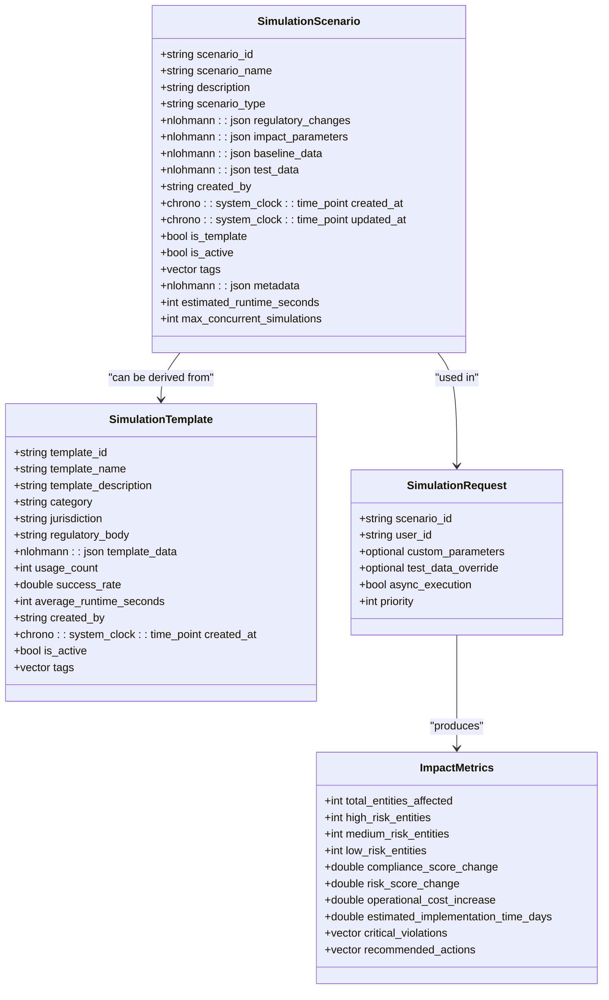
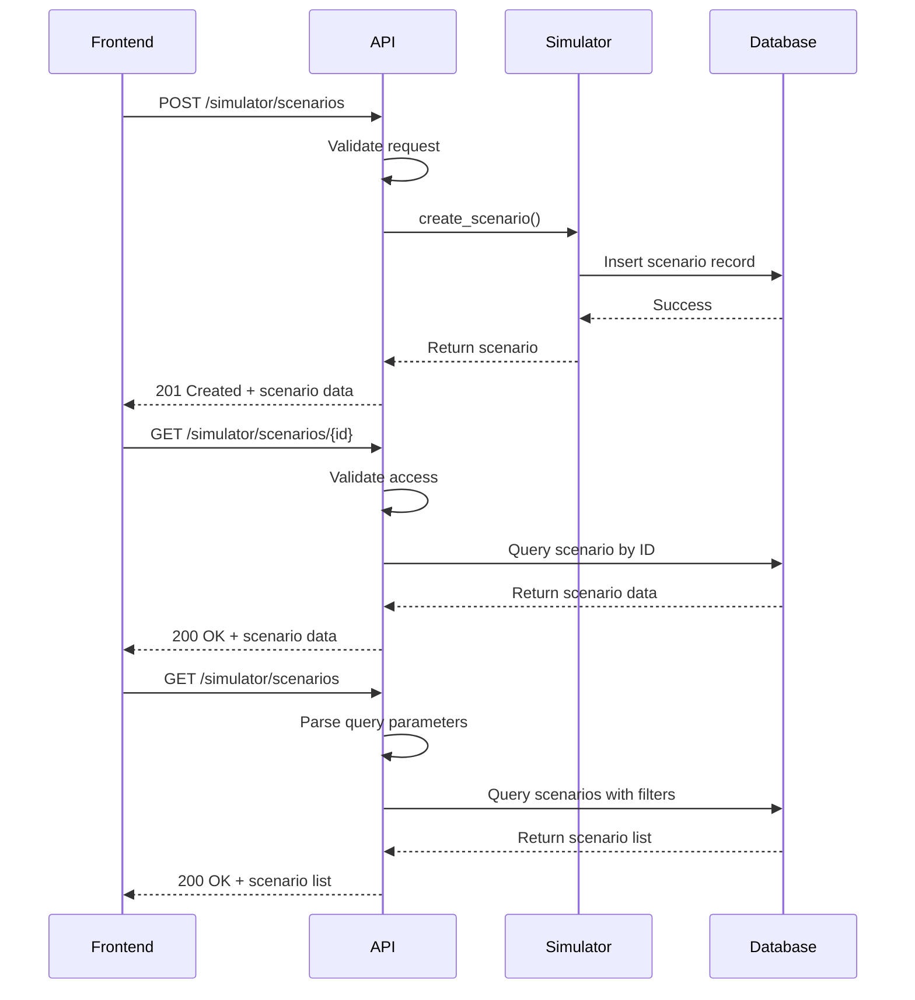
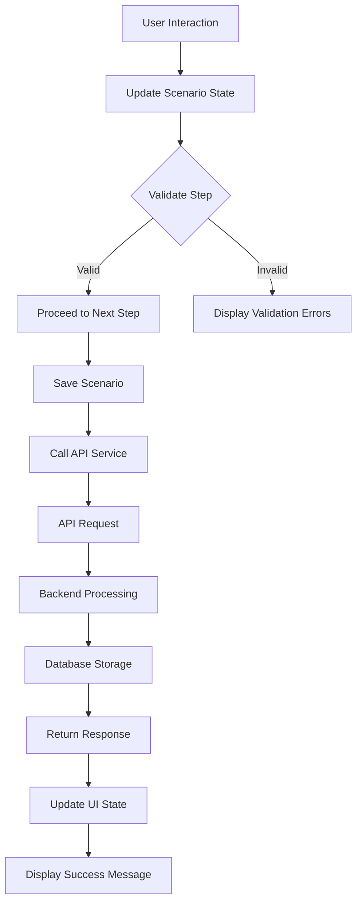
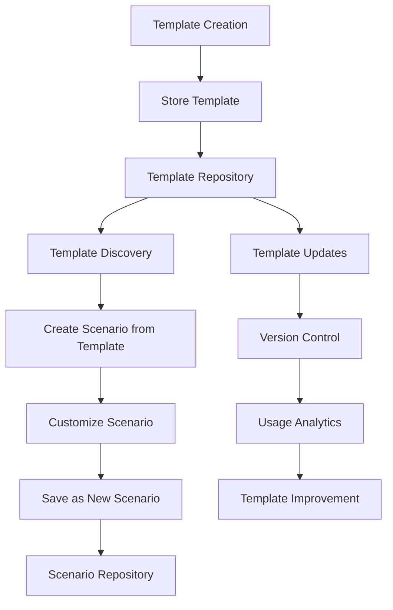

# Scenario Management

<cite>
**Referenced Files in This Document**   
- [simulator_api_handlers.cpp](file://shared/simulator/simulator_api_handlers.cpp)
- [regulatory_simulator.hpp](file://shared/simulator/regulatory_simulator.hpp)
- [schema.sql](file://schema.sql)
- [ScenarioCreation.tsx](file://frontend/src/components/Simulator/ScenarioCreation.tsx)
- [api.ts](file://frontend/src/services/api.ts)
- [useSimulator.ts](file://frontend/src/hooks/useSimulator.ts)
- [api_endpoint_registrations.cpp](file://shared/api_registry/api_endpoint_registrations.cpp)
</cite>

## Table of Contents
1. [Introduction](#introduction)
2. [Domain Model](#domain-model)
3. [Scenario Creation and Configuration](#scenario-creation-and-configuration)
4. [API Interface](#api-interface)
5. [Frontend Integration](#frontend-integration)
6. [Template Management](#template-management)
7. [Error Handling and Concurrency](#error-handling-and-concurrency)
8. [Best Practices](#best-practices)

## Introduction
The Scenario Management sub-feature of the Simulation System enables users to define, configure, and store regulatory simulation scenarios for impact analysis. This comprehensive system supports the creation of complex scenarios involving regulatory changes, market shifts, and operational modifications. The architecture integrates a robust backend API with a sophisticated frontend interface, allowing users to model hypothetical regulatory changes and assess their potential impact on compliance frameworks. The system supports versioning through templates, enabling reuse of proven scenario configurations across different regulatory jurisdictions and business units.

## Domain Model
The domain model for simulation scenarios is centered around the `SimulationScenario` entity, which captures all aspects of a regulatory simulation. Key attributes include scenario metadata, regulatory change variables, impact parameters, and time horizons. The model also incorporates business impact factors through various metrics and scoring systems.

**Diagram sources**
- [regulatory_simulator.hpp](file://shared/simulator/regulatory_simulator.hpp#L42-L199)

**Section sources**
- [regulatory_simulator.hpp](file://shared/simulator/regulatory_simulator.hpp#L42-L199)

## Scenario Creation and Configuration
Scenarios are defined through a structured configuration process that captures regulatory change variables, time horizons, and business impact factors. The system supports multiple scenario types including regulatory change, market change, and operational change. Each scenario includes impact parameters such as risk thresholds, compliance weights, operational weights, and cost weights, which determine how different factors influence the simulation outcomes.

The configuration process follows a multi-step workflow that guides users through scenario definition:
1. Basic information (name, description, type)
2. Regulatory changes (jurisdiction, regulatory body, effective date)
3. Impact parameters (risk thresholds, time horizons)
4. Data configuration (baseline and test data)
5. Review and testing

Scenarios are stored with metadata including creation and update timestamps, approval status, and version information. The system also supports tagging for organizational purposes and allows for the attachment of custom metadata to support advanced filtering and reporting.

**Section sources**
- [ScenarioCreation.tsx](file://frontend/src/components/Simulator/ScenarioCreation.tsx#L0-L406)
- [regulatory_simulator.hpp](file://shared/simulator/regulatory_simulator.hpp#L42-L64)

## API Interface
The simulator API provides a comprehensive REST interface for creating and retrieving scenarios. The API endpoints follow standard REST conventions and are secured with JWT authentication. The primary endpoints for scenario management include:

**Diagram sources**
- [simulator_api_handlers.cpp](file://shared/simulator/simulator_api_handlers.cpp#L149-L179)
- [api_endpoint_registrations.cpp](file://shared/api_registry/api_endpoint_registrations.cpp#L2546-L2561)

**Section sources**
- [simulator_api_handlers.cpp](file://shared/simulator/simulator_api_handlers.cpp#L149-L344)
- [api_endpoint_registrations.cpp](file://shared/api_registry/api_endpoint_registrations.cpp#L2546-L2627)

## Frontend Integration
The frontend implementation in `ScenarioCreation.tsx` provides a rich user interface for creating and configuring simulation scenarios. The component integrates with the backend through the API service layer, using React hooks to manage state and data fetching. The integration follows a clean separation of concerns, with the UI component handling user interactions and the service layer managing API communication.

The frontend uses a step-by-step wizard approach to guide users through the scenario creation process. Each step includes validation to ensure data integrity before proceeding. The component accepts callback functions for save, test, preview, and cancel operations, allowing for flexible integration with different parent components.

**Diagram sources**
- [ScenarioCreation.tsx](file://frontend/src/components/Simulator/ScenarioCreation.tsx#L0-L406)
- [api.ts](file://frontend/src/services/api.ts#L0-L199)

**Section sources**
- [ScenarioCreation.tsx](file://frontend/src/components/Simulator/ScenarioCreation.tsx#L0-L406)
- [api.ts](file://frontend/src/services/api.ts#L0-L199)

## Template Management
The system integrates with the Configuration Management system through simulation templates, enabling versioning and reuse of scenario configurations. Templates are pre-configured scenarios that capture best practices and regulatory requirements for specific jurisdictions and regulatory bodies. Users can create new scenarios from templates, inheriting the template's configuration while allowing for customization.

Template management includes:
- Template creation and versioning
- Usage tracking and performance metrics
- Category-based organization (AML, KYC, fraud, privacy, reporting)
- Jurisdiction-specific templates
- Public and private template sharing

The template system supports organizational knowledge sharing and ensures consistency in scenario design across different teams and business units. Templates can be updated and versioned, with usage statistics tracking their effectiveness and adoption across the organization.

**Diagram sources**
- [regulatory_simulator.hpp](file://shared/simulator/regulatory_simulator.hpp#L142-L199)
- [api_endpoint_registrations.cpp](file://shared/api_registry/api_endpoint_registrations.cpp#L2700-L2716)

**Section sources**
- [regulatory_simulator.hpp](file://shared/simulator/regulatory_simulator.hpp#L142-L199)
- [api_endpoint_registrations.cpp](file://shared/api_registry/api_endpoint_registrations.cpp#L2700-L2716)

## Error Handling and Concurrency
The system implements comprehensive error handling for scenario management operations. Parameter validation occurs at multiple levels, including frontend validation in the React components and backend validation in the API handlers. Validation errors are communicated to users with descriptive messages to guide correction.

For concurrency during scenario editing, the system employs several strategies:
- Optimistic locking using timestamp-based versioning
- Rate limiting for simulation execution (429 responses when limits are exceeded)
- Access control validation for scenario modification
- Transactional database operations to ensure data consistency

Common issues and their handling:
- **Parameter validation failures**: Frontend validation prevents submission of invalid data, while backend validation provides additional protection and returns 400 Bad Request responses with specific error messages
- **Concurrency during editing**: The system uses last-write-wins semantics with timestamp tracking, allowing users to see when a scenario was last updated
- **Rate limiting**: Simulation execution is rate-limited to prevent system overload, with 429 responses returned when limits are exceeded
- **Access denied**: Scenario access is validated against user permissions, with 404 responses returned for unauthorized access attempts

**Section sources**
- [simulator_api_handlers.cpp](file://shared/simulator/simulator_api_handlers.cpp#L149-L179)
- [ScenarioCreation.tsx](file://frontend/src/components/Simulator/ScenarioCreation.tsx#L0-L406)

## Best Practices
When structuring complex scenarios involving multiple agents and decision pathways, consider the following best practices:

1. **Modular Design**: Break complex scenarios into smaller, reusable components that can be combined as needed
2. **Template Utilization**: Leverage existing templates as starting points for new scenarios to ensure consistency and reduce configuration errors
3. **Parameterization**: Use custom parameters to make scenarios flexible and adaptable to different contexts
4. **Validation Testing**: Always test scenarios with the built-in test functionality before finalizing
5. **Documentation**: Include comprehensive descriptions and metadata to support future reuse and understanding
6. **Version Control**: Use the template system to version and track changes to important scenarios
7. **Performance Considerations**: Set appropriate estimated runtime values and concurrency limits based on scenario complexity
8. **Collaboration**: Use tags and shared templates to facilitate collaboration across teams

For scenarios involving multiple agents and decision pathways:
- Define clear decision criteria and thresholds
- Model agent interactions and dependencies explicitly
- Use the impact parameters to weight different factors appropriately
- Test edge cases and boundary conditions
- Document assumptions and limitations in the scenario description
- Consider creating specialized templates for common multi-agent scenarios

**Section sources**
- [ScenarioCreation.tsx](file://frontend/src/components/Simulator/ScenarioCreation.tsx#L0-L406)
- [regulatory_simulator.hpp](file://shared/simulator/regulatory_simulator.hpp#L42-L199)