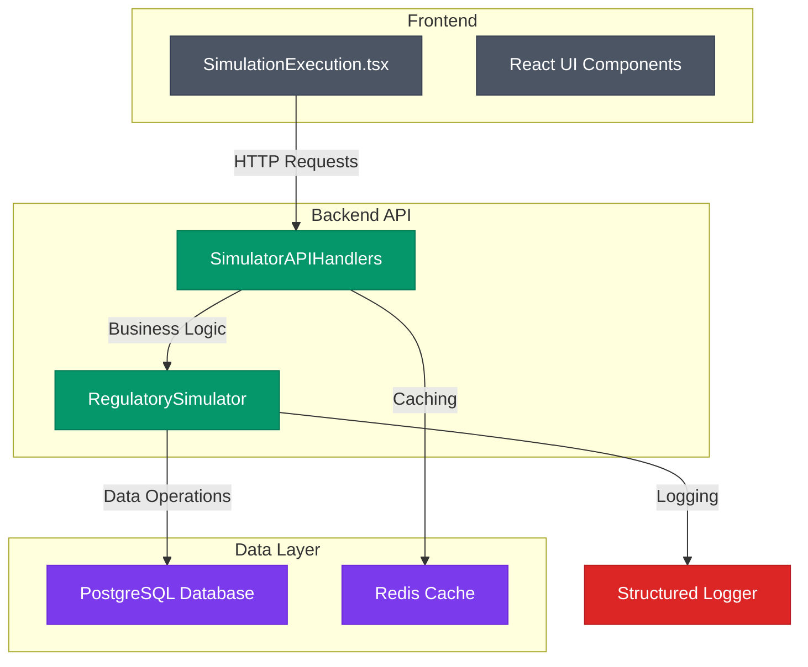
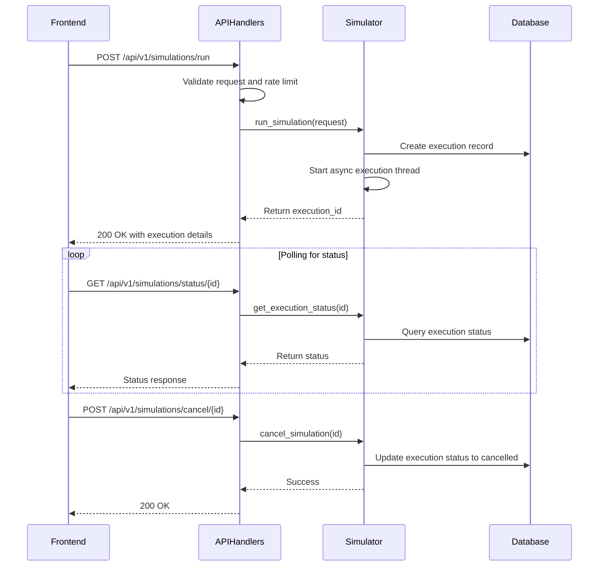
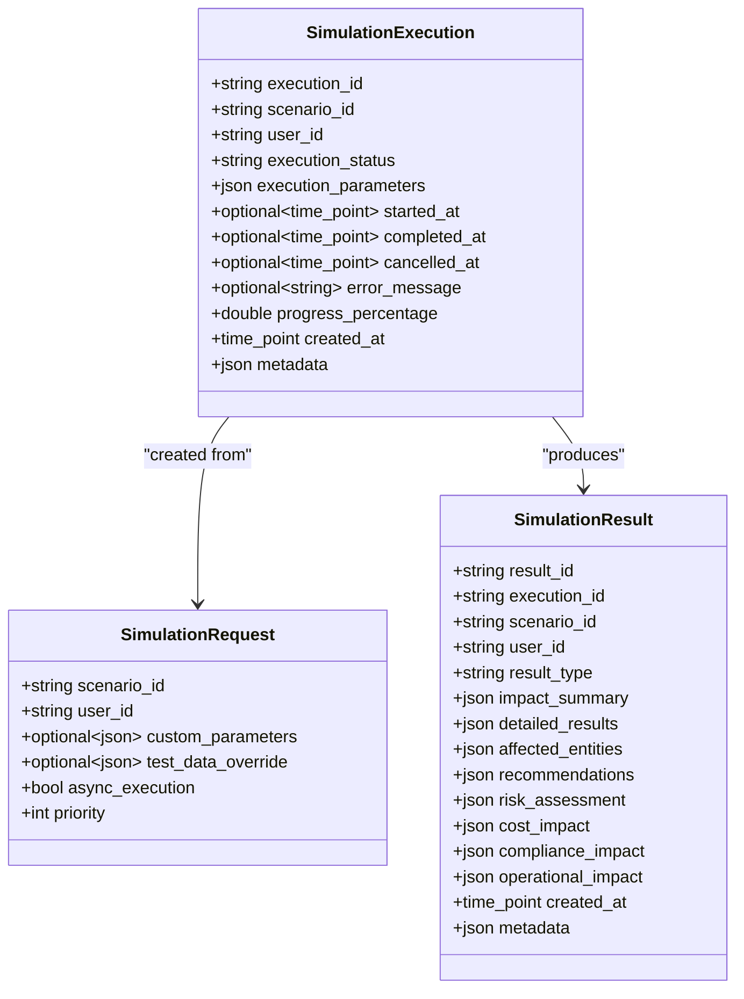
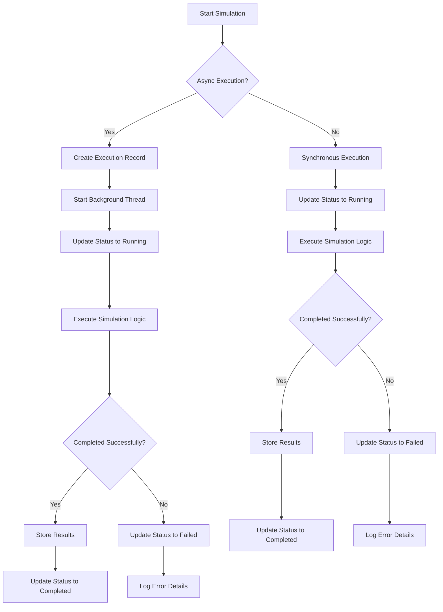
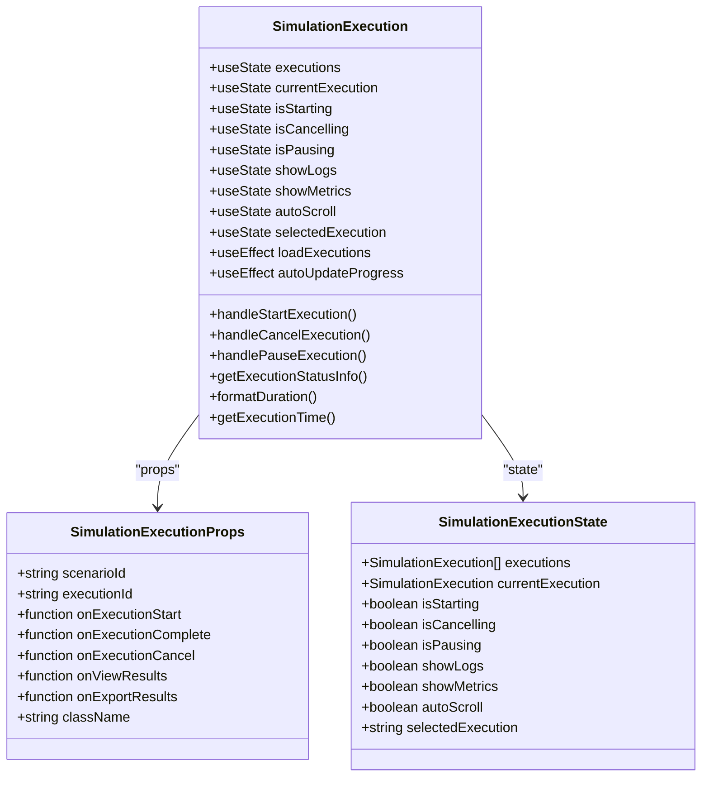
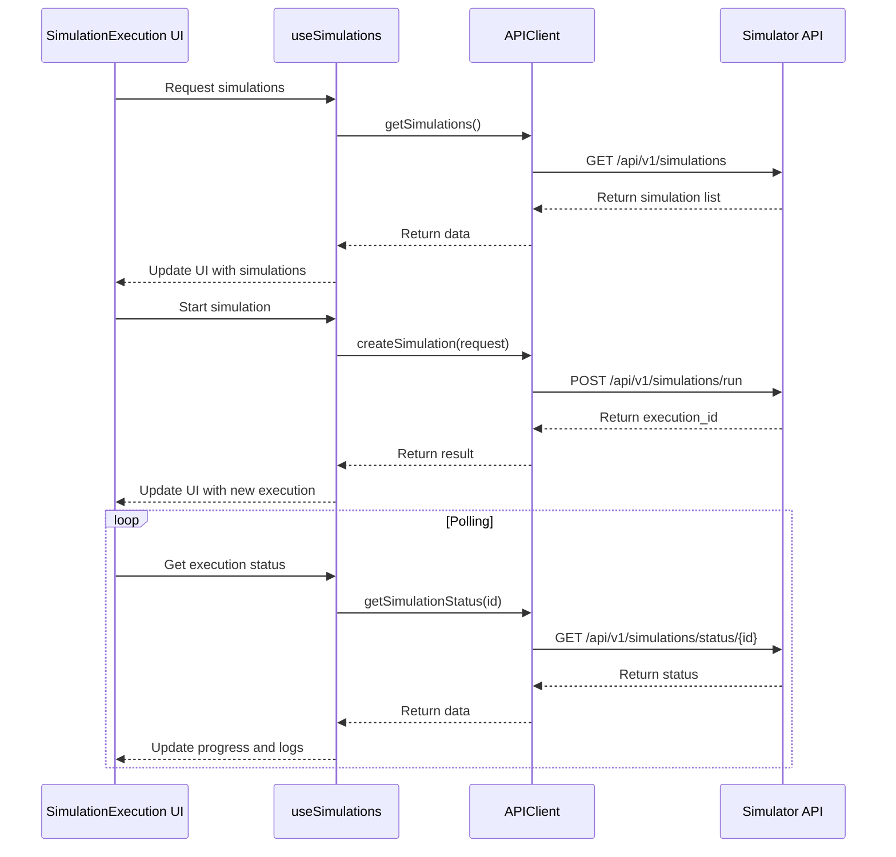
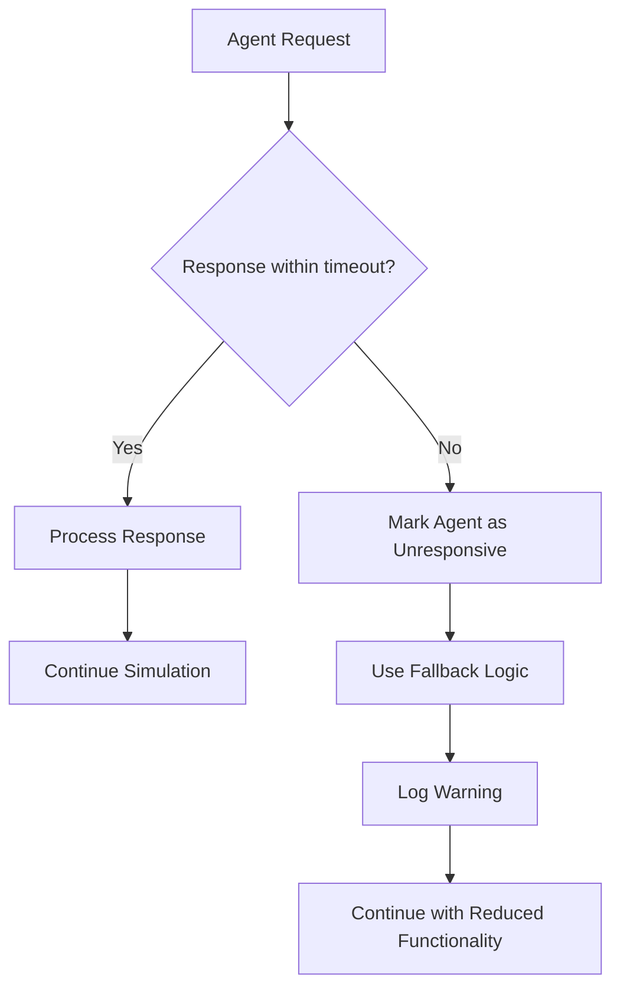
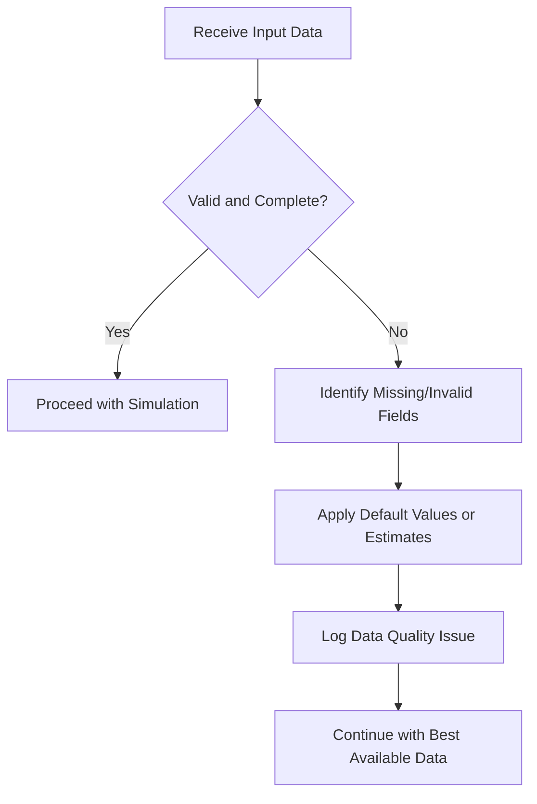
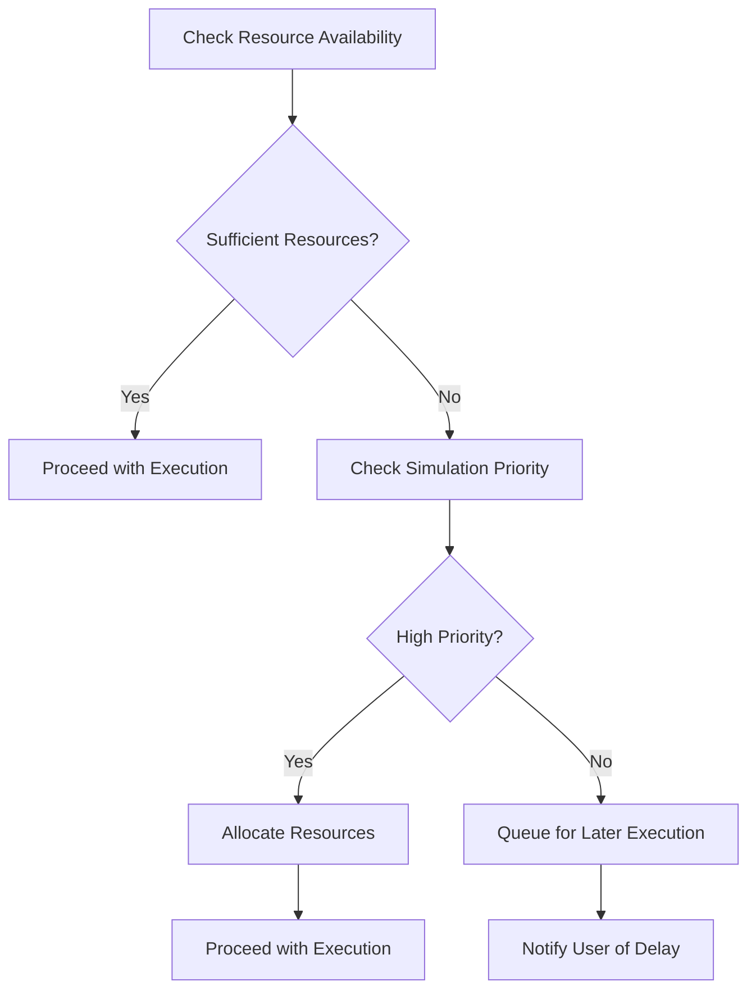
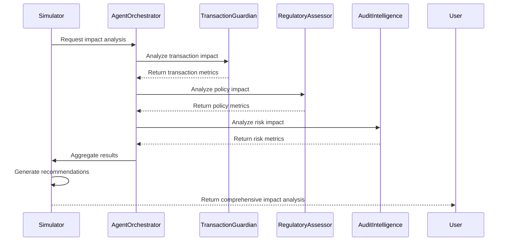

# Simulation Execution Engine

<cite>
**Referenced Files in This Document**   
- [regulatory_simulator.cpp](file://shared/simulator/regulatory_simulator.cpp)
- [regulatory_simulator.hpp](file://shared/simulator/regulatory_simulator.hpp)
- [simulator_api_handlers.cpp](file://shared/simulator/simulator_api_handlers.cpp)
- [simulator_api_handlers.hpp](file://shared/simulator/simulator_api_handlers.hpp)
- [SimulationExecution.tsx](file://frontend/src/components/Simulator/SimulationExecution.tsx)
- [schema.sql](file://schema.sql)
- [api.ts](file://frontend/src/services/api.ts)
</cite>

## Table of Contents
1. [Introduction](#introduction)
2. [Architecture Overview](#architecture-overview)
3. [Simulation Lifecycle Management](#simulation-lifecycle-management)
4. [Execution Context and Resource Management](#execution-context-and-resource-management)
5. [Frontend Integration](#frontend-integration)
6. [Error Handling and Recovery](#error-handling-and-recovery)
7. [Performance Optimization](#performance-optimization)
8. [Integration with Agent System](#integration-with-agent-system)
9. [Conclusion](#conclusion)

## Introduction

The Simulation Execution Engine is a core component of the Regulens platform, responsible for orchestrating scenario execution for regulatory impact analysis. This engine enables users to simulate hypothetical regulatory changes and assess their potential impact on compliance frameworks, risk profiles, and operational processes. The system supports both synchronous and asynchronous execution models, providing real-time monitoring and control capabilities through a comprehensive API interface.

The engine is designed to handle complex simulation scenarios involving multiple data sources, regulatory changes, and business processes. It integrates with the Agent System and Decision Engine to simulate realistic decision-making under hypothetical conditions, providing organizations with valuable insights for strategic planning and risk mitigation.

**Section sources**
- [regulatory_simulator.cpp](file://shared/simulator/regulatory_simulator.cpp#L1-L50)
- [regulatory_simulator.hpp](file://shared/simulator/regulatory_simulator.hpp#L1-L50)

## Architecture Overview

The Simulation Execution Engine follows a modular architecture with clear separation of concerns between the core simulation logic, API handlers, and database interactions. The system is built around three primary components: the RegulatorySimulator class, the SimulatorAPIHandlers class, and the frontend SimulationExecution component.

**Diagram sources**
- [regulatory_simulator.cpp](file://shared/simulator/regulatory_simulator.cpp#L1-L50)
- [simulator_api_handlers.cpp](file://shared/simulator/simulator_api_handlers.cpp#L1-L50)
- [SimulationExecution.tsx](file://frontend/src/components/Simulator/SimulationExecution.tsx#L1-L50)

The engine's architecture is designed for scalability and reliability, with support for concurrent simulations, rate limiting, and comprehensive error handling. The system uses PostgreSQL for persistent storage of simulation scenarios, executions, and results, while Redis is used for caching analytics data to improve performance.

**Section sources**
- [regulatory_simulator.cpp](file://shared/simulator/regulatory_simulator.cpp#L1-L100)
- [regulatory_simulator.hpp](file://shared/simulator/regulatory_simulator.hpp#L1-L100)

## Simulation Lifecycle Management

The Simulation Execution Engine provides a comprehensive API for managing the complete lifecycle of simulation scenarios, from creation to execution and result retrieval. The lifecycle is orchestrated through a series of well-defined API endpoints that control the various states of simulation execution.

### API Endpoints for Simulation Control

The simulator_api_handlers.cpp file implements REST API endpoints that control the simulation lifecycle. These endpoints handle the creation, execution, monitoring, and cancellation of simulations:

**Diagram sources**
- [simulator_api_handlers.cpp](file://shared/simulator/simulator_api_handlers.cpp#L1196-L1225)
- [regulatory_simulator.cpp](file://shared/simulator/regulatory_simulator.cpp#L109-L141)

The simulation lifecycle consists of several distinct states:
- **Pending**: The simulation has been created but not yet started
- **Running**: The simulation is actively processing
- **Completed**: The simulation has finished successfully
- **Failed**: The simulation encountered an error during execution
- **Cancelled**: The simulation was manually cancelled by a user
- **Paused**: The simulation has been temporarily suspended

The engine supports both synchronous and asynchronous execution modes, allowing users to choose the appropriate model based on their requirements. For long-running simulations, the asynchronous mode is recommended to prevent timeouts and provide better user experience.

**Section sources**
- [regulatory_simulator.cpp](file://shared/simulator/regulatory_simulator.cpp#L109-L141)
- [simulator_api_handlers.cpp](file://shared/simulator/simulator_api_handlers.cpp#L449-L486)

## Execution Context and Resource Management

The Simulation Execution Engine implements robust execution context isolation and resource management to ensure reliable operation, especially for long-running simulations. The system is designed to handle resource constraints and prevent individual simulations from impacting the overall system performance.

### Execution Context Isolation

Each simulation execution runs in an isolated context with its own execution parameters, progress tracking, and error handling. The RegulatorySimulator class manages execution records in the database, ensuring that each simulation has a unique execution ID and maintains its state independently:

**Diagram sources**
- [regulatory_simulator.hpp](file://shared/simulator/regulatory_simulator.hpp#L42-L64)

### Resource Management and Timeout Handling

The engine implements comprehensive resource management strategies to handle long-running simulations efficiently. Key features include:

1. **Thread Management**: Asynchronous simulations are executed in separate threads to prevent blocking the main application
2. **Progress Tracking**: Regular progress updates are stored in the database to provide real-time feedback
3. **Timeout Handling**: Configurable timeout settings prevent simulations from running indefinitely
4. **Memory Management**: Efficient data structures and cleanup routines minimize memory usage

The system uses a configurable timeout mechanism to prevent simulations from running indefinitely. The default timeout is set to 3600 seconds (1 hour), but this can be adjusted based on the specific requirements of different simulation scenarios.

**Diagram sources**
- [regulatory_simulator.cpp](file://shared/simulator/regulatory_simulator.cpp#L109-L141)
- [regulatory_simulator.hpp](file://shared/simulator/regulatory_simulator.hpp#L42-L64)

**Section sources**
- [regulatory_simulator.cpp](file://shared/simulator/regulatory_simulator.cpp#L109-L141)
- [regulatory_simulator.hpp](file://shared/simulator/regulatory_simulator.hpp#L42-L64)

## Frontend Integration

The Simulation Execution Engine is tightly integrated with the frontend through the SimulationExecution component, which provides a user-friendly interface for managing simulations. The component communicates with the backend API to control simulation lifecycle and display real-time execution status.

### Component Architecture

The SimulationExecution component is implemented as a React functional component that manages the state of simulation executions and provides controls for users to interact with the simulation engine:

**Diagram sources**
- [SimulationExecution.tsx](file://frontend/src/components/Simulator/SimulationExecution.tsx#L0-L41)

### API Integration

The frontend communicates with the backend through the APIClient class, which handles HTTP requests, authentication, and error handling. The useSimulations hook provides a React Query interface for managing simulation data:

**Diagram sources**
- [SimulationExecution.tsx](file://frontend/src/components/Simulator/SimulationExecution.tsx#L0-L817)
- [api.ts](file://frontend/src/services/api.ts#L0-L1550)
- [useSimulations.ts](file://frontend/src/hooks/useSimulations.ts#L0-L28)

The frontend implementation includes several key features:
- Real-time progress monitoring with percentage completion
- Detailed execution logs with filtering and search capabilities
- Performance metrics visualization (CPU, memory, network usage)
- Control buttons for starting, pausing, resuming, and cancelling simulations
- Results viewing and export functionality

**Section sources**
- [SimulationExecution.tsx](file://frontend/src/components/Simulator/SimulationExecution.tsx#L0-L817)
- [api.ts](file://frontend/src/services/api.ts#L0-L1550)

## Error Handling and Recovery

The Simulation Execution Engine implements comprehensive error handling and recovery mechanisms to ensure reliability and data integrity. The system is designed to gracefully handle various failure scenarios, including agent unresponsiveness, data inconsistencies, and resource constraints.

### Failure Modes and Recovery Mechanisms

The engine identifies and handles several common execution failures:

1. **Agent Unresponsiveness**: When an agent fails to respond within the expected timeframe, the system implements timeout mechanisms and fallback strategies:

2. **Data Inconsistencies**: When input data contains inconsistencies or missing values, the system applies data validation and cleansing:

3. **Resource Exhaustion**: When system resources are constrained, the engine implements throttling and prioritization:

The engine uses a structured error handling approach with specific error codes and messages that are logged and reported to the frontend. Critical errors trigger notifications to system administrators, while recoverable errors are handled transparently with appropriate fallback mechanisms.

**Section sources**
- [regulatory_simulator.cpp](file://shared/simulator/regulatory_simulator.cpp#L109-L141)
- [regulatory_simulator.cpp](file://shared/simulator/regulatory_simulator.cpp#L935-L935)
- [simulator_api_handlers.cpp](file://shared/simulator/simulator_api_handlers.cpp#L1196-L1225)

## Performance Optimization

The Simulation Execution Engine incorporates several performance optimization strategies to ensure efficient execution, particularly for complex scenarios with large datasets. These optimizations focus on memory usage, computational efficiency, and response times.

### Memory Usage Optimization

The engine implements several strategies to minimize memory consumption:

1. **Efficient Data Structures**: Using optimized data structures like vectors and hash maps for fast access and minimal memory overhead
2. **Streaming Processing**: Processing large datasets in chunks rather than loading everything into memory at once
3. **Object Pooling**: Reusing objects to reduce allocation and garbage collection overhead
4. **Lazy Loading**: Loading data only when needed rather than pre-loading all data

### Computational Efficiency

The system employs various techniques to improve computational efficiency:

1. **Parallel Processing**: Utilizing multiple threads for independent tasks
2. **Caching**: Storing frequently accessed data and computation results
3. **Algorithm Optimization**: Using efficient algorithms with optimal time complexity
4. **Batch Operations**: Grouping database operations to reduce round trips

The engine's performance characteristics are monitored through comprehensive metrics collection, including:
- Execution time
- Memory usage
- CPU utilization
- Database query performance
- Network I/O

These metrics are stored in the database and can be accessed through analytics endpoints for performance analysis and optimization.

**Section sources**
- [regulatory_simulator.cpp](file://shared/simulator/regulatory_simulator.cpp#L1-L935)
- [regulatory_simulator.hpp](file://shared/simulator/regulatory_simulator.hpp#L1-L225)

## Integration with Agent System

The Simulation Execution Engine is designed to work seamlessly with the Agent System and Decision Engine to simulate realistic decision-making under hypothetical conditions. This integration enables comprehensive impact analysis by leveraging the specialized capabilities of different agents.

### Agent Coordination Workflow

The engine coordinates with multiple agents to perform various aspects of the simulation:

**Diagram sources**
- [regulatory_simulator.cpp](file://shared/simulator/regulatory_simulator.cpp#L935-L935)
- [regulatory_simulator.cpp](file://shared/simulator/regulatory_simulator.cpp#L1-L935)

The integration allows for:
- **Specialized Analysis**: Each agent focuses on its area of expertise (transactions, policies, risk)
- **Consensus Building**: Combining insights from multiple agents for comprehensive analysis
- **Realistic Simulation**: Mimicking actual decision-making processes in the organization
- **Cross-Validation**: Verifying results across different agent perspectives

The engine uses a publish-subscribe pattern for communication with agents, allowing for loose coupling and flexible configuration. Agents can be added or removed from the simulation workflow without modifying the core engine logic.

**Section sources**
- [regulatory_simulator.cpp](file://shared/simulator/regulatory_simulator.cpp#L935-L935)
- [regulatory_simulator.cpp](file://shared/simulator/regulatory_simulator.cpp#L1-L935)

## Conclusion

The Simulation Execution Engine is a robust and scalable component that provides comprehensive capabilities for simulating regulatory impact scenarios. Its modular architecture, comprehensive API, and tight integration with the Agent System make it a powerful tool for compliance planning and risk assessment.

Key strengths of the engine include:
- Support for both synchronous and asynchronous execution models
- Comprehensive lifecycle management with real-time monitoring
- Robust error handling and recovery mechanisms
- Efficient resource management for long-running simulations
- Seamless integration with specialized agents for realistic decision-making simulation
- Performance optimizations for handling complex scenarios

The engine's design prioritizes reliability, scalability, and usability, making it suitable for production environments with demanding requirements. Future enhancements could include support for more sophisticated simulation models, enhanced visualization capabilities, and integration with additional data sources.

**Section sources**
- [regulatory_simulator.cpp](file://shared/simulator/regulatory_simulator.cpp#L1-L935)
- [regulatory_simulator.hpp](file://shared/simulator/regulatory_simulator.hpp#L1-L225)
- [simulator_api_handlers.cpp](file://shared/simulator/simulator_api_handlers.cpp#L1-L1259)
- [SimulationExecution.tsx](file://frontend/src/components/Simulator/SimulationExecution.tsx#L0-L817)