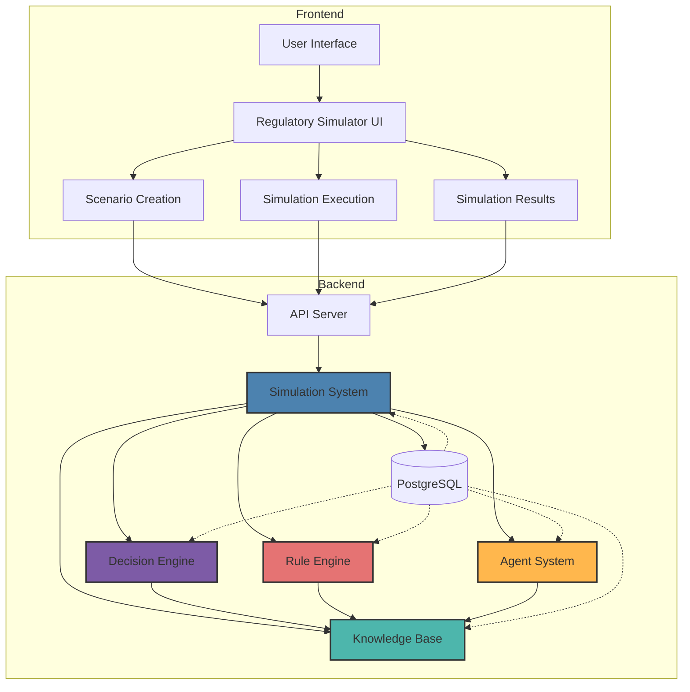
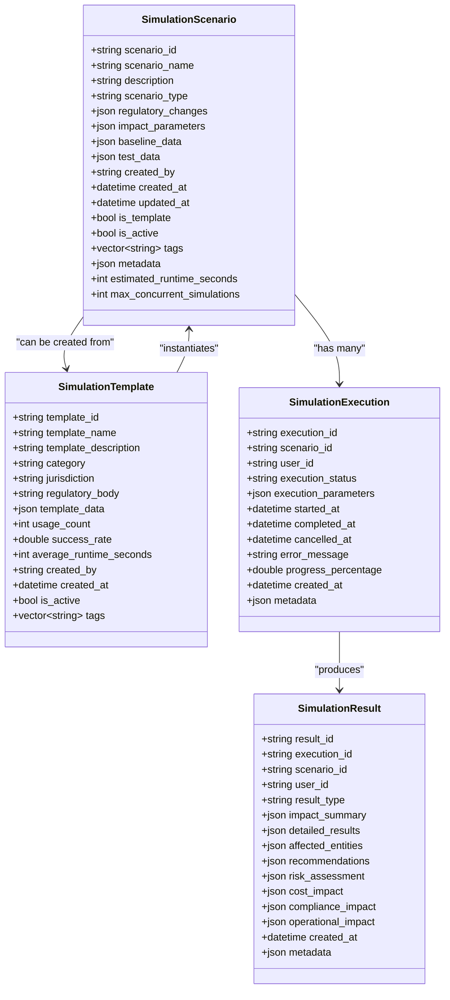
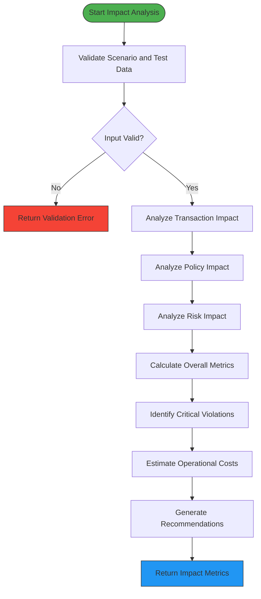
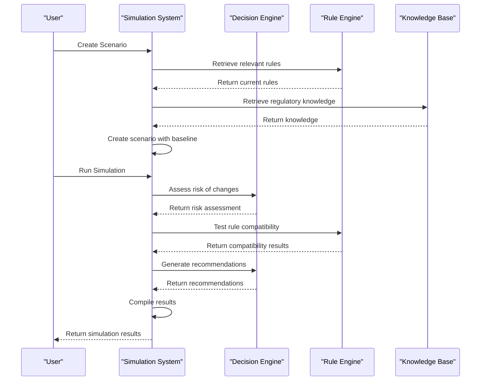
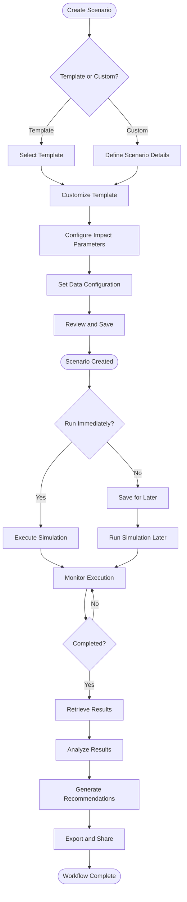
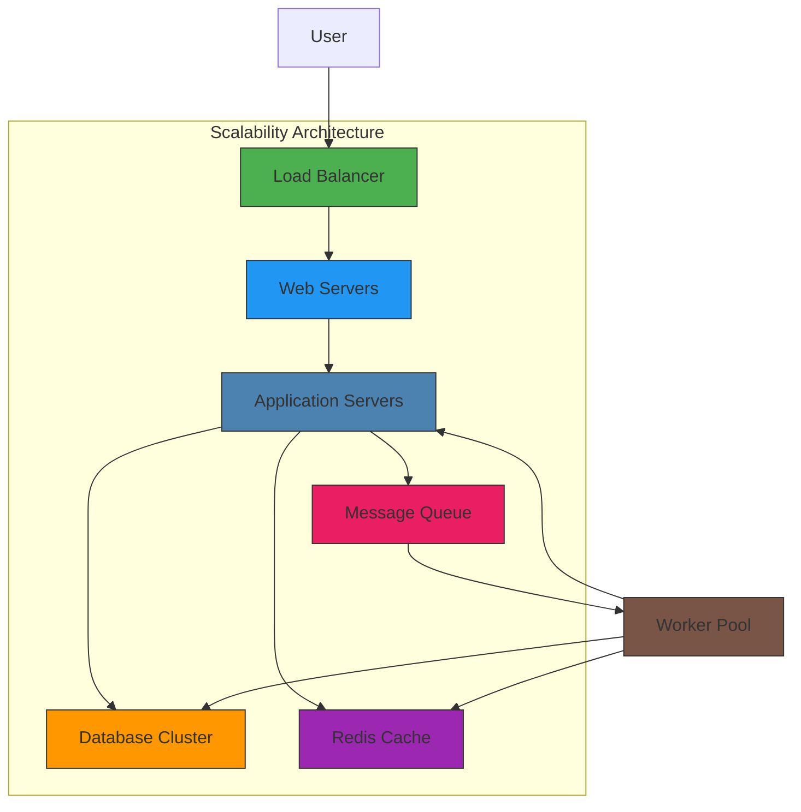
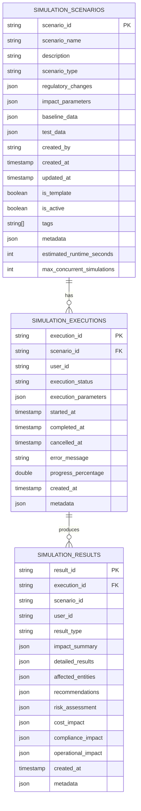

# Simulation System

<cite>
**Referenced Files in This Document**   
- [regulatory_simulator.hpp](file://shared/simulator/regulatory_simulator.hpp)
- [regulatory_simulator.cpp](file://shared/simulator/regulatory_simulator.cpp)
- [simulator_api_handlers.hpp](file://shared/simulator/simulator_api_handlers.hpp)
- [simulator_api_handlers.cpp](file://shared/simulator/simulator_api_handlers.cpp)
- [RegulatorySimulator.tsx](file://frontend/src/pages/RegulatorySimulator.tsx)
- [ScenarioCreation.tsx](file://frontend/src/components/Simulator/ScenarioCreation.tsx)
- [SimulationExecution.tsx](file://frontend/src/components/Simulator/SimulationExecution.tsx)
- [SimulationResults.tsx](file://frontend/src/components/Simulator/SimulationResults.tsx)
- [useSimulator.ts](file://frontend/src/hooks/useSimulator.ts)
- [schema.sql](file://schema.sql)
</cite>

## Table of Contents
1. [Introduction](#introduction)
2. [System Context](#system-context)
3. [Scenario Management System](#scenario-management-system)
4. [Impact Analysis Algorithms](#impact-analysis-algorithms)
5. [Result Visualization Components](#result-visualization-components)
6. [Integration with Decision Engine and Rule Engine](#integration-with-decision-engine-and-rule-engine)
7. [Simulation Workflow](#simulation-workflow)
8. [Scalability Considerations](#scalability-considerations)
9. [Configuration Options](#configuration-options)
10. [Conclusion](#conclusion)

## Introduction

The Simulation System provides a comprehensive regulatory impact simulation capability that enables organizations to analyze the potential effects of hypothetical regulatory changes on their compliance frameworks. This production-grade what-if analysis system offers a complete workflow for creating, executing, and analyzing simulation scenarios with detailed impact assessment.

The system is designed to support various types of regulatory changes, market conditions, and operational modifications, providing stakeholders with actionable insights and recommendations. By simulating regulatory changes before implementation, organizations can proactively identify compliance gaps, assess risk exposure, estimate implementation costs, and develop mitigation strategies.

The Simulation System integrates seamlessly with the broader regulatory intelligence platform, leveraging the knowledge base, agent system, and frontend interface to provide a cohesive user experience. The system supports both template-based and custom scenario creation, allowing users to quickly launch simulations based on proven patterns or create bespoke analyses for unique situations.

**Section sources**
- [regulatory_simulator.hpp](file://shared/simulator/regulatory_simulator.hpp#L1-L25)
- [RegulatorySimulator.tsx](file://frontend/src/pages/RegulatorySimulator.tsx#L1-L50)

## System Context

The Simulation System operates as a core component within the broader regulatory intelligence platform, interacting with multiple subsystems to provide comprehensive regulatory impact analysis. The system serves as a bridge between regulatory knowledge, decision-making engines, and user-facing interfaces, enabling stakeholders to understand the implications of regulatory changes.

**Diagram sources**
- [regulatory_simulator.hpp](file://shared/simulator/regulatory_simulator.hpp#L1-L225)
- [RegulatorySimulator.tsx](file://frontend/src/pages/RegulatorySimulator.tsx#L1-L769)
- [schema.sql](file://schema.sql#L1-L100)

**Section sources**
- [regulatory_simulator.hpp](file://shared/simulator/regulatory_simulator.hpp#L1-L25)
- [RegulatorySimulator.tsx](file://frontend/src/pages/RegulatorySimulator.tsx#L1-L50)

## Scenario Management System

The Scenario Management System provides a comprehensive framework for creating, organizing, and managing regulatory simulation scenarios. The system supports both custom scenario creation and template-based instantiation, enabling users to quickly launch simulations based on proven patterns or create bespoke analyses for unique situations.

The core data model revolves around the `SimulationScenario` structure, which encapsulates all relevant information about a simulation scenario including its name, description, type, regulatory changes, impact parameters, baseline data, test data, and metadata. Scenarios can be categorized by type (regulatory_change, market_change, operational_change) and tagged for easy organization and retrieval.

The system provides a comprehensive API for scenario management, including operations for creating, retrieving, updating, and deleting scenarios. Users can also manage simulation templates, which serve as reusable blueprints for common simulation types. Templates are categorized by domain (AML, KYC, fraud, privacy, reporting) and jurisdiction, making it easy to find relevant starting points for new simulations.

The frontend interface provides an intuitive multi-step wizard for scenario creation, guiding users through the process of defining basic information, regulatory changes, impact parameters, and data configuration. The interface supports both form-based and JSON editing modes, catering to users with different technical expertise levels.

**Section sources**
- [regulatory_simulator.hpp](file://shared/simulator/regulatory_simulator.hpp#L226-L450)
- [simulator_api_handlers.hpp](file://shared/simulator/simulator_api_handlers.hpp#L1-L115)
- [ScenarioCreation.tsx](file://frontend/src/components/Simulator/ScenarioCreation.tsx#L1-L1083)

## Impact Analysis Algorithms

The Impact Analysis Algorithms form the core computational engine of the Simulation System, responsible for assessing the potential effects of regulatory changes on an organization's operations. These algorithms employ a multi-dimensional approach to impact assessment, evaluating compliance, risk, operational, and financial implications across various entity types.

The primary algorithm is implemented in the `analyze_regulatory_impact` method of the `RegulatorySimulator` class, which orchestrates the analysis across different data domains. The algorithm follows a modular design, with specialized methods for analyzing transaction impact, policy impact, and risk impact, allowing for extensibility and maintainability.

The transaction impact analysis evaluates how regulatory changes affect transaction processing by examining factors such as transaction amount limits, high-risk country lists, and customer risk profiles. The algorithm identifies transactions that would be impacted by the proposed changes and categorizes them by risk level (high, medium, low).

The policy impact analysis assesses the compatibility of existing policies with new regulatory requirements, identifying areas that need updating or revision. This analysis considers both new requirements that must be addressed and deprecated requirements that should be removed from existing policies.

The risk impact analysis evaluates the overall risk profile changes resulting from regulatory modifications, considering factors such as risk weightings, monitoring requirements, and reporting obligations. This analysis helps organizations understand how their risk exposure might change under the new regulatory regime.

The system also implements a recommendation generation engine that produces actionable insights based on the impact analysis results. These recommendations are tailored to the specific findings of the simulation and cover areas such as enhanced monitoring, staff training, technology investments, and implementation planning.

**Section sources**
- [regulatory_simulator.cpp](file://shared/simulator/regulatory_simulator.cpp#L1-L935)
- [regulatory_simulator.hpp](file://shared/simulator/regulatory_simulator.hpp#L451-L500)

## Result Visualization Components

The Result Visualization Components provide a comprehensive interface for exploring and interpreting simulation results, transforming complex data into actionable insights. The system offers multiple views and visualization types to cater to different user needs and analytical requirements.

The primary visualization is the Simulation Results dashboard, which presents a multi-tab interface allowing users to explore different aspects of the simulation outcomes. The dashboard includes an executive summary with key metrics, detailed impact analysis, compliance assessment, risk evaluation, cost impact analysis, and recommended actions.

```mermaid
graph TD
subgraph "Simulation Results Dashboard"
Overview[Overview Tab]
Impact[Impact Analysis Tab]
Compliance[Compliance Tab]
Risk[Risk Assessment Tab]
Cost[Cost Impact Tab]
Recommendations[Recommendations Tab]
end
subgraph "Overview Tab"
A[Key Metrics Cards]
B[Executive Summary]
C[Detailed Metrics]
end
subgraph "Impact Analysis Tab"
D[Regulatory Changes List]
E[Entity Breakdown]
F[Process Changes]
end
subgraph "Compliance Tab"
G[Compliance Score Comparison]
H[Compliance Gaps]
I[Remediation Steps]
end
subgraph "Risk Assessment Tab"
J[Risk Score]
K[Critical Risks]
L[Risk Mitigation]
end
subgraph "Cost Impact Tab"
M[Cost Breakdown]
N[ROI Projection]
O[Breakeven Analysis]
end
subgraph "Recommendations Tab"
P[High Priority Actions]
Q[Implementation Timeline]
R[Resource Allocation]
end
Overview --> A
Overview --> B
Overview --> C
Impact --> D
Impact --> E
Impact --> F
Compliance --> G
Compliance --> H
Compliance --> I
Risk --> J
Risk --> K
Risk --> L
Cost --> M
Cost --> N
Cost --> O
Recommendations --> P
Recommendations --> Q
Recommendations --> R
```

The system employs a variety of visualization techniques to present the results effectively. Key metrics are displayed using metric cards with trend indicators, showing changes in entities affected, compliance scores, risk exposure, and operational costs. The executive summary provides a narrative overview of the findings, highlighting the most significant impacts and recommendations.

For detailed analysis, the system uses lists and tables to present regulatory changes, compliance gaps, critical risks, and recommended actions. Each item includes relevant details such as impact scores, affected entities, cost implications, and priority levels. The interface supports filtering and sorting to help users focus on the most relevant information.

The results visualization also includes metadata about the simulation execution, such as execution time, data quality score, and confidence level, providing context for interpreting the results. This transparency helps users assess the reliability of the simulation outcomes and make informed decisions based on the findings.

**Section sources**
- [SimulationResults.tsx](file://frontend/src/components/Simulator/SimulationResults.tsx#L1-L917)
- [regulatory_simulator.hpp](file://shared/simulator/regulatory_simulator.hpp#L501-L550)

## Integration with Decision Engine and Rule Engine

The Simulation System integrates closely with the Decision Engine and Rule Engine to provide predictive modeling capabilities and ensure alignment with the organization's decision-making frameworks. This integration enables the simulation of regulatory changes within the context of existing business rules and decision logic, providing more accurate and actionable results.

The integration with the Decision Engine allows the Simulation System to leverage advanced multi-criteria decision analysis (MCDA) techniques when assessing the impact of regulatory changes. The Decision Engine provides risk assessment, confidence scoring, and recommendation generation capabilities that enhance the simulation's analytical depth.

The integration with the Rule Engine enables the Simulation System to test the compatibility of proposed regulatory changes with existing business rules. The system can identify rules that would be affected by the changes, assess whether they need modification, and estimate the effort required to update them. This capability helps organizations understand the operational impact of regulatory changes on their automated decision-making processes.

The Simulation System also leverages the Knowledge Base to enrich its analysis with regulatory context and historical precedents. By accessing relevant regulatory documents, interpretations, and past decisions, the system can provide more nuanced and informed impact assessments.

These integrations create a closed-loop system where simulation results can inform updates to business rules and decision models. When a simulation identifies compliance gaps or operational challenges, the insights can be used to refine the organization's rule sets and decision criteria, creating a continuous improvement cycle.

**Section sources**
- [regulatory_simulator.cpp](file://shared/simulator/regulatory_simulator.cpp#L1-L935)
- [agentic_orchestrator.hpp](file://shared/agentic_brain/agentic_orchestrator.hpp#L1-L322)
- [decision_engine.hpp](file://shared/agentic_brain/decision_engine.hpp#L1-L140)

## Simulation Workflow

The Simulation Workflow defines the end-to-end process for creating, executing, and analyzing regulatory impact simulations. The workflow is designed to be intuitive and efficient, guiding users through each step while providing flexibility for advanced use cases.

The workflow begins with scenario creation, where users define the parameters of their simulation. This can be done by creating a new scenario from scratch or by instantiating a template. The scenario creation process is supported by a multi-step wizard that collects all necessary information in a structured manner.

Once a scenario is created, users can execute the simulation either synchronously or asynchronously. The system supports both modes to accommodate different use cases and performance requirements. For complex simulations with long execution times, the asynchronous mode allows users to continue working while the simulation runs in the background.

During execution, the system provides real-time monitoring capabilities, showing the progress percentage, current status, and estimated completion time. Users can also view execution logs to gain insights into the simulation process and troubleshoot any issues that may arise.

After the simulation completes, users can access the results through the comprehensive visualization interface. The results include detailed impact analysis, compliance assessment, risk evaluation, cost implications, and actionable recommendations. Users can explore different aspects of the results through multiple tabs and views, drilling down into specific details as needed.

The workflow concludes with the ability to export and share the results, enabling collaboration and decision-making across the organization. The system supports multiple export formats, including PDF, CSV, and JSON, to accommodate different use cases and integration requirements.

**Section sources**
- [RegulatorySimulator.tsx](file://frontend/src/pages/RegulatorySimulator.tsx#L1-L769)
- [SimulationExecution.tsx](file://frontend/src/components/Simulator/SimulationExecution.tsx#L1-L818)
- [regulatory_simulator.cpp](file://shared/simulator/regulatory_simulator.cpp#L1-L935)

## Scalability Considerations

The Simulation System is designed with scalability in mind, capable of handling complex simulations with multiple variables and large datasets. The system employs several architectural patterns and optimization techniques to ensure performance and reliability at scale.

The system supports concurrent simulation execution with configurable limits on the number of simultaneous simulations. This allows multiple users to run simulations in parallel while preventing resource exhaustion. The `max_concurrent_simulations` parameter in the `SimulationScenario` structure enables fine-grained control over resource allocation for different scenarios.

For long-running simulations, the system implements an asynchronous execution model using background processing. Simulations are queued and processed by worker threads, freeing up the main application servers to handle other requests. This approach ensures that the user interface remains responsive even when complex simulations are running.

The system also employs caching strategies to improve performance for frequently accessed data, such as simulation templates and analytics results. The `get_cached_analytics` and `cache_analytics_result` methods in the `SimulatorAPIHandlers` class demonstrate this capability, reducing database load and improving response times for analytics queries.

Database optimization is another key aspect of the system's scalability. The schema is designed with appropriate indexing on frequently queried fields, such as scenario_id, execution_id, and user_id. The system also implements pagination for list operations to prevent performance degradation when dealing with large result sets.

Resource management features, such as simulation timeout and result retention policies, help prevent resource leaks and ensure system stability. The `set_simulation_timeout_seconds` and `set_result_retention_days` methods allow administrators to configure these parameters based on organizational requirements and resource constraints.

**Section sources**
- [regulatory_simulator.hpp](file://shared/simulator/regulatory_simulator.hpp#L551-L600)
- [simulator_api_handlers.cpp](file://shared/simulator/simulator_api_handlers.cpp#L1-L1260)

## Configuration Options

The Simulation System provides extensive configuration options to customize the behavior of simulations and adapt to different regulatory environments and organizational requirements. These options are exposed through both the API and the user interface, allowing for flexible scenario design and execution.

The system supports configuration of simulation parameters through the `ImpactMetrics` structure and related methods. Key parameters include risk thresholds, compliance weights, operational weights, cost weights, and time horizons. These parameters allow users to tailor the impact analysis to their specific risk appetite and business priorities.

Time horizon configuration is supported through the `time_horizon_days` parameter in the impact parameters, allowing users to specify the duration over which the regulatory changes will be evaluated. This enables both short-term and long-term impact assessments, depending on the nature of the regulatory changes being analyzed.

Sensitivity analysis is supported through the ability to override test data and execution parameters when running a simulation. The `custom_parameters` and `test_data_override` fields in the `SimulationRequest` structure allow users to test different scenarios and assumptions without modifying the base scenario.

The system also provides configuration options for simulation execution, including priority levels and asynchronous execution settings. The `priority` parameter (1=low, 5=high) allows users to indicate the importance of a simulation, which can influence scheduling in high-load situations.

Administrative configuration options include settings for maximum concurrent simulations, simulation timeout, and result retention. These settings help ensure system stability and resource efficiency while accommodating different organizational requirements.

**Section sources**
- [regulatory_simulator.hpp](file://shared/simulator/regulatory_simulator.hpp#L601-L650)
- [schema.sql](file://schema.sql#L1-L100)

## Conclusion

The Simulation System provides a comprehensive and production-grade solution for regulatory impact simulation, enabling organizations to proactively assess the implications of regulatory changes before implementation. The system's modular architecture, extensive configuration options, and seamless integration with other components of the regulatory intelligence platform make it a powerful tool for compliance management and strategic planning.

Key strengths of the system include its comprehensive scenario management capabilities, sophisticated impact analysis algorithms, intuitive user interface, and robust integration with decision and rule engines. The system supports both template-based and custom scenario creation, allowing users to quickly launch simulations based on proven patterns or create bespoke analyses for unique situations.

The system's scalability features, including support for concurrent execution, asynchronous processing, and resource management, ensure reliable performance even with complex simulations and large datasets. The comprehensive result visualization components transform complex data into actionable insights, helping stakeholders understand the potential impacts and make informed decisions.

Future enhancements could include advanced machine learning capabilities for predictive modeling, enhanced collaboration features for team-based scenario development, and expanded integration with external data sources for more comprehensive analysis. The system's modular design makes it well-suited for these and other enhancements, ensuring its continued value as regulatory requirements evolve.

**Section sources**
- [regulatory_simulator.hpp](file://shared/simulator/regulatory_simulator.hpp#L1-L25)
- [RegulatorySimulator.tsx](file://frontend/src/pages/RegulatorySimulator.tsx#L1-L50)