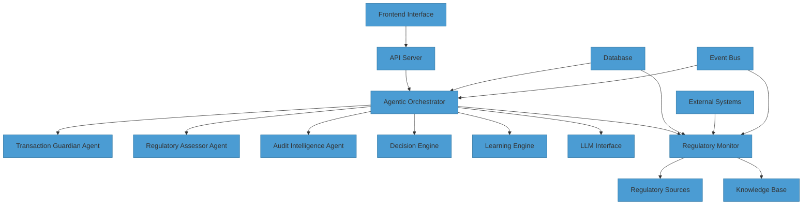
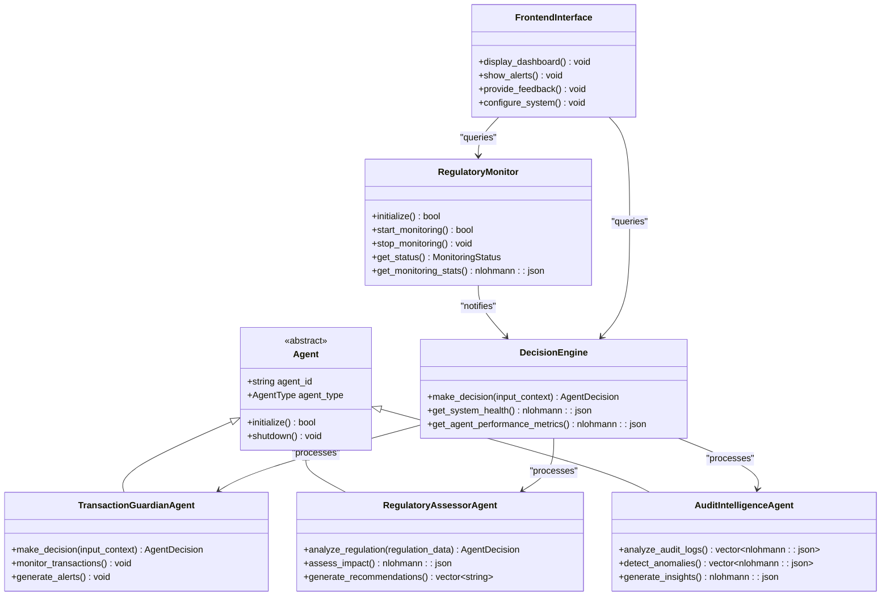
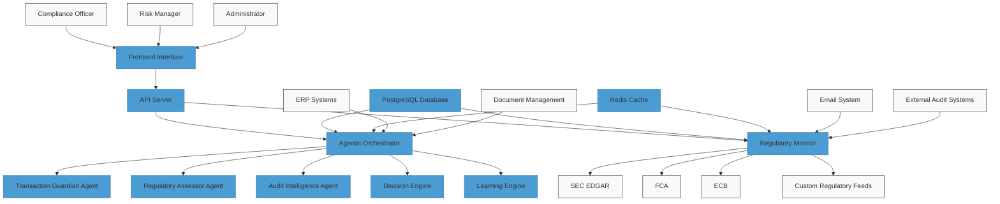
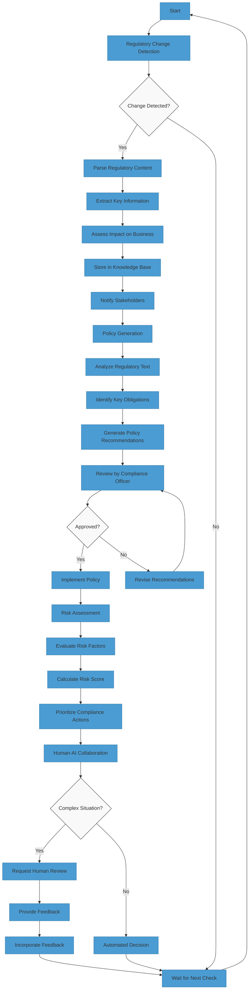
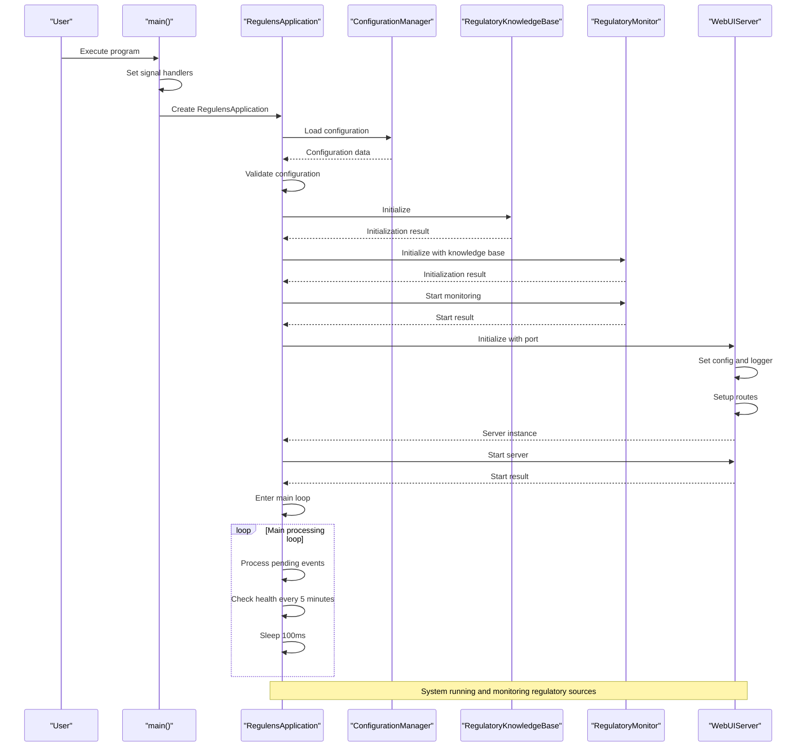

# System Overview

<cite>
**Referenced Files in This Document**   
- [main.cpp](file://main.cpp)
- [regulatory_monitor.hpp](file://regulatory_monitor/regulatory_monitor.hpp)
- [agentic_orchestrator.hpp](file://shared/agentic_brain/agentic_orchestrator.hpp)
- [CMakeLists.txt](file://CMakeLists.txt)
- [docker-compose.yml](file://docker-compose.yml)
- [schema.sql](file://schema.sql)
- [event.hpp](file://shared/event_system/event.hpp)
- [llm_interface.hpp](file://shared/agentic_brain/llm_interface.hpp)
- [configuration_manager.hpp](file://shared/config/configuration_manager.hpp)
- [App.tsx](file://frontend/src/App.tsx)
</cite>

## Table of Contents
1. [Introduction](#introduction)
2. [Core Architecture](#core-architecture)
3. [High-Level Components](#high-level-components)
4. [System Context Diagram](#system-context-diagram)
5. [Core Workflows](#core-workflows)
6. [User Roles and System Usage](#user-roles-and-system-usage)
7. [Build and Execution Flow](#build-and-execution-flow)
8. [Deployment Scenarios](#deployment-scenarios)
9. [Performance Characteristics](#performance-characteristics)

## Introduction

Regulens is an AI-powered regulatory compliance platform designed for financial institutions. The system leverages an agent-oriented architecture and event-driven design to provide real-time monitoring, analysis, and response to regulatory changes. By combining multiple specialized AI agents with a central orchestrator, Regulens enables financial institutions to maintain compliance with evolving regulations while minimizing operational overhead and reducing risk exposure.

The platform is built on a microservices architecture with clear separation of concerns, allowing for scalability and resilience. At its core, Regulens uses AI agents that specialize in different compliance domains, including transaction monitoring, regulatory assessment, and audit intelligence. These agents work collaboratively through an event-driven communication system, enabling real-time information sharing and coordinated decision-making.

Regulens addresses the complex challenges of financial regulatory compliance by automating the detection of regulatory changes, generating appropriate policies, assessing risks, and facilitating human-AI collaboration. The system is designed to be both technically robust for developers and accessible for compliance professionals, providing a comprehensive solution that bridges the gap between technical implementation and regulatory requirements.

**Section sources**
- [main.cpp](file://main.cpp#L1-L410)
- [regulatory_monitor.hpp](file://regulatory_monitor/regulatory_monitor.hpp#L1-L226)

## Core Architecture

Regulens employs an agent-oriented architecture with event-driven design principles to create a responsive and adaptive compliance system. The architecture is organized around specialized AI agents that focus on specific compliance domains, with a central orchestrator coordinating their activities and ensuring coherent decision-making across the system.

The agent-oriented approach allows for modular development and deployment, where each agent can be independently updated and scaled based on specific compliance requirements. Agents in the Regulens system include the Transaction Guardian, Regulatory Assessor, and Audit Intelligence agents, each specializing in different aspects of financial compliance. These agents operate autonomously but communicate through a shared event bus, enabling them to share insights and coordinate responses to regulatory changes.

The event-driven design ensures that the system can respond in real-time to regulatory updates and internal events. When a regulatory change is detected, an event is published to the event bus, which triggers relevant agents to analyze the change and generate appropriate responses. This decoupled architecture enhances system resilience, as individual components can fail without bringing down the entire system, and allows for asynchronous processing of compliance tasks.

The architecture also incorporates AI-powered decision engines and learning capabilities, enabling the system to improve over time through feedback incorporation. The central orchestrator manages the lifecycle of agents, coordinates their activities, and ensures that decisions are consistent with organizational policies and regulatory requirements.

**Diagram sources**
- [main.cpp](file://main.cpp#L1-L410)
- [agentic_orchestrator.hpp](file://shared/agentic_brain/agentic_orchestrator.hpp#L1-L323)
- [regulatory_monitor.hpp](file://regulatory_monitor/regulatory_monitor.hpp#L1-L226)

**Section sources**
- [main.cpp](file://main.cpp#L1-L410)
- [agentic_orchestrator.hpp](file://shared/agentic_brain/agentic_orchestrator.hpp#L1-L323)
- [regulatory_monitor.hpp](file://regulatory_monitor/regulatory_monitor.hpp#L1-L226)

## High-Level Components

Regulens consists of several high-level components that work together to provide comprehensive regulatory compliance capabilities. These components include specialized agents, a decision engine, regulatory monitor, and frontend interface, each serving a distinct purpose in the compliance workflow.

The **agents** are specialized AI components that focus on specific compliance domains. The Transaction Guardian agent monitors financial transactions for potential compliance violations, the Regulatory Assessor analyzes new regulations and their impact on business operations, and the Audit Intelligence agent identifies patterns and anomalies in system logs and audit trails. Each agent operates with a specific expertise while collaborating with other agents through the event system.

The **decision engine** is a central component that processes inputs from various agents and generates recommendations for compliance actions. It uses multi-criteria decision analysis (MCDA) to evaluate different options and provides confidence scores for its recommendations. The decision engine also incorporates feedback from human reviewers to improve its future decisions.

The **regulatory monitor** continuously scans regulatory sources such as SEC EDGAR, FCA, and ECB for new regulations and updates. When changes are detected, the monitor analyzes the content, assesses its impact, and notifies relevant agents. The monitor maintains a knowledge base of regulatory information and tracks the status of compliance activities related to each regulatory change.

The **frontend interface** provides a user-friendly dashboard for compliance officers, risk managers, and administrators to monitor system activities, review AI-generated recommendations, and provide feedback. The interface displays real-time alerts, compliance metrics, and detailed information about regulatory changes and their potential impact.

**Diagram sources**
- [agentic_orchestrator.hpp](file://shared/agentic_brain/agentic_orchestrator.hpp#L1-L323)
- [regulatory_monitor.hpp](file://regulatory_monitor/regulatory_monitor.hpp#L1-L226)

**Section sources**
- [agentic_orchestrator.hpp](file://shared/agentic_brain/agentic_orchestrator.hpp#L1-L323)
- [regulatory_monitor.hpp](file://regulatory_monitor/regulatory_monitor.hpp#L1-L226)

## System Context Diagram

The Regulens system interacts with various internal and external components to provide comprehensive regulatory compliance capabilities. The system context diagram illustrates the relationships between the Regulens platform and its surrounding environment, including frontend clients, backend services, databases, and external systems.

The frontend interface communicates with the API server, which serves as the entry point for all external interactions. The API server processes requests from the frontend and coordinates with the agentic orchestrator and regulatory monitor to fulfill them. The agentic orchestrator manages the specialized AI agents and coordinates their activities, while the regulatory monitor continuously scans external regulatory sources for updates.

The system relies on a PostgreSQL database for persistent storage of compliance data, regulatory information, and system configurations. A Redis cache is used for temporary data storage and to improve performance by reducing database load. The system also integrates with external regulatory sources such as SEC EDGAR, FCA, and ECB through their respective APIs.

**Diagram sources**
- [docker-compose.yml](file://docker-compose.yml#L1-L141)
- [main.cpp](file://main.cpp#L1-L410)
- [regulatory_monitor.hpp](file://regulatory_monitor/regulatory_monitor.hpp#L1-L226)

**Section sources**
- [docker-compose.yml](file://docker-compose.yml#L1-L141)
- [main.cpp](file://main.cpp#L1-L410)
- [regulatory_monitor.hpp](file://regulatory_monitor/regulatory_monitor.hpp#L1-L226)

## Core Workflows

Regulens implements several core workflows that enable financial institutions to maintain regulatory compliance. These workflows include regulatory change detection, policy generation, risk assessment, and human-AI collaboration, each designed to address specific aspects of the compliance process.

The **regulatory change detection** workflow begins with the regulatory monitor scanning designated sources such as SEC EDGAR, FCA, and ECB for new regulations and updates. When changes are detected, the system parses the content, extracts key information, and assesses the potential impact on the organization. The detected changes are then stored in the knowledge base and notifications are sent to relevant stakeholders.

The **policy generation** workflow uses AI-powered natural language processing to convert regulatory requirements into actionable compliance policies. The system analyzes the regulatory text, identifies key obligations, and generates policy recommendations that can be reviewed and approved by compliance officers. The generated policies are then stored in the knowledge base and linked to relevant business processes.

The **risk assessment** workflow evaluates the potential risks associated with regulatory changes and business activities. The system uses a combination of rule-based analysis and machine learning to calculate risk scores for different scenarios. These assessments help organizations prioritize their compliance efforts and allocate resources effectively.

The **human-AI collaboration** workflow facilitates interaction between compliance professionals and the AI system. When the system encounters complex situations or low-confidence decisions, it can request human review. Compliance officers can provide feedback on AI-generated recommendations, which is then used to improve the system's future performance through continuous learning.

**Diagram sources**
- [regulatory_monitor.hpp](file://regulatory_monitor/regulatory_monitor.hpp#L1-L226)
- [agentic_orchestrator.hpp](file://shared/agentic_brain/agentic_orchestrator.hpp#L1-L323)

**Section sources**
- [regulatory_monitor.hpp](file://regulatory_monitor/regulatory_monitor.hpp#L1-L226)
- [agentic_orchestrator.hpp](file://shared/agentic_brain/agentic_orchestrator.hpp#L1-L323)

## User Roles and System Usage

Regulens supports different user roles, each with specific responsibilities and system interactions. The primary roles include compliance officers, risk managers, and administrators, each using the system in different ways to achieve their objectives.

**Compliance officers** use Regulens to monitor regulatory changes, review AI-generated policy recommendations, and ensure organizational compliance. They receive alerts about new regulations and can use the system to assess the impact of these changes on business operations. Compliance officers also provide feedback on AI-generated decisions, helping to improve the system's accuracy over time.

**Risk managers** leverage Regulens to identify and assess compliance risks across the organization. They use the system's risk assessment capabilities to prioritize compliance activities and allocate resources effectively. Risk managers can simulate different scenarios to understand potential risks and develop mitigation strategies.

**Administrators** are responsible for configuring and maintaining the Regulens system. They manage user accounts, configure system settings, and monitor system performance. Administrators also ensure that the system is properly integrated with external data sources and that all components are functioning correctly.

Each user role has access to specific features and information through the frontend interface, with appropriate access controls to ensure data security and privacy. The system provides role-based dashboards that display relevant information and tools for each user type.

```mermaid
graph TD
A[Compliance Officer] --> B[Monitor Regulatory Changes]
A --> C[Review Policy Recommendations]
A --> D[Provide Feedback on Decisions]
A --> E[Ensure Organizational Compliance]
F[Risk Manager] --> G[Identify Compliance Risks]
F --> H[Assess Risk Levels]
F --> I[Prioritize Compliance Activities]
F --> J[Develop Mitigation Strategies]
K[Administrator] --> L[Configure System Settings]
K --> M[Manage User Accounts]
K --> N[Monitor System Performance]
K --> O[Maintain External Integrations]
B --> P[Regulatory Monitor]
C --> Q[Policy Generation Engine]
D --> R[Learning Engine]
E --> S[Compliance Dashboard]
G --> T[Risk Assessment Engine]
H --> T
I --> U[Resource Allocation]
J --> V[Scenario Simulation]
L --> W[System Configuration]
M --> X[User Management]
N --> Y[System Monitoring]
O --> Z[External Integrations]
style A fill:#4B9CD3,stroke:#347AA6
style F fill:#4B9CD3,stroke:#347AA6
style K fill:#4B9CD3,stroke:#347AA6
style B fill:#F9F9F9,stroke:#333
style C fill:#F9F9F9,stroke:#333
style D fill:#F9F9F9,stroke:#333
style E fill:#F9F9F9,stroke:#333
style G fill:#F9F9F9,stroke:#333
style H fill:#F9F9F9,stroke:#333
style I fill:#F9F9F9,stroke:#333
style J fill:#F9F9F9,stroke:#333
style L fill:#F9F9F9,stroke:#333
style M fill:#F9F9F9,stroke:#333
style N fill:#F9F9F9,stroke:#333
style O fill:#F9F9F9,stroke:#333
style P fill:#4B9CD3,stroke:#347AA6
style Q fill:#4B9CD3,stroke:#347AA6
style R fill:#4B9CD3,stroke:#347AA6
style S fill:#4B9CD3,stroke:#347AA6
style T fill:#4B9CD3,stroke:#347AA6
style U fill:#4B9CD3,stroke:#347AA6
style V fill:#4B9CD3,stroke:#347AA6
style W fill:#4B9CD3,stroke:#347AA6
style X fill:#4B9CD3,stroke:#347AA6
style Y fill:#4B9CD3,stroke:#347AA6
style Z fill:#4B9CD3,stroke:#347AA6
```

**Diagram sources**
- [App.tsx](file://frontend/src/App.tsx#L1-L68)
- [agentic_orchestrator.hpp](file://shared/agentic_brain/agentic_orchestrator.hpp#L1-L323)

**Section sources**
- [App.tsx](file://frontend/src/App.tsx#L1-L68)
- [agentic_orchestrator.hpp](file://shared/agentic_brain/agentic_orchestrator.hpp#L1-L323)

## Build and Execution Flow

The Regulens system follows a structured build and execution flow that begins with the main.cpp entry point and proceeds through service initialization and startup. The build process is managed by CMake, which coordinates the compilation of various components and their dependencies.

The execution flow starts with the main function in main.cpp, which sets up signal handlers for graceful shutdown and initializes the RegulensApplication class. The application constructor performs system component initialization, including loading configuration, initializing the regulatory knowledge base, and starting the regulatory monitor. The main application loop then begins, continuously processing system events and performing periodic health checks.

During initialization, the system loads configuration from environment variables and configuration files, validates the settings, and establishes connections to the database and other external services. The regulatory monitor is initialized with the knowledge base and begins monitoring configured regulatory sources. The web UI server is started on the configured port, making the frontend interface accessible to users.

The build process, defined in CMakeLists.txt, specifies the compilation requirements and dependencies for the system. It includes settings for modern C++ standards, compiler flags, and dependency management for libraries such as nlohmann_json, spdlog, PostgreSQL, and libpqxx. The build configuration also supports optional features like thread and address sanitizers for development builds.

**Diagram sources**
- [main.cpp](file://main.cpp#L1-L410)
- [CMakeLists.txt](file://CMakeLists.txt#L1-L233)

**Section sources**
- [main.cpp](file://main.cpp#L1-L410)
- [CMakeLists.txt](file://CMakeLists.txt#L1-L233)

## Deployment Scenarios

Regulens supports multiple deployment scenarios to accommodate different organizational requirements and infrastructure preferences. The primary deployment options include local development, cloud deployment, and on-premises installation, each with specific configuration requirements and considerations.

For **local development**, the system can be deployed using Docker Compose, which sets up all required services including PostgreSQL, Redis, the regulatory monitor, API server, and frontend interface. This scenario is ideal for development and testing, providing a complete environment that closely mirrors production.

For **cloud deployment**, Regulens can be deployed on major cloud platforms such as AWS, Azure, or Google Cloud. The system is designed to work with cloud-native services for database, caching, and container orchestration. Configuration parameters allow for integration with cloud-specific services and security features.

For **on-premises installation**, the system can be deployed within an organization's private data center. This scenario requires careful consideration of network configuration, security policies, and integration with existing enterprise systems. The build system supports custom installation paths for dependencies to accommodate different on-premises environments.

The deployment configuration is managed through environment variables and configuration files, allowing for flexible adaptation to different environments. The system includes health checks and monitoring capabilities to ensure reliable operation in all deployment scenarios.

**Section sources**
- [docker-compose.yml](file://docker-compose.yml#L1-L141)
- [CMakeLists.txt](file://CMakeLists.txt#L1-L233)
- [configuration_manager.hpp](file://shared/config/configuration_manager.hpp#L1-L343)

## Performance Characteristics

Regulens is designed with performance and scalability in mind, incorporating several features to ensure efficient operation in production environments. The system's performance characteristics include response times, throughput capabilities, resource utilization, and scalability options.

The system uses a combination of caching (Redis) and database indexing (PostgreSQL) to optimize data access and reduce latency. Complex queries are optimized with appropriate indexes, and frequently accessed data is cached to minimize database load. The event-driven architecture allows for asynchronous processing of compliance tasks, preventing blocking operations from affecting system responsiveness.

Resource utilization is carefully managed through connection pooling for database access and rate limiting for external API calls. The system includes built-in monitoring and health check capabilities to detect performance issues and trigger appropriate responses. Configuration parameters allow for tuning of performance-related settings such as connection pool size and timeout values.

The modular architecture enables horizontal scaling of specific components based on workload requirements. For example, additional instances of the regulatory monitor can be deployed to handle increased monitoring load, or multiple decision engines can be used to process compliance decisions in parallel.

**Section sources**
- [schema.sql](file://schema.sql#L1-L8473)
- [configuration_manager.hpp](file://shared/config/configuration_manager.hpp#L1-L343)
- [regulatory_monitor.hpp](file://regulatory_monitor/regulatory_monitor.hpp#L1-L226)