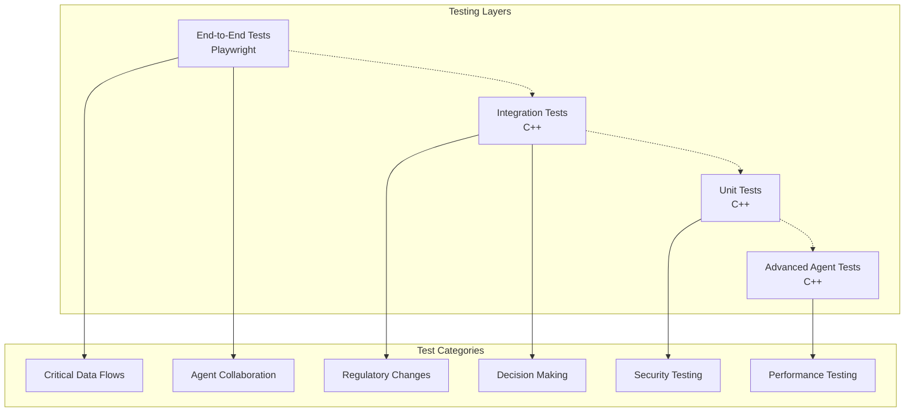
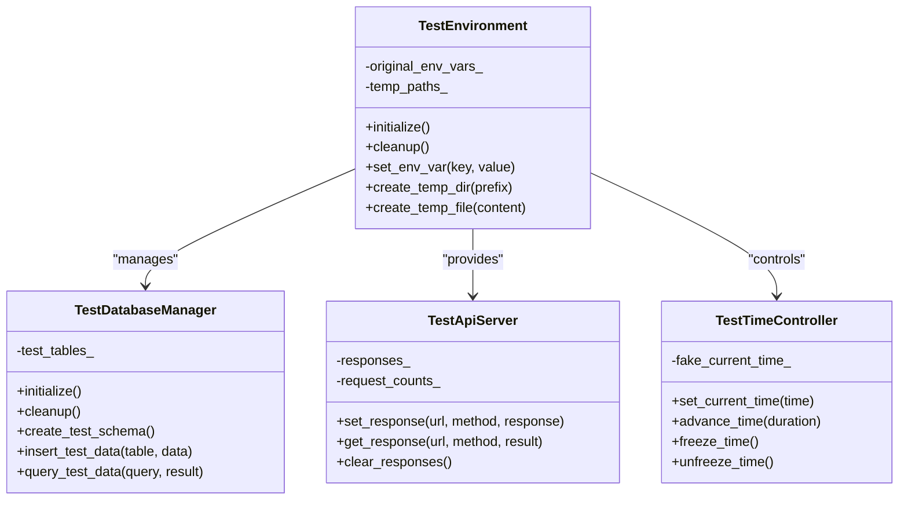
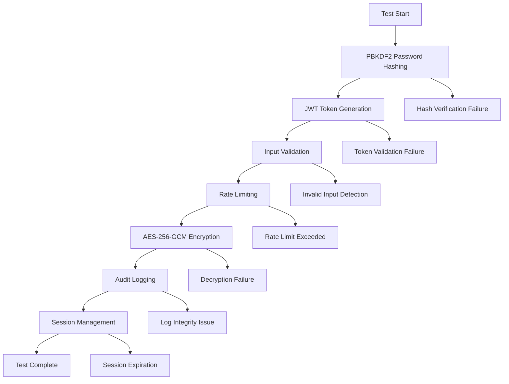
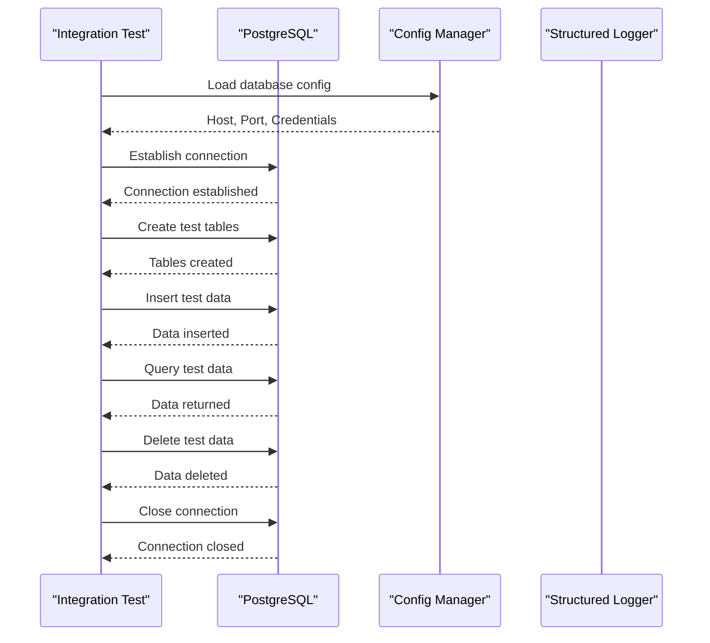
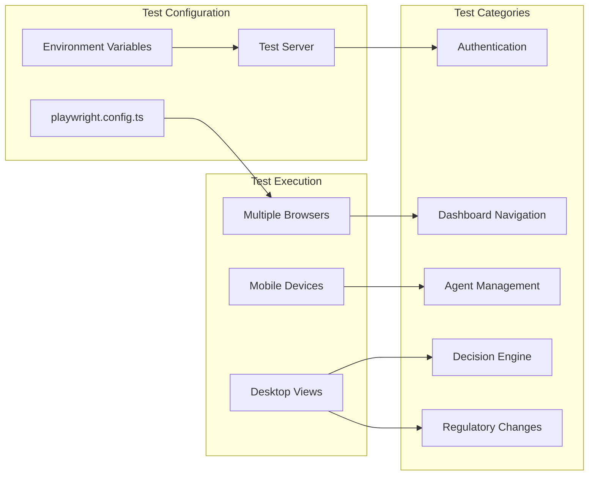
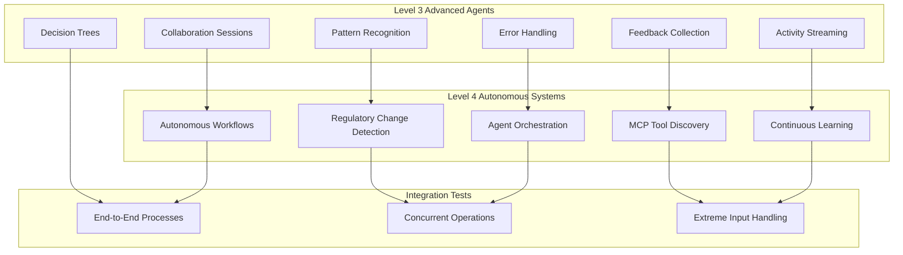
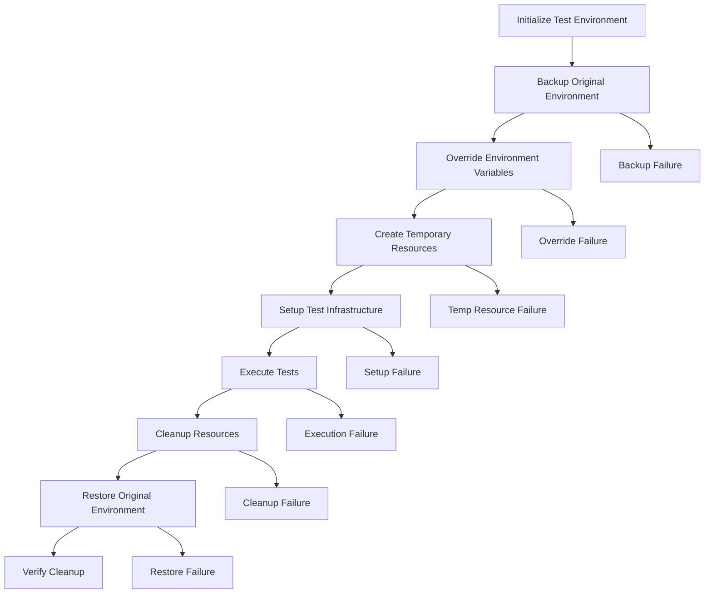
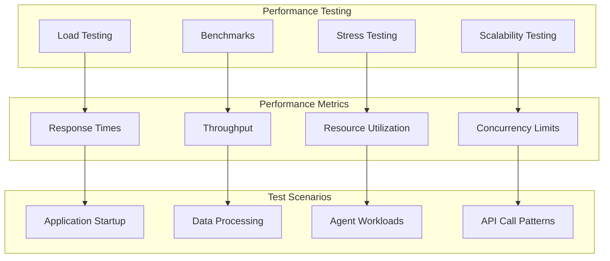
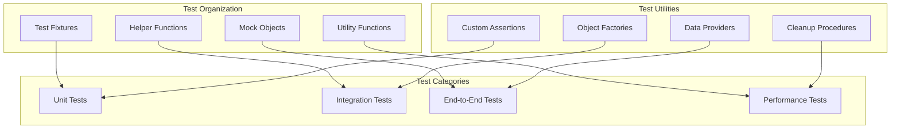

# Testing Strategy

<cite>
**Referenced Files in This Document**
- [playwright.config.ts](file://playwright.config.ts)
- [tests/CMakeLists.txt](file://tests/CMakeLists.txt)
- [tests/unit_tests.cpp](file://tests/unit_tests.cpp)
- [tests/advanced_agent_tests.cpp](file://tests/advanced_agent_tests.cpp)
- [tests/integration/database_connectivity_test.cpp](file://tests/integration/database_connectivity_test.cpp)
- [tests/e2e/critical-data-flows.spec.ts](file://tests/e2e/critical-data-flows.spec.ts)
- [frontend/testing_checklist.txt](file://frontend/testing_checklist.txt)
- [scripts/run_tests.sh](file://scripts/run_tests.sh)
- [tests/infrastructure/test_environment.cpp](file://tests/infrastructure/test_environment.cpp)
- [tests/infrastructure/test_framework.cpp](file://tests/infrastructure/test_framework.cpp)
</cite>

## Table of Contents
1. [Introduction](#introduction)
2. [Multi-Layered Testing Approach](#multi-layered-testing-approach)
3. [Test Infrastructure Setup](#test-infrastructure-setup)
4. [Unit Tests (C++)](#unit-tests-c)
5. [Integration Tests](#integration-tests)
6. [End-to-End Tests (Playwright)](#end-to-end-tests-playwright)
7. [Advanced Agent Testing](#advanced-agent-testing)
8. [Test Environment Management](#test-environment-management)
9. [Testing Challenges for AI Systems](#testing-challenges-for-ai-systems)
10. [Performance Testing](#performance-testing)
11. [Security Testing](#security-testing)
12. [Troubleshooting Guide](#troubleshooting-guide)
13. [Best Practices](#best-practices)
14. [Conclusion](#conclusion)

## Introduction

The Regulens compliance platform employs a comprehensive multi-layered testing strategy designed to ensure reliability, security, and correctness across all system components. This testing framework encompasses unit tests written in C++, integration tests, and end-to-end tests using Playwright, specifically tailored for an AI-powered regulatory compliance system.

The testing strategy addresses the unique challenges of testing AI agents, agent collaboration, event-driven architectures, and complex regulatory workflows. It provides robust test infrastructure with mock services, isolated test environments, and comprehensive coverage of critical compliance scenarios.

## Multi-Layered Testing Approach

The Regulens testing strategy follows a hierarchical approach with four primary layers, each serving distinct testing objectives:

**Diagram sources**
- [playwright.config.ts](file://playwright.config.ts#L1-L101)
- [tests/CMakeLists.txt](file://tests/CMakeLists.txt#L1-L131)

### Layer 1: End-to-End Tests (Playwright)
Browser-based tests that simulate real user interactions with the web interface, validating complete user journeys from frontend to backend APIs and database operations.

### Layer 2: Integration Tests
C++ tests that validate component interactions, particularly focusing on database connectivity, API integrations, and cross-service communication.

### Layer 3: Unit Tests (C++)
Low-level tests for individual functions, classes, and modules, ensuring cryptographic operations, data validation, and core business logic correctness.

### Layer 4: Advanced Agent Tests
Sophisticated tests for AI agent capabilities, including pattern recognition, feedback incorporation, autonomous decision-making, and multi-agent orchestration.

**Section sources**
- [playwright.config.ts](file://playwright.config.ts#L1-L101)
- [tests/CMakeLists.txt](file://tests/CMakeLists.txt#L1-L131)
- [tests/unit_tests.cpp](file://tests/unit_tests.cpp#L1-L1027)

## Test Infrastructure Setup

The Regulens testing infrastructure provides isolated, reproducible test environments with comprehensive mocking capabilities and resource management.

### Test Environment Architecture

**Diagram sources**
- [tests/infrastructure/test_environment.cpp](file://tests/infrastructure/test_environment.cpp#L1-L628)
- [tests/infrastructure/test_framework.cpp](file://tests/infrastructure/test_framework.cpp#L1-L566)

### Test Environment Components

The test infrastructure consists of several key components:

1. **Environment Isolation**: Creates isolated test environments by overriding environment variables and managing temporary resources
2. **Mock Services**: Provides mock implementations for external dependencies like databases, APIs, and AI services
3. **Resource Management**: Handles temporary file creation, directory management, and cleanup procedures
4. **Time Control**: Allows deterministic testing by controlling system time and enabling time-based assertions

**Section sources**
- [tests/infrastructure/test_environment.cpp](file://tests/infrastructure/test_environment.cpp#L1-L628)
- [tests/infrastructure/test_framework.cpp](file://tests/infrastructure/test_framework.cpp#L1-L566)

## Unit Tests (C++)

The unit testing framework focuses on production-grade testing of individual components, particularly cryptographic operations, data validation, and core business logic.

### Cryptographic Operations Testing

Unit tests extensively validate cryptographic implementations using industry-standard libraries:

**Diagram sources**
- [tests/unit_tests.cpp](file://tests/unit_tests.cpp#L1-L799)

### Security-Critical Unit Tests

The unit test suite covers essential security operations:

1. **Password Hashing**: Validates PBKDF2-HMAC-SHA256 implementation with configurable iteration counts
2. **JWT Token Management**: Tests token generation, verification, and expiration handling
3. **Input Sanitization**: Ensures protection against SQL injection and XSS attacks
4. **Rate Limiting**: Validates request throttling mechanisms
5. **Data Encryption**: Tests AES-256-GCM encryption with proper authentication tags

### Test Coverage and Reporting

The unit testing framework integrates with coverage tools to provide comprehensive code coverage analysis:

- **Coverage Reports**: HTML, XML, and text format reports
- **Line Coverage**: Tracks executed vs. unexecuted code lines
- **Branch Coverage**: Monitors conditional statement execution
- **Function Coverage**: Measures function invocation rates

**Section sources**
- [tests/unit_tests.cpp](file://tests/unit_tests.cpp#L1-L799)
- [scripts/run_tests.sh](file://scripts/run_tests.sh#L1-L315)

## Integration Tests

Integration tests validate component interactions, particularly focusing on database connectivity, API integrations, and cross-service communication patterns.

### Database Connectivity Testing

The integration test suite provides comprehensive database validation:

**Diagram sources**
- [tests/integration/database_connectivity_test.cpp](file://tests/integration/database_connectivity_test.cpp#L1-L386)

### Critical Table Validation

Integration tests verify the existence and accessibility of critical system tables:

- **Case Base**: Stores compliance case information with confidence scores
- **Learning Feedback**: Tracks agent learning and improvement data
- **Conversation Memory**: Manages AI agent conversation history
- **Agent Decisions**: Records decision-making processes and outcomes
- **Regulatory Changes**: Tracks regulatory updates and impacts
- **Audit Logs**: Maintains comprehensive audit trails

### Transaction Support and Error Handling

The integration tests validate transactional operations and error recovery:

1. **Transaction Management**: Tests BEGIN, COMMIT, and ROLLBACK operations
2. **Parameterized Queries**: Validates SQL injection protection
3. **Connection Pooling**: Tests reconnection and resource management
4. **Error Recovery**: Validates graceful handling of database failures

**Section sources**
- [tests/integration/database_connectivity_test.cpp](file://tests/integration/database_connectivity_test.cpp#L1-L386)

## End-to-End Tests (Playwright)

The Playwright-based end-to-end testing framework simulates real user interactions with the Regulens web interface, validating complete user journeys across all system components.

### Test Configuration and Setup

**Diagram sources**
- [playwright.config.ts](file://playwright.config.ts#L1-L101)
- [tests/e2e/critical-data-flows.spec.ts](file://tests/e2e/critical-data-flows.spec.ts#L1-L360)

### Browser Compatibility Testing

The Playwright configuration supports comprehensive browser testing:

1. **Desktop Browsers**: Chromium, Firefox, and WebKit (Safari)
2. **Mobile Emulation**: Pixel 5 and iPhone 13 device profiles
3. **Viewport Testing**: Various screen sizes and resolutions
4. **Cross-Browser Consistency**: Ensures uniform behavior across platforms

### Critical Data Flow Testing

End-to-end tests validate complete data flows from frontend to backend:

1. **Activity Feed Flow**: Database → API → Frontend Display
2. **Decision Creation Flow**: Frontend → API → Database → Display
3. **Agent Status Flow**: Database → API → Frontend Update
4. **Regulatory Changes Flow**: External Source → Database → API → Frontend
5. **Audit Trail Flow**: System Events → Database → API → Frontend Audit Log

### Test Reporting and CI Integration

The Playwright configuration provides comprehensive reporting:

- **HTML Reports**: Interactive test execution summaries
- **JSON Reports**: Machine-readable test results
- **JUnit XML**: CI/CD pipeline integration
- **Trace Files**: Debugging information for failed tests

**Section sources**
- [playwright.config.ts](file://playwright.config.ts#L1-L101)
- [tests/e2e/critical-data-flows.spec.ts](file://tests/e2e/critical-data-flows.spec.ts#L1-L360)

## Advanced Agent Testing

Advanced agent testing focuses on sophisticated AI agent capabilities, including pattern recognition, feedback incorporation, autonomous decision-making, and multi-agent orchestration.

### Agent Capability Testing Matrix

**Diagram sources**
- [tests/advanced_agent_tests.cpp](file://tests/advanced_agent_tests.cpp#L1-L799)

### Pattern Recognition Testing

Advanced agent tests validate sophisticated pattern recognition capabilities:

1. **Decision Pattern Analysis**: Identifies recurring decision-making patterns
2. **Behavior Pattern Detection**: Recognizes behavioral trends in agent interactions
3. **Anomaly Detection**: Identifies unusual patterns requiring intervention
4. **Trend Analysis**: Detects long-term trends in compliance data
5. **Correlation Analysis**: Finds relationships between different data points
6. **Sequence Pattern Mining**: Identifies temporal patterns in events

### Autonomous Decision Workflows

The testing framework validates autonomous decision-making capabilities:

1. **Decision Confidence Scoring**: Validates confidence level calculations
2. **Decision Explainability**: Ensures decisions can be explained and justified
3. **Decision Audit Trails**: Maintains comprehensive decision histories
4. **Autonomous Workflow Execution**: Tests complete autonomous processes

### Multi-Agent Orchestration

Advanced agent tests validate complex multi-agent scenarios:

1. **Agent Task Distribution**: Tests efficient workload allocation
2. **Agent Coordination**: Validates inter-agent communication protocols
3. **Performance Optimization**: Monitors and optimizes agent performance
4. **Failover Mechanisms**: Tests system resilience and recovery

**Section sources**
- [tests/advanced_agent_tests.cpp](file://tests/advanced_agent_tests.cpp#L1-L799)

## Test Environment Management

The test environment management system ensures isolated, reproducible testing conditions with comprehensive resource management and cleanup procedures.

### Environment Isolation Strategy

**Diagram sources**
- [tests/infrastructure/test_environment.cpp](file://tests/infrastructure/test_environment.cpp#L1-L628)

### Resource Management

The test environment manager handles various resource types:

1. **Temporary Directories**: Creates isolated temporary storage areas
2. **Temporary Files**: Manages test data files and configurations
3. **Database Connections**: Provides isolated test databases
4. **Mock Services**: Registers and manages mock service implementations
5. **Configuration Overrides**: Temporarily modifies system configurations

### Cleanup and Resource Recovery

Comprehensive cleanup procedures ensure test isolation:

1. **File Cleanup**: Removes temporary files and directories
2. **Database Cleanup**: Resets test databases to initial state
3. **Environment Restoration**: Restores original environment variables
4. **Resource Deallocation**: Frees allocated system resources
5. **Mock Service Removal**: Unregisters mock services

**Section sources**
- [tests/infrastructure/test_environment.cpp](file://tests/infrastructure/test_environment.cpp#L1-L628)
- [tests/infrastructure/test_framework.cpp](file://tests/infrastructure/test_framework.cpp#L1-L566)

## Testing Challenges for AI Systems

Testing AI-powered regulatory compliance systems presents unique challenges that require specialized testing approaches and methodologies.

### Deterministic Testing of Non-Deterministic Systems

AI systems often exhibit non-deterministic behavior, requiring specialized testing strategies:

1. **Statistical Validation**: Uses statistical methods to validate AI behavior
2. **Monte Carlo Testing**: Runs extensive test iterations to establish baselines
3. **Confidence Interval Testing**: Validates results within acceptable confidence ranges
4. **Edge Case Analysis**: Tests boundary conditions and rare scenarios

### Agent Collaboration Testing

Multi-agent systems require comprehensive testing of agent interactions:

1. **Communication Protocols**: Validates message passing and synchronization
2. **Conflict Resolution**: Tests resolution of conflicting decisions
3. **Load Balancing**: Validates fair distribution of work among agents
4. **Failure Recovery**: Tests system resilience to agent failures

### Regulatory Change Processing

Testing regulatory change processing involves complex scenarios:

1. **Change Detection**: Validates identification of regulatory changes
2. **Impact Analysis**: Tests assessment of regulatory impact
3. **Compliance Tracking**: Validates ongoing compliance monitoring
4. **Historical Analysis**: Tests historical compliance trend analysis

### AI Model Validation

Specialized testing for AI model validation:

1. **Model Accuracy Testing**: Validates model prediction accuracy
2. **Bias Detection**: Tests for and mitigates model bias
3. **Explainability Testing**: Ensures model decisions can be explained
4. **Model Drift Detection**: Tests for and handles model performance degradation

## Performance Testing

Performance testing ensures the Regulens system maintains acceptable performance under various load conditions and stress scenarios.

### Performance Test Categories

### Application Startup Performance

Performance tests measure application startup characteristics:

1. **Cold Start Times**: Measures time to first response
2. **Memory Allocation**: Tracks memory usage during startup
3. **Dependency Loading**: Validates loading of external dependencies
4. **Configuration Initialization**: Tests configuration loading speed

### Data Processing Performance

Tests validate data processing throughput and latency:

1. **Batch Processing**: Tests bulk data processing performance
2. **Real-time Processing**: Validates real-time data handling
3. **Database Operations**: Tests database query performance
4. **API Response Times**: Validates API endpoint performance

### Concurrent Operation Testing

Tests validate system behavior under concurrent loads:

1. **Multi-Agent Operations**: Tests simultaneous agent execution
2. **Concurrent API Calls**: Validates concurrent API endpoint usage
3. **Database Concurrency**: Tests concurrent database operations
4. **Resource Contention**: Validates resource sharing and contention

**Section sources**
- [scripts/run_tests.sh](file://scripts/run_tests.sh#L1-L315)

## Security Testing

Security testing focuses on validating cryptographic implementations, input validation, and protection against common security vulnerabilities.

### Cryptographic Security Testing

Extensive testing of cryptographic operations:

1. **Password Hashing**: Validates PBKDF2 implementation with proper salt handling
2. **Token Security**: Tests JWT token generation and validation
3. **Data Encryption**: Validates AES-256-GCM encryption with authentication
4. **Secure Random Number Generation**: Tests cryptographic randomness
5. **Key Management**: Validates secure key storage and rotation

### Input Validation and Sanitization

Comprehensive input validation testing:

1. **SQL Injection Prevention**: Tests protection against SQL injection attacks
2. **XSS Protection**: Validates protection against cross-site scripting
3. **Command Injection**: Tests protection against command injection
4. **Buffer Overflow**: Validates buffer overflow protection
5. **XML External Entity**: Tests XML parsing security

### Authentication and Authorization Testing

Security testing of authentication systems:

1. **Credential Validation**: Tests username/password validation
2. **Token Authentication**: Validates JWT token authentication
3. **Role-Based Access Control**: Tests permission enforcement
4. **Session Management**: Validates session security
5. **Rate Limiting**: Tests protection against brute force attacks

### Network Security Testing

Tests validate network-level security measures:

1. **HTTPS Enforcement**: Validates secure communication
2. **Certificate Validation**: Tests SSL/TLS certificate validation
3. **Firewall Rules**: Validates network access controls
4. **DDoS Protection**: Tests protection against distributed denial of service
5. **Network Segmentation**: Validates network isolation

**Section sources**
- [tests/unit_tests.cpp](file://tests/unit_tests.cpp#L1-L799)

## Troubleshooting Guide

Common test failures and their solutions, along with debugging strategies for flaky tests and intermittent failures.

### Common Test Failures

#### Database Connection Issues
**Symptoms**: Tests fail with database connection errors
**Causes**: 
- Database server not running
- Incorrect connection parameters
- Network connectivity issues
- Resource exhaustion

**Solutions**:
1. Verify database server status
2. Check connection configuration
3. Review network connectivity
4. Monitor system resource usage

#### Authentication Failures
**Symptoms**: Tests fail with authentication errors
**Causes**:
- Invalid test credentials
- JWT token expiration
- Rate limiting exceeded
- Configuration issues

**Solutions**:
1. Update test credentials
2. Adjust token expiration settings
3. Reduce test frequency
4. Verify configuration parameters

#### Timeout Issues
**Symptoms**: Tests fail with timeout errors
**Causes**:
- Slow database queries
- Network latency
- Resource contention
- Infinite loops

**Solutions**:
1. Optimize database queries
2. Increase timeout thresholds
3. Monitor system resources
4. Fix infinite loop conditions

### Flaky Test Debugging

Flaky tests are inconsistent and can pass or fail intermittently. Strategies for identifying and fixing flaky tests:

1. **Isolation Testing**: Run tests in isolation to identify dependencies
2. **Timing Analysis**: Measure execution timing to identify race conditions
3. **Resource Monitoring**: Monitor system resources during test execution
4. **Logging Enhancement**: Add detailed logging to capture test state
5. **Deterministic Testing**: Replace non-deterministic elements with controlled values

### Test Environment Issues

#### Environment Variable Conflicts
**Symptoms**: Tests behave differently in different environments
**Solutions**:
1. Use environment variable isolation
2. Implement proper cleanup procedures
3. Validate environment setup
4. Use configuration managers

#### Resource Leaks
**Symptoms**: Tests fail after repeated executions
**Solutions**:
1. Implement proper resource cleanup
2. Use RAII (Resource Acquisition Is Initialization) patterns
3. Monitor resource usage
4. Implement resource leak detection

### Debugging Tools and Techniques

1. **Test Logging**: Comprehensive logging for test execution
2. **Coverage Analysis**: Identify untested code paths
3. **Memory Profiling**: Detect memory leaks and corruption
4. **Performance Profiling**: Identify performance bottlenecks
5. **Static Analysis**: Catch potential issues early

## Best Practices

Comprehensive guidelines for writing effective tests, maintaining test suites, and ensuring test reliability.

### Test Design Principles

1. **Single Responsibility**: Each test should validate one specific behavior
2. **Isolation**: Tests should not depend on each other or external state
3. **Determinism**: Tests should produce consistent results
4. **Speed**: Tests should execute quickly for rapid feedback
5. **Maintainability**: Tests should be easy to understand and modify

### Test Organization

### Writing Effective Tests

1. **Clear Test Names**: Use descriptive names that explain the test purpose
2. **Arrange-Act-Assert Pattern**: Structure tests consistently
3. **Meaningful Assertions**: Make assertions clear and specific
4. **Test Data Management**: Use appropriate test data and cleanup
5. **Error Handling**: Test error conditions and edge cases

### Test Maintenance

1. **Regular Review**: Periodically review and update tests
2. **Refactoring**: Refactor tests to improve readability and maintainability
3. **Documentation**: Document complex test logic and assumptions
4. **Version Control**: Track test changes alongside code changes
5. **Continuous Integration**: Integrate tests into CI/CD pipelines

### Test Automation

1. **Automated Execution**: Run tests automatically on code changes
2. **Parallel Execution**: Execute tests in parallel for faster feedback
3. **Test Reporting**: Generate comprehensive test reports
4. **Test Metrics**: Track test effectiveness and coverage
5. **Continuous Monitoring**: Monitor test health and reliability

## Conclusion

The Regulens testing strategy provides a comprehensive, multi-layered approach to ensuring system reliability, security, and correctness. By combining unit tests, integration tests, and end-to-end tests with specialized testing for AI agents and regulatory compliance workflows, the framework addresses the unique challenges of testing complex, AI-powered systems.

The testing infrastructure provides robust isolation, comprehensive mocking capabilities, and extensive coverage of critical compliance scenarios. The combination of C++ unit tests for cryptographic operations, integration tests for component interactions, and Playwright-based end-to-end tests for user workflows creates a solid foundation for reliable system operation.

Key strengths of the testing strategy include:

- **Comprehensive Coverage**: Tests all major system components and workflows
- **AI-Specific Testing**: Addresses unique challenges of testing AI agents and decision-making
- **Infrastructure Support**: Provides robust test environment management and resource isolation
- **Performance Focus**: Includes performance testing for scalability and responsiveness
- **Security Emphasis**: Extensive security testing for cryptographic operations and input validation

The testing framework continues to evolve with the system, incorporating new testing methodologies and addressing emerging challenges in AI-powered regulatory compliance systems. Regular maintenance, continuous improvement, and adherence to best practices ensure the testing strategy remains effective as the system grows and evolves.