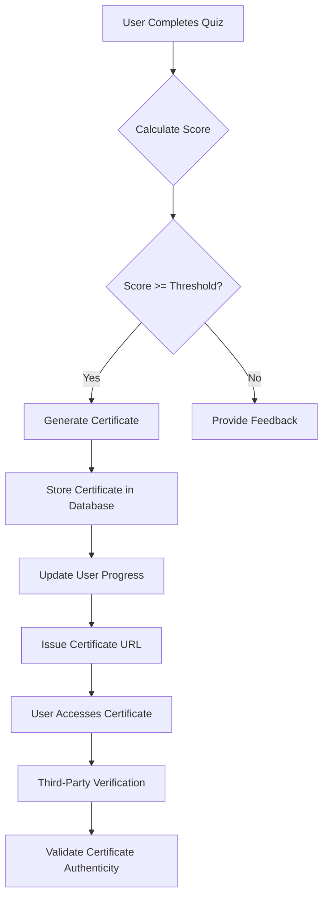
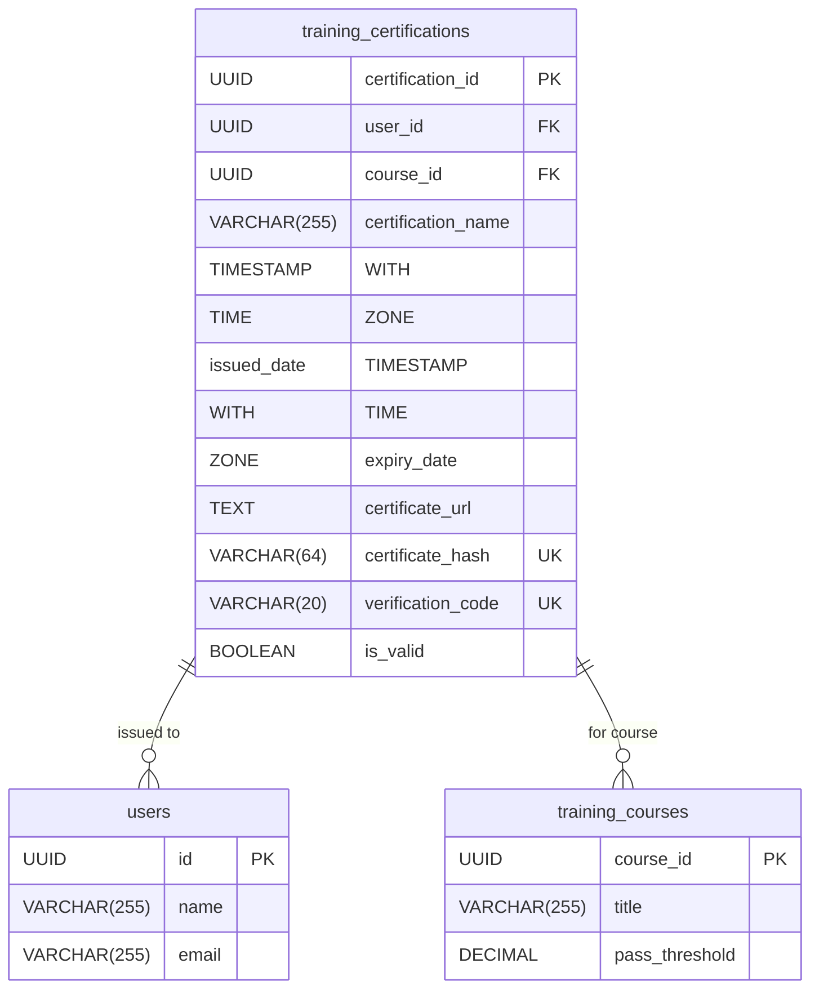
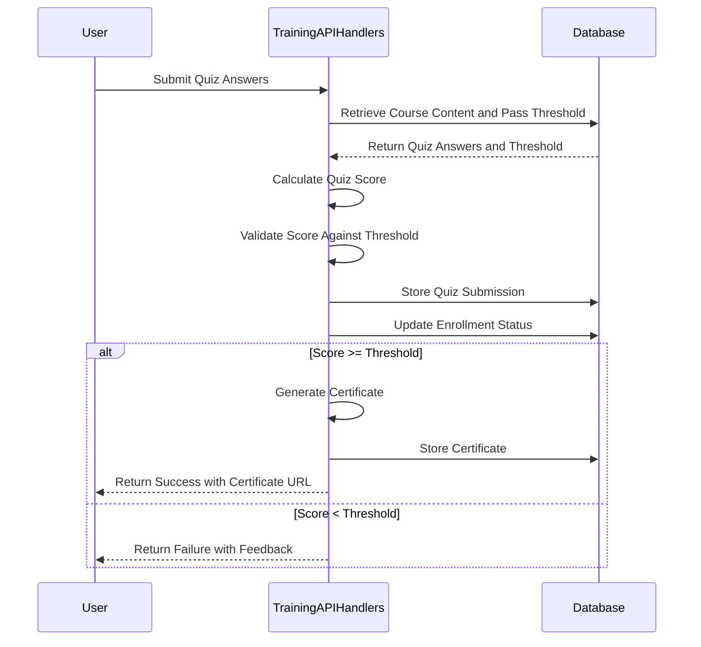
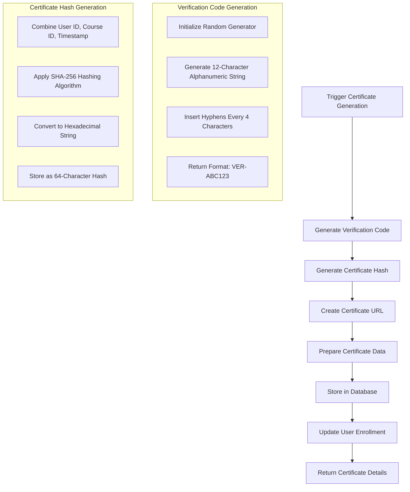
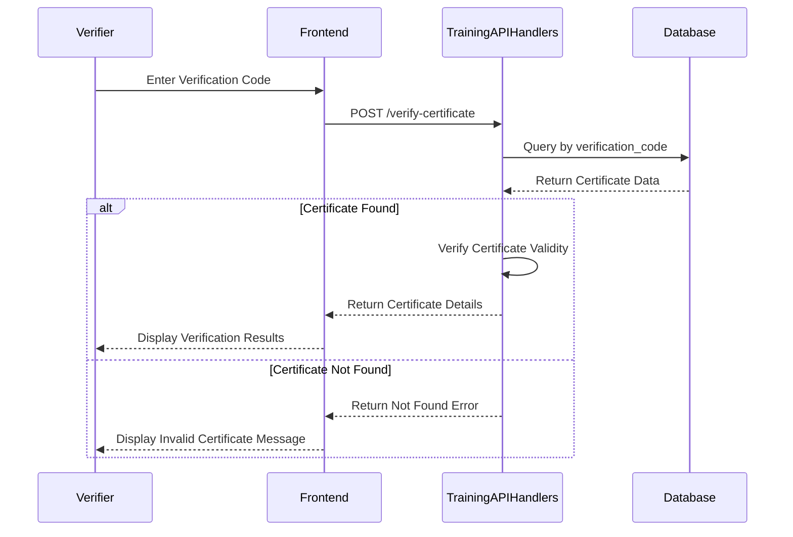
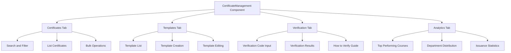

# Certification Workflows

<cite>
**Referenced Files in This Document**   
- [training_api_handlers.cpp](file://shared/training/training_api_handlers.cpp)
- [training_api_handlers.hpp](file://shared/training/training_api_handlers.hpp)
- [CertificateManagement.tsx](file://frontend/src/components/Training/CertificateManagement.tsx)
- [schema.sql](file://schema.sql)
</cite>

## Table of Contents
1. [Introduction](#introduction)
2. [Certification Workflow Overview](#certification-workflow-overview)
3. [Domain Model for Certifications](#domain-model-for-certifications)
4. [Quiz Scoring and Threshold Validation](#quiz-scoring-and-threshold-validation)
5. [Certificate Generation Process](#certificate-generation-process)
6. [Certificate Verification System](#certificate-verification-system)
7. [Configuration Options](#configuration-options)
8. [Common Issues and Solutions](#common-issues-and-solutions)
9. [Frontend Implementation](#frontend-implementation)

## Introduction

The Certification Workflows sub-feature provides a comprehensive system for generating, issuing, and managing training certifications within the Regulens platform. This documentation details the implementation of the certification lifecycle, from quiz completion to certificate verification. The system ensures that users receive verifiable, tamper-proof certificates upon successful completion of training courses, with robust mechanisms for validation and management.

The certification workflow is tightly integrated with the training system, automatically triggering certificate generation when users meet predefined criteria. The implementation includes backend services for certificate management, database schemas for storing certification data, and frontend components for user interaction and verification.

**Section sources**
- [training_api_handlers.cpp](file://shared/training/training_api_handlers.cpp#L1-L1494)
- [training_api_handlers.hpp](file://shared/training/training_api_handlers.hpp#L1-L68)

## Certification Workflow Overview

The certification workflow consists of several interconnected stages that ensure a seamless experience from course completion to certificate verification. The process begins when a user completes a training course and submits a quiz. The system then evaluates the quiz results against predefined thresholds, and if the user passes, automatically generates and issues a certificate.

The workflow follows this sequence:
1. User completes course modules and submits a quiz
2. System calculates quiz score and validates against pass threshold
3. If passed, certificate is generated with unique identifiers
4. Certificate metadata is stored in the database
5. User can access, download, and verify their certificate
6. Certificate can be validated by third parties using the verification code

This automated workflow ensures consistency and security in the certification process while reducing administrative overhead. The system also supports manual certificate issuance for special cases and bulk operations for administrators.

**Diagram sources**
- [training_api_handlers.cpp](file://shared/training/training_api_handlers.cpp#L499-L590)
- [schema.sql](file://schema.sql#L6524-L6555)

**Section sources**
- [training_api_handlers.cpp](file://shared/training/training_api_handlers.cpp#L499-L590)
- [schema.sql](file://schema.sql#L6524-L6555)

## Domain Model for Certifications

The certification domain model defines the core entities and their relationships within the system. The primary entity is the `training_certifications` table, which stores all certificate metadata and relationships to users and courses.

Key attributes of the certification model include:
- **certificate_url**: Unique URL where the certificate can be accessed
- **certificate_hash**: Cryptographic hash of the certificate content for tamper detection
- **verification_code**: Human-readable code for third-party verification
- **issued_date**: Timestamp when the certificate was issued
- **expiry_date**: Optional expiration date for time-limited certifications
- **is_valid**: Boolean flag indicating the current validity status

The model establishes relationships between users, courses, and certificates, ensuring that each user can have at most one active certificate per course. The verification code follows a specific pattern (e.g., VER-ABC123) with hyphen-separated alphanumeric characters for readability and error prevention.

**Diagram sources**
- [schema.sql](file://schema.sql#L6524-L6555)
- [training_api_handlers.cpp](file://shared/training/training_api_handlers.cpp#L1260-L1285)

**Section sources**
- [schema.sql](file://schema.sql#L6524-L6555)
- [training_api_handlers.cpp](file://shared/training/training_api_handlers.cpp#L1260-L1285)

## Quiz Scoring and Threshold Validation

The quiz scoring system calculates a user's performance based on their answers compared to the correct answers stored in the course content. The scoring algorithm is implemented in the `calculate_quiz_score` method, which returns a percentage score between 0 and 100.

The threshold validation process compares the calculated score against the course's `pass_threshold` value, which is configurable per course (defaulting to 80.0%). If the user's score meets or exceeds this threshold, they are considered to have passed the quiz and are eligible for certification.

The system stores quiz submissions with detailed feedback, including which answers were correct or incorrect. This feedback is provided to users to help them understand their performance and improve if they need to retake the quiz.

**Diagram sources**
- [training_api_handlers.cpp](file://shared/training/training_api_handlers.cpp#L499-L590)
- [training_api_handlers.cpp](file://shared/training/training_api_handlers.cpp#L559-L590)

**Section sources**
- [training_api_handlers.cpp](file://shared/training/training_api_handlers.cpp#L499-L590)
- [training_api_handlers.cpp](file://shared/training/training_api_handlers.cpp#L559-L590)

## Certificate Generation Process

The certificate generation process is triggered automatically when a user passes a course quiz or manually through the certificate issuance API. The system creates a unique certificate with cryptographic security features to prevent tampering and forgery.

The generation process involves several key steps:
1. Creating a unique verification code using a random generation algorithm with hyphen-separated character groups
2. Generating a cryptographic hash of the certificate data using SHA-256 for integrity verification
3. Creating a certificate URL that points to the downloadable certificate
4. Storing all certificate metadata in the database with proper relationships

The `generate_certificate_url` method creates a placeholder URL that would point to a certificate service in production. The `generate_certificate_hash` method combines user ID, course ID, and issuance timestamp to create a unique hash that can be used to verify the certificate's authenticity.

**Diagram sources**
- [training_api_handlers.cpp](file://shared/training/training_api_handlers.cpp#L610-L638)
- [training_api_handlers.cpp](file://shared/training/training_api_handlers.cpp#L1260-L1285)

**Section sources**
- [training_api_handlers.cpp](file://shared/training/training_api_handlers.cpp#L610-L638)
- [training_api_handlers.cpp](file://shared/training/training_api_handlers.cpp#L1260-L1285)

## Certificate Verification System

The certificate verification system allows both users and third parties to validate the authenticity of issued certificates. The verification process uses the unique verification code printed on each certificate to look up the certificate details in the database.

When a verification request is made, the system:
1. Searches for a certificate with the matching verification code
2. Returns detailed certificate information if found
3. Includes user details, course information, and issuance metadata
4. Provides a validity status to indicate if the certificate is active

The frontend implementation includes a dedicated verification interface where users can enter a verification code and receive immediate feedback on the certificate's authenticity. This system ensures that certificates cannot be forged, as each verification code is unique and stored securely in the database.

**Diagram sources**
- [training_api_handlers.cpp](file://shared/training/training_api_handlers.cpp#L1318-L1349)
- [CertificateManagement.tsx](file://frontend/src/components/Training/CertificateManagement.tsx#L682-L718)

**Section sources**
- [training_api_handlers.cpp](file://shared/training/training_api_handlers.cpp#L1318-L1349)
- [CertificateManagement.tsx](file://frontend/src/components/Training/CertificateManagement.tsx#L682-L718)

## Configuration Options

The certification system provides several configuration options that can be customized per course or organization-wide. These options allow administrators to tailor the certification process to their specific requirements.

Key configuration options include:
- **Certificate templates**: Different designs for various course types (professional, modern, classic, corporate)
- **Validity periods**: Configurable expiration periods for time-limited certifications
- **Issuance criteria**: Customizable pass thresholds and completion requirements
- **Certificate features**: Options to include QR codes, digital signatures, and custom fields

The system supports multiple certificate templates with different visual designs and features. Administrators can configure whether templates include QR codes for quick scanning or digital signatures for enhanced security. Custom fields can be added to accommodate organization-specific requirements.

**Section sources**
- [CertificateManagement.tsx](file://frontend/src/components/Training/CertificateManagement.tsx#L138-L163)
- [training_api_handlers.cpp](file://shared/training/training_api_handlers.cpp#L499-L527)

## Common Issues and Solutions

Several common issues may arise in the certification workflow, along with their corresponding solutions:

**Certificate Validity Periods**: Certificates may expire over time, requiring renewal. The system addresses this by:
- Storing optional expiry dates in the certification record
- Providing notifications when certificates are nearing expiration
- Supporting re-certification workflows for expired credentials

**Re-certification Requirements**: For compliance training, periodic re-certification may be required. The system handles this by:
- Allowing administrators to configure mandatory refresh training
- Tracking certificate issuance dates to determine when re-certification is due
- Providing automated reminders to users when re-certification is needed

**Duplicate Certificate Issuance**: Preventing multiple certificates for the same course. The system ensures this by:
- Checking for existing valid certificates before issuing new ones
- Using database constraints to enforce unique user-course combinations
- Providing clear error messages when attempting to reissue certificates

**Section sources**
- [training_api_handlers.cpp](file://shared/training/training_api_handlers.cpp#L1260-L1285)
- [training_api_handlers.cpp](file://shared/training/training_api_handlers.cpp#L1318-L1349)

## Frontend Implementation

The frontend implementation provides a comprehensive interface for certificate management, viewing, and verification. The `CertificateManagement` component offers administrators and users the ability to manage certificates, view details, and verify authenticity.

Key features of the frontend implementation include:
- **Certificate listing**: Display all issued certificates with filtering and search
- **Bulk operations**: Support for bulk issuance, revocation, and downloading
- **Verification interface**: Dedicated section for verifying certificate authenticity
- **Analytics dashboard**: Statistics on certificate issuance and user performance

The component uses a tabbed interface to organize different aspects of certificate management, including certificates, templates, verification, and analytics. Users can search, filter, and take actions on certificates, while administrators can perform bulk operations and configure templates.

**Diagram sources**
- [CertificateManagement.tsx](file://frontend/src/components/Training/CertificateManagement.tsx#L0-L827)

**Section sources**
- [CertificateManagement.tsx](file://frontend/src/components/Training/CertificateManagement.tsx#L0-L827)