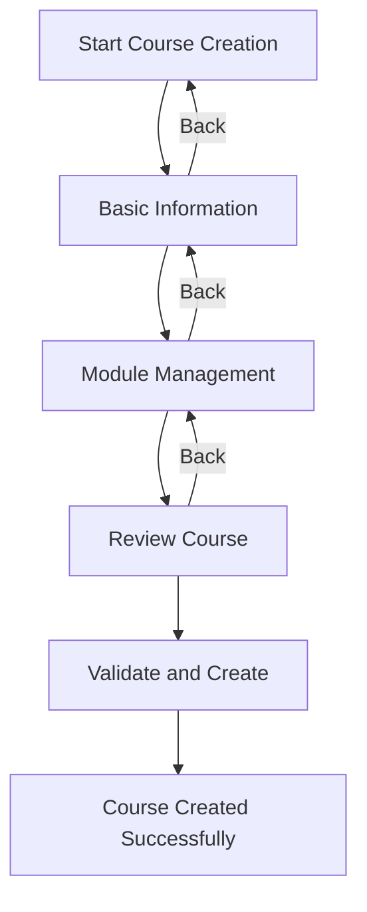
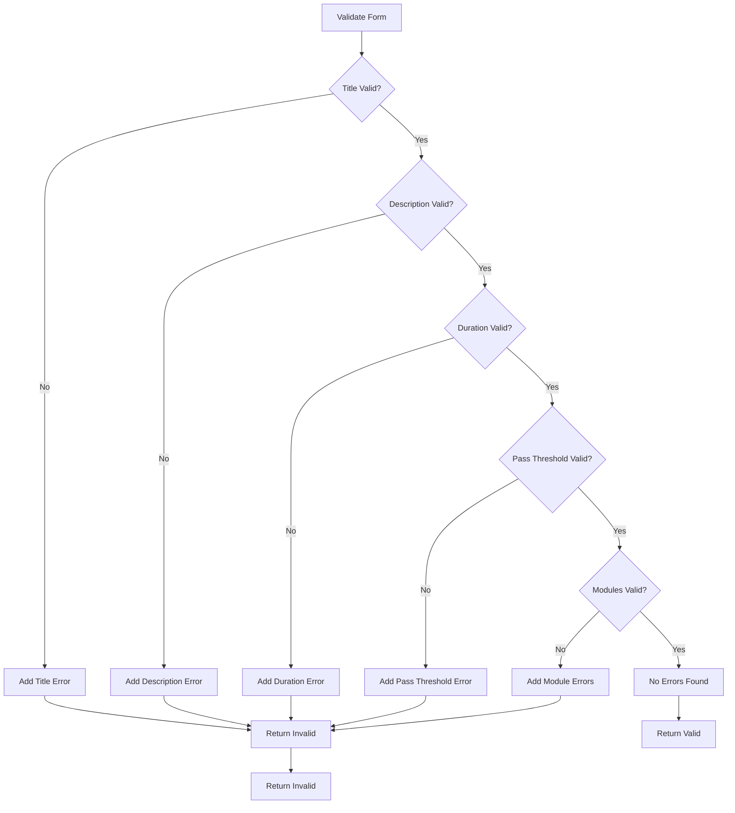
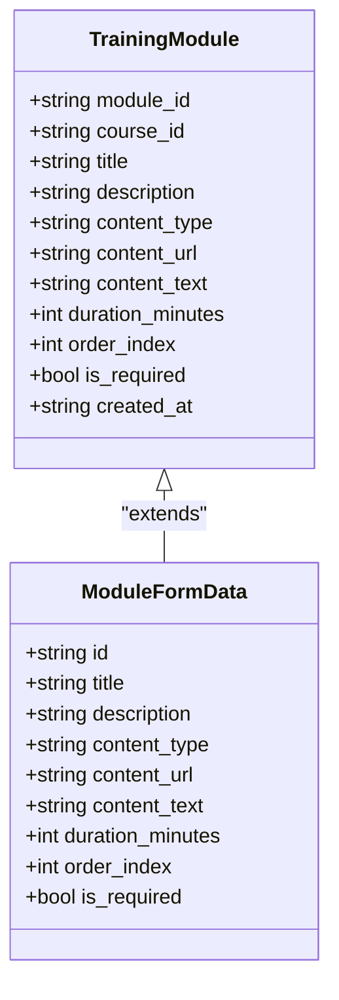
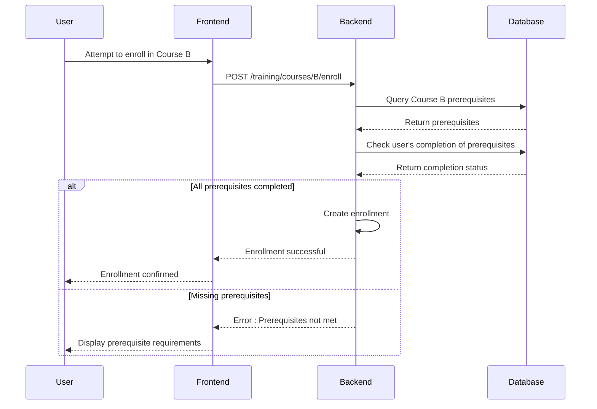
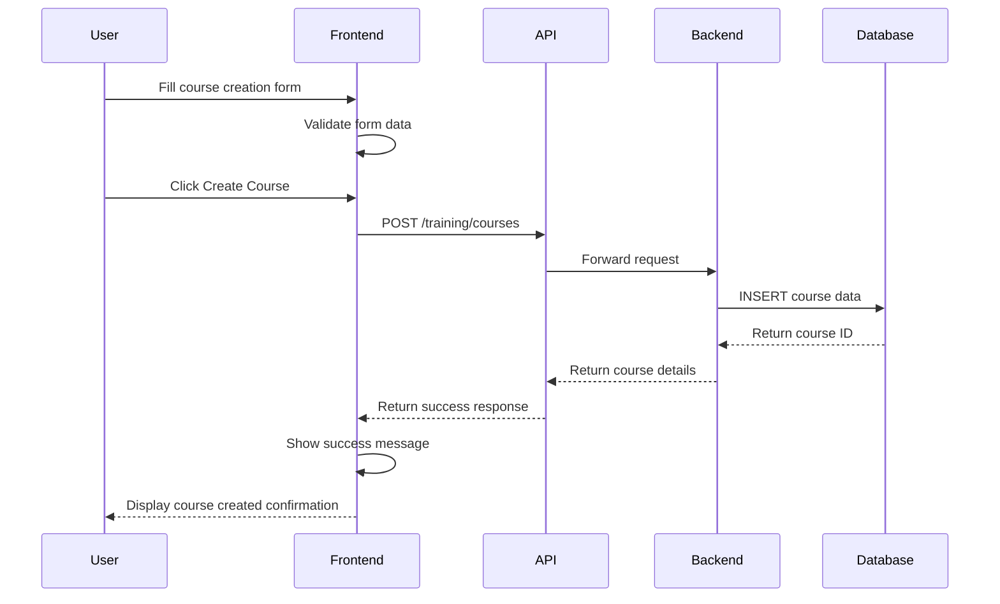
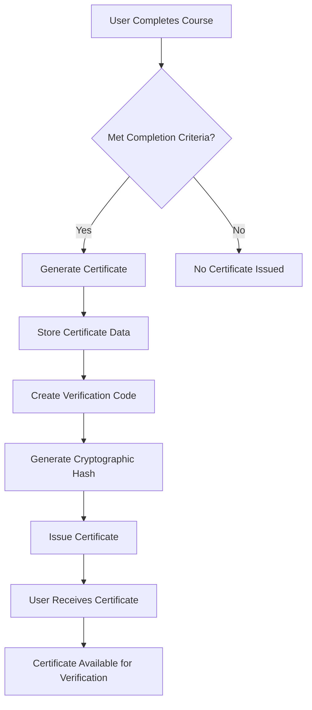

# Course Management

<cite>
**Referenced Files in This Document**   
- [CourseCreation.tsx](file://frontend/src/components/Training/CourseCreation.tsx)
- [useTraining.ts](file://frontend/src/hooks/useTraining.ts)
- [training_api_handlers.cpp](file://shared/training/training_api_handlers.cpp)
- [schema.sql](file://schema.sql)
- [TrainingProgress.tsx](file://frontend/src/components/Training/TrainingProgress.tsx)
- [CertificateManagement.tsx](file://frontend/src/components/Training/CertificateManagement.tsx)
</cite>

## Table of Contents
1. [Introduction](#introduction)
2. [Domain Model](#domain-model)
3. [Course Creation Workflow](#course-creation-workflow)
4. [Form Validation](#form-validation)
5. [Module Management](#module-management)
6. [Prerequisite Configuration](#prerequisite-configuration)
7. [API Integration](#api-integration)
8. [Common Issues and Solutions](#common-issues-and-solutions)
9. [Configuration Options](#configuration-options)
10. [Certificate Management](#certificate-management)
11. [Data Model](#data-model)
12. [Conclusion](#conclusion)

## Introduction
The Course Management feature in the Regulens platform provides a comprehensive system for creating, updating, and managing training courses. This documentation details the implementation of course creation, module management, prerequisite configuration, and related functionality. The system supports various course types, difficulty levels, and completion criteria, enabling organizations to deliver structured training programs for compliance, technical skills, regulatory knowledge, security awareness, ethics, and general professional development.

The feature includes a user-friendly interface for course creation with validation, module sequencing, and prerequisite management. It integrates with backend services for data persistence, user enrollment, progress tracking, and certificate issuance. The implementation follows a modular architecture with clear separation between frontend components, API hooks, and backend handlers.

**Section sources**
- [CourseCreation.tsx](file://frontend/src/components/Training/CourseCreation.tsx)

## Domain Model
The course management system is built around several core entities that represent courses, modules, user enrollments, and certifications. These entities form a hierarchical relationship where courses contain modules, users enroll in courses, and successful completion results in certifications.

The primary entities are:
- **Course**: Represents a training program with metadata such as title, description, type, difficulty level, duration, and completion criteria
- **Module**: Represents a discrete unit of content within a course, with its own title, description, content type, duration, and sequence
- **Enrollment**: Represents a user's participation in a course, tracking progress, completion status, and quiz scores
- **Certification**: Represents formal recognition of course completion, with verification capabilities

Courses can have prerequisites that must be completed before enrollment, creating a dependency chain that ensures proper learning progression. The system also supports tagging for categorization and searchability.

**Section sources**
- [useTraining.ts](file://frontend/src/hooks/useTraining.ts)
- [training_api_handlers.cpp](file://shared/training/training_api_handlers.cpp)

## Course Creation Workflow
The course creation process follows a structured three-step workflow that guides users through the complete course setup. This progressive disclosure approach reduces cognitive load and ensures all necessary information is provided.

### Step 1: Basic Information
The first step collects essential course metadata:
- **Title**: Required field with minimum 5-character validation
- **Description**: Required field with minimum 20-character validation
- **Course Type**: Selection from predefined categories (compliance, technical, regulatory, security, ethics, general)
- **Difficulty Level**: Selection from beginner, intermediate, advanced, or expert
- **Duration**: Estimated completion time in minutes with minimum 15-minute requirement
- **Pass Threshold**: Minimum score percentage required for course completion
- **Tags**: Optional keywords for categorization and search
- **Prerequisites**: Optional list of courses that must be completed first

### Step 2: Module Management
The second step focuses on creating and organizing course content through modules:
- **Add Modules**: Users can add multiple modules to structure the course content
- **Module Sequencing**: Modules can be reordered using up/down controls to establish the learning path
- **Content Types**: Each module supports different content types (video, text, interactive, quiz, document)
- **Duration Management**: Each module has its own duration that contributes to the overall course time

### Step 3: Review and Creation
The final step provides a comprehensive review of all course details before creation:
- **Course Summary**: Displays all course metadata in a formatted view
- **Module Summary**: Lists all modules with their titles, durations, and types
- **Final Validation**: Performs comprehensive validation before submission
- **Creation**: Submits the course data to the backend for persistence

The workflow uses a progress indicator to show completion status and allows navigation between steps for editing.

**Diagram sources**
- [CourseCreation.tsx](file://frontend/src/components/Training/CourseCreation.tsx)

**Section sources**
- [CourseCreation.tsx](file://frontend/src/components/Training/CourseCreation.tsx)

## Form Validation
The course creation form implements comprehensive client-side validation to ensure data quality and prevent submission of incomplete or invalid courses.

### Field-Level Validation
Each field has specific validation rules:
- **Title**: Required, minimum 5 characters
- **Description**: Required, minimum 20 characters
- **Duration**: Minimum 15 minutes
- **Pass Threshold**: Between 0 and 100
- **Module Titles**: Must be unique within a course
- **Module Duration**: Minimum 1 minute per module

Validation errors are displayed inline with descriptive messages and visual indicators (red borders, warning icons).

### Cross-Field Validation
The system performs additional validation that involves multiple fields:
- **Module Uniqueness**: Ensures no duplicate module titles exist
- **Duration Consistency**: Compares user-entered duration with calculated duration from modules
- **Prerequisite Validation**: Verifies prerequisite courses exist in the system

### Validation Implementation
The validation is implemented in the `validateForm` function within the CourseCreation component:

**Diagram sources**
- [CourseCreation.tsx](file://frontend/src/components/Training/CourseCreation.tsx)

**Section sources**
- [CourseCreation.tsx](file://frontend/src/components/Training/CourseCreation.tsx)

## Module Management
The module management system provides a flexible way to structure course content into discrete, manageable units.

### Module Structure
Each module contains the following properties:
- **Title**: Descriptive name of the module
- **Description**: Learning objectives and content overview
- **Content Type**: Determines the presentation format
- **Duration**: Estimated time to complete the module
- **Order Index**: Position in the course sequence
- **Required Status**: Whether the module is mandatory

### Content Types
The system supports multiple content types to accommodate different learning styles:
- **Video**: External video content with URL reference
- **Text Content**: Reading materials and articles
- **Interactive**: Simulations and interactive exercises
- **Quiz**: Knowledge assessments with scoring
- **Document**: Downloadable resources like PDFs

### Module Operations
Users can perform several operations on modules:
- **Add**: Create new modules with default values
- **Edit**: Modify module properties through inline editing
- **Remove**: Delete modules with confirmation
- **Reorder**: Change module sequence using drag controls
- **Duplicate**: Copy existing modules as templates

The interface provides visual feedback for module status and progress, with color-coded indicators for required modules and completion status.

**Diagram sources**
- [CourseCreation.tsx](file://frontend/src/components/Training/CourseCreation.tsx)
- [useTraining.ts](file://frontend/src/hooks/useTraining.ts)

**Section sources**
- [CourseCreation.tsx](file://frontend/src/components/Training/CourseCreation.tsx)
- [useTraining.ts](file://frontend/src/hooks/useTraining.ts)

## Prerequisite Configuration
The prerequisite system ensures proper learning progression by requiring completion of foundational courses before enrolling in advanced ones.

### Prerequisite Implementation
Prerequisites are implemented as a simple list of course identifiers that must be completed before enrollment. The system validates prerequisites at enrollment time, not during course creation.

### Validation Process
When a user attempts to enroll in a course with prerequisites:
1. The system checks if the user has completed all prerequisite courses
2. If any prerequisite is missing, enrollment is blocked
3. The user receives a clear error message indicating which prerequisites are required

The validation occurs in the `handle_enroll_user` method of the TrainingAPIHandlers class, which queries the database to verify completion status of prerequisite courses.

### User Experience
The course creation interface allows administrators to specify prerequisites through a simple input field:
- **Add Prerequisite**: Enter the name of a prerequisite course
- **Remove Prerequisite**: Delete prerequisites with a remove button
- **Visual Indicators**: Prerequisites are displayed as removable tags

The system does not validate the existence of prerequisite courses during creation, allowing for flexible course planning. Validation occurs at enrollment time when the actual courses must exist.

**Diagram sources**
- [training_api_handlers.cpp](file://shared/training/training_api_handlers.cpp)
- [CourseCreation.tsx](file://frontend/src/components/Training/CourseCreation.tsx)

**Section sources**
- [training_api_handlers.cpp](file://shared/training/training_api_handlers.cpp)
- [CourseCreation.tsx](file://frontend/src/components/Training/CourseCreation.tsx)

## API Integration
The course management system integrates with backend services through a well-defined API layer that handles data persistence, retrieval, and business logic.

### Frontend Hooks
The frontend uses React Query hooks to manage API interactions:
- **useCreateCourse**: Creates new courses
- **useUpdateCourse**: Updates existing courses
- **useDeleteCourse**: Deletes courses
- **useCourses**: Retrieves course listings
- **useCourse**: Retrieves specific course details

These hooks handle data fetching, caching, and mutation with automatic query invalidation to keep the UI synchronized with the backend.

### Backend Handlers
The backend implements RESTful endpoints in the TrainingAPIHandlers class:
- **handle_create_course**: Creates courses in the database
- **handle_get_courses**: Retrieves course listings with filtering
- **handle_get_course_by_id**: Retrieves specific course details
- **handle_update_course**: Updates course information
- **handle_delete_course**: Marks courses as inactive

The handlers use PostgreSQL for data persistence with proper error handling and logging.

### Data Flow
The data flow follows a consistent pattern:
1. User interacts with the frontend interface
2. Frontend hook triggers API call
3. Backend handler processes the request
4. Database operation is performed
5. Response is returned to frontend
6. UI is updated based on the result

**Diagram sources**
- [useTraining.ts](file://frontend/src/hooks/useTraining.ts)
- [training_api_handlers.cpp](file://shared/training/training_api_handlers.cpp)

**Section sources**
- [useTraining.ts](file://frontend/src/hooks/useTraining.ts)
- [training_api_handlers.cpp](file://shared/training/training_api_handlers.cpp)

## Common Issues and Solutions
The course management system addresses several common challenges in training platform implementation.

### Prerequisite Validation Issues
**Issue**: Users cannot enroll in courses due to unmet prerequisites.
**Solution**: The system provides clear error messages indicating which prerequisites are required. Administrators can review prerequisite requirements in the course creation interface and adjust them as needed.

### Module Sequencing Problems
**Issue**: Modules appear in incorrect order, disrupting the learning flow.
**Solution**: The interface includes up/down buttons to reorder modules. The system automatically updates order indices when modules are moved, ensuring consistent sequencing.

### Duration Mismatch
**Issue**: Manually entered course duration doesn't match the sum of module durations.
**Solution**: The system calculates the total duration from modules and displays both values for comparison. Users can choose to use the calculated duration or override it.

### Duplicate Module Titles
**Issue**: Multiple modules with the same title can cause confusion.
**Solution**: The validation system checks for duplicate module titles and prevents form submission until they are resolved.

### Performance Optimization
**Issue**: Large courses with many modules may impact performance.
**Solution**: The system implements query optimization with proper database indexing on frequently accessed fields like course_id, user_id, and status.

### Data Consistency
**Issue**: Ensuring data consistency across related tables.
**Solution**: The database schema uses foreign key constraints and cascading deletes to maintain referential integrity. For example, when a course is deleted, related enrollments and quiz submissions are automatically removed.

## Configuration Options
The course management system provides several configuration options to customize course behavior and appearance.

### Course Types
Courses can be categorized into different types:
- **Compliance Training**: Regulatory compliance and AML training
- **Technical Skills**: Technical skills and system training
- **Regulatory Knowledge**: Regulatory frameworks and requirements
- **Security Awareness**: Information security and cybersecurity
- **Ethics & Conduct**: Ethical standards and professional conduct
- **General Training**: General business and professional development

### Difficulty Levels
Courses are assigned difficulty levels with visual indicators:
- **Beginner**: No prior knowledge required (green)
- **Intermediate**: Some prior knowledge recommended (yellow)
- **Advanced**: Strong background knowledge required (orange)
- **Expert**: Deep expertise and experience required (red)

### Completion Criteria
Courses have configurable completion requirements:
- **Pass Threshold**: Minimum score percentage required (default: 80%)
- **Required Modules**: Modules marked as required must be completed
- **Quiz Attempts**: Configurable number of attempts allowed
- **Time Limits**: Optional time limits for quizzes

### Visual Configuration
Courses can be customized with visual elements:
- **Tags**: Color-coded tags for categorization
- **Icons**: Type-specific icons for visual identification
- **Colors**: Status indicators with color coding
- **Badges**: Achievement indicators for completed courses

These configuration options are accessible through the course creation interface, allowing administrators to tailor courses to specific training needs.

**Section sources**
- [CourseCreation.tsx](file://frontend/src/components/Training/CourseCreation.tsx)
- [useTraining.ts](file://frontend/src/hooks/useTraining.ts)

## Certificate Management
The certificate management system handles the issuance, verification, and tracking of course completion certificates.

### Certificate Issuance
Certificates are automatically issued when users meet completion criteria:
- **Completion Requirements**: User must achieve the required pass threshold
- **Automatic Generation**: Certificates are generated upon successful completion
- **Verification Codes**: Each certificate has a unique verification code
- **Digital Signatures**: Certificates include cryptographic hashes for authenticity

### Certificate Features
Issued certificates include:
- **Unique Identifier**: Certificate number and verification code
- **Recipient Information**: User name and email
- **Course Details**: Course title and completion date
- **Performance Data**: Final score and completion time
- **Security Features**: QR code and digital signature

### Verification System
The system provides multiple ways to verify certificate authenticity:
- **Verification Code**: Unique code that can be validated through the API
- **QR Code**: Scannable code linking to verification page
- **Blockchain-like Hashing**: Cryptographic hash to detect tampering
- **Public Verification**: Anyone can verify a certificate with the code

The CertificateManagement component provides an interface for administrators to view, download, share, and revoke certificates as needed.

**Diagram sources**
- [CertificateManagement.tsx](file://frontend/src/components/Training/CertificateManagement.tsx)
- [training_api_handlers.cpp](file://shared/training/training_api_handlers.cpp)

**Section sources**
- [CertificateManagement.tsx](file://frontend/src/components/Training/CertificateManagement.tsx)
- [training_api_handlers.cpp](file://shared/training/training_api_handlers.cpp)

## Data Model
The course management system uses a relational database schema to store course-related data.

### Core Tables
The primary tables are:

**training_courses**: Stores course metadata
- course_id (UUID, primary key)
- title (VARCHAR)
- description (TEXT)
- course_type (VARCHAR with constraints)
- difficulty_level (VARCHAR with constraints)
- duration_minutes (INTEGER)
- pass_threshold (DECIMAL)
- prerequisites (JSONB)
- tags (JSONB)
- is_active (BOOLEAN)
- created_at (TIMESTAMP)
- updated_at (TIMESTAMP)
- created_by (UUID, foreign key to users)

**training_modules**: Stores module content
- module_id (UUID, primary key)
- course_id (UUID, foreign key to training_courses)
- title (VARCHAR)
- description (TEXT)
- content_type (VARCHAR)
- content_url (TEXT)
- content_text (TEXT)
- duration_minutes (INTEGER)
- order_index (INTEGER)
- is_required (BOOLEAN)
- created_at (TIMESTAMP)

**training_enrollments**: Tracks user participation
- enrollment_id (UUID, primary key)
- user_id (UUID, foreign key to users)
- course_id (UUID, foreign key to training_courses)
- enrollment_date (TIMESTAMP)
- progress (DECIMAL)
- current_module (INTEGER)
- status (VARCHAR with constraints)
- quiz_attempts (INTEGER)
- quiz_score (DECIMAL)
- completed_at (TIMESTAMP)
- certificate_issued (BOOLEAN)
- certificate_url (TEXT)
- last_accessed (TIMESTAMP)

**training_certifications**: Manages issued certificates
- certification_id (UUID, primary key)
- user_id (UUID, foreign key to users)
- course_id (UUID, foreign key to training_courses)
- certification_name (VARCHAR)
- issued_date (TIMESTAMP)
- expiry_date (TIMESTAMP)
- certificate_url (TEXT)
- certificate_hash (VARCHAR)
- verification_code (VARCHAR)
- is_valid (BOOLEAN)

### Indexes
The schema includes indexes for performance optimization:
- Index on training_courses(course_type)
- Index on training_courses(difficulty_level)
- Index on training_courses(is_active)
- Index on training_courses(created_by)
- Index on training_courses(tags) using GIN
- Index on training_enrollments(user_id)
- Index on training_enrollments(course_id)
- Index on training_enrollments(status)
- Index on training_certifications(verification_code)

### Constraints
The schema enforces data integrity through constraints:
- Foreign key relationships with cascading deletes
- Check constraints on enumerated fields
- Unique constraints on verification codes and certificate hashes
- Not null constraints on required fields

**Section sources**
- [schema.sql](file://schema.sql)

## Conclusion
The Course Management feature in the Regulens platform provides a comprehensive solution for creating, managing, and delivering training courses. The system combines a user-friendly interface with robust backend functionality to support organizational training needs.

Key strengths of the implementation include:
- **Structured Workflow**: The three-step course creation process guides users through setup
- **Comprehensive Validation**: Client-side and server-side validation ensure data quality
- **Flexible Content**: Support for multiple content types accommodates different learning styles
- **Prerequisite Management**: Ensures proper learning progression through dependency chains
- **Certificate System**: Provides verifiable credentials for course completion
- **Analytics Integration**: Tracks user progress and course performance

The modular architecture separates concerns between frontend components, API hooks, and backend handlers, making the system maintainable and extensible. The use of modern technologies like React, TypeScript, and PostgreSQL ensures performance and reliability.

Future enhancements could include:
- Advanced content authoring tools
- SCORM/xAPI compliance
- Mobile learning support
- AI-powered course recommendations
- Gamification elements
- Social learning features

The current implementation provides a solid foundation for an enterprise-grade training management system that can scale to meet growing organizational needs.

**Section sources**
- [CourseCreation.tsx](file://frontend/src/components/Training/CourseCreation.tsx)
- [useTraining.ts](file://frontend/src/hooks/useTraining.ts)
- [training_api_handlers.cpp](file://shared/training/training_api_handlers.cpp)
- [schema.sql](file://schema.sql)
- [TrainingProgress.tsx](file://frontend/src/components/Training/TrainingProgress.tsx)
- [CertificateManagement.tsx](file://frontend/src/components/Training/CertificateManagement.tsx)