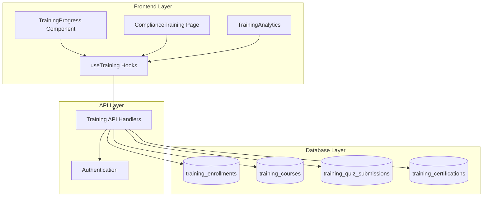
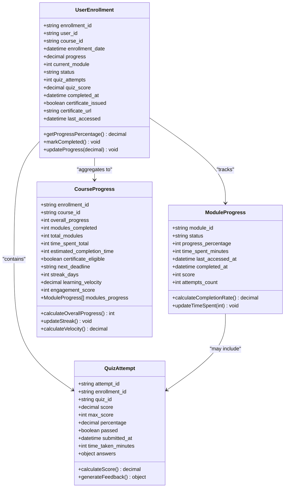
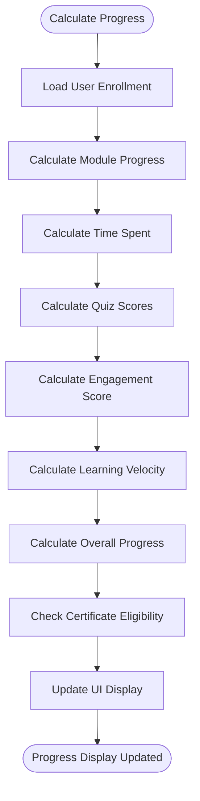
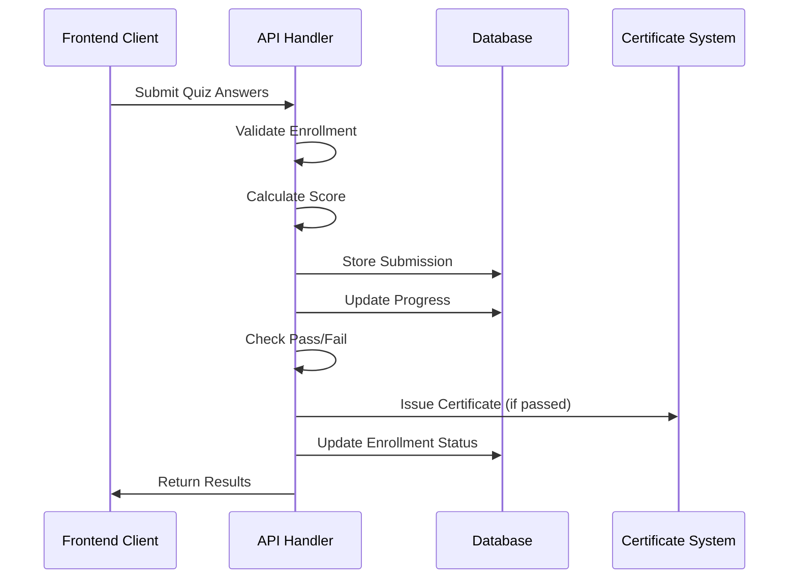
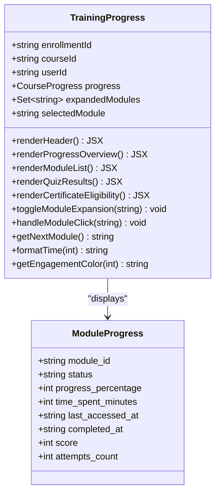
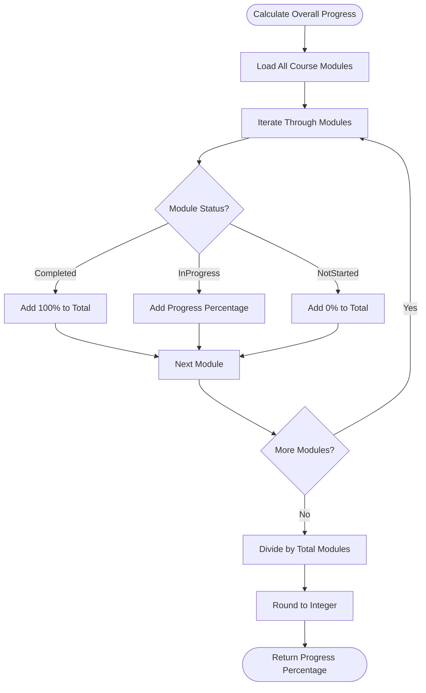
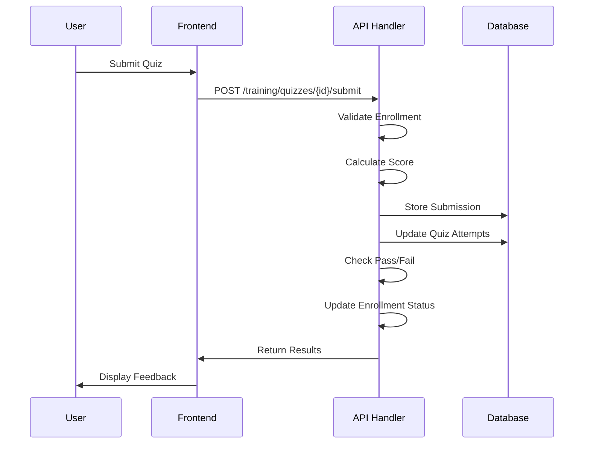
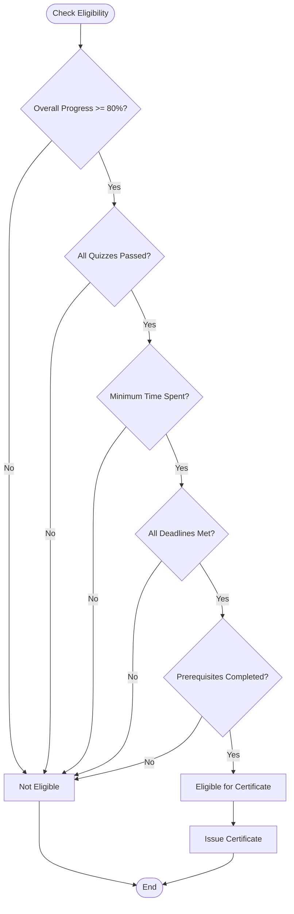
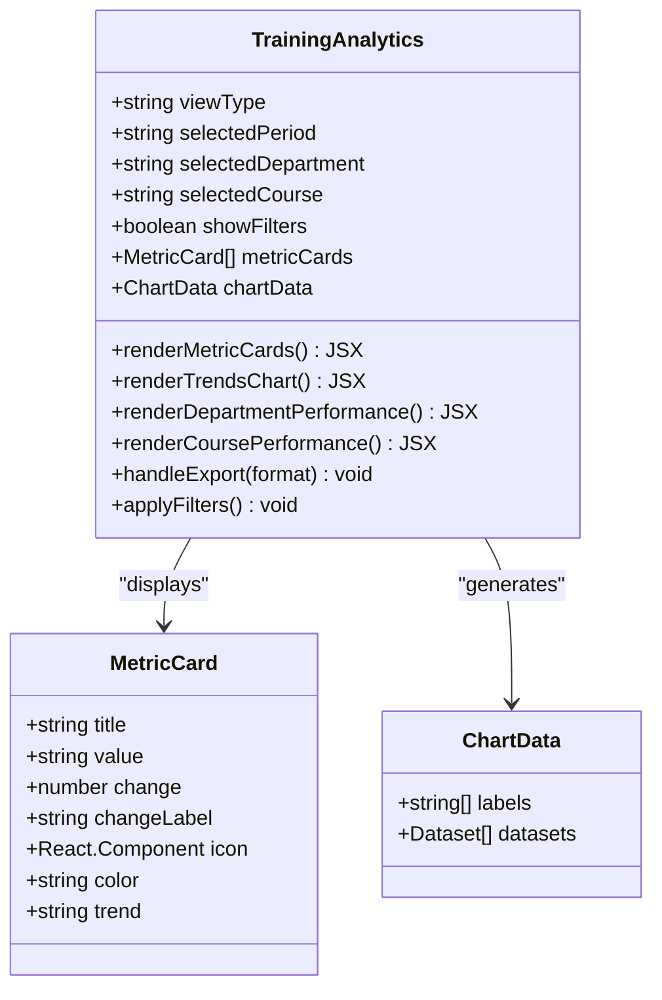

# Progress Tracking

<cite>
**Referenced Files in This Document**
- [TrainingProgress.tsx](file://frontend/src/components/Training/TrainingProgress.tsx)
- [useTraining.ts](file://frontend/src/hooks/useTraining.ts)
- [training_api_handlers.cpp](file://shared/training/training_api_handlers.cpp)
- [training_api_handlers.hpp](file://shared/training/training_api_handlers.hpp)
- [schema.sql](file://schema.sql)
- [CourseCreation.tsx](file://frontend/src/components/Training/CourseCreation.tsx)
- [TrainingAnalytics.tsx](file://frontend/src/components/Training/TrainingAnalytics.tsx)
- [ComplianceTraining.tsx](file://frontend/src/pages/ComplianceTraining.tsx)
</cite>

## Table of Contents
1. [Introduction](#introduction)
2. [System Architecture](#system-architecture)
3. [Domain Model](#domain-model)
4. [Progress Tracking Implementation](#progress-tracking-implementation)
5. [API Handlers](#api-handlers)
6. [Frontend Components](#frontend-components)
7. [Database Schema](#database-schema)
8. [Progress Calculation Logic](#progress-calculation-logic)
9. [Quiz Performance Tracking](#quiz-performance-tracking)
10. [Certificate Eligibility](#certificate-eligibility)
11. [Analytics and Reporting](#analytics-and-reporting)
12. [Common Issues and Solutions](#common-issues-and-solutions)
13. [Configuration Options](#configuration-options)
14. [Best Practices](#best-practices)

## Introduction

The Progress Tracking sub-feature is a comprehensive system designed to monitor and manage user progress through training courses. It provides real-time tracking of enrollment status, module completion, time spent, quiz performance, and learning velocity metrics. The system offers both granular individual progress tracking and aggregated analytics for organizational oversight.

The implementation follows a modern React-based frontend architecture with a C++ backend API handler system, utilizing PostgreSQL for data persistence. The system tracks multiple dimensions of progress including completion rates, engagement scores, time tracking, and quiz performance metrics.

## System Architecture

The progress tracking system consists of several interconnected components working together to provide comprehensive training progress monitoring:



**Diagram sources**
- [TrainingProgress.tsx](file://frontend/src/components/Training/TrainingProgress.tsx#L1-L50)
- [useTraining.ts](file://frontend/src/hooks/useTraining.ts#L1-L100)
- [training_api_handlers.cpp](file://shared/training/training_api_handlers.cpp#L1-L50)

## Domain Model

The progress tracking system is built around several core domain entities that represent different aspects of training progress:



**Diagram sources**
- [useTraining.ts](file://frontend/src/hooks/useTraining.ts#L15-L100)
- [TrainingProgress.tsx](file://frontend/src/components/Training/TrainingProgress.tsx#L40-L80)

**Section sources**
- [useTraining.ts](file://frontend/src/hooks/useTraining.ts#L15-L100)
- [TrainingProgress.tsx](file://frontend/src/components/Training/TrainingProgress.tsx#L40-L80)

## Progress Tracking Implementation

The progress tracking implementation centers around the `TrainingProgress` component, which serves as the primary interface for displaying and managing user progress through training courses.

### Core Progress Data Structure

The system maintains detailed progress information through a comprehensive data structure:

```typescript
interface CourseProgress {
  enrollment_id: string;
  course_id: string;
  overall_progress: number;
  modules_completed: number;
  total_modules: number;
  time_spent_total: number;
  estimated_completion_time: number;
  certificate_eligible: boolean;
  next_deadline?: string;
  streak_days: number;
  learning_velocity: number;
  engagement_score: number;
  modules_progress: ModuleProgress[];
}
```

### Progress Calculation Logic

The system calculates various progress metrics dynamically:



**Diagram sources**
- [TrainingProgress.tsx](file://frontend/src/components/Training/TrainingProgress.tsx#L114-L161)

### Module Progress Tracking

Each module maintains its own progress state with detailed tracking:

```typescript
interface ModuleProgress {
  module_id: string;
  status: 'not_started' | 'in_progress' | 'completed';
  progress_percentage: number;
  time_spent_minutes: number;
  last_accessed_at?: string;
  completed_at?: string;
  score?: number;
  attempts_count: number;
}
```

The system tracks:
- **Status**: Current state of module completion
- **Progress Percentage**: Numeric representation of completion
- **Time Spent**: Accumulated time spent on module
- **Access History**: Timestamps for tracking engagement
- **Quiz Performance**: Scores and attempt counts
- **Completion Metrics**: Final completion timestamps

**Section sources**
- [TrainingProgress.tsx](file://frontend/src/components/Training/TrainingProgress.tsx#L40-L80)
- [TrainingProgress.tsx](file://frontend/src/components/Training/TrainingProgress.tsx#L114-L161)

## API Handlers

The backend API handlers manage all progress tracking operations through a robust C++ implementation:

### Enrollment Progress Updates

The system handles progress updates through dedicated API endpoints:

```cpp
std::string TrainingAPIHandlers::handle_update_progress(const std::string& enrollment_id, const std::string& request_body) {
    try {
        json request = json::parse(request_body);
        
        double progress = request["progress"];
        int current_module = request["current_module"];
        
        // Update database record
        const char* params[3] = {
            std::to_string(progress).c_str(),
            std::to_string(current_module).c_str(),
            enrollment_id.c_str()
        };
        
        PGresult* result = PQexecParams(
            conn,
            "UPDATE training_enrollments SET progress = $1, current_module = $2, "
            "last_accessed = CURRENT_TIMESTAMP WHERE enrollment_id = $3 "
            "RETURNING enrollment_id, progress, current_module, last_accessed",
            3, nullptr, params, nullptr, nullptr, 0
        );
        
        return serialize_enrollment(result, 0);
    } catch (const std::exception& e) {
        logger_->log(LogLevel::ERROR, "Exception in handle_update_progress: " + std::string(e.what()));
        return R"({"error": "Internal server error"})";
    }
}
```

### Quiz Submission Processing

Quiz submissions trigger comprehensive progress calculations:



**Diagram sources**
- [training_api_handlers.cpp](file://shared/training/training_api_handlers.cpp#L499-L527)

**Section sources**
- [training_api_handlers.cpp](file://shared/training/training_api_handlers.cpp#L1062-L1097)
- [training_api_handlers.cpp](file://shared/training/training_api_handlers.cpp#L499-L527)

## Frontend Components

The frontend implementation provides rich, interactive progress tracking through specialized React components:

### TrainingProgress Component

The main progress tracking component displays comprehensive progress information:



**Diagram sources**
- [TrainingProgress.tsx](file://frontend/src/components/Training/TrainingProgress.tsx#L60-L120)

### Progress Visualization

The component provides multiple visualization modes:

1. **Progress Bars**: Visual representation of overall progress
2. **Module Status Indicators**: Color-coded module statuses
3. **Time Tracking**: Detailed time spent on each module
4. **Engagement Metrics**: Learning velocity and streak tracking
5. **Quiz Performance**: Historical quiz results and scores

### Interactive Features

The component supports rich user interactions:

- **Module Expansion**: Clickable modules with detailed information
- **Progress Tracking**: Real-time progress updates
- **Navigation**: Seamless navigation between modules
- **Action Buttons**: Start, continue, review actions
- **Certificate Claims**: Direct certificate issuance process

**Section sources**
- [TrainingProgress.tsx](file://frontend/src/components/Training/TrainingProgress.tsx#L60-L120)
- [TrainingProgress.tsx](file://frontend/src/components/Training/TrainingProgress.tsx#L292-L357)

## Database Schema

The database schema supports comprehensive progress tracking with optimized indexing for performance:

### Core Tables

```sql
-- Training Enrollments Table
CREATE TABLE IF NOT EXISTS training_enrollments (
    enrollment_id UUID PRIMARY KEY DEFAULT gen_random_uuid(),
    user_id UUID NOT NULL REFERENCES users(id) ON DELETE CASCADE,
    course_id UUID NOT NULL REFERENCES training_courses(course_id) ON DELETE CASCADE,
    enrollment_date TIMESTAMP WITH TIME ZONE DEFAULT CURRENT_TIMESTAMP,
    progress DECIMAL(5,2) DEFAULT 0.0 CHECK (progress >= 0 AND progress <= 100),
    current_module INTEGER DEFAULT 1 CHECK (current_module > 0),
    status VARCHAR(20) DEFAULT 'enrolled' CHECK (status IN ('enrolled', 'in_progress', 'completed', 'dropped')),
    quiz_attempts INTEGER DEFAULT 0 CHECK (quiz_attempts >= 0),
    quiz_score DECIMAL(5,2),
    completed_at TIMESTAMP WITH TIME ZONE,
    certificate_issued BOOLEAN DEFAULT false,
    certificate_url TEXT,
    last_accessed TIMESTAMP WITH TIME ZONE DEFAULT CURRENT_TIMESTAMP,
    
    CONSTRAINT unique_enrollment UNIQUE (user_id, course_id),
    CONSTRAINT valid_progress CHECK (progress >= 0 AND progress <= 100),
    CONSTRAINT valid_quiz_attempts CHECK (quiz_attempts >= 0)
);

-- Quiz Submissions Table
CREATE TABLE IF NOT EXISTS training_quiz_submissions (
    submission_id UUID PRIMARY KEY DEFAULT gen_random_uuid(),
    enrollment_id UUID NOT NULL REFERENCES training_enrollments(enrollment_id) ON DELETE CASCADE,
    quiz_id VARCHAR(50) NOT NULL,
    user_answers JSONB NOT NULL,
    score DECIMAL(5,2) NOT NULL CHECK (score >= 0 AND score <= 100),
    passed BOOLEAN NOT NULL,
    submitted_at TIMESTAMP WITH TIME ZONE DEFAULT CURRENT_TIMESTAMP,
    time_taken_seconds INTEGER CHECK (time_taken_seconds >= 0),
    feedback JSONB,
    
    CONSTRAINT valid_score CHECK (score >= 0 AND score <= 100),
    CONSTRAINT valid_time_taken CHECK (time_taken_seconds >= 0)
);

-- Certifications Table
CREATE TABLE IF NOT EXISTS training_certifications (
    certification_id UUID PRIMARY KEY DEFAULT gen_random_uuid(),
    user_id UUID NOT NULL REFERENCES users(id) ON DELETE CASCADE,
    course_id UUID NOT NULL REFERENCES training_courses(course_id) ON DELETE CASCADE,
    certification_name VARCHAR(255) NOT NULL,
    issued_date TIMESTAMP WITH TIME ZONE DEFAULT CURRENT_TIMESTAMP,
    expiry_date TIMESTAMP WITH TIME ZONE,
    certificate_url TEXT NOT NULL,
    certificate_hash VARCHAR(64) NOT NULL UNIQUE,
    verification_code VARCHAR(20) NOT NULL UNIQUE,
    is_valid BOOLEAN DEFAULT true,
    
    CONSTRAINT unique_user_course_cert UNIQUE (user_id, course_id),
    CONSTRAINT valid_verification_code CHECK (verification_code ~ '^[A-Z0-9-]{12,20}$')
);
```

### Indexes for Performance

The schema includes optimized indexes for common queries:

```sql
-- Performance indexes
CREATE INDEX IF NOT EXISTS idx_training_enrollments_user_id ON training_enrollments(user_id);
CREATE INDEX IF NOT EXISTS idx_training_enrollments_course_id ON training_enrollments(course_id);
CREATE INDEX IF NOT EXISTS idx_training_enrollments_status ON training_enrollments(status);
CREATE INDEX IF NOT EXISTS idx_training_enrollments_progress ON training_enrollments(progress);
CREATE INDEX IF NOT EXISTS idx_training_enrollments_completed_at ON training_enrollments(completed_at);
CREATE INDEX IF NOT EXISTS idx_training_enrollments_last_accessed ON training_enrollments(last_accessed);

CREATE INDEX IF NOT EXISTS idx_training_quiz_submissions_enrollment ON training_quiz_submissions(enrollment_id);
CREATE INDEX IF NOT EXISTS idx_training_quiz_submissions_quiz_id ON training_quiz_submissions(quiz_id);
CREATE INDEX IF NOT EXISTS idx_training_quiz_submissions_score ON training_quiz_submissions(score);
CREATE INDEX IF NOT EXISTS idx_training_quiz_submissions_submitted_at ON training_quiz_submissions(submitted_at);

CREATE INDEX IF NOT EXISTS idx_training_certifications_user_id ON training_certifications(user_id);
CREATE INDEX IF NOT EXISTS idx_training_certifications_course_id ON training_certifications(course_id);
CREATE INDEX IF NOT EXISTS idx_training_certifications_verification_code ON training_certifications(verification_code);
CREATE INDEX IF NOT EXISTS idx_training_certifications_hash ON training_certifications(certificate_hash);
CREATE INDEX IF NOT EXISTS idx_training_certifications_is_valid ON training_certifications(is_valid);
CREATE INDEX IF NOT EXISTS idx_training_certifications_expiry_date ON training_certifications(expiry_date);
```

**Section sources**
- [schema.sql](file://schema.sql#L6500-L6600)
- [schema.sql](file://schema.sql#L6524-L6555)

## Progress Calculation Logic

The system implements sophisticated algorithms for calculating various progress metrics:

### Overall Progress Calculation



**Diagram sources**
- [TrainingProgress.tsx](file://frontend/src/components/Training/TrainingProgress.tsx#L114-L161)

### Learning Velocity Calculation

Learning velocity is calculated as modules completed per day:

```typescript
// Learning velocity calculation
const calculateLearningVelocity = (modulesCompleted: number, startDate: Date): number => {
  const daysElapsed = Math.ceil((new Date().getTime() - startDate.getTime()) / (1000 * 60 * 60 * 24));
  return daysElapsed > 0 ? modulesCompleted / daysElapsed : 0;
};
```

### Engagement Score Calculation

The engagement score combines multiple factors:

```typescript
// Engagement score calculation
const calculateEngagementScore = (progress: CourseProgress): number => {
  const factors = [
    progress.overall_progress / 100,           // Progress factor
    Math.min(progress.learning_velocity, 2),   // Velocity factor (max 2 modules/day)
    Math.min(progress.streak_days / 7, 1),     // Streak factor (max weekly streak)
    progress.modules_completed / progress.total_modules // Completion factor
  ];
  
  return Math.round(factors.reduce((sum, factor) => sum + factor, 0) / factors.length * 100);
};
```

**Section sources**
- [TrainingProgress.tsx](file://frontend/src/components/Training/TrainingProgress.tsx#L340-L357)

## Quiz Performance Tracking

The system provides comprehensive quiz performance tracking with detailed analytics:

### Quiz Submission Process



**Diagram sources**
- [training_api_handlers.cpp](file://shared/training/training_api_handlers.cpp#L499-L527)

### Quiz Result Storage

Quiz submissions are stored with comprehensive metadata:

```typescript
interface QuizAttempt {
  attempt_id: string;
  enrollment_id: string;
  quiz_id: string;
  score: number;
  max_score: number;
  percentage: number;
  passed: boolean;
  submitted_at: string;
  time_taken_minutes: number;
  answers: Record<string, any>;
}
```

### Quiz Performance Analytics

The system tracks multiple quiz performance metrics:

- **Pass/Fail Rates**: Individual and course-wide pass/fail statistics
- **Average Scores**: Mean scores across all quiz attempts
- **Time Efficiency**: Average time taken per quiz
- **Attempt Distribution**: Number of attempts per quiz
- **Question-Level Analysis**: Individual question performance

**Section sources**
- [TrainingProgress.tsx](file://frontend/src/components/Training/TrainingProgress.tsx#L592-L609)
- [training_api_handlers.cpp](file://shared/training/training_api_handlers.cpp#L499-L527)

## Certificate Eligibility

The system automatically determines certificate eligibility based on comprehensive criteria:

### Eligibility Criteria



**Diagram sources**
- [TrainingProgress.tsx](file://frontend/src/components/Training/TrainingProgress.tsx#L632-L659)

### Certificate Generation Process

When eligibility criteria are met, the system automatically generates certificates:

```cpp
// Certificate issuance logic
if (passed) {
    certificate_url = generate_certificate_url(user_id, course_id);
    std::string cert_hash = generate_certificate_hash(user_id, course_id, std::to_string(std::time(nullptr)));

    const char* cert_params[4] = {
        user_id.c_str(),
        course_id.c_str(),
        certificate_url.c_str(),
        cert_hash.c_str()
    };

    PGresult* cert_result = PQexecParams(
        conn,
        "INSERT INTO training_certifications (user_id, course_id, certification_name, certificate_url, certificate_hash, verification_code) "
        "VALUES ($1, $2, (SELECT title || ' Certification' FROM training_courses WHERE course_id = $2), $3, $4, $5) "
        "RETURNING certification_id",
        4, nullptr, cert_params, nullptr, nullptr, 0
    );
    
    // Update enrollment to mark certificate as issued
    const char* cert_update_params[2] = {PQgetvalue(cert_result, 0, 0), enrollment_id.c_str()};
    PQexecParams(
        conn,
        "UPDATE training_enrollments SET certificate_issued = true, certificate_url = $1 WHERE enrollment_id = $2",
        2, nullptr, cert_update_params, nullptr, nullptr, 0
    );
}
```

**Section sources**
- [TrainingProgress.tsx](file://frontend/src/components/Training/TrainingProgress.tsx#L632-L659)
- [training_api_handlers.cpp](file://shared/training/training_api_handlers.cpp#L1260-L1285)

## Analytics and Reporting

The system provides comprehensive analytics and reporting capabilities:

### Training Analytics Component

The analytics component offers multiple visualization modes:



**Diagram sources**
- [TrainingAnalytics.tsx](file://frontend/src/components/Training/TrainingAnalytics.tsx#L60-L120)

### Key Analytics Metrics

The system tracks numerous key performance indicators:

1. **Enrollment Metrics**: Total enrollments, active users, completion rates
2. **Performance Metrics**: Average scores, pass/fail rates, quiz performance
3. **Engagement Metrics**: Time spent, learning velocity, streak tracking
4. **Business Metrics**: ROI, training hours, certificate issuance rates
5. **Departmental Metrics**: Departmental completion rates, average scores

### Export Capabilities

The analytics system supports multiple export formats:

- **PDF Reports**: Comprehensive formatted reports
- **CSV Data**: Raw data exports for analysis
- **Excel Spreadsheets**: Interactive spreadsheet exports
- **Custom Time Ranges**: Flexible date range selections

**Section sources**
- [TrainingAnalytics.tsx](file://frontend/src/components/Training/TrainingAnalytics.tsx#L60-L120)
- [TrainingAnalytics.tsx](file://frontend/src/components/Training/TrainingAnalytics.tsx#L700-L799)

## Common Issues and Solutions

### Progress Synchronization Issues

**Problem**: Progress not updating in real-time across sessions
**Solution**: Implement WebSocket connections for real-time updates or optimize polling intervals

```typescript
// Solution: Implement debounced progress updates
const debouncedUpdateProgress = debounce(async (progressData) => {
  await updateProgressMutation.mutateAsync(progressData);
}, 1000);
```

### Quiz Score Calculation Errors

**Problem**: Incorrect quiz scores due to floating-point precision
**Solution**: Use integer-based scoring with configurable point systems

```typescript
// Solution: Integer-based scoring
const calculateQuizScore = (userAnswers: any, correctAnswers: any): number => {
  const totalQuestions = Object.keys(correctAnswers).length;
  if (totalQuestions === 0) return 0;
  
  const correctCount = Object.entries(userAnswers).reduce((count, [questionId, answer]) => {
    return count + (correctAnswers[questionId] === answer ? 1 : 0);
  }, 0);
  
  return Math.round((correctCount / totalQuestions) * 100);
};
```

### Certificate Generation Failures

**Problem**: Certificate issuance fails due to concurrent requests
**Solution**: Implement database-level uniqueness constraints and retry logic

```cpp
// Solution: Database-level constraint enforcement
const char* cert_params[4] = {
    user_id.c_str(),
    course_id.c_str(),
    certificate_url.c_str(),
    cert_hash.c_str()
};

PGresult* cert_result = PQexecParams(
    conn,
    "INSERT INTO training_certifications (user_id, course_id, certification_name, certificate_url, certificate_hash, verification_code) "
    "VALUES ($1, $2, (SELECT title || ' Certification' FROM training_courses WHERE course_id = $2), $3, $4, $5) "
    "ON CONFLICT (user_id, course_id) DO NOTHING "
    "RETURNING certification_id",
    4, nullptr, cert_params, nullptr, nullptr, 0
);
```

### Performance Optimization

**Problem**: Slow progress calculations with large datasets
**Solution**: Implement server-side aggregation and caching

```cpp
// Solution: Server-side aggregation
std::string TrainingAPIHandlers::handle_get_user_progress(const std::string& user_id, const std::map<std::string, std::string>& query_params) {
    // Use pre-aggregated views for performance
    PGresult* result = PQexecParams(
        conn,
        "SELECT * FROM training_enrollment_details WHERE user_id = $1",
        1, nullptr, params, nullptr, nullptr, 0
    );
}
```

## Configuration Options

### Progress Thresholds

Configure various progress thresholds for different scenarios:

```typescript
// Configuration constants
const PROGRESS_THRESHOLDS = {
  MINIMUM_PROGRESS: 80,        // Minimum progress percentage for certificate eligibility
  QUIZ_PASS_THRESHOLD: 80,     // Minimum quiz pass percentage
  MODULE_COMPLETION_TIME: 15,  // Minimum time spent per module (minutes)
  STREAK_THRESHOLD: 5,         // Minimum consecutive days for streak bonus
  LEARNING_VELOCITY: 0.8       // Minimum modules per day for good engagement
};
```

### Engagement Scoring Configuration

Configure engagement scoring weights:

```typescript
// Engagement scoring configuration
const ENGAGEMENT_WEIGHTS = {
  PROGRESS_WEIGHT: 0.3,
  VELOCITY_WEIGHT: 0.25,
  STREAK_WEIGHT: 0.2,
  COMPLETION_WEIGHT: 0.25
};
```

### Completion Requirements

Define course completion requirements:

```typescript
// Course completion requirements
const COURSE_REQUIREMENTS = {
  MIN_MODULES_COMPLETED: 80,   // Percentage of modules required
  MAX_ATTEMPTS_PER_QUIZ: 3,   // Maximum quiz attempts
  QUIZ_TIME_LIMIT: 60,        // Default quiz time limit (minutes)
  CERTIFICATE_VALIDITY: 24    // Certificate validity period (months)
};
```

## Best Practices

### Frontend Implementation

1. **Debounce API Calls**: Use debouncing for progress updates to reduce API calls
2. **Optimistic Updates**: Implement optimistic UI updates for better user experience
3. **Error Handling**: Provide meaningful error messages and retry mechanisms
4. **Loading States**: Implement appropriate loading states for all async operations
5. **Accessibility**: Ensure all components are accessible with proper ARIA labels

### Backend Implementation

1. **Transaction Management**: Use database transactions for atomic operations
2. **Index Optimization**: Properly index frequently queried columns
3. **Caching Strategy**: Implement caching for frequently accessed data
4. **Error Logging**: Comprehensive error logging for debugging and monitoring
5. **Rate Limiting**: Implement rate limiting for API endpoints

### Data Integrity

1. **Constraint Validation**: Use database constraints to enforce data integrity
2. **Data Validation**: Validate all incoming data on both frontend and backend
3. **Audit Trails**: Maintain audit trails for all progress modifications
4. **Backup Strategy**: Implement regular backups for progress data
5. **Data Retention**: Define clear data retention policies for historical data

### Performance Optimization

1. **Lazy Loading**: Implement lazy loading for large datasets
2. **Pagination**: Use pagination for lists exceeding 50 items
3. **Query Optimization**: Optimize database queries for performance
4. **CDN Integration**: Use CDNs for static assets and media files
5. **Monitoring**: Implement comprehensive monitoring and alerting