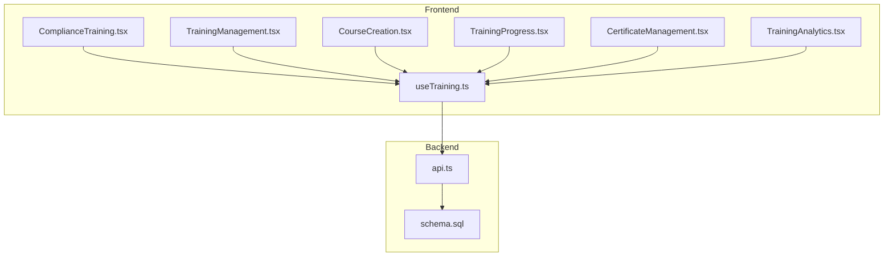
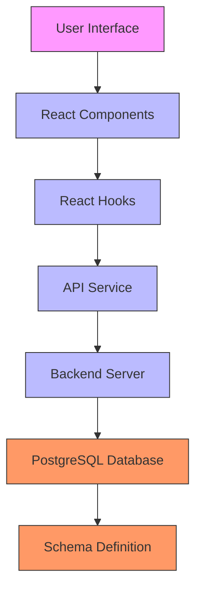
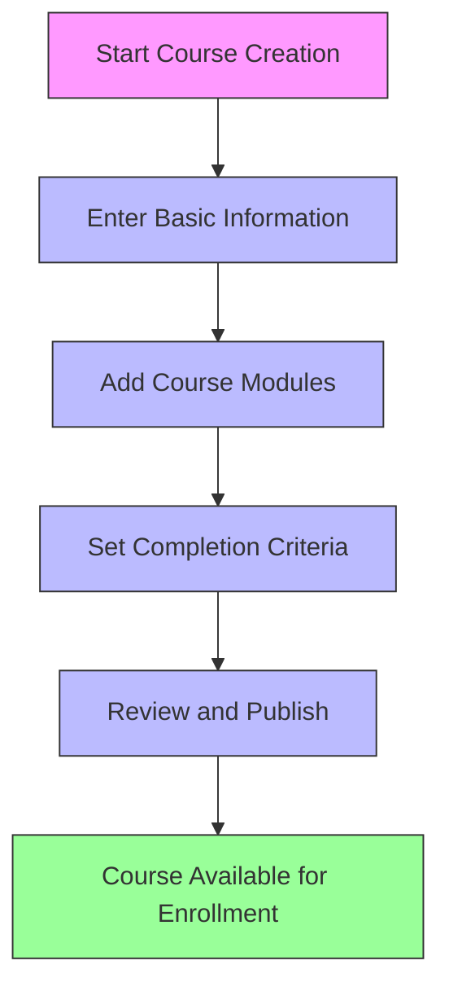
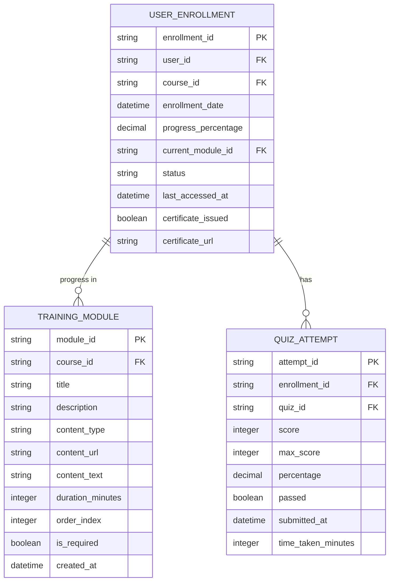
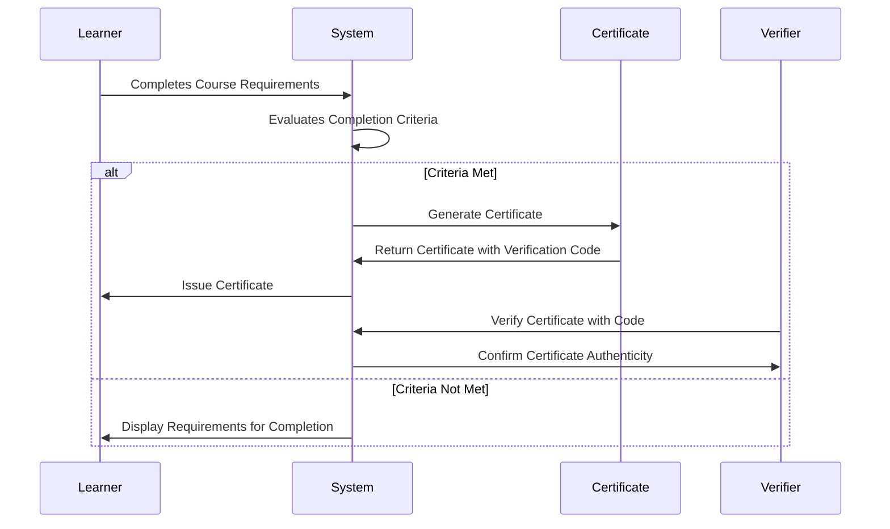
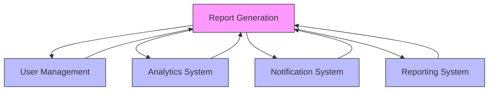
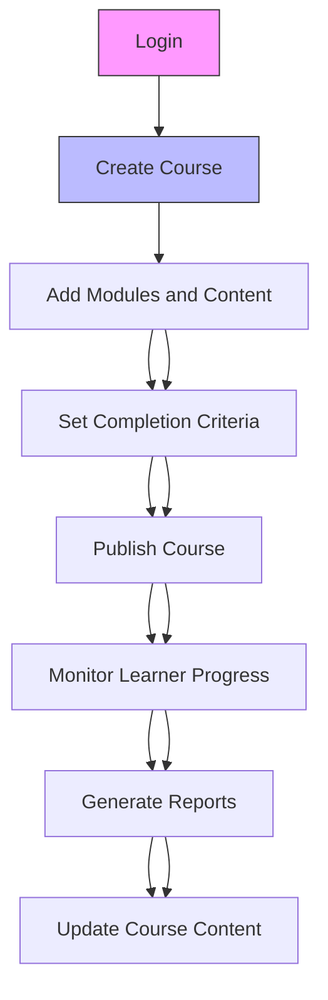
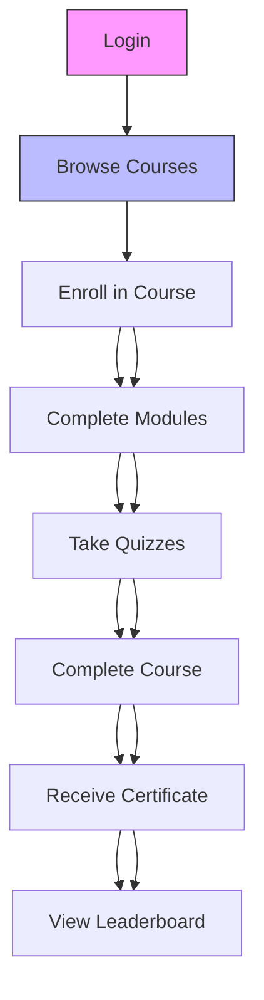
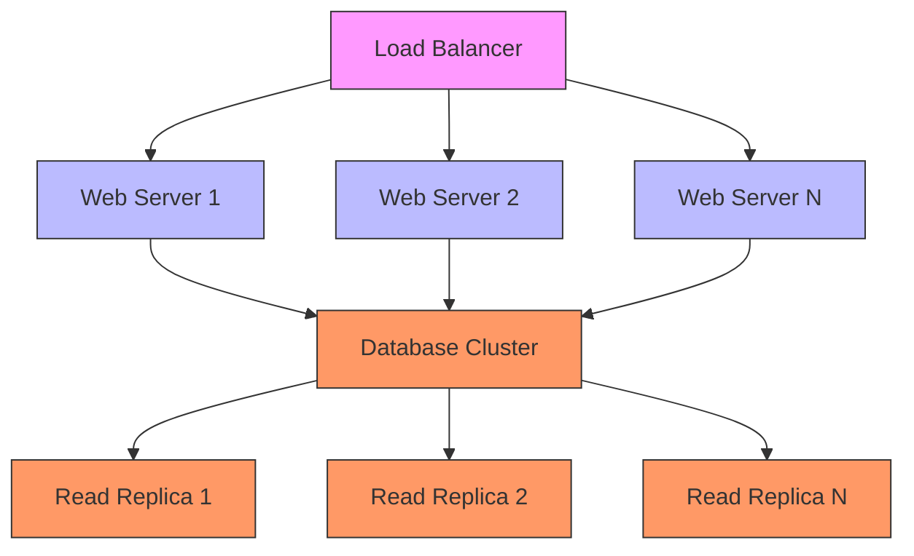
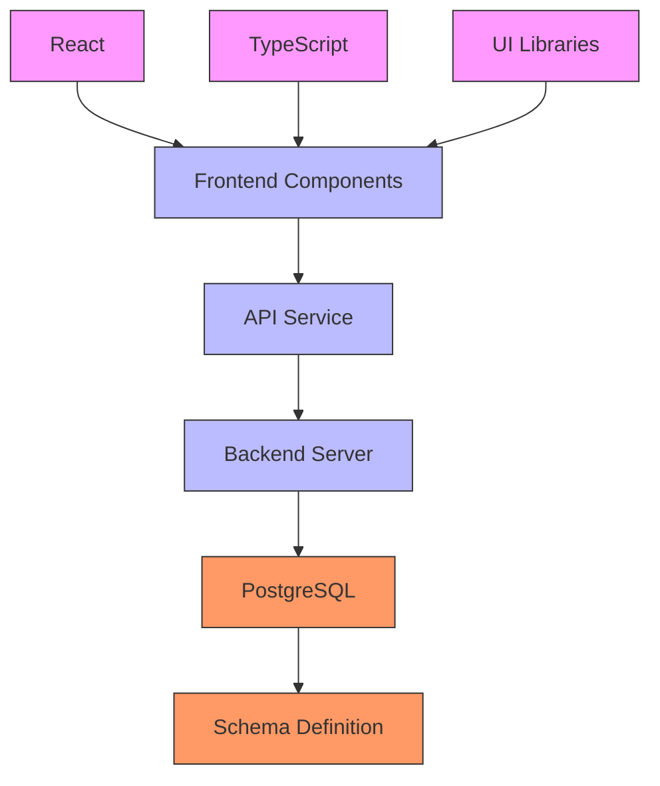

# Training System

<cite>
**Referenced Files in This Document**   
- [ComplianceTraining.tsx](file://frontend/src/pages/ComplianceTraining.tsx)
- [TrainingManagement.tsx](file://frontend/src/pages/TrainingManagement.tsx)
- [CourseCreation.tsx](file://frontend/src/components/Training/CourseCreation.tsx)
- [TrainingProgress.tsx](file://frontend/src/components/Training/TrainingProgress.tsx)
- [CertificateManagement.tsx](file://frontend/src/components/Training/CertificateManagement.tsx)
- [TrainingAnalytics.tsx](file://frontend/src/components/Training/TrainingAnalytics.tsx)
- [useTraining.ts](file://frontend/src/hooks/useTraining.ts)
- [schema.sql](file://schema.sql)
- [api.ts](file://frontend/src/services/api.ts)
</cite>

## Table of Contents
1. [Introduction](#introduction)
2. [Project Structure](#project-structure)
3. [Core Components](#core-components)
4. [Architecture Overview](#architecture-overview)
5. [Detailed Component Analysis](#detailed-component-analysis)
6. [Dependency Analysis](#dependency-analysis)
7. [Performance Considerations](#performance-considerations)
8. [Troubleshooting Guide](#troubleshooting-guide)
9. [Conclusion](#conclusion)

## Introduction
The Training System is a comprehensive compliance training and certification platform designed to manage course creation, progress tracking, and certification workflows. This documentation provides a detailed architectural overview of the system, focusing on its course management capabilities, progress tracking mechanisms, certification workflows, and integration with user management and reporting systems. The system supports instructor and learner workflows for course creation, enrollment, and completion, with scalability considerations for large user bases and course catalogs. It includes system context diagrams showing interactions with user management, analytics, and notification systems, along with configuration options for training requirements, certification periods, and completion criteria.

## Project Structure
The Training System is organized within a well-structured frontend and backend architecture. The frontend components are located in the `frontend/src` directory, with specific training-related components in the `frontend/src/components/Training` folder. Key pages for the training system are found in `frontend/src/pages`, including `ComplianceTraining.tsx` and `TrainingManagement.tsx`. The backend schema is defined in `schema.sql`, which contains the database structure for training courses, enrollments, quizzes, and certifications. API services are implemented in `frontend/src/services/api.ts`, providing the interface between the frontend and backend systems. The system uses React with TypeScript for the frontend, with hooks in `frontend/src/hooks/useTraining.ts` managing training-specific state and API interactions.

**Diagram sources**
- [ComplianceTraining.tsx](file://frontend/src/pages/ComplianceTraining.tsx)
- [TrainingManagement.tsx](file://frontend/src/pages/TrainingManagement.tsx)
- [CourseCreation.tsx](file://frontend/src/components/Training/CourseCreation.tsx)
- [TrainingProgress.tsx](file://frontend/src/components/Training/TrainingProgress.tsx)
- [CertificateManagement.tsx](file://frontend/src/components/Training/CertificateManagement.tsx)
- [TrainingAnalytics.tsx](file://frontend/src/components/Training/TrainingAnalytics.tsx)
- [useTraining.ts](file://frontend/src/hooks/useTraining.ts)
- [schema.sql](file://schema.sql)
- [api.ts](file://frontend/src/services/api.ts)

**Section sources**
- [ComplianceTraining.tsx](file://frontend/src/pages/ComplianceTraining.tsx)
- [TrainingManagement.tsx](file://frontend/src/pages/TrainingManagement.tsx)
- [schema.sql](file://schema.sql)

## Core Components
The Training System consists of several core components that work together to provide a comprehensive training and certification platform. The system includes course management functionality, progress tracking mechanisms, certification workflows, and analytics capabilities. These components are designed to support both instructor and learner workflows, from course creation to completion and certification. The system integrates with user management and reporting systems to provide a seamless experience for administrators and learners alike.

**Section sources**
- [ComplianceTraining.tsx](file://frontend/src/pages/ComplianceTraining.tsx)
- [TrainingManagement.tsx](file://frontend/src/pages/TrainingManagement.tsx)
- [CourseCreation.tsx](file://frontend/src/components/Training/CourseCreation.tsx)
- [TrainingProgress.tsx](file://frontend/src/components/Training/TrainingProgress.tsx)
- [CertificateManagement.tsx](file://frontend/src/components/Training/CertificateManagement.tsx)
- [TrainingAnalytics.tsx](file://frontend/src/components/Training/TrainingAnalytics.tsx)

## Architecture Overview
The Training System follows a client-server architecture with a React frontend and a backend API that interacts with a PostgreSQL database. The frontend components are organized in a modular fashion, with specific components for course creation, progress tracking, certificate management, and analytics. The system uses React hooks to manage state and API interactions, with `useTraining.ts` providing a centralized location for training-related hooks. The backend schema in `schema.sql` defines the database structure for training courses, enrollments, quizzes, and certifications, with appropriate relationships and constraints.

**Diagram sources**
- [ComplianceTraining.tsx](file://frontend/src/pages/ComplianceTraining.tsx)
- [TrainingManagement.tsx](file://frontend/src/pages/TrainingManagement.tsx)
- [CourseCreation.tsx](file://frontend/src/components/Training/CourseCreation.tsx)
- [TrainingProgress.tsx](file://frontend/src/components/Training/TrainingProgress.tsx)
- [CertificateManagement.tsx](file://frontend/src/components/Training/CertificateManagement.tsx)
- [TrainingAnalytics.tsx](file://frontend/src/components/Training/TrainingAnalytics.tsx)
- [useTraining.ts](file://frontend/src/hooks/useTraining.ts)
- [schema.sql](file://schema.sql)
- [api.ts](file://frontend/src/services/api.ts)

## Detailed Component Analysis

### Course Management System
The course management system provides comprehensive functionality for creating, managing, and organizing training courses. Instructors can create courses with detailed information including title, description, course type, difficulty level, duration, and pass threshold. Courses can be categorized by type (compliance, technical, regulatory, security, ethics, or general) and difficulty level (beginner, intermediate, advanced, or expert). Each course consists of multiple modules that can contain various types of content such as video, text, interactive elements, quizzes, or documents. The system supports course prerequisites, allowing for structured learning paths where completion of one course is required before enrolling in another.

#### Course Creation Workflow

**Diagram sources**
- [CourseCreation.tsx](file://frontend/src/components/Training/CourseCreation.tsx)
- [TrainingManagement.tsx](file://frontend/src/pages/TrainingManagement.tsx)

**Section sources**
- [CourseCreation.tsx](file://frontend/src/components/Training/CourseCreation.tsx)
- [TrainingManagement.tsx](file://frontend/src/pages/TrainingManagement.tsx)

### Progress Tracking Mechanisms
The progress tracking system provides detailed monitoring of learner progress through training courses. It tracks overall progress percentage, modules completed, time spent, and quiz performance. The system displays a progress overview with key metrics such as overall progress, modules completed, time spent, and engagement score. Learners can see their progress through individual modules, with visual indicators for completed, in-progress, and not-started modules. The system supports sequential module access, where learners must complete prerequisite modules before accessing subsequent ones, ensuring a structured learning path.

#### Progress Tracking Data Model

**Diagram sources**
- [TrainingProgress.tsx](file://frontend/src/components/Training/TrainingProgress.tsx)
- [schema.sql](file://schema.sql)

**Section sources**
- [TrainingProgress.tsx](file://frontend/src/components/Training/TrainingProgress.tsx)
- [useTraining.ts](file://frontend/src/hooks/useTraining.ts)

### Certification Workflows
The certification system manages the issuance, verification, and management of training certificates. When a learner completes a course and meets the completion criteria (typically achieving a score at or above the pass threshold), they become eligible for a certificate. The system generates a unique certificate with a verification code that can be used to validate the certificate's authenticity. Certificates include key information such as the learner's name, course title, completion date, and score. The system supports certificate templates with different designs for various course types, and certificates can include QR codes for easy verification.

#### Certification Workflow

**Diagram sources**
- [CertificateManagement.tsx](file://frontend/src/components/Training/CertificateManagement.tsx)
- [schema.sql](file://schema.sql)

**Section sources**
- [CertificateManagement.tsx](file://frontend/src/components/Training/CertificateManagement.tsx)
- [useTraining.ts](file://frontend/src/hooks/useTraining.ts)

### Integration with User Management and Reporting Systems
The Training System integrates seamlessly with user management and reporting systems to provide a comprehensive training platform. User information is synchronized with the main user management system, allowing for automatic enrollment based on user roles or departments. The system tracks user progress and generates detailed reports on training completion rates, quiz performance, and certification status. These reports can be exported in various formats (CSV, Excel, PDF) for further analysis. The integration also supports automated notifications and reminders for upcoming deadlines, overdue trainings, and certification expirations.

#### System Integration Diagram

**Diagram sources**
- [api.ts](file://frontend/src/services/api.ts)
- [useTraining.ts](file://frontend/src/hooks/useTraining.ts)

**Section sources**
- [api.ts](file://frontend/src/services/api.ts)
- [useTraining.ts](file://frontend/src/hooks/useTraining.ts)

### Instructor and Learner Workflows
The Training System supports distinct workflows for instructors and learners, providing tailored experiences for each user role. Instructors can create and manage courses, monitor learner progress, and generate reports on training effectiveness. Learners can browse available courses, enroll in training, track their progress, and access completed certifications. The system provides a gamified learning experience with leaderboards and achievement tracking to increase engagement.

#### Instructor Workflow

#### Learner Workflow

**Diagram sources**
- [TrainingManagement.tsx](file://frontend/src/pages/TrainingManagement.tsx)
- [ComplianceTraining.tsx](file://frontend/src/pages/ComplianceTraining.tsx)
- [TrainingProgress.tsx](file://frontend/src/components/Training/TrainingProgress.tsx)

**Section sources**
- [TrainingManagement.tsx](file://frontend/src/pages/TrainingManagement.tsx)
- [ComplianceTraining.tsx](file://frontend/src/pages/ComplianceTraining.tsx)
- [TrainingProgress.tsx](file://frontend/src/components/Training/TrainingProgress.tsx)

### Scalability Considerations
The Training System is designed with scalability in mind to support large user bases and extensive course catalogs. The database schema is optimized with appropriate indexes on frequently queried fields such as user_id, course_id, and status. The system uses efficient API endpoints that support filtering and pagination to handle large datasets. Caching mechanisms are implemented to reduce database load for frequently accessed data. The frontend components are designed to handle large amounts of data efficiently, with virtualized lists and lazy loading where appropriate.

#### Scalability Architecture

**Diagram sources**
- [schema.sql](file://schema.sql)
- [api.ts](file://frontend/src/services/api.ts)

**Section sources**
- [schema.sql](file://schema.sql)
- [api.ts](file://frontend/src/services/api.ts)

### Configuration Options
The Training System provides extensive configuration options to customize training requirements, certification periods, and completion criteria. Administrators can configure course types, difficulty levels, and tags to organize the course catalog. Each course can have specific completion criteria, including minimum pass thresholds for quizzes and required modules that must be completed. Certification periods can be configured with expiration dates and renewal requirements. The system also supports custom fields and metadata for courses and certificates, allowing for organization-specific requirements.

#### Configuration Options Table
| Configuration Option | Description | Default Value | Scope |
|---------------------|-----------|-------------|------|
| Pass Threshold | Minimum score required to pass a course | 80% | Course-level |
| Certification Expiration | Duration before certification expires | 3 years | System-level |
| Course Difficulty Levels | Available difficulty levels for courses | beginner, intermediate, advanced, expert | System-level |
| Course Types | Categories for organizing courses | compliance, technical, regulatory, security, ethics, general | System-level |
| Module Prerequisites | Requirement to complete prerequisite modules | Enabled | Course-level |
| Certificate Templates | Design templates for certificates | professional, modern, classic, corporate | System-level |
| Verification Code Format | Format for certificate verification codes | VER-XXXX-XXXX-XXXX | System-level |
| Quiz Attempts | Maximum number of attempts allowed for quizzes | 3 | Course-level |
| Time Limits | Time limits for quiz completion | None | Course-level |
| Gamification | Enable gamified elements like points and leaderboards | Enabled | System-level |

**Section sources**
- [TrainingManagement.tsx](file://frontend/src/pages/TrainingManagement.tsx)
- [schema.sql](file://schema.sql)

## Dependency Analysis
The Training System has several key dependencies that enable its functionality. The frontend components depend on React, TypeScript, and various UI libraries for rendering. The system relies on the API service to communicate with the backend, which in turn depends on PostgreSQL for data storage. The training hooks in `useTraining.ts` depend on the API service for data retrieval and mutation. The database schema in `schema.sql` defines the relationships between training entities, with foreign key constraints ensuring data integrity.

**Diagram sources**
- [package.json](file://package.json)
- [schema.sql](file://schema.sql)
- [api.ts](file://frontend/src/services/api.ts)

**Section sources**
- [package.json](file://package.json)
- [schema.sql](file://schema.sql)
- [api.ts](file://frontend/src/services/api.ts)

## Performance Considerations
The Training System incorporates several performance optimizations to ensure a responsive user experience. Database queries are optimized with appropriate indexes on frequently accessed fields such as user_id, course_id, and status. The API endpoints support filtering and pagination to minimize data transfer for large datasets. The frontend components use React's performance features such as memoization and lazy loading to reduce rendering overhead. Caching is implemented at multiple levels, including browser caching of static assets and server-side caching of frequently accessed data.

**Section sources**
- [schema.sql](file://schema.sql)
- [api.ts](file://frontend/src/services/api.ts)
- [useTraining.ts](file://frontend/src/hooks/useTraining.ts)

## Troubleshooting Guide
When encountering issues with the Training System, consider the following troubleshooting steps:

1. **Course Creation Issues**: Verify that all required fields are filled in the course creation form. Check that module titles are unique and that the total duration is consistent with individual module durations.

2. **Progress Tracking Problems**: Ensure that the user is properly enrolled in the course. Verify that module completion is being recorded correctly and that quiz scores are being calculated accurately.

3. **Certificate Generation Failures**: Check that the user has met all completion criteria for the course. Verify that the certificate template is properly configured and that the verification code generation is working correctly.

4. **API Connectivity Issues**: Confirm that the API service is running and accessible. Check the network connection and verify that the API base URL is correctly configured.

5. **Database Errors**: Review the database schema to ensure that all required tables and relationships exist. Check for any constraint violations or data type mismatches.

**Section sources**
- [TrainingManagement.tsx](file://frontend/src/pages/TrainingManagement.tsx)
- [TrainingProgress.tsx](file://frontend/src/components/Training/TrainingProgress.tsx)
- [CertificateManagement.tsx](file://frontend/src/components/Training/CertificateManagement.tsx)
- [api.ts](file://frontend/src/services/api.ts)
- [schema.sql](file://schema.sql)

## Conclusion
The Training System provides a comprehensive platform for managing compliance training and certification. Its modular architecture supports course creation, progress tracking, and certification workflows, with seamless integration with user management and reporting systems. The system is designed with scalability in mind, capable of handling large user bases and extensive course catalogs. The instructor and learner workflows are optimized for usability, with a focus on engagement through gamified elements and clear progress tracking. The system's configuration options allow for customization to meet specific organizational requirements, making it a flexible solution for compliance training needs.