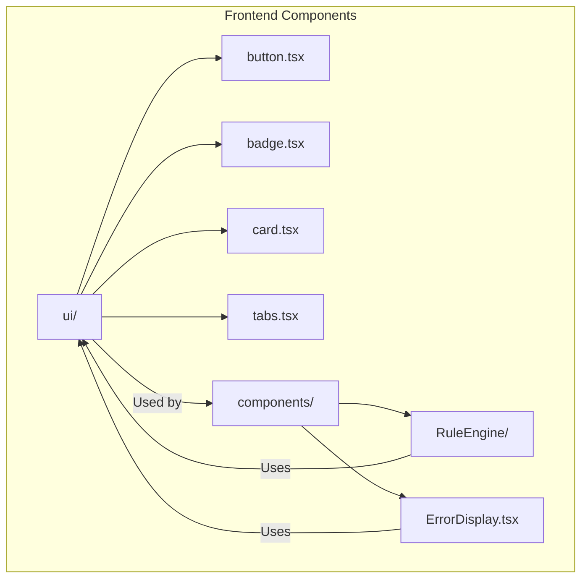
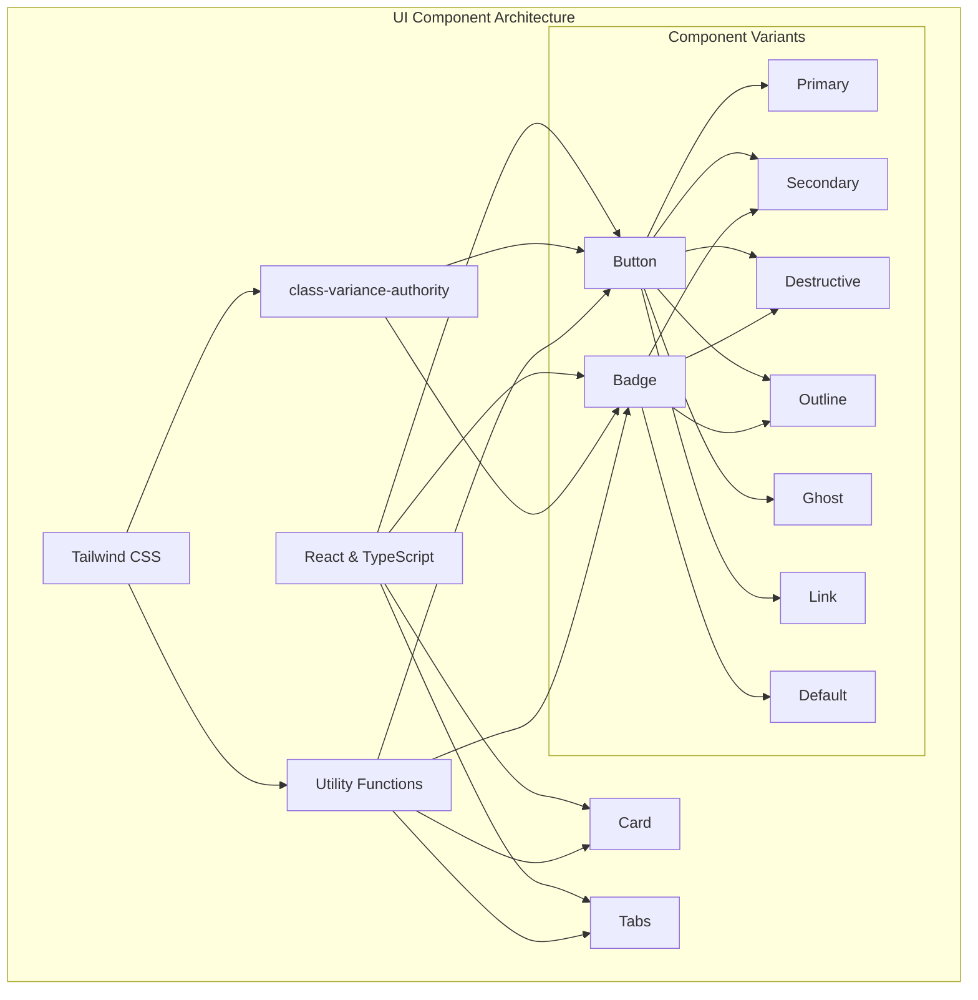
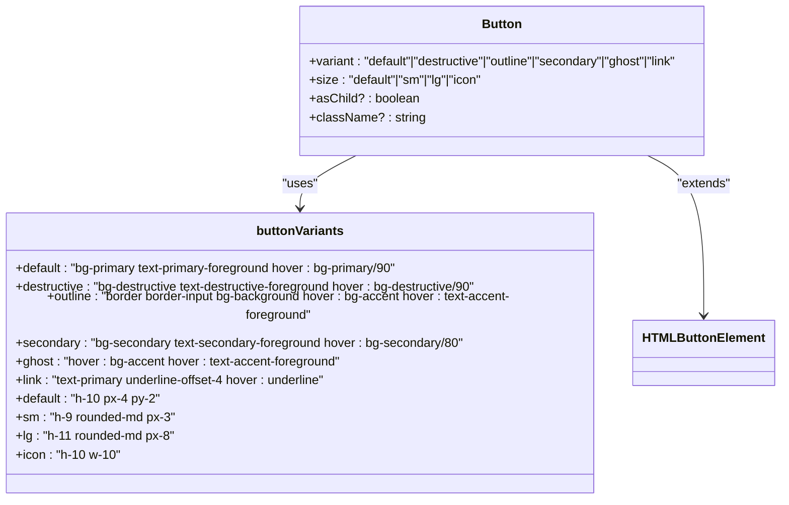
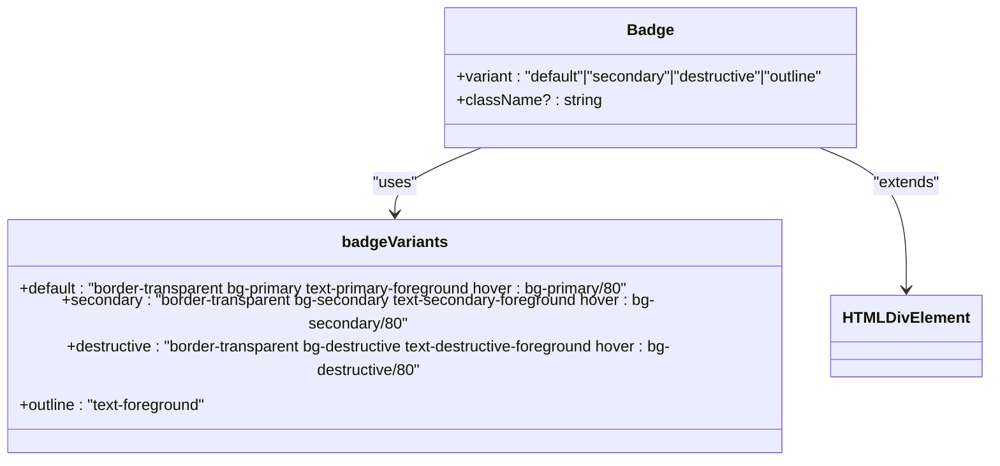
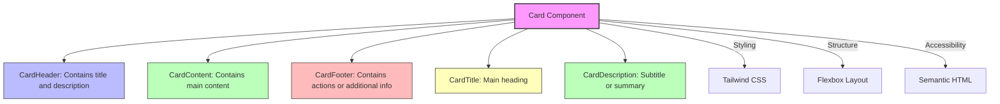
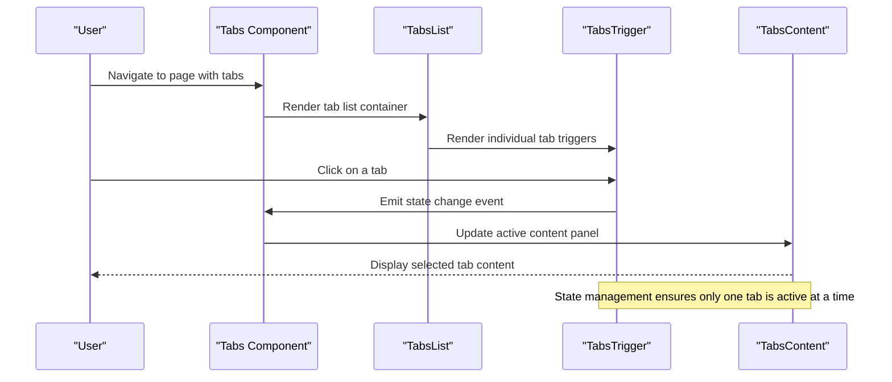
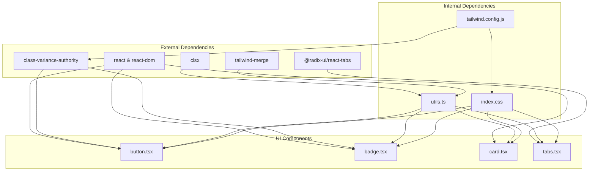

# UI Components Library

<cite>
**Referenced Files in This Document**   
- [button.tsx](file://frontend/src/components/ui/button.tsx)
- [badge.tsx](file://frontend/src/components/ui/badge.tsx)
- [card.tsx](file://frontend/src/components/ui/card.tsx)
- [tabs.tsx](file://frontend/src/components/ui/tabs.tsx)
- [utils.ts](file://frontend/src/lib/utils.ts)
- [tailwind.config.js](file://frontend/tailwind.config.js)
- [index.css](file://frontend/src/index.css)
- [RuleAnalytics.tsx](file://frontend/src/components/RuleEngine/RuleAnalytics.tsx)
- [RuleCreationForm.tsx](file://frontend/src/components/RuleEngine/RuleCreationForm.tsx)
- [ErrorDisplay.tsx](file://frontend/src/components/ErrorDisplay.tsx)
</cite>

## Table of Contents
1. [Introduction](#introduction)
2. [Project Structure](#project-structure)
3. [Core Components](#core-components)
4. [Architecture Overview](#architecture-overview)
5. [Detailed Component Analysis](#detailed-component-analysis)
6. [Dependency Analysis](#dependency-analysis)
7. [Performance Considerations](#performance-considerations)
8. [Troubleshooting Guide](#troubleshooting-guide)
9. [Conclusion](#conclusion)

## Introduction
The UI Components Library is a collection of reusable React components designed for the Regulens application. These components follow a consistent design system based on Tailwind CSS and provide a cohesive user interface across the application. The library includes fundamental UI elements such as buttons, badges, cards, and tabs that are used throughout the Regulens platform for regulatory compliance, decision engine, and rule management interfaces.

## Project Structure
The UI components are organized in a dedicated directory within the frontend source structure. This organization follows a component-based architecture pattern, allowing for easy maintenance and reuse across different parts of the application.

**Diagram sources**
- [components/ui](file://frontend/src/components/ui)
- [RuleAnalytics.tsx](file://frontend/src/components/RuleEngine/RuleAnalytics.tsx)
- [ErrorDisplay.tsx](file://frontend/src/components/ErrorDisplay.tsx)

**Section sources**
- [components/ui](file://frontend/src/components/ui)

## Core Components
The UI Components Library consists of four primary components that form the foundation of the Regulens application's user interface: Button, Badge, Card, and Tabs. These components are built using React with TypeScript, leveraging Tailwind CSS for styling and the class-variance-authority library for variant management. Each component is designed to be accessible, reusable, and consistent with the application's design system.

**Section sources**
- [button.tsx](file://frontend/src/components/ui/button.tsx)
- [badge.tsx](file://frontend/src/components/ui/badge.tsx)
- [card.tsx](file://frontend/src/components/ui/card.tsx)
- [tabs.tsx](file://frontend/src/components/ui/tabs.tsx)

## Architecture Overview
The UI Components Library follows a modern React component architecture that emphasizes reusability, type safety, and design consistency. The components are built on top of several key technologies and patterns that work together to create a cohesive design system.

**Diagram sources**
- [button.tsx](file://frontend/src/components/ui/button.tsx)
- [badge.tsx](file://frontend/src/components/ui/badge.tsx)
- [utils.ts](file://frontend/src/lib/utils.ts)
- [tailwind.config.js](file://frontend/tailwind.config.js)

## Detailed Component Analysis

### Button Component Analysis
The Button component is a versatile and accessible UI element that serves as the primary interactive control in the Regulens application. It supports multiple variants and sizes, making it suitable for various use cases throughout the interface.

**Diagram sources**
- [button.tsx](file://frontend/src/components/ui/button.tsx#L1-L50)

**Section sources**
- [button.tsx](file://frontend/src/components/ui/button.tsx)

### Badge Component Analysis
The Badge component is used to display small pieces of information such as status indicators, counts, or labels. It provides visual hierarchy and helps users quickly identify important information within the interface.

**Diagram sources**
- [badge.tsx](file://frontend/src/components/ui/badge.tsx#L1-L30)

**Section sources**
- [badge.tsx](file://frontend/src/components/ui/badge.tsx)

### Card Component Analysis
The Card component is a container element used to group related content and create visual separation between different sections of the interface. It provides a consistent layout for displaying information in a structured format.

**Diagram sources**
- [card.tsx](file://frontend/src/components/ui/card.tsx#L1-L66)

**Section sources**
- [card.tsx](file://frontend/src/components/ui/card.tsx)

### Tabs Component Analysis
The Tabs component provides a way to organize content into separate sections that can be viewed one at a time. It's commonly used in the Regulens application for navigating between different views or data sets within a single interface.

**Diagram sources**
- [tabs.tsx](file://frontend/src/components/ui/tabs.tsx#L1-L52)

**Section sources**
- [tabs.tsx](file://frontend/src/components/ui/tabs.tsx)

## Dependency Analysis
The UI Components Library relies on several external dependencies and internal utilities to function properly. These dependencies work together to provide styling, accessibility, and component composition capabilities.

**Diagram sources**
- [package.json](file://frontend/package.json)
- [utils.ts](file://frontend/src/lib/utils.ts)
- [tailwind.config.js](file://frontend/tailwind.config.js)
- [index.css](file://frontend/src/index.css)

**Section sources**
- [package.json](file://frontend/package.json)
- [utils.ts](file://frontend/src/lib/utils.ts)

## Performance Considerations
The UI Components Library is designed with performance in mind, leveraging React's component model and Tailwind CSS's utility-first approach to minimize bundle size and maximize rendering efficiency. The components use React.forwardRef for proper ref forwarding and are optimized for reusability across the application. The use of class-variance-authority allows for efficient variant management without runtime overhead, while the utility functions like cn() provide optimized class merging.

The components are also designed to be lightweight and focused, with each component serving a specific purpose. This modular approach allows for tree-shaking, ensuring that only the components actually used in the application are included in the final bundle. The implementation avoids unnecessary re-renders through proper use of React's memoization patterns and stable component references.

## Troubleshooting Guide
When working with the UI Components Library, developers may encounter various issues related to styling, accessibility, or component usage. Common issues include incorrect variant application, accessibility violations, or styling conflicts with the global CSS. To troubleshoot these issues, first verify that the component is being imported correctly and that all required dependencies are installed. Check the browser's developer tools for any console errors or warnings related to the components.

For styling issues, ensure that the Tailwind CSS configuration is properly set up and that the component's className prop is being used correctly. When encountering accessibility problems, verify that the components are being used with appropriate ARIA attributes and that keyboard navigation works as expected. For the Tabs component, ensure that the active tab is properly managed and that screen readers can correctly announce the tab state.

**Section sources**
- [button.tsx](file://frontend/src/components/ui/button.tsx)
- [badge.tsx](file://frontend/src/components/ui/badge.tsx)
- [card.tsx](file://frontend/src/components/ui/card.tsx)
- [tabs.tsx](file://frontend/src/components/ui/tabs.tsx)

## Conclusion
The UI Components Library provides a robust foundation for building consistent and accessible user interfaces in the Regulens application. By standardizing on a set of reusable components, the library ensures visual consistency across different parts of the application while reducing development time and maintenance overhead. The components are designed with accessibility in mind, following best practices for keyboard navigation, screen reader support, and semantic HTML structure.

The library's architecture, based on React, TypeScript, and Tailwind CSS, provides a modern development experience with strong typing, efficient styling, and excellent tooling support. As the Regulens application continues to evolve, the UI Components Library can be extended with new components and variants to meet emerging design requirements while maintaining consistency with the existing design system.