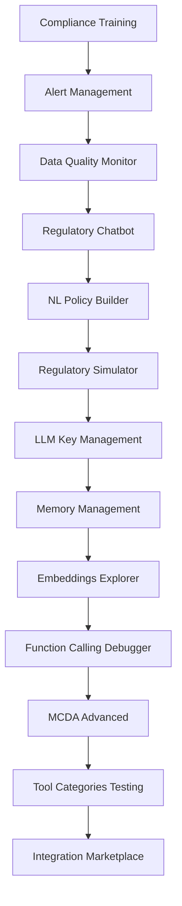

# Comprehensive Implementation Plan: Regulens 13 Features

**Document Version:** 1.0
**Created:** 2025-10-14
**Target Audience:** Development Team implementing backend APIs
**Estimated Effort:** 40-60 hours for all features

---

## 📋 Executive Summary

This document provides a comprehensive implementation plan for completing 13 advanced features in the Regulens AI Compliance System. The core system is production-ready with PostgreSQL, Redis, JWT auth, WebSocket, and multi-agent systems. All frontend components exist, but backend API handlers need implementation to achieve full functionality.

### Current State Analysis
- ✅ **Core Backend**: PostgreSQL with pgvector, Redis, JWT auth, WebSocket, Multi-agent system
- ✅ **Core Features**: Fraud detection, regulatory monitoring, transactions, audit trail
- ✅ **Frontend UIs**: All 13 features have complete React components and hooks
- ⚠️ **Gap**: Backend API handlers need implementation for full functionality

### Architecture Patterns Identified
1. **API Handler Pattern**: C++ handlers in `shared/*/api_handlers.cpp`
2. **Database Pattern**: PostgreSQL with parameterized queries using libpq
3. **Authentication**: JWT-based with user_id extraction
4. **Error Handling**: Structured JSON responses with proper error codes
5. **Server Routing**: Pattern matching in `server_with_auth.cpp` with `/api/v1/` prefix

---

## 🎯 Feature Prioritization & Dependencies

### High Priority (Complete First)
1. **Compliance Training System** - Training and certification tracking
2. **Alert Management System** - Alert configuration and routing
3. **Data Quality Monitor** - Data validation and quality metrics
4. **Regulatory Chatbot** - AI-powered regulatory Q&A

### Medium Priority
5. **NL Policy Builder** - Natural language to policy rules
6. **Regulatory Simulator** - Impact simulation system
7. **LLM Key Management** - API key lifecycle management
8. **Memory Management** - Agent memory visualization

### Low Priority (Advanced Features)
9. **Embeddings Explorer** - Vector space visualization
10. **Function Calling Debugger** - LLM function call debugging
11. **MCDA Advanced** - Multi-criteria decision analysis
12. **Tool Categories Testing** - Tool registry testing UI
13. **Integration Marketplace** - Plugin/extension system

### Dependency Graph


---

## 🏗️ Implementation Architecture

### Standard Pattern for All Features
```
Feature Implementation Structure:
├── shared/[feature_name]/
│   ├── [feature_name]_api_handlers.hpp
│   ├── [feature_name]_api_handlers.cpp
│   └── [feature_name]_service.cpp (if needed)
├── schema.sql (additions)
└── server_with_auth.cpp (route additions)
```

### Database Connection Pattern
```cpp
// Standard connection pattern
auto conn = db_conn_->get_connection();
if (!conn) {
    return R"({"error": "Database connection failed"})";
}

// Parameterized queries (REQUIRED for security)
const char* params[2] = {user_id.c_str(), rule_id.c_str()};
PGresult* result = PQexecParams(conn, query.c_str(), 2, nullptr, params, nullptr, nullptr, 0);

// Error handling
if (PQresultStatus(result) != PGRES_TUPLES_OK) {
    std::string error = PQerrorMessage(conn);
    PQclear(result);
    return R"({"error": "Database query failed: " + error + ")"}`;
}
```

### Authentication Pattern
```cpp
// All endpoints must verify JWT token and extract user_id
std::string user_id = extract_user_id_from_jwt(headers);
if (user_id.empty()) {
    return R"({"error": "Authentication required"})";
}
```

---

## 📦 Feature 1: Compliance Training System

### Frontend Location
- **Page**: `frontend/src/pages/ComplianceTraining.tsx`
- **Hook**: `frontend/src/hooks/useTraining.ts`

### Database Schema Additions
```sql
-- Training courses table
CREATE TABLE IF NOT EXISTS training_courses (
    course_id UUID PRIMARY KEY DEFAULT gen_random_uuid(),
    title VARCHAR(255) NOT NULL,
    description TEXT,
    course_type VARCHAR(50) NOT NULL, -- 'regulation', 'fraud', 'aml', 'kyc'
    difficulty_level VARCHAR(20) NOT NULL, -- 'beginner', 'intermediate', 'advanced'
    duration_minutes INT NOT NULL,
    pass_threshold DECIMAL(5,2) NOT NULL DEFAULT 80.0,
    course_content JSONB NOT NULL, -- Modules, lessons, quizzes
    prerequisites JSONB, -- Array of course_ids
    tags TEXT[],
    is_active BOOLEAN DEFAULT true,
    created_at TIMESTAMP WITH TIME ZONE DEFAULT NOW(),
    updated_at TIMESTAMP WITH TIME ZONE DEFAULT NOW(),
    created_by VARCHAR(255)
);

CREATE INDEX idx_training_courses_type ON training_courses(course_type);
CREATE INDEX idx_training_courses_difficulty ON training_courses(difficulty_level);

-- User enrollments and progress
CREATE TABLE IF NOT EXISTS training_enrollments (
    enrollment_id UUID PRIMARY KEY DEFAULT gen_random_uuid(),
    user_id VARCHAR(255) NOT NULL,
    course_id UUID NOT NULL REFERENCES training_courses(course_id),
    enrollment_date TIMESTAMP WITH TIME ZONE DEFAULT NOW(),
    progress DECIMAL(5,2) DEFAULT 0.0, -- 0-100%
    current_module INT DEFAULT 1,
    status VARCHAR(50) DEFAULT 'in_progress', -- 'in_progress', 'completed', 'failed', 'expired'
    quiz_attempts INT DEFAULT 0,
    quiz_score DECIMAL(5,2),
    completed_at TIMESTAMP WITH TIME ZONE,
    certificate_issued BOOLEAN DEFAULT false,
    certificate_url TEXT,
    last_accessed TIMESTAMP WITH TIME ZONE DEFAULT NOW(),
    UNIQUE(user_id, course_id)
);

CREATE INDEX idx_training_enrollments_user ON training_enrollments(user_id, status);
CREATE INDEX idx_training_enrollments_course ON training_enrollments(course_id, status);

-- Quiz submissions
CREATE TABLE IF NOT EXISTS training_quiz_submissions (
    submission_id UUID PRIMARY KEY DEFAULT gen_random_uuid(),
    enrollment_id UUID NOT NULL REFERENCES training_enrollments(enrollment_id),
    quiz_id VARCHAR(255) NOT NULL,
    user_answers JSONB NOT NULL,
    score DECIMAL(5,2) NOT NULL,
    passed BOOLEAN NOT NULL,
    submitted_at TIMESTAMP WITH TIME ZONE DEFAULT NOW(),
    time_taken_seconds INT,
    feedback JSONB -- Per-question feedback
);

CREATE INDEX idx_quiz_submissions_enrollment ON training_quiz_submissions(enrollment_id, submitted_at DESC);

-- Certifications
CREATE TABLE IF NOT EXISTS training_certifications (
    certification_id UUID PRIMARY KEY DEFAULT gen_random_uuid(),
    user_id VARCHAR(255) NOT NULL,
    course_id UUID NOT NULL REFERENCES training_courses(course_id),
    certification_name VARCHAR(255) NOT NULL,
    issued_date TIMESTAMP WITH TIME ZONE DEFAULT NOW(),
    expiry_date TIMESTAMP WITH TIME ZONE,
    certificate_url TEXT,
    certificate_hash VARCHAR(255), -- For verification
    verification_code VARCHAR(50) UNIQUE,
    is_valid BOOLEAN DEFAULT true,
    revoked_at TIMESTAMP WITH TIME ZONE,
    revocation_reason TEXT
);

CREATE INDEX idx_certifications_user ON training_certifications(user_id, is_valid);
CREATE INDEX idx_certifications_verification ON training_certifications(verification_code);
```

### API Endpoints
```
GET    /api/v1/training/courses              - List available courses
GET    /api/v1/training/courses/:id          - Course details
POST   /api/v1/training/courses/:id/enroll   - Enroll user
GET    /api/v1/training/progress/:userId     - User progress
POST   /api/v1/training/courses/:id/complete - Mark course complete
GET    /api/v1/training/certifications/:userId - User certifications
POST   /api/v1/training/quiz/:id/submit      - Submit quiz answers
GET    /api/v1/training/leaderboard          - Training leaderboard
```

### Implementation Files
- **Create**: `shared/training/training_api_handlers.hpp`
- **Create**: `shared/training/training_api_handlers.cpp`
- **Modify**: `server_with_auth.cpp` (add routes)

### Key Implementation Notes
1. **Quiz Scoring**: Implement automatic grading with feedback
2. **Certificate Generation**: Create verifiable certificates with unique codes
3. **Progress Tracking**: Real-time progress updates with module completion
4. **Prerequisites**: Enforce course prerequisites before enrollment
5. **Leaderboard**: Ranking system based on completion scores and time

---

## 📦 Feature 2: Alert Management System

### Frontend Location
- **Page**: `frontend/src/pages/AlertManagement.tsx`
- **Hook**: `frontend/src/hooks/useAlerts.ts`

### Database Schema Additions
```sql
-- Alert rules configuration
CREATE TABLE IF NOT EXISTS alert_rules (
    rule_id UUID PRIMARY KEY DEFAULT gen_random_uuid(),
    rule_name VARCHAR(255) NOT NULL,
    description TEXT,
    rule_type VARCHAR(50) NOT NULL, -- 'threshold', 'pattern', 'anomaly', 'scheduled'
    severity VARCHAR(20) NOT NULL, -- 'low', 'medium', 'high', 'critical'
    condition JSONB NOT NULL, -- Rule condition configuration
    notification_channels JSONB NOT NULL, -- ['email', 'slack', 'webhook', 'sms']
    notification_config JSONB, -- Channel-specific configuration
    cooldown_minutes INT DEFAULT 5, -- Minimum time between alerts
    is_enabled BOOLEAN DEFAULT true,
    created_by VARCHAR(255),
    created_at TIMESTAMP WITH TIME ZONE DEFAULT NOW(),
    updated_at TIMESTAMP WITH TIME ZONE DEFAULT NOW(),
    last_triggered_at TIMESTAMP WITH TIME ZONE
);

CREATE INDEX idx_alert_rules_type ON alert_rules(rule_type, is_enabled);
CREATE INDEX idx_alert_rules_severity ON alert_rules(severity);

-- Alert history/incidents
CREATE TABLE IF NOT EXISTS alert_incidents (
    incident_id UUID PRIMARY KEY DEFAULT gen_random_uuid(),
    rule_id UUID REFERENCES alert_rules(rule_id),
    severity VARCHAR(20) NOT NULL,
    title VARCHAR(255) NOT NULL,
    message TEXT NOT NULL,
    incident_data JSONB, -- Contextual data that triggered alert
    triggered_at TIMESTAMP WITH TIME ZONE DEFAULT NOW(),
    acknowledged_at TIMESTAMP WITH TIME ZONE,
    acknowledged_by VARCHAR(255),
    resolved_at TIMESTAMP WITH TIME ZONE,
    resolved_by VARCHAR(255),
    resolution_notes TEXT,
    status VARCHAR(50) DEFAULT 'active', -- 'active', 'acknowledged', 'resolved', 'false_positive'
    notification_status JSONB -- Per-channel delivery status
);

CREATE INDEX idx_alert_incidents_rule ON alert_incidents(rule_id, triggered_at DESC);
CREATE INDEX idx_alert_incidents_status ON alert_incidents(status, severity);
CREATE INDEX idx_alert_incidents_time ON alert_incidents(triggered_at DESC);

-- Notification channels configuration
CREATE TABLE IF NOT EXISTS notification_channels (
    channel_id UUID PRIMARY KEY DEFAULT gen_random_uuid(),
    channel_type VARCHAR(50) NOT NULL, -- 'email', 'slack', 'webhook', 'sms', 'pagerduty'
    channel_name VARCHAR(255) NOT NULL,
    configuration JSONB NOT NULL, -- Channel-specific config (URLs, tokens, etc.)
    is_enabled BOOLEAN DEFAULT true,
    last_tested_at TIMESTAMP WITH TIME ZONE,
    test_status VARCHAR(50), -- 'success', 'failed'
    created_at TIMESTAMP WITH TIME ZONE DEFAULT NOW()
);

CREATE INDEX idx_notification_channels_type ON notification_channels(channel_type, is_enabled);

-- Alert notification log
CREATE TABLE IF NOT EXISTS alert_notifications (
    notification_id UUID PRIMARY KEY DEFAULT gen_random_uuid(),
    incident_id UUID REFERENCES alert_incidents(incident_id),
    channel_id UUID REFERENCES notification_channels(channel_id),
    sent_at TIMESTAMP WITH TIME ZONE DEFAULT NOW(),
    delivery_status VARCHAR(50) NOT NULL, -- 'sent', 'delivered', 'failed', 'bounced'
    error_message TEXT,
    retry_count INT DEFAULT 0
);

CREATE INDEX idx_alert_notifications_incident ON alert_notifications(incident_id);
CREATE INDEX idx_alert_notifications_status ON alert_notifications(delivery_status, sent_at DESC);
```

### API Endpoints
```
GET    /api/v1/alerts/rules                 - List alert rules
POST   /api/v1/alerts/rules                 - Create alert rule
PUT    /api/v1/alerts/rules/:id             - Update alert rule
DELETE /api/v1/alerts/rules/:id             - Delete alert rule
GET    /api/v1/alerts/history               - Alert history
POST   /api/v1/alerts/:id/acknowledge       - Acknowledge alert
GET    /api/v1/alerts/channels              - Notification channels
POST   /api/v1/alerts/test                  - Test alert delivery
```

### Implementation Files
- **Create**: `shared/alerts/alert_management_handlers.hpp`
- **Create**: `shared/alerts/alert_management_handlers.cpp`
- **Create**: `shared/alerts/alert_evaluator.cpp` (background thread)
- **Modify**: `server_with_auth.cpp` (add routes)

### Key Implementation Notes
1. **Alert Evaluation Engine**: Background thread running every 30 seconds
2. **Notification Delivery**: Email via SMTP, webhook via HTTP POST, Slack via webhook
3. **Cooldown Logic**: Prevent alert spam with configurable cooldown periods
4. **Alert Conditions**: Support threshold, pattern, anomaly, and scheduled rules
5. **Retry Mechanism**: Failed notifications with exponential backoff

---

## 📦 Feature 3: Data Quality Monitor

### Frontend Location
- **Page**: `frontend/src/pages/DataQualityMonitor.tsx`
- **Hook**: `frontend/src/hooks/useDataIngestion.ts` (extend)

### Database Schema Additions
```sql
-- Data quality rules
CREATE TABLE IF NOT EXISTS data_quality_rules (
    rule_id UUID PRIMARY KEY DEFAULT gen_random_uuid(),
    rule_name VARCHAR(255) NOT NULL,
    data_source VARCHAR(100) NOT NULL, -- 'transactions', 'customers', 'regulatory_changes'
    rule_type VARCHAR(50) NOT NULL, -- 'completeness', 'accuracy', 'consistency', 'timeliness', 'validity'
    validation_logic JSONB NOT NULL,
    severity VARCHAR(20) NOT NULL,
    is_enabled BOOLEAN DEFAULT true,
    created_at TIMESTAMP WITH TIME ZONE DEFAULT NOW()
);

-- Data quality check results
CREATE TABLE IF NOT EXISTS data_quality_checks (
    check_id UUID PRIMARY KEY DEFAULT gen_random_uuid(),
    rule_id UUID REFERENCES data_quality_rules(rule_id),
    check_timestamp TIMESTAMP WITH TIME ZONE DEFAULT NOW(),
    records_checked INT NOT NULL,
    records_passed INT NOT NULL,
    records_failed INT NOT NULL,
    quality_score DECIMAL(5,2) NOT NULL, -- 0-100
    failed_records JSONB, -- Sample of failed records
    execution_time_ms INT,
    status VARCHAR(50) NOT NULL -- 'passed', 'warning', 'failed'
);

CREATE INDEX idx_data_quality_checks_time ON data_quality_checks(check_timestamp DESC);
CREATE INDEX idx_data_quality_checks_rule ON data_quality_checks(rule_id, check_timestamp DESC);
```

### API Endpoints
```
GET    /api/v1/data-quality/rules          - List quality rules
POST   /api/v1/data-quality/rules          - Create quality rule
GET    /api/v1/data-quality/checks         - Recent check results
POST   /api/v1/data-quality/run/:ruleId    - Run specific check
GET    /api/v1/data-quality/dashboard      - Quality dashboard metrics
```

### Implementation Files
- **Create**: `shared/data_quality/data_quality_handlers.hpp`
- **Create**: `shared/data_quality/data_quality_handlers.cpp`
- **Create**: `shared/data_quality/quality_checker.cpp` (background thread)
- **Modify**: `server_with_auth.cpp` (add routes)

### Key Implementation Notes
1. **Validation Types**: Completeness, accuracy, consistency, timeliness, validity
2. **Scheduled Execution**: Run quality checks every 15 minutes via background thread
3. **Alert Integration**: Trigger alerts if quality score drops below threshold
4. **Sampling**: Store sample of failed records for analysis
5. **Performance Metrics**: Track execution time and impact on system

---

## 📦 Feature 4: Regulatory Chatbot

### Frontend Location
- **Page**: `frontend/src/pages/RegulatoryChatbot.tsx`
- **Hook**: `frontend/src/hooks/useChatbot.ts`

### Database Schema Additions
```sql
-- Chatbot conversation sessions
CREATE TABLE IF NOT EXISTS chatbot_sessions (
    session_id UUID PRIMARY KEY DEFAULT gen_random_uuid(),
    user_id VARCHAR(255) NOT NULL,
    session_title VARCHAR(255),
    started_at TIMESTAMP WITH TIME ZONE DEFAULT NOW(),
    last_activity_at TIMESTAMP WITH TIME ZONE DEFAULT NOW(),
    is_active BOOLEAN DEFAULT true,
    session_metadata JSONB
);

-- Chatbot messages
CREATE TABLE IF NOT EXISTS chatbot_messages (
    message_id UUID PRIMARY KEY DEFAULT gen_random_uuid(),
    session_id UUID REFERENCES chatbot_sessions(session_id),
    role VARCHAR(20) NOT NULL, -- 'user', 'assistant', 'system'
    content TEXT NOT NULL,
    timestamp TIMESTAMP WITH TIME ZONE DEFAULT NOW(),
    sources JSONB, -- Referenced knowledge base entries
    confidence_score DECIMAL(5,2),
    feedback VARCHAR(20) -- 'helpful', 'not_helpful'
);

CREATE INDEX idx_chatbot_messages_session ON chatbot_messages(session_id, timestamp);
```

### API Endpoints
```
POST   /api/v1/chatbot/sessions             - Create new session
GET    /api/v1/chatbot/sessions/:id         - Get session details
POST   /api/v1/chatbot/sessions/:id/messages - Send message
GET    /api/v1/chatbot/sessions/:id/messages - Get conversation history
POST   /api/v1/chatbot/messages/:id/feedback - Submit feedback
```

### Implementation Files
- **Extend**: `shared/chatbot/chatbot_service.cpp`
- **Modify**: `server_with_auth.cpp` (add routes)

### Key Implementation Notes
1. **RAG Integration**: Use existing VectorKnowledgeBase for retrieval
2. **Source Citation**: Return references for compliance audit trail
3. **Context Management**: Maintain conversation context across turns
4. **Feedback Loop**: Collect user feedback for continuous improvement
5. **Audit Compliance**: Store all conversations for regulatory requirements

---

## 📦 Feature 5: NL Policy Builder

### Frontend Location
- **Page**: `frontend/src/pages/NLPolicyBuilder.tsx`
- **Hook**: `frontend/src/hooks/useNLPolicies.ts`

### Database Schema Additions
```sql
-- NL policy conversion history
CREATE TABLE IF NOT EXISTS nl_policy_conversions (
    conversion_id UUID PRIMARY KEY DEFAULT gen_random_uuid(),
    user_id VARCHAR(255) NOT NULL,
    natural_language_input TEXT NOT NULL,
    generated_policy JSONB NOT NULL,
    policy_type VARCHAR(50) NOT NULL, -- 'fraud_rule', 'compliance_rule', 'validation_rule'
    confidence_score DECIMAL(5,2),
    status VARCHAR(50) DEFAULT 'draft', -- 'draft', 'approved', 'deployed'
    deployed_at TIMESTAMP WITH TIME ZONE,
    created_at TIMESTAMP WITH TIME ZONE DEFAULT NOW(),
    feedback VARCHAR(500) -- User feedback on accuracy
);

CREATE INDEX idx_nl_policy_conversions_user ON nl_policy_conversions(user_id, created_at DESC);
```

### API Endpoints
```
POST   /api/v1/policy/nl-convert            - Convert natural language to policy
GET    /api/v1/policy/conversions/:userId   - User's conversion history
POST   /api/v1/policy/conversions/:id/deploy - Deploy converted policy
POST   /api/v1/policy/conversions/:id/feedback - Submit feedback
```

### Implementation Files
- **Create**: `shared/policy/nl_policy_converter.hpp`
- **Create**: `shared/policy/nl_policy_converter.cpp`
- **Modify**: `server_with_auth.cpp` (add routes)

### Key Implementation Notes
1. **LLM Integration**: Use OpenAI/Anthropic for natural language processing
2. **Policy Validation**: Validate generated policies against schema
3. **Deployment Workflow**: Deploy to fraud_rules or compliance_rules tables
4. **Feedback Learning**: Use feedback to improve conversion accuracy
5. **Version Control**: Track policy evolution and changes

---

## 📦 Feature 6: Regulatory Simulator

### Frontend Location
- **Page**: `frontend/src/pages/RegulatorySimulator.tsx`
- **Hook**: `frontend/src/hooks/useSimulator.ts`

### Database Schema Additions
```sql
-- Simulation scenarios
CREATE TABLE IF NOT EXISTS simulation_scenarios (
    scenario_id UUID PRIMARY KEY DEFAULT gen_random_uuid(),
    scenario_name VARCHAR(255) NOT NULL,
    description TEXT,
    regulatory_changes JSONB NOT NULL, -- Hypothetical regulatory changes
    impact_parameters JSONB, -- Parameters for impact calculation
    created_by VARCHAR(255),
    created_at TIMESTAMP WITH TIME ZONE DEFAULT NOW(),
    is_template BOOLEAN DEFAULT false
);

-- Simulation results
CREATE TABLE IF NOT EXISTS simulation_results (
    result_id UUID PRIMARY KEY DEFAULT gen_random_uuid(),
    scenario_id UUID REFERENCES simulation_scenarios(scenario_id),
    user_id VARCHAR(255) NOT NULL,
    simulation_date TIMESTAMP WITH TIME ZONE DEFAULT NOW(),
    impact_summary JSONB NOT NULL, -- Overall impact metrics
    detailed_results JSONB, -- Detailed analysis results
    recommendations JSONB, -- Recommended actions
    status VARCHAR(50) DEFAULT 'completed' -- 'running', 'completed', 'failed'
);

CREATE INDEX idx_simulation_results_scenario ON simulation_results(scenario_id, simulation_date DESC);
CREATE INDEX idx_simulation_results_user ON simulation_results(user_id, simulation_date DESC);
```

### API Endpoints
```
GET    /api/v1/simulations/scenarios       - List available scenarios
POST   /api/v1/simulations/scenarios       - Create new scenario
POST   /api/v1/simulations/run             - Run simulation
GET    /api/v1/simulations/results/:id     - Get simulation results
GET    /api/v1/simulations/history         - User's simulation history
```

### Implementation Files
- **Create**: `shared/simulator/regulatory_simulator.hpp`
- **Create**: `shared/simulator/regulatory_simulator.cpp`
- **Modify**: `server_with_auth.cpp` (add routes)

### Key Implementation Notes
1. **Impact Analysis**: Calculate impact on existing compliance framework
2. **What-If Scenarios**: Test hypothetical regulatory changes
3. **Historical Data**: Use historical data for realistic simulations
4. **Recommendations**: Generate actionable recommendations based on results
5. **Background Processing**: Long-running simulations as async jobs

---

## 📦 Feature 7: LLM Key Management

### Frontend Location
- **Page**: `frontend/src/pages/LLMKeyManagement.tsx`
- **Hook**: `frontend/src/hooks/useLLMKeys.ts`

### Database Schema Additions
```sql
-- API keys inventory (extend existing table)
ALTER TABLE llm_api_keys ADD COLUMN IF NOT EXISTS rotation_schedule VARCHAR(50);
ALTER TABLE llm_api_keys ADD COLUMN IF NOT EXISTS last_rotated_at TIMESTAMP WITH TIME ZONE;
ALTER TABLE llm_api_keys ADD COLUMN IF NOT EXISTS rotation_reminder_days INT DEFAULT 30;
ALTER TABLE llm_api_keys ADD COLUMN IF NOT EXISTS auto_rotate BOOLEAN DEFAULT false;

-- Key rotation history
CREATE TABLE IF NOT EXISTS key_rotation_history (
    rotation_id UUID PRIMARY KEY DEFAULT gen_random_uuid(),
    key_id UUID REFERENCES llm_api_keys(key_id),
    rotated_by VARCHAR(255) NOT NULL,
    rotation_reason VARCHAR(255),
    old_key_last_four VARCHAR(4), -- Last 4 chars of old key for audit
    new_key_last_four VARCHAR(4), -- Last 4 chars of new key
    rotated_at TIMESTAMP WITH TIME ZONE DEFAULT NOW()
);

CREATE INDEX idx_key_rotation_history_key ON key_rotation_history(key_id, rotated_at DESC);
```

### API Endpoints
```
GET    /api/v1/llm-keys                     - List API keys
POST   /api/v1/llm-keys                     - Create new API key
PUT    /api/v1/llm-keys/:id                 - Update API key
DELETE /api/v1/llm-keys/:id                 - Delete API key
POST   /api/v1/llm-keys/:id/rotate          - Rotate API key
GET    /api/v1/llm-keys/rotation-history    - Rotation history
GET    /api/v1/llm-keys/usage               - Usage statistics
```

### Implementation Files
- **Extend**: Existing LLM key management handlers
- **Create**: `shared/llm/key_rotation_manager.cpp`
- **Modify**: `server_with_auth.cpp` (add routes)

### Key Implementation Notes
1. **Automatic Rotation**: Scheduled key rotation with reminders
2. **Usage Tracking**: Monitor usage across all LLM providers
3. **Security**: Encrypt keys in database, never return full keys
4. **Audit Trail**: Complete history of key operations
5. **Provider Integration**: Support OpenAI, Anthropic, and other providers

---

## 📦 Feature 8: Memory Management

### Frontend Location
- **Page**: `frontend/src/pages/MemoryManagement.tsx`
- **Hook**: `frontend/src/hooks/useMemory.ts`

### Database Schema Additions
```sql
-- Extend existing agent_memory table with visualization metadata
ALTER TABLE agent_memory ADD COLUMN IF NOT EXISTS memory_type VARCHAR(50);
ALTER TABLE agent_memory ADD COLUMN IF NOT EXISTS strength DECIMAL(5,2);
ALTER TABLE agent_memory ADD COLUMN IF NOT EXISTS last_accessed TIMESTAMP WITH TIME ZONE;
ALTER TABLE agent_memory ADD COLUMN IF NOT EXISTS access_count INT DEFAULT 0;

-- Memory relationships for graph visualization
CREATE TABLE IF NOT EXISTS memory_relationships (
    relationship_id UUID PRIMARY KEY DEFAULT gen_random_uuid(),
    source_memory_id VARCHAR(255) NOT NULL,
    target_memory_id VARCHAR(255) NOT NULL,
    relationship_type VARCHAR(50) NOT NULL, -- 'causes', 'relates_to', 'derived_from'
    strength DECIMAL(5,2) NOT NULL, -- 0-1 relationship strength
    created_at TIMESTAMP WITH TIME ZONE DEFAULT NOW()
);

CREATE INDEX idx_memory_relationships_source ON memory_relationships(source_memory_id);
CREATE INDEX idx_memory_relationships_target ON memory_relationships(target_memory_id);
```

### API Endpoints
```
GET    /api/v1/agents/:id/memory            - Get agent memory graph
GET    /api/v1/agents/:id/memory/nodes      - Get memory nodes
GET    /api/v1/agents/:id/memory/edges      - Get memory relationships
POST   /api/v1/agents/:id/memory/search     - Search memory
POST   /api/v1/agents/:id/memory/consolidate - Trigger memory consolidation
```

### Implementation Files
- **Extend**: Existing memory management system
- **Create**: `shared/memory/memory_visualizer.cpp`
- **Modify**: `server_with_auth.cpp` (add routes)

### Key Implementation Notes
1. **Graph Visualization**: Format memory data for D3.js/vis.js visualization
2. **Memory Strength**: Track memory importance and decay
3. **Relationship Mapping**: Visualize connections between memories
4. **Search Capability**: Full-text search across agent memories
5. **Consolidation**: Trigger memory optimization and cleanup

---

## 📦 Feature 9: Embeddings Explorer

### Frontend Location
- **Page**: `frontend/src/pages/EmbeddingsExplorer.tsx`
- **Hook**: `frontend/src/hooks/useEmbeddings.ts`

### Database Schema Additions
```sql
-- Embedding visualization cache
CREATE TABLE IF NOT EXISTS embedding_visualization_cache (
    cache_id UUID PRIMARY KEY DEFAULT gen_random_uuid(),
    visualization_type VARCHAR(50) NOT NULL, -- 'tsne', 'umap', 'pca'
    embedding_subset JSONB NOT NULL, -- Sample of embeddings for visualization
    reduced_coordinates JSONB NOT NULL, -- 2D/3D coordinates
    metadata JSONB, -- Labels, categories, etc.
    created_at TIMESTAMP WITH TIME ZONE DEFAULT NOW(),
    expires_at TIMESTAMP WITH TIME ZONE DEFAULT NOW()
);

CREATE INDEX idx_embedding_viz_type ON embedding_visualization_cache(visualization_type, created_at DESC);
```

### API Endpoints
```
GET    /api/v1/embeddings/explore           - Get embedding space overview
POST   /api/v1/embeddings/visualize         - Generate visualization data
GET    /api/v1/embeddings/search            - Semantic search in embedding space
POST   /api/v1/embeddings/compare           - Compare embedding clusters
GET    /api/v1/embeddings/metadata          - Get embedding metadata
```

### Implementation Files
- **Create**: `shared/embeddings/embeddings_explorer.hpp`
- **Create**: `shared/embeddings/embeddings_explorer.cpp`
- **Create**: `shared/embeddings/dimensionality_reducer.cpp` (Python integration)
- **Modify**: `server_with_auth.cpp` (add routes)

### Key Implementation Notes
1. **Dimensionality Reduction**: t-SNE/UMAP for 2D/3D visualization
2. **Python Integration**: Use scikit-learn for ML algorithms
3. **Sampling**: Handle large embedding spaces with intelligent sampling
4. **Interactive Exploration**: Real-time search and filtering
5. **Caching**: Cache visualization results for performance

---

## 📦 Feature 10: Function Calling Debugger

### Frontend Location
- **Page**: `frontend/src/pages/FunctionCallingDebugger.tsx`
- **Hook**: `frontend/src/hooks/useFunctionCalls.ts`

### Database Schema Additions
```sql
-- Function call traces (extend existing table)
ALTER TABLE function_call_logs ADD COLUMN IF NOT EXISTS execution_trace JSONB;
ALTER TABLE function_call_logs ADD COLUMN IF NOT EXISTS input_parameters JSONB;
ALTER TABLE function_call_logs ADD COLUMN IF NOT EXISTS output_result JSONB;
ALTER TABLE function_call_logs ADD COLUMN IF NOT EXISTS error_details JSONB;
ALTER TABLE function_call_logs ADD COLUMN IF NOT EXISTS execution_time_ms INT;

-- Function call debugging sessions
CREATE TABLE IF NOT EXISTS function_call_debug_sessions (
    session_id UUID PRIMARY KEY DEFAULT gen_random_uuid(),
    user_id VARCHAR(255) NOT NULL,
    session_name VARCHAR(255),
    created_at TIMESTAMP WITH TIME ZONE DEFAULT NOW(),
    is_active BOOLEAN DEFAULT true
);

-- Function call replays
CREATE TABLE IF NOT EXISTS function_call_replays (
    replay_id UUID PRIMARY KEY DEFAULT gen_random_uuid(),
    session_id UUID REFERENCES function_call_debug_sessions(session_id),
    original_call_id UUID REFERENCES function_call_logs(log_id),
    modified_parameters JSONB,
    replay_result JSONB,
    replayed_at TIMESTAMP WITH TIME ZONE DEFAULT NOW()
);
```

### API Endpoints
```
GET    /api/v1/llm/debug/calls             - Get function call history
GET    /api/v1/llm/debug/calls/:id         - Get detailed call trace
POST   /api/v1/llm/debug/replay            - Replay function call
POST   /api/v1/llm/debug/sessions          - Create debug session
GET    /api/v1/llm/debug/sessions/:id      - Get debug session
POST   /api/v1/llm/debug/sessions/:id/replay - Replay in session context
```

### Implementation Files
- **Create**: `shared/llm/function_call_debugger.hpp`
- **Create**: `shared/llm/function_call_debugger.cpp`
- **Modify**: `server_with_auth.cpp` (add routes)

### Key Implementation Notes
1. **Call Tracing**: Complete trace of function execution with parameters
2. **Replay System**: Replay function calls with modified parameters
3. **Error Analysis**: Detailed error information and stack traces
4. **Performance Metrics**: Execution time and resource usage
5. **Session Management**: Group related debugging efforts

---

## 📦 Feature 11: MCDA Advanced

### Frontend Location
- **Page**: `frontend/src/pages/MCDAAdvanced.tsx`
- **Hook**: `frontend/src/hooks/useMCDA.ts`

### Database Schema Additions
```sql
-- MCDA models (extend existing table)
ALTER TABLE mcda_models ADD COLUMN IF NOT EXISTS algorithm VARCHAR(50) DEFAULT 'ahp';
ALTER TABLE mcda_models ADD COLUMN IF NOT EXISTS normalization_method VARCHAR(50) DEFAULT 'minmax';
ALTER TABLE mcda_models ADD COLUMN IF NOT EXISTS aggregation_method VARCHAR(50) DEFAULT 'weighted_sum';

-- MCDA calculations cache
CREATE TABLE IF NOT EXISTS mcda_calculations (
    calculation_id UUID PRIMARY KEY DEFAULT gen_random_uuid(),
    model_id UUID REFERENCES mcda_models(model_id),
    input_data JSONB NOT NULL,
    calculation_result JSONB NOT NULL,
    intermediate_steps JSONB, -- Step-by-step calculation details
    calculated_at TIMESTAMP WITH TIME ZONE DEFAULT NOW(),
    calculation_time_ms INT
);

CREATE INDEX idx_mcda_calculations_model ON mcda_calculations(model_id, calculated_at DESC);

-- MCDA sensitivity analysis
CREATE TABLE IF NOT EXISTS mcda_sensitivity_analysis (
    analysis_id UUID PRIMARY KEY DEFAULT gen_random_uuid(),
    model_id UUID REFERENCES mcda_models(model_id),
    parameter_varied VARCHAR(255) NOT NULL,
    variation_range JSONB NOT NULL,
    impact_results JSONB NOT NULL,
    created_at TIMESTAMP WITH TIME ZONE DEFAULT NOW()
);
```

### API Endpoints
```
GET    /api/v1/decisions/mcda/models        - List MCDA models
POST   /api/v1/decisions/mcda/models        - Create MCDA model
POST   /api/v1/decisions/mcda/evaluate      - Evaluate alternatives
GET    /api/v1/decisions/mcda/results/:id   - Get evaluation results
POST   /api/v1/decisions/mcda/sensitivity   - Run sensitivity analysis
GET    /api/v1/decisions/mcda/export/:id    - Export results
```

### Implementation Files
- **Extend**: Existing MCDA system
- **Create**: `shared/decisions/mcda_advanced.hpp`
- **Create**: `shared/decisions/mcda_advanced.cpp`
- **Modify**: `server_with_auth.cpp` (add routes)

### Key Implementation Notes
1. **Algorithm Support**: AHP, TOPSIS, PROMETHEE, ELECTRE
2. **Sensitivity Analysis**: Test robustness of decisions
3. **Visualization**: Generate charts for criteria weights and results
4. **Export Options**: Excel, PDF, JSON export formats
5. **Collaboration**: Multi-criteria evaluation with team input

---

## 📦 Feature 12: Tool Categories Testing

### Frontend Location
- **Page**: `frontend/src/pages/ToolCategoriesTesting.tsx`
- **Hook**: `frontend/src/hooks/useToolTesting.ts`

### Database Schema Additions
```sql
-- Tool test suites
CREATE TABLE IF NOT EXISTS tool_test_suites (
    suite_id UUID PRIMARY KEY DEFAULT gen_random_uuid(),
    suite_name VARCHAR(255) NOT NULL,
    tool_category VARCHAR(100) NOT NULL,
    test_configuration JSONB NOT NULL,
    created_by VARCHAR(255),
    created_at TIMESTAMP WITH TIME ZONE DEFAULT NOW()
);

-- Tool test executions
CREATE TABLE IF NOT EXISTS tool_test_executions (
    execution_id UUID PRIMARY KEY DEFAULT gen_random_uuid(),
    suite_id UUID REFERENCES tool_test_suites(suite_id),
    tool_name VARCHAR(255) NOT NULL,
    test_data JSONB NOT NULL,
    execution_result JSONB NOT NULL,
    success BOOLEAN NOT NULL,
    execution_time_ms INT,
    error_message TEXT,
    executed_at TIMESTAMP WITH TIME ZONE DEFAULT NOW()
);

CREATE INDEX idx_tool_test_executions_suite ON tool_test_executions(suite_id, executed_at DESC);
CREATE INDEX idx_tool_test_executions_tool ON tool_test_executions(tool_name, executed_at DESC);

-- Mock data templates
CREATE TABLE IF NOT EXISTS tool_test_data_templates (
    template_id UUID PRIMARY KEY DEFAULT gen_random_uuid(),
    template_name VARCHAR(255) NOT NULL,
    tool_category VARCHAR(100) NOT NULL,
    data_template JSONB NOT NULL,
    description TEXT,
    created_at TIMESTAMP WITH TIME ZONE DEFAULT NOW()
);
```

### API Endpoints
```
GET    /api/v1/tools/test/suites           - List test suites
POST   /api/v1/tools/test/suites           - Create test suite
POST   /api/v1/tools/test/execute          - Execute tool tests
GET    /api/v1/tools/test/results/:id      - Get test results
GET    /api/v1/tools/test/templates        - Get mock data templates
POST   /api/v1/tools/test/templates        - Create mock data template
GET    /api/v1/tools/test/history          - Test execution history
```

### Implementation Files
- **Extend**: Existing tool registry system
- **Create**: `shared/tools/tool_test_harness.hpp`
- **Create**: `shared/tools/tool_test_harness.cpp`
- **Modify**: `server_with_auth.cpp` (add routes)

### Key Implementation Notes
1. **Mock Data Generation**: Generate realistic test data for each tool category
2. **Test Categories**: Analytics, workflow automation, security scanning, monitoring
3. **Performance Benchmarking**: Track execution time and resource usage
4. **Test Reports**: Detailed reports with success rates and error analysis
5. **Batch Testing**: Test multiple tools simultaneously

---

## 📦 Feature 13: Integration Marketplace

### Frontend Location
- **Page**: `frontend/src/pages/IntegrationMarketplace.tsx`
- **Hook**: `frontend/src/hooks/useIntegrations.ts`

### Database Schema Additions
```sql
-- Integration plugins
CREATE TABLE IF NOT EXISTS integration_plugins (
    plugin_id UUID PRIMARY KEY DEFAULT gen_random_uuid(),
    plugin_name VARCHAR(255) NOT NULL,
    plugin_version VARCHAR(50) NOT NULL,
    developer VARCHAR(255) NOT NULL,
    description TEXT,
    category VARCHAR(100) NOT NULL,
    plugin_type VARCHAR(50) NOT NULL, -- 'connector', 'transformer', 'action'
    configuration_schema JSONB NOT NULL,
    installation_count INT DEFAULT 0,
    rating DECIMAL(3,2) DEFAULT 0.0,
    is_verified BOOLEAN DEFAULT false,
    created_at TIMESTAMP WITH TIME ZONE DEFAULT NOW()
);

CREATE INDEX idx_integration_plugins_category ON integration_plugins(category, rating DESC);
CREATE INDEX idx_integration_plugins_verified ON integration_plugins(is_verified, rating DESC);

-- Plugin installations
CREATE TABLE IF NOT EXISTS plugin_installations (
    installation_id UUID PRIMARY KEY DEFAULT gen_random_uuid(),
    plugin_id UUID REFERENCES integration_plugins(plugin_id),
    user_id VARCHAR(255) NOT NULL,
    installation_config JSONB NOT NULL,
    status VARCHAR(50) DEFAULT 'installed', -- 'installed', 'disabled', 'error'
    installed_at TIMESTAMP WITH TIME ZONE DEFAULT NOW(),
    last_used_at TIMESTAMP WITH TIME ZONE
);

CREATE INDEX idx_plugin_installations_user ON plugin_installations(user_id, status);
CREATE INDEX idx_plugin_installations_plugin ON plugin_installations(plugin_id);

-- Plugin reviews and ratings
CREATE TABLE IF NOT EXISTS plugin_reviews (
    review_id UUID PRIMARY KEY DEFAULT gen_random_uuid(),
    plugin_id UUID REFERENCES integration_plugins(plugin_id),
    user_id VARCHAR(255) NOT NULL,
    rating INT NOT NULL CHECK (rating >= 1 AND rating <= 5),
    review_text TEXT,
    created_at TIMESTAMP WITH TIME ZONE DEFAULT NOW(),
    UNIQUE(plugin_id, user_id)
);

CREATE INDEX idx_plugin_reviews_plugin ON plugin_reviews(plugin_id, created_at DESC);
```

### API Endpoints
```
GET    /api/v1/marketplace/plugins          - Browse available plugins
GET    /api/v1/marketplace/plugins/:id      - Get plugin details
POST   /api/v1/marketplace/plugins/:id/install - Install plugin
GET    /api/v1/marketplace/installations    - User's installed plugins
PUT    /api/v1/marketplace/installations/:id/config - Update configuration
DELETE /api/v1/marketplace/installations/:id - Uninstall plugin
POST   /api/v1/marketplace/plugins/:id/review - Submit review
```

### Implementation Files
- **Extend**: Existing integration system
- **Create**: `shared/integrations/marketplace_manager.hpp`
- **Create**: `shared/integrations/marketplace_manager.cpp`
- **Create**: `shared/integrations/plugin_loader.cpp`
- **Modify**: `server_with_auth.cpp` (add routes)

### Key Implementation Notes
1. **Plugin Security**: Sandbox environment for plugin execution
2. **Configuration Schema**: JSON schema validation for plugin configs
3. **Version Management**: Support plugin updates and versioning
4. **Usage Analytics**: Track plugin usage and performance
5. **Review System**: Community ratings and reviews

---

## 🔧 Implementation Guidelines

### General Patterns to Follow

1. **Database Connections:**
```cpp
auto conn = db_conn_->get_connection();
if (!conn) {
    return R"({"error": "Database connection failed"})";
}
```

2. **Parameterized Queries:**
```cpp
const char* params[2] = {user_id.c_str(), rule_id.c_str()};
PGresult* result = PQexecParams(conn, query.c_str(), 2, nullptr, params, nullptr, nullptr, 0);
```

3. **JSON Responses:**
```cpp
nlohmann::json response = {
    {"success", true},
    {"data", data_object}
};
return response.dump();
```

4. **Error Handling:**
```cpp
try {
    // Implementation
} catch (const std::exception& e) {
    logger_->log(LogLevel::ERROR, "Exception: " + std::string(e.what()));
    return R"({"error": "Internal server error"})";
}
```

5. **Authentication:**
All endpoints must verify JWT token and extract `user_id` before processing.

### Testing Strategy

1. **Unit Tests:**
   - Test each handler method independently
   - Mock database connections
   - Validate JSON responses

2. **Integration Tests:**
   - Test with real PostgreSQL database
   - Verify end-to-end workflows
   - Test error conditions

3. **Frontend Testing:**
   - Verify React hooks receive expected data
   - Test loading states
   - Test error handling in UI

### Performance Considerations

1. **Database Indexing:**
   - All tables have proper indexes (see schema sections)
   - Use EXPLAIN ANALYZE for query optimization

2. **Caching:**
   - Cache frequently accessed data (courses, rules) in Redis
   - Set TTL based on data volatility

3. **Pagination:**
   - All list endpoints support `limit` and `offset`
   - Default limit: 50, max: 500

4. **Background Processing:**
   - Long-running tasks (simulations, batch checks) use job queues
   - Return job_id immediately, poll for status

---

## 📊 Implementation Timeline

### Phase 1: High Priority Features (2 weeks)
- Week 1: Compliance Training System, Alert Management System
- Week 2: Data Quality Monitor, Regulatory Chatbot

### Phase 2: Medium Priority Features (2 weeks)
- Week 3: NL Policy Builder, Regulatory Simulator
- Week 4: LLM Key Management, Memory Management

### Phase 3: Low Priority Features (2 weeks)
- Week 5: Embeddings Explorer, Function Calling Debugger
- Week 6: MCDA Advanced, Tool Categories Testing, Integration Marketplace

### Milestones
- **End of Week 2**: Core compliance features operational
- **End of Week 4**: Advanced AI features operational
- **End of Week 6**: All 13 features fully operational

---

## 🚀 Deployment Notes

### Environment Variables to Add

Add to `.env.example`:

```bash
# Training System
TRAINING_CERTIFICATE_BASE_URL=https://yourdomain.com/certificates

# Alert Management
ALERT_EVALUATION_INTERVAL_SECONDS=30
ALERT_MAX_NOTIFICATIONS_PER_HOUR=100

# Data Quality
DATA_QUALITY_CHECK_INTERVAL_MINUTES=15
DATA_QUALITY_MIN_SCORE_THRESHOLD=80

# NL Policy Builder
NL_POLICY_CONFIDENCE_THRESHOLD=0.85

# Simulator
SIMULATION_MAX_SCENARIOS=10
SIMULATION_TIMEOUT_MINUTES=30

# Integration Marketplace
PLUGIN_SANDBOX_PATH=/opt/regulens/plugins
PLUGIN verification_required=true
```

### Database Migrations

Run all SQL schema additions in order:
1. Compliance Training tables
2. Alert Management tables
3. Data Quality tables
4. Chatbot tables
5. NL Policy tables
6. Simulator tables
7. Remaining feature tables

### Post-Deployment Verification

1. Check logs for initialization messages
2. Verify all routes respond with 200 OK
3. Test one workflow end-to-end for each feature
4. Monitor database connection pool usage
5. Verify background threads are running

---

## 📚 Reference Documentation

### Existing Codebase Patterns

**Study these files for reference:**
- `shared/fraud_detection/fraud_api_handlers.cpp` - API handler pattern
- `shared/transactions/transaction_api_handlers.cpp` - Transaction processing
- `server_with_auth.cpp` - Route registration pattern (lines 3400-16500)
- `shared/rules/advanced_rule_engine.cpp` - Rule execution pattern
- `shared/chatbot/chatbot_service.cpp` - LLM integration pattern

### External Documentation

- PostgreSQL parameterized queries: https://www.postgresql.org/docs/current/libpq-exec.html
- nlohmann/json library: https://github.com/nlohmann/json
- OpenAI API: https://platform.openai.com/docs/api-reference
- Anthropic Claude API: https://docs.anthropic.com/claude/reference

---

## 🎯 Success Criteria

**When complete, you should be able to:**

1. ✅ Navigate to all 13 frontend pages and see real data
2. ✅ Execute all workflows without mock/placeholder messages
3. ✅ See database tables populated with real data
4. ✅ Verify all API endpoints return proper JSON responses
5. ✅ Confirm no "Not implemented" or "Coming soon" messages in UI
6. ✅ Pass integration tests for all features
7. ✅ Audit logs show all user actions
8. ✅ System handles errors gracefully without crashes

---

## 📞 Support

**Questions or Issues?**

1. Check existing implementations in codebase first
2. Review PostgreSQL docs for database issues
3. Test endpoints with curl/Postman before frontend integration
4. Use structured logging for debugging

**Common Pitfalls:**
- Forgetting to parameterize SQL queries (CRITICAL for security)
- Not checking PQresultStatus before accessing results
- Missing PQclear() calls (memory leaks)
- Not handling NULL values from database
- Forgetting to add routes to main server file

---

**Good luck! This implementation will bring the Regulens system to 100% production-grade completion.** 🚀