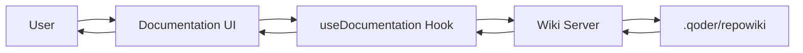

# Web-Based Documentation Guide

This guide explains how to set up and use the new web-based documentation system for Regulens, which converts the entire wiki into an interactive, navigable documentation site.

## Features

✅ **Interactive Tree Navigation** - Collapsible folder structure matching the wiki hierarchy  
✅ **Mermaid Chart Support** - All mermaid diagrams render with zoom and scroll functionality  
✅ **Syntax Highlighting** - Code blocks with language-specific highlighting  
✅ **Search Functionality** - Full-text search across all documentation  
✅ **Responsive Design** - Dark theme optimized for readability  
✅ **Zoom Controls** - Zoom in/out for better visibility  
✅ **File Links** - Clickable source file references  
✅ **Markdown Rendering** - Full GFM (GitHub Flavored Markdown) support  

## Setup Instructions

### 1. Install Dependencies

Navigate to the frontend directory and install the required packages:

```bash
cd frontend
npm install react-markdown remark-gfm react-syntax-highlighter @types/react-syntax-highlighter mermaid
```

### 2. Start the Wiki Documentation Server

The wiki server serves the markdown content from `.qoder/repowiki/en/content/`. Start it with:

```bash
# From the project root
npm run wiki-server
```

This starts the server on `http://localhost:3001`

### 3. Start the Frontend Development Server

```bash
cd frontend
npm run dev
```

This starts the frontend on `http://localhost:3000` (or your configured port)

### 4. Access the Documentation

Navigate to: `http://localhost:3000/documentation`

## Architecture

### Components

```
frontend/src/
├── pages/
│   └── Documentation.tsx          # Main documentation viewer component
├── hooks/
│   └── useDocumentation.ts        # Custom hook for wiki data loading
└── routes/
    └── index.tsx                  # Route configuration (updated)

wiki-server.js                     # Node.js server serving wiki content

.qoder/repowiki/en/
├── content/                       # All markdown documentation files
│   ├── System Overview.md
│   ├── Agent System/
│   ├── Decision Engine/
│   ├── Knowledge Base/
│   └── ... (all wiki content)
└── meta/
    └── repowiki-metadata.json    # Wiki metadata and relationships
```

### API Endpoints

The wiki server provides the following endpoints:

1. **GET /api/documentation/structure** - Returns the hierarchical tree structure
2. **GET /api/documentation/content?path={path}** - Returns markdown content for a specific file
3. **GET /api/documentation/search?q={query}** - Searches across all documentation
4. **GET /api/documentation/metadata** - Returns wiki metadata
5. **GET /health** - Health check endpoint

### Data Flow



## Usage Guide

### Navigation

1. **Tree Navigation** (Left Sidebar):
   - Click folder names to expand/collapse
   - Click file names to view content
   - Use search box to filter tree items

2. **Content View** (Main Area):
   - Markdown content with full styling
   - Interactive mermaid diagrams
   - Syntax-highlighted code blocks
   - Clickable source file links

3. **Toolbar** (Top):
   - Zoom In/Out controls
   - Current zoom level display
   - Export to PDF (future feature)

### Zoom Controls

- **Zoom In**: Click `+` or use keyboard shortcut
- **Zoom Out**: Click `-` or use keyboard shortcut
- **Reset Zoom**: Double-click zoom level

### Mermaid Charts

All mermaid charts are rendered as interactive SVG diagrams with:
- Pan and zoom capabilities
- Dark theme for consistency
- Scrollable containers for large diagrams
- Automatic resizing

### Code Blocks

Code blocks support syntax highlighting for:
- C++ (.cpp, .hpp)
- JavaScript/TypeScript (.js, .ts, .tsx)
- JSON
- SQL
- Bash/Shell
- Python
- And many more...

## Customization

### Theme Colors

Update colors in `Documentation.tsx`:

```tsx
const theme = {
  background: 'bg-gray-900',
  sidebar: 'bg-gray-800',
  text: 'text-gray-100',
  // ... customize as needed
};
```

### Mermaid Configuration

Customize mermaid rendering in `Documentation.tsx`:

```tsx
mermaid.initialize({
  startOnLoad: true,
  theme: 'dark', // or 'default', 'forest', 'neutral'
  securityLevel: 'loose',
  fontFamily: 'monospace',
  // Add more mermaid configuration options
});
```

### Search Configuration

Modify search behavior in `wiki-server.js`:

```javascript
// Adjust search result limits
.slice(0, 3) // Change to show more/fewer results per file
```

## Troubleshooting

### Issue: Mermaid diagrams not rendering

**Solution**: Ensure mermaid is imported and initialized. Check browser console for errors.

```tsx
import mermaid from 'mermaid';

mermaid.initialize({
  startOnLoad: true,
  theme: 'dark',
});
```

### Issue: Wiki server not starting

**Solution**: Check port 3001 is available:

```bash
lsof -ti:3001 | xargs kill -9  # Kill process on port 3001
npm run wiki-server            # Restart server
```

### Issue: Documentation structure not loading

**Solution**: Verify the wiki path exists:

```bash
ls -la .qoder/repowiki/en/content/
```

### Issue: Search not working

**Solution**: Ensure wiki server is running and accessible:

```bash
curl http://localhost:3001/health
# Should return: {"status":"ok","service":"wiki-server"}
```

## Performance Optimization

### 1. Code Splitting

Documentation is lazy-loaded via React.lazy():

```tsx
const Documentation = lazy(() => import('@/pages/Documentation'));
```

### 2. Caching

The wiki server can implement caching for frequently accessed files (future enhancement).

### 3. Pagination

For very large documentation sets, implement pagination in search results.

## Future Enhancements

- [ ] PDF Export functionality
- [ ] Print-friendly styles
- [ ] Breadcrumb navigation
- [ ] Table of contents for current document
- [ ] Document history and versioning
- [ ] Collaborative editing features
- [ ] Real-time search suggestions
- [ ] Keyboard shortcuts
- [ ] Bookmark/favorite documents
- [ ] Dark/Light theme toggle

## Development Workflow

### Adding New Documentation

1. Add markdown files to `.qoder/repowiki/en/content/`
2. Follow the existing folder structure
3. Use frontmatter for metadata (optional)
4. Include mermaid diagrams using ` ```mermaid ` code blocks
5. Restart wiki server to pick up changes

### Updating Existing Documentation

1. Edit files in `.qoder/repowiki/en/content/`
2. Save changes
3. Refresh browser (hot reload if supported)

## Technical Details

### Dependencies

```json
{
  "react-markdown": "^9.0.1",      // Markdown rendering
  "remark-gfm": "^4.0.0",          // GitHub Flavored Markdown
  "react-syntax-highlighter": "^15.5.0",  // Code highlighting
  "mermaid": "^10.6.1",            // Diagram rendering
  "lucide-react": "^0.468.0"       // Icons
}
```

### Browser Compatibility

- Chrome/Edge: ✅ Full support
- Firefox: ✅ Full support  
- Safari: ✅ Full support
- Mobile browsers: ⚠️ Limited (desktop-optimized)

## Security Considerations

1. **Path Traversal Prevention**: Wiki server validates all file paths
2. **CORS**: Configured for local development
3. **Content Security**: Mermaid runs in "loose" mode (development only)

## Production Deployment

For production deployment:

1. Build the frontend:
   ```bash
   cd frontend
   npm run build
   ```

2. Update wiki server for production:
   - Add proper CORS configuration
   - Implement caching headers
   - Add rate limiting
   - Use environment variables for paths

3. Serve static files via nginx/Apache

4. Consider CDN for wiki content

## Support

For issues or questions:
- Check the troubleshooting section above
- Review browser console for errors
- Check wiki server logs
- Verify all dependencies are installed

## License

Same as the Regulens project license.
