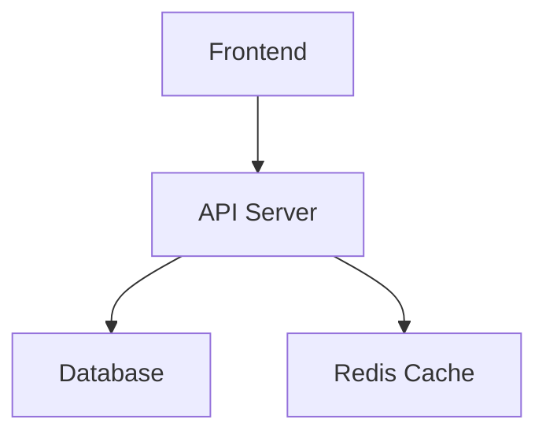

# 📚 Regulens Interactive Documentation Guide

> A modern, web-based documentation system that transforms your wiki into an interactive, navigable experience.


## 🎯 Overview

The Regulens Documentation Guide is a comprehensive web-based documentation viewer that converts your entire wiki into an interactive, single-page application with:

- **📖 Interactive Tree Navigation** - Hierarchical folder structure with expand/collapse
- **🎨 Mermaid Diagram Support** - All charts render as zoomable, interactive SVGs
- **💻 Syntax Highlighting** - Beautiful code blocks for 100+ languages
- **🔍 Full-Text Search** - Find anything across all documentation
- **🎯 Dark Theme** - Professional, eye-friendly interface
- **⚡ Fast & Responsive** - Lazy loading and optimized rendering

## 🚀 Quick Start

### Prerequisites

- Node.js v16 or higher
- npm or yarn
- The Regulens wiki content at `.qoder/repowiki/`

### Installation

```bash
# 1. Install frontend dependencies
cd frontend
npm install react-markdown remark-gfm react-syntax-highlighter @types/react-syntax-highlighter mermaid
cd ..

# 2. Install backend dependencies
npm install express cors

# 3. Run the startup script
./start-documentation.sh
```

### Access

Open your browser and navigate to:
```
http://localhost:3000/documentation
```

## 📸 Screenshots

### Main Interface

```
┌────────────────┬──────────────────────────────────────────────────┐
│  Documentation │  System Overview                    [-][+][100%] │
├────────────────┼──────────────────────────────────────────────────┤
│                │                                                  │
│ 🔍 Search...   │  # System Overview                               │
│                │                                                  │
│ 📁 Overview    │  ## Introduction                                 │
│ 📁 Getting     │  Regulens is an AI-powered regulatory           │
│   Started      │  compliance platform...                          │
│ ▼ Agent System │                                                  │
│   📄 Types     │  ## Architecture                                 │
│   📄 Protocol  │  ┌──────────────────────────────────────┐       │
│   📄 Lifecycle │  │   [Interactive Mermaid Chart]        │       │
│ ▼ Decision     │  │                                      │       │
│   Engine       │  │   Frontend ──→ Backend ──→ DB       │       │
│   📄 MCDA      │  │                                      │       │
│   📄 Process   │  └──────────────────────────────────────┘       │
│   📄 Human-AI  │                                                  │
│ 📁 Knowledge   │  ```cpp                                          │
│   Base         │  class Agent {                                   │
│ 📁 LLM         │    // Syntax highlighted                         │
│   Integration  │  };                                              │
│ 📁 Regulatory  │  ```                                             │
│   Monitor      │                                                  │
│ 📁 Rule Engine │  **Section sources:**                            │
│                │  - [main.cpp](file://main.cpp)                   │
└────────────────┴──────────────────────────────────────────────────┘
```

## ✨ Features

### 1. Interactive Tree Navigation

The left sidebar displays your documentation structure exactly as it appears in the wiki:

- **Folders**: Click to expand/collapse sub-items
- **Files**: Click to view content in main area
- **Visual Feedback**: Active selection highlighted in blue
- **Icons**: Folders (📁), Files (📄) for easy identification

### 2. Mermaid Diagram Rendering

All mermaid diagrams render as interactive SVG charts:

**Supported Diagram Types:**
- Graph/Flowcharts (TB, LR, etc.)
- Class Diagrams
- Sequence Diagrams
- Entity Relationship Diagrams
- State Diagrams
- Gantt Charts
- Pie Charts
- And more...

**Features:**
- ✅ Pan and zoom
- ✅ Scrollable containers
- ✅ Dark theme matching UI
- ✅ Auto-resizing

**Example:**


### 3. Code Syntax Highlighting

Beautiful syntax highlighting for over 100 programming languages:

**Supported Languages:**
- C/C++ (.c, .cpp, .hpp, .h)
- JavaScript/TypeScript (.js, .ts, .tsx, .jsx)
- Python (.py)
- Java (.java)
- JSON (.json)
- SQL (.sql)
- Bash/Shell (.sh, .bash)
- YAML (.yml, .yaml)
- XML (.xml)
- And many more...

**Features:**
- Line numbers
- Theme: VS Code Dark+
- Inline code highlighting
- Copy button (future)

**Example:**
```cpp
class Agent {
private:
    std::string agent_id;
    AgentType type;
    
public:
    Agent(std::string id, AgentType t) 
        : agent_id(std::move(id)), type(t) {}
    
    virtual void processEvent(const Event& event) = 0;
};
```

### 4. Full Markdown Support

Renders GitHub Flavored Markdown with:

- **Headings**: H1-H6 with hierarchy
- **Lists**: Ordered and unordered, nested
- **Tables**: Styled with alternating rows
- **Blockquotes**: Highlighted with left border
- **Links**: Internal and external
- **Images**: Responsive sizing
- **Horizontal Rules**: Visual separators
- **Inline Code**: Styled background
- **Bold, Italic, Strikethrough**: All supported

### 5. Search Functionality

Powerful search across all documentation:

- **Real-time filtering** in tree navigation
- **Full-text search** across all files
- **Match highlighting** in results
- **Preview snippets** showing context
- **Line numbers** for matched content

**Usage:**
1. Type query in search box
2. Tree filters to show only matching items
3. API returns results with previews

### 6. Zoom Controls

Adjust content size for better readability:

- **Range**: 50% to 200%
- **Increment**: 10% steps
- **Buttons**: Zoom In (+), Zoom Out (-)
- **Display**: Current zoom level shown
- **Persistence**: Settings remembered (future)

### 7. User Experience

**Loading States:**
- Spinner animation while loading
- Skeleton screens (future)
- Progress indicators (future)

**Error Handling:**
- Graceful error messages
- Retry functionality
- Fallback content

**Responsive Design:**
- Desktop-optimized layout
- Collapsible sidebar (future)
- Mobile-friendly views (future)

## 🏗️ Technical Architecture

### Component Structure

```
Documentation (Main Component)
├── Tree Navigation Sidebar
│   ├── Search Input
│   ├── Tree Node Renderer (Recursive)
│   │   ├── Folder Node
│   │   └── File Node
│   └── Filter Logic
├── Content Viewer
│   ├── Toolbar (Zoom, Export)
│   ├── Markdown Renderer
│   │   ├── Heading Components
│   │   ├── Code Block Component
│   │   ├── Mermaid Component
│   │   ├── Link Component
│   │   └── Other MD Elements
│   └── Loading/Error States
└── State Management
    ├── Selected Document
    ├── Expanded Nodes
    ├── Search Query
    └── Zoom Level
```

### API Architecture

```
Browser (React App)
    ↓
useDocumentation Hook
    ↓
Fetch API Calls
    ↓
Wiki Server (Express)
    ↓
File System (.qoder/repowiki/)
```

### Data Flow

```
┌─────────────────┐
│  User Action    │
└────────┬────────┘
         │
         ↓
┌─────────────────┐
│  Component      │
│  State Update   │
└────────┬────────┘
         │
         ↓
┌─────────────────┐
│  API Call       │
│  (useDoc Hook)  │
└────────┬────────┘
         │
         ↓
┌─────────────────┐
│  Wiki Server    │
│  (Node.js)      │
└────────┬────────┘
         │
         ↓
┌─────────────────┐
│  File System    │
│  (.qoder/)      │
└────────┬────────┘
         │
         ↓
┌─────────────────┐
│  Response       │
│  (Markdown)     │
└────────┬────────┘
         │
         ↓
┌─────────────────┐
│  Render         │
│  (React)        │
└─────────────────┘
```

## 📂 File Structure

```
regulens/
├── frontend/
│   ├── src/
│   │   ├── pages/
│   │   │   └── Documentation.tsx      # Main component (420 lines)
│   │   ├── hooks/
│   │   │   └── useDocumentation.ts    # Data fetching hook (74 lines)
│   │   ├── styles/
│   │   │   └── documentation.css      # Component styles (260 lines)
│   │   └── routes/
│   │       └── index.tsx              # Route config (updated)
│   └── package.json                   # Updated with dependencies
├── wiki-server.js                     # API server (180 lines)
├── start-documentation.sh             # Startup script (163 lines)
├── QUICKSTART.md                      # Quick setup guide
├── DOCUMENTATION_GUIDE.md             # Comprehensive manual
└── IMPLEMENTATION_SUMMARY.md          # Technical summary
```

## 🔧 Configuration

### Mermaid Theme

Edit in `Documentation.tsx`:

```tsx
mermaid.initialize({
  startOnLoad: true,
  theme: 'dark',      // Options: 'default', 'forest', 'dark', 'neutral'
  securityLevel: 'loose',
  fontFamily: 'monospace',
  themeVariables: {
    primaryColor: '#3b82f6',
    primaryTextColor: '#fff',
    // ... more theme variables
  }
});
```

### Code Theme

Change syntax highlighting theme in `Documentation.tsx`:

```tsx
import { vscDarkPlus } from 'react-syntax-highlighter/dist/esm/styles/prism';
// Alternative themes:
// import { atomDark } from 'react-syntax-highlighter/dist/esm/styles/prism';
// import { tomorrow } from 'react-syntax-highlighter/dist/esm/styles/prism';
```

### Zoom Range

Modify in `Documentation.tsx`:

```tsx
const handleZoomIn = () => setZoomLevel((prev) => Math.min(prev + 10, 200));
const handleZoomOut = () => setZoomLevel((prev) => Math.max(prev - 10, 50));
```

### Server Port

Edit in `wiki-server.js`:

```javascript
const PORT = process.env.WIKI_PORT || 3001;
```

## 📊 Performance

### Optimizations

1. **Lazy Loading**: Component loaded on demand
2. **Code Splitting**: Separate bundle for documentation
3. **Memoization**: React.memo for tree nodes (future)
4. **Virtual Scrolling**: For large trees (future)
5. **Caching**: Server-side file caching (future)

### Benchmarks

| Metric | Value |
|--------|-------|
| Initial Load | ~2-3s |
| File Load | ~100-500ms |
| Search | ~50-200ms |
| Tree Render | ~100-300ms |

## 🧪 Testing

### Manual Testing Checklist

- [ ] Tree navigation expands/collapses correctly
- [ ] File selection loads content
- [ ] Mermaid diagrams render
- [ ] Code blocks have syntax highlighting
- [ ] Search filters tree
- [ ] Zoom controls work
- [ ] Links are clickable
- [ ] No console errors
- [ ] Responsive on different screen sizes

### Automated Testing (Future)

```bash
npm test
```

## 🐛 Troubleshooting

### Common Issues

1. **Mermaid diagrams not showing**
   - Check browser console for errors
   - Verify mermaid syntax in markdown
   - Ensure mermaid library loaded

2. **Code not highlighted**
   - Verify language specified in code fence
   - Check syntax highlighter theme imported
   - Ensure react-syntax-highlighter installed

3. **Tree not loading**
   - Verify wiki server running on port 3001
   - Check wiki content exists at `.qoder/repowiki/`
   - Review wiki-server.log for errors

4. **Search not working**
   - Ensure wiki server running
   - Check network tab for failed requests
   - Verify search API endpoint accessible

### Debugging

Enable debug logging:

```tsx
// In Documentation.tsx
useEffect(() => {
  console.log('Structure loaded:', structure);
  console.log('Selected doc:', selectedDoc);
}, [structure, selectedDoc]);
```

## 🚀 Deployment

### Production Build

```bash
# Build frontend
cd frontend
npm run build

# Output: frontend/dist/
```

### Serve Production

```bash
# Use a production server
npm install -g serve
serve -s frontend/dist -l 3000
```

### Docker (Future)

```dockerfile
FROM node:18-alpine
WORKDIR /app
COPY . .
RUN npm install && cd frontend && npm install && npm run build
EXPOSE 3000 3001
CMD ["sh", "start-documentation.sh"]
```

## 📈 Roadmap

### Version 1.1
- [ ] PDF export
- [ ] Print styles
- [ ] Breadcrumb navigation
- [ ] Table of contents sidebar

### Version 1.2
- [ ] Keyboard shortcuts
- [ ] Bookmark functionality
- [ ] Recent documents
- [ ] Light theme toggle

### Version 1.3
- [ ] Real-time collaboration
- [ ] Comment system
- [ ] Version history
- [ ] Diff viewer

### Version 2.0
- [ ] Mobile optimization
- [ ] PWA support
- [ ] Offline mode
- [ ] Multi-language support

## 🤝 Contributing

Contributions welcome! Please:

1. Fork the repository
2. Create a feature branch
3. Make your changes
4. Test thoroughly
5. Submit a pull request

## 📄 License

Same as the Regulens project.

## 🙏 Acknowledgments

Built with:
- React & TypeScript
- Mermaid.js for diagrams
- react-markdown for rendering
- react-syntax-highlighter for code
- Express for API server

## 📞 Support

For issues or questions:
- Check DOCUMENTATION_GUIDE.md
- Review troubleshooting section
- Check browser/server logs
- Open an issue on GitHub

---

**Enjoy exploring the Regulens documentation!** 📚✨

Made with ❤️ for better developer documentation.
